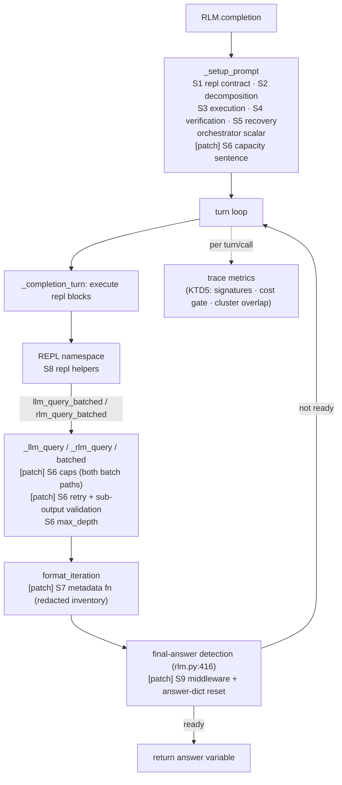

# feat: RLM harness surfaces declared from the loop's own phases

> **Filename note.** This file is still named `...-surfaces-from-paper-failures-plan.md` from its first revision, when the surfaces were derived from the RLM paper's documented failures. The 2026-07-28 revision changed that basis (see Problem Frame). The name is kept so the `supersedes:` chain and the companion open-questions document's `parent:` link stay valid.

**Target repo:** this one. It is a fork of `alexzhang13/rlm` (`upstream` remote), and the RLM package lives in-tree at `rlm/` — there is no vendored clone. Seam edits therefore land as ordinary commits here, and `72d6940` is an ancestor of `HEAD`, not a pinned third-party checkout. The reproducibility artifact is an exported diff, regenerated at freeze time with `git diff 72d6940..HEAD -- rlm/ > patches/0001-harness-seams.patch`, whose verification is that it reapplies cleanly onto a tree at `72d6940`.

**Supersedes** `2026-07-21-001`, which is **not present in this repo or in git history** — it was dropped without being committed. Its content is therefore unreadable, so wherever this plan reverses one of its decisions, the reversed argument is restated inline rather than referenced (see KTD1). What it contained: PromptFrame, static-share accounting, sandboxed policy lint, and ten KTDs, all gone.

---

## Summary

This plan builds the harness scaffolding a Self-Harness loop will later optimize: **nine editable surfaces declared as builder functions in one module**, the three architectural invariants that define an RLM and may never be edited, the small runtime patch four of the surfaces need, and two starting harnesses — **H0**, a genuine mechanism floor, and **H0\***, the shipped reference.

The surfaces are declared from the RLM turn loop's own phase structure, following the same pattern Self-Harness (Zhang et al., arXiv:2606.09498) uses for its nine builders. The loop itself — mining, clustering, proposal, promotion gate — is out of scope; this plan lands the surfaces it edits and the trace metrics it reads.

---

## Problem Frame

**Surfaces are declared from loop structure, not from known failures.** An earlier revision of this plan derived its six surfaces from failures the RLM paper documents and fixes. That basis was wrong in a specific way: it selected the edit surface by reading the answer key, which makes it impossible at analysis time to separate what the loop discovered from what a human already knew.

Self-Harness's own precedent settles the right basis. Its Figure 3 shows nine builder functions in a harness-definition file — `build_system_prompt`, `build_memory_sources`, `build_subagents`, `build_skills`, `build_bootstrap_instruction`, `build_execution_instruction`, `build_verification_instruction`, `build_failure_recovery_instruction`, `build_runtime_control_policy` — and states that *"the editable surfaces correspond to declared configuration points in this harness."* They are chosen a priori by the authors, keyed to phases of the agent loop, and the paper never claims otherwise: its contribution sentence says the model *"proposes bounded edits to **declared** harness surfaces."* Surface selection is not on their limitations list, because declaring the surface set is the definition of the object being optimized, not a result.

This plan adopts that basis. The nine surfaces below correspond to positions in the RLM turn loop — what the model is told at each phase, what carries across turns, what functions exist in the REPL, what numeric limits apply — with no reference to which of them the paper happened to find broken.

**The paper's failures become a prediction instead of a justification.** They are not discarded; they are repositioned. Self-Harness had no external check on whether its mining stage found *real* failure mechanisms or merely plausible-sounding ones — it falls back on qualitative before/after trace case studies for exactly this reason. This study has something it did not: an independent, published, model-specific catalogue of RLM failures. If those failures are real, a loop starting from H0 should rediscover them from its own traces. **The overlap between mined clusters and the paper's documented failures is therefore a reportable result — convergent validity for the mining stage — rather than a confound.** This is what makes the paper-anchoring a contribution over the work it builds on, and it only holds if H0 is genuinely stripped, which is why the H0/H0\* split below is load-bearing rather than cosmetic.

**Fidelity is the invariants first, then two residual conditions.** An RLM is defined by three invariants — the three design choices the paper's Algorithm 2 gets wrong. An edit that touches any invariant is unfaithful. That check is necessary but not sufficient, because two failure modes slip past it, and the plan states both rather than implying a clean biconditional (KTD1). This still resolves the earlier tension: automatic recovery middleware, which `2026-07-21-001` ruled out, touches no invariant and is therefore admissible. The paper itself used such a patcher (offline, in its training pipeline), and the shipped harness already ships two guards of this kind.

**Two surfaces are described in the paper's Algorithm 1 terms, which the reference implementation does not match.** The plan uses the reference implementation's actual injection points, noted per surface, not Algorithm 1's idealized ones.

---

## The three invariants (frozen architecture)

These are the paper's three flaws of Algorithm 2, inverted. No surface may edit them; a harness that does is no longer an RLM.

- **I1 — Prompt-as-variable.** The prompt lives in the environment as a REPL variable and is never copied into root context. (Algorithm 2 Flaw #1 puts `P` into `hist`.)
- **I2 — Programmatic sub-calls.** Sub-calls are issued by code, in loops, over slices of the prompt — not as verbalized single actions. (Flaw #3.)
- **I3 — Outputs-in-variables.** The final answer is accumulated in a REPL variable and returned from it, not verbalized directly by the root. (Flaw #2.)

The one tempting edit these rule out — letting the proposer truncate the prompt variable or pre-summarize it into root context — is excluded precisely because it violates I1 and quietly turns the RLM back into a compaction agent. It is listed under Scope Boundaries so the exclusion is explicit rather than implied.

---

## The nine surfaces

Each surface is a position in the RLM turn loop. "H0 default" is what the mechanism floor starts with; "Patch?" marks whether the surface needs a runtime change (U1) or is pure configuration.

| # | Surface | What it governs | H0 default | Patch? |
|---|---|---|---|---|
| S1 | `build_repl_contract()` | The factual contract: available names, the `answer` protocol, one ```repl``` block per turn, `print`-only stdout, the truncation sentence | the minimal contract and nothing else | No |
| S2 | `build_decomposition_instruction()` | Turns 1–2: how to probe `context`, whether and how to plan a decomposition | one generic line | No |
| S3 | `build_execution_instruction()` | Per-turn discipline: what to print, when to offload to a sub-call vs. read directly, how to aggregate | one generic line | No |
| S4 | `build_verification_instruction()` | What to check before flipping `answer["ready"]` | one generic line | No |
| S5 | `build_recovery_instruction()` | What to do when a sub-call errors or returns something unusable | one generic line | No |
| S6 | `build_runtime_policy()` | **Every number and switch**: chars per prompt, batch width, max calls per turn, max calls total, `max_depth`, retry-on-syntax-error, sub-output validation | `{"enabled": False}` with all fields `None` | Yes |
| S7 | `build_metadata(stdout, repl_inventory)` | What carries across turns — the RLM's memory | the shipped 20K head-truncation | Yes |
| S8 | `build_repl_helpers()` / `build_sub_repl_helpers()` | Functions and data injected into the REPL namespace: chunkers, size-capped batch wrappers, verified-answers dicts | `{}` | No |
| S9 | `build_answer_middleware()` | Programmatic inspection of the detected final answer, with redirect | identity | Yes |

**Seven of nine start empty, disabled, or at one generic line.** That is the point, and it is the property Self-Harness's conclusion identifies as what makes the result meaningful: *"even sparse initial harnesses can support useful self-improvement."* A surface set is a statement about where edits may go, not about what a good edit looks like.

**Mapping to Self-Harness's nine.** S1↔`build_system_prompt`, S2↔`build_bootstrap_instruction`, S3↔`build_execution_instruction`, S4↔`build_verification_instruction`, S5↔`build_failure_recovery_instruction`, S6↔`build_runtime_control_policy`, S7↔`build_memory_sources`, S8↔`build_skills`+`build_subagents`. S9 is the one surface with no clean twin — Self-Harness's policy dict carries a tool-error-triggered instruction, which is adjacent but text-only, whereas S9 is code. It is the strongest surface in the set and is bounded accordingly in U3.

**Why the instruction surfaces are split by phase rather than pooled.** Self-Harness's own results turn on this resolution: their MiniMax M2.5 gain came from a bootstrap-instruction edit, their Qwen3.5 gain from a failure-recovery edit. A single prompt blob cannot produce edits that localize like that, and it breaks the "each proposal modifies one declared surface" constraint that makes the lineage auditable.

**Why every number lives in one dict.** S6 is the only surface holding scalars, so "turn on a limit" is one legible edit against one surface rather than a prose rewrite that also drags in unrelated guidance. It starts `{"enabled": False}`, matching Self-Harness's runtime-control policy exactly.

**Reference-implementation mismatches, stated once.** S7's O(1) metadata and S9's `FINAL`/`FINAL_VAR` pathologies are Algorithm 1 / training-pipeline terms. The shipped harness truncates at 20K (S7) and uses `answer["ready"]`/`answer["content"]` (S9). The plan targets the shipped behavior; S9's pathologies are re-expressed for the `answer` protocol in U1.

**S7 is coupled to S1 and cannot be edited alone.** `RLM_SYSTEM_PROMPT` hardcodes "REPL outputs over ~20K characters are truncated, so for longer payloads slice `context` and pass slices through `llm_query`" (`rlm/utils/prompts.py:139`), and that sentence is the root model's only cue for when to offload rather than print. An S7 edit that changes the real bound while S1 still states 20K leaves the model told a false fact about its own environment, which confounds the measured effect. The runner therefore derives that sentence from the active S7 builder's declared bound rather than letting the two drift (U3).

---

## Two starting harnesses: H0 and H0\*

The shipped RLM is not a mechanism floor. `RLM.__init__` defaults `orchestrator=True` (`rlm/core/rlm.py:79`), and `build_rlm_system_prompt` therefore appends `ORCHESTRATOR_ADDENDUM` to every root system prompt (`rlm/utils/prompts.py:228-230`). That addendum is dense with content that belongs to S2–S6: "act as an orchestrator, not a solver" and a plan-then-execute protocol (S2), guidance on pushing long-context work into sub-calls (S3), "only flip `answer[\"ready\"] = True` once you have actually printed the candidate answer" (S4), a ~100K-chars-per-prompt capacity ceiling and a ~20-prompts-per-batch fan-out rule with "tiny-prompt mega-batches … are the anti-pattern" (S6). A single starting harness cannot be both the unmodified shipped reference and a floor stripped of tuned strategy, so the plan declares two:

- **H0** — *the mechanism floor, and the optimization loop's starting point.* `orchestrator=False`; S1 returns the minimal REPL contract; S2–S5 return one generic line each; S6 is `{"enabled": False}`; S7 is the 20K default; S8 is `{}`; S9 is identity. Every clause H0 lacks relative to H0\* is one the loop must rediscover from its own traces.
- **H0\*** — *the shipped reference harness.* `orchestrator=True`; S1 returns `RLM_SYSTEM_PROMPT` verbatim and the runner appends `ORCHESTRATOR_ADDENDUM`; S2–S5 empty, because their content arrives through the addendum; S6–S9 at H0 defaults. Byte-identical to the shipped reference. The star marks "carries the authors' hand-tuned orchestration guidance."

Both are built from the same nine builders through the same runner. The star is notation, not a separate code path.

**What each one is for.** H0 is the optimization loop's starting point, and the condition under which the self-discovery claim is testable — a loop starting from H0\* would be rediscovering guidance sitting in its own system prompt. H0\* is a *human-engineering baseline*: it is the RLM authors' own prompt tuning, and it sits alongside H1 (λ-RLM) as a second reference point at a lighter level of human effort. The gap H0\* − H0 is the human-supplied orchestration prior, measured rather than assumed.

**Consequence for the proposal's baselines.** The proposal currently defines B1 as "the unmodified reference harness, **and the starting point of optimization**." Those two roles now come apart: H0\* is the unmodified reference, H0 is the starting point. U4 updates the baseline section accordingly, giving two human-engineering comparisons (H0\*, H1) rather than one.

---

## Requirements

- **R1.** Nine surfaces are declared as builder functions in one module, each corresponding to a named position in the RLM turn loop.
- **R2.** Two starting harnesses are constructible from those builders: H0 (mechanism floor, `orchestrator=False`) and H0\* (shipped reference, `orchestrator=True`), differing only in S1–S5 and the `orchestrator` scalar.
- **R3.** The three invariants are non-editable. I1's boundedness property, the sub-call and answer-from-variable plumbing, and the mechanical half of the non-program-rewriting condition are enforced at construction; I2 and I3 in practice are monitored through trace metrics (U3).
- **R4.** Fidelity is the invariants test plus the two residual conditions in KTD1; automatic middleware (S6, S9) is permitted because it satisfies all three.
- **R5.** The **agent-mechanism component** of the failure signature is computable from traces near-deterministically — sub-call count, syntax-error rate, answer-protocol misuse, buffer-discarded-before-return, truncation events. ϕ's other three components (verifier cause, failing level, causal status) need verifier outputs and a call tree this plan does not build; see RD2 in the research-design document.
- **R6.** The acceptance signal available to the loop includes a cost/sub-call budget check, not pass-rate alone, because RLM cost is long-tailed.
- **R7.** The editable-surface section of `docs/Self Harnessing RLMs.md` — the tracked proposal — describes the nine surfaces, the three invariants, the H0/H0\* split, and the cost-aware gate, and its baseline section reflects H0 as the optimization starting point. (`paper/proposal.tex` is the untracked LaTeX export; `paper/` is gitignored, so the markdown source is authoritative.) Delivered by U4.

---

## Key Technical Decisions

**KTD1 — Invariants first, then two residual conditions.** The invariants check is necessary and does most of the work: it replaces the previous plan's per-surface seam adjudication, and it is the reconciliation — middleware that `2026-07-21-001` pushed to opt-in helpers is admissible here because it touches no invariant, with the paper's own offline patcher as precedent. It is not sufficient, because two things slip past it:

1. **Non-program-rewriting.** Middleware must operate on the root's own variables and answers, not rewrite its program. A middleware plus error policy rich enough to drive control flow satisfies all three invariants while moving orchestration out of the model. U3 enforces the mechanical half by restricting S9's inputs and return type.
2. **Behavioral I2/I3.** An S2 or S9 edit can discourage recursion in prose ("just answer directly") or push the root to verbalize without touching any invariant mechanically. Prose is not mechanically checkable, so this is monitored through trace metrics rather than blocked.

Stating three criteria instead of one biconditional costs a paragraph and gives a reviewer of a proposed middleware edit a test they can actually apply.

**KTD2 — Surfaces come from loop phases, following Self-Harness's own pattern.** See Problem Frame. The consequence for this plan is that no surface row carries a paper-evidence citation, and no builder docstring is required to cite one; the paper's failures live in the analysis plan as a predicted-overlap measurement instead. This is the decision that makes the surface set defensible under review: it is the same move Self-Harness makes, and the claim is worded the same way — the model proposes bounded edits to *declared* surfaces.

**KTD3 — Reference implementation, not Algorithm 1.** Surfaces attach to the shipped harness's real injection points, not Algorithm 1's idealized ones. The starting harness is split in two because the shipped default already carries hand-tuned orchestration guidance; see "Two starting harnesses." This keeps H0\* citable as the reference implementation of Zhang et al. while leaving a floor the loop can actually climb from, and keeps the runtime patch small and honest.

**KTD4 — Four seams, one patch.** S7's metadata function, S9's middleware, and S6's two enforcement points (batch caps, sub-call retry) need runtime hooks; S6's capacity sentence rides along. S1–S5 and S8 are `custom_system_prompt` and `custom_tools` and need no patch. S6's caps live at the runtime seam rather than in an S8 helper because a helper is bypassable — generated REPL code can call the builtin `llm_query_batched` directly, so a helper-level cap bounds only well-behaved programs and the failure S6 targets is precisely badly-behaved ones. The patch is exported as `git diff 72d6940..HEAD -- rlm/` at freeze time and frozen thereafter.

**KTD5 — Trace metrics are load-bearing three times.** The same per-turn/per-call metrics (sub-call count, syntax-error rate, answer-protocol events, truncation events, per-call cost) make the agent-mechanism component of ϕ computable (R5), make the cost-aware acceptance check possible (R6), *and* supply the mined clusters whose overlap with the paper's documented failures is the convergent-validity result. Built once, in U1; consumed by loop stages out of scope here.

---

## High-Level Technical Design

Where each surface attaches in the RLM turn loop. `[patch]` marks the seams U1 adds; unmarked surfaces are configuration.



Directional guidance for review, not implementation specification.

---

## Output Structure

```
shrlm/
  __init__.py
  rlm_harness.py     # three invariants (frozen) + nine surfaces + H0 / H0*
  runner.py          # assembles a harnessed RLM; enforces what is enforceable
patches/
  0001-harness-seams.patch
tests/
  test_runtime_seams.py
  test_harness_surfaces.py
  test_invariants.py
docs/
  Self Harnessing RLMs.md                                # U4 rewrites surfaces + baselines
  plans/2026-07-21-002-open-questions-research-design.md  # RD1-RD4
pyproject.toml                                           # + shrlm in setuptools packages
```

---

## Implementation Units

### U1. Runtime patch: four seams plus trace metrics

**Goal:** Add the injection points S7, S9, and S6 need, plus the per-turn/per-call metrics of KTD5 — as a minimal, revertible diff against `72d6940`.

**Requirements:** R1, R5, R6

**Dependencies:** none

**Files:**
- `rlm/utils/parsing.py` (modify)
- `rlm/utils/prompts.py` (modify — S6 capacity sentence)
- `rlm/core/rlm.py` (modify)
- `rlm/core/types.py` (modify — trace-metric serialization)
- `rlm/environments/local_repl.py` (modify)
- `patches/0001-harness-seams.patch` (create)
- `tests/test_runtime_seams.py` (create)

**Approach:** Five changes plus metrics, each defaulting to current behavior so an unconfigured harness is byte-identical to the reference.

1. **S7 — metadata function.** `format_iteration` currently hardcodes `max_character_length=20000` and its formatting (`rlm/utils/parsing.py:25`). Make it accept an injected metadata builder and thread it from the RLM through the call site at `rlm/core/rlm.py:456`. The builder receives a **redacted inventory** — `{name: (type_name, length)}` derived from `result.locals`, never `result.locals` itself. Default builder reproduces the 20K head-truncation exactly.
2. **S9 — answer middleware.** At the final-answer detection block (`rlm/core/rlm.py:416-434`), call an optional middleware with the detected `final_answer` and the redacted inventory; it may return an unchanged answer or a redirect (suppress this answer, inject a user nudge, continue the loop). Default is identity. Re-express the paper's pathologies for the `answer` protocol: `answer["ready"]=True` before any REPL interaction (the turn-0 safeguard already targets this — the middleware is its programmatic complement), and a `ready` answer whose content restates a plan rather than a result. **The redirect branch must also reset the environment's answer dict to `{"content": "", "ready": False}`.** The environment clears only its own capture (`self._last_final_answer = None`, `rlm/environments/local_repl.py:573-574`); the `_AnswerDict` in `self.locals` persists across turns and `_restore_scaffold` leaves it untouched (`:527-539`), so without the reset the model's namespace still reads `ready: True`, it concludes it already submitted, and the run burns to `max_iterations` and falls through to `_default_answer`.
3. **S6 — retry and sub-output validation.** Wrap the error returns at `_llm_query` / `_rlm_query` (`local_repl.py:280,330`) so a configured policy can retry on a classified syntax error or mark a sub-output invalid before it enters a buffer. Cover the batched paths too (`_rlm_query_batched` at `:362,379`), which produce the same error strings per element. `max_depth` is already a constructor scalar and needs no change. Default: no retry, current pass-through.
4. **S6 — hard caps.** In `_llm_query_batched` (`local_repl.py:282`) **and** `_rlm_query_batched` (`:335`), optionally enforce max batch width and per-prompt char ceiling; over-budget calls return a structured refusal the root can read. Both paths fan out sub-calls, so capping only one leaves the other unbounded — and unbounded fan-out is precisely what S6 exists to bound. Both return `list[str]`, so the refusal is encoded in-band as a parseable prefixed string. Default: unbounded, current behavior.
5. **S6 — capacity sentence.** `build_rlm_system_prompt` hardcodes "Each sub-LLM call can handle roughly ~100k tokens at once" into the metadata user message (`rlm/utils/prompts.py:236`), which `custom_system_prompt` cannot reach. Make that sentence S6-supplied with the current string as default, so the stated capacity and the enforced cap come from one place.
6. **Trace metrics.** At the concatenation/detection sites, record per turn and per call: sub-call count, classified syntax-error flag, answer-protocol event, truncation event, and per-call cost. Attach to the call/iteration record. `RLMChatCompletion.to_dict`/`from_dict` are field-by-field (`rlm/core/types.py:133`) and cross the socket, so any new serialized field is added both directions with a `None` default. (The metric set is known incomplete for the full preregistered ϕ — see RD2; U1 lands the mechanism-side metrics and the serialization pattern later additions follow.)

Export the patch with `git diff 72d6940..HEAD -- rlm/ > patches/0001-harness-seams.patch` once the changes are in, and regenerate it at freeze time.

**Patterns to follow:** the optional-kwarg-with-`None`-default idiom throughout `RLM.__init__`; `tests/mock_lm.py` for LM stubbing without network.

**Execution note:** Write the seam tests first — each seam's claim is "the configured behavior fires and the default is unchanged," observable only through a stub that records what it received.

**Test scenarios:**
- Unconfigured, a turn's history entry is byte-identical to pre-patch `format_iteration` output.
- A configured metadata builder that returns prefix+length shrinks the history entry accordingly, and the entry size does not grow with prompt length.
- The metadata builder receives only the redacted inventory — no variable's value is reachable from what it is handed.
- Answer middleware returning a redirect suppresses the answer and continues the loop; returning identity terminates exactly as before.
- After a redirect, the REPL namespace reports `answer["ready"] is False`, and a subsequent `answer["ready"] = True` still fires capture.
- Middleware sees the redacted inventory, so the E.2-style "answer exists in a buffer" case is detectable.
- A syntax-error-classified sub-call is retried once under a configured policy and passed through unchanged under the default; the batched paths behave the same per element.
- `_llm_query_batched` and `_rlm_query_batched` past the configured width or char cap both return the structured refusal; unconfigured, both run unbounded.
- The S6-supplied capacity sentence appears in the metadata user message; unconfigured, it is the current `~100k tokens` string.
- Trace metrics record sub-call count, syntax-error flag, answer-protocol event, and truncation event for a run, and survive the socket round trip; a pre-patch record still deserializes.
- The exported patch reapplies cleanly onto a tree checked out at `72d6940`, and the upstream suite passes unconfigured.

**Verification:** upstream `tests/` passes with nothing configured; the agent-mechanism component of ϕ and a per-run cost total are both computable from a logged run without reading harness source.

---

### U2. Harness module

**Goal:** Declare the three invariants and nine surfaces in one readable module, and construct both starting harnesses from them.

**Requirements:** R1, R2, R3, R4

**Dependencies:** U1

**Files:**
- `shrlm/__init__.py` (create)
- `shrlm/rlm_harness.py` (create)
- `pyproject.toml` (modify — add `"shrlm", "shrlm.*"` to `[tool.setuptools.packages.find] include`, which currently lists only `["rlm", "rlm.*"]` at `pyproject.toml:48-49`, so `import shrlm` resolves after `uv pip install -e .`)
- `tests/test_harness_surfaces.py` (create)

**Approach:** One module, one builder per surface, no indirection — it must read as a figure in the paper, the way Self-Harness's Figure 3 does. Invariants appear as frozen module constants with a comment tying each to its Algorithm 2 flaw. Each builder is a pure function of its declared inputs.

Two harness constants are built from those builders:

- **H0** — `orchestrator=False`; S1 the minimal REPL contract; S2–S5 one generic line each; S6 `{"enabled": False}` with all fields `None`; S7 the 20K default; S8 `{}`; S9 identity.
- **H0\*** — `orchestrator=True`; S1 returns `RLM_SYSTEM_PROMPT` verbatim (the runner appends `ORCHESTRATOR_ADDENDUM`); S2–S5 empty; S6–S9 identical to H0.

**Brace constraint on the prompt surfaces.** Any S1–S5 return value ends up inside the string passed through `system_prompt.format(custom_tools_section=...)` at `rlm/utils/prompts.py:228`, so a literal `{` or `}` raises `KeyError`/`IndexError` before the run starts — the shipped prompt escapes its own example as `{{"content": "", "ready": False}}` (`:135`) for exactly this reason. Prompt-surface builders must therefore return text whose only replacement field is `{custom_tools_section}` and must double every other brace. This is load-bearing beyond H0: a proposed S2 edit containing a dict or JSON in-context example — the most natural way to write decomposition examples — would hard-crash the run rather than score badly, so the loop would see an infrastructure error where it should see a bad edit.

**Patterns to follow:** `rlm/utils/prompts.py` for prompt-construction style and the `{custom_tools_section}` format-slot convention.

**Test scenarios:**
- Every surface name resolves to a module-level callable, and the surface registry matches the module's public builders exactly — nine, no more, no fewer.
- H0\*'s assembled system prompt is byte-identical to the shipped `RLM_SYSTEM_PROMPT` + `ORCHESTRATOR_ADDENDUM`.
- H0's assembled system prompt contains none of the clauses the star marks: no "orchestrator, not a solver", no plan-then-execute protocol, no `~100K` chars-per-prompt ceiling, no `~20` prompts-per-batch rule, no answer-discipline sentence.
- H0 and H0\* differ only in S1–S5 and the `orchestrator` scalar — S6 through S9 return the same objects for both.
- Seven of the nine H0 defaults are empty, disabled, or a single line; a test asserts this explicitly so a future edit cannot quietly pre-populate the floor.
- A prompt-surface return containing a literal `{` round-trips through `build_rlm_system_prompt` without raising.
- S6's default dict is `{"enabled": False}` with every policy field `None`.
- S7 default reproduces 20K truncation; a smaller-metadata edit produces a bounded entry that does not scale with input length.
- S9's default is identity.
- S8 builders return dicts whose keys avoid the reserved REPL names. (`validate_custom_tools` at `rlm/environments/base_env.py:130-147` already raises on collision with `RESERVED_TOOL_NAMES`; this test asserts the harness never relies on that backstop firing.)
- Each builder's docstring names the loop phase it governs. **No builder is required to cite paper evidence** — that requirement was removed with KTD2, and a test asserting it would reintroduce the answer-key basis this revision removed.

**Verification:** both H0 and H0\* load, the registry round-trips, and `import shrlm` resolves from an editable install.

---

### U3. Runner and invariant enforcement

**Goal:** Assemble a harnessed RLM from a harness module, enforce what is mechanically enforceable at construction, and monitor the rest.

**Requirements:** R2, R3, R4

**Dependencies:** U1, U2

**Files:**
- `shrlm/runner.py` (create)
- `tests/test_invariants.py` (create)

**Approach:** One entry point concatenates S1–S5 into the root system prompt in phase order, reads S6 into the runtime hooks and the `max_depth` / `orchestrator` scalars, S7 into `format_iteration`, S8 into `custom_tools`/`custom_sub_tools`, and S9 into the answer-detection hook. It also derives S1's truncation sentence from the active S7 builder's declared bound and S6's capacity sentence from the active policy, so the prompt cannot state limits the runtime does not honor.

Invariant protection is two-tier, and the plan is explicit about which tier each invariant sits in — a construction-time check cannot read prose, so claiming it enforces all three would overclaim.

*Structural (construction-time, raises):*
- **I1 boundedness** — enforced as a growth property, not as a wiring property. The wiring version is not implementable: at the S7 seam `format_iteration` receives an `RLMIteration` whose `code_blocks[i].result.locals` is a full copy of the REPL namespace (`rlm/environments/local_repl.py:579`), and the prompt lives *inside* that same dict as `context_0`/`context` (`:400,434,540-541`). One object carries both, so "wired to receive the prompt variable" versus "receiving only REPL state" is not a distinguishable construction-time decision. Instead, U1's redaction makes the prompt's contents unreachable, and the runner probes the builder with synthetic REPL states at 1× and 100× prompt length, asserting the output size does not grow.
- **Plumbing present** — the programmatic sub-call path and the answer-from-variable return path are always injected; no surface can remove them, so I2 and I3 cannot be violated *structurally*.
- **Non-program-rewriting (KTD1 condition 1)** — S9 is handed the redacted inventory and the detected answer, and its return type admits only "unchanged" or "redirect." It has no channel through which to rewrite the root's program. This is the mechanically enforceable half; the judgment half stays with the reviewer of a proposed edit.
- **Incidental hazards** — `other_backends`/`other_backend_kwargs` must be unset (depth-routing silently swaps the child model — `rlm/core/lm_handler.py:188`); tracing callbacks and hard token/budget/timeout caps stay experiment-owned.

*Behavioral (trace-monitored, reported not prevented):*
- **I2/I3 in practice** — an S2 or S9 edit could still discourage recursion in prose ("just answer directly") or push the root to verbalize. Prose is not mechanically checkable, so these are preregistered constraints monitored through the U1 trace metrics: if a promoted edit drives sub-call count toward zero or answer-from-variable toward zero, the metrics show it and the harness lineage records it. Whether the gate *blocks* on that is RD1.

**Patterns to follow:** the fail-fast assertion style documented under Error Handling in `docs/api/rlm.md`.

**Test scenarios:**

Structural:
- A metadata builder whose output grows between the 1× and 100× synthetic probe fails the boundedness assertion; one returning prefix+length passes.
- The system prompt's stated truncation size matches the active S7 builder's declared bound, and its stated capacity matches S6's policy; a harness where either pair disagrees raises.
- A harness declaring `other_backends` raises.
- A harness supplying tracing callbacks or hard budget caps raises.
- The sub-call path and answer-from-variable return path are present after construction and cannot be removed through any surface.
- S1–S5 appear in the assembled prompt in phase order, and an empty surface contributes nothing rather than a blank section.

Behavioral (monitored, not raised):
- A run whose S2 discourages recursion shows a near-zero sub-call count in the trace metrics, and that value is retrievable for the lineage record.
- A full H0 run and a full H0\* run against the stub client each complete, return from a REPL variable, and populate trace metrics.
- The cost-aware acceptance predicate (pass-rate non-regression AND sub-call/cost within a preregistered band) is computable from two logged runs — the gate lives in the loop, but its inputs are present.

**Verification:** end-to-end H0 and H0\* completions against `tests/mock_lm.py` each produce an answer, pass the structural invariant checks, expose the behavioral metrics, and yield a per-run cost total.

---

### U4. Proposal: surfaces, baselines, and the overlap prediction

**Goal:** Bring the tracked proposal in line with what U1–U3 build and with the revised surface basis.

**Requirements:** R7

**Dependencies:** U2, U3

**Files:**
- `docs/Self Harnessing RLMs.md` (modify)

**Approach:** Three passages change.

1. **The editable-surface enumeration** (§3.3, "The editable surfaces are to decomposition guidance, sub-call/batching policy, …") is replaced by the nine surfaces named by their builder functions, described as declared configuration points keyed to loop phases, with the Self-Harness precedent cited for the pattern. Also record the three invariants, the two residual fidelity conditions, and the permanent prompt-variable-truncation exclusion.
2. **The baseline section** (§3.4) is updated for the H0/H0\* split: H0 is the optimization starting point, H0\* is the unmodified reference *and* a human-engineering baseline alongside H1. The current text conflates the two in "B1: initial RLM. The unmodified reference harness, and the starting point of optimization."
3. **The runtime sentence** in §2 ("Their runtime is extended to support metadata from child sub-calls, answer middleware, sub-call error handling, and batching policies") is stale against the nine surfaces and is rewritten.

Add the **overlap prediction** to the analysis plan: if the RLM paper's documented failures are real and model-general, a loop starting from H0 should rediscover them, and the overlap between mined clusters and that published catalogue is reported as convergent validity for the mining stage. Frame it as a prediction registered in advance, not a post-hoc observation.

**Test scenarios:**
- Every surface name in the proposal resolves to a public builder in `shrlm/rlm_harness.py`, and vice versa.
- The proposal states the H0/H0\* distinction, what the star denotes, and which one the loop starts from.
- The proposal records the prompt-truncation exclusion and the overlap prediction.
- No passage in the proposal describes the surface set as derived from the paper's documented failures.

**Verification:** surface names match the module both directions; the LaTeX export, when regenerated, compiles.

---

## Scope Boundaries

**In scope:** the nine surfaces, both starting harnesses, the three invariants and their two-tier enforcement, the runtime patch with trace metrics, the runner, and the proposal sections describing them.

**Not in scope:**
- The Self-Harness loop — mining, clustering, proposer, promotion gate. U1's metrics make the cost-aware gate and the overlap measurement *computable*; both are loop work.
- Environments, verifiers, sub-verifiers.
- The `docker`/`modal`/`prime`/`daytona`/`e2b` environments; seams target `local` (and `ipython` where trivial).
- A harness figure float in the paper — deferred; the surface table carries the content for now. (Self-Harness's Figure 3 is the model to copy when it lands.)

### Deferred to Follow-Up Work

- **Prompt-variable truncation / pre-summarization surface.** Tempting because it would likely show held-in gains, deliberately excluded because it violates I1 and turns the RLM into a compaction agent. Not a follow-up to add later — a permanent exclusion, recorded here so the decision is visible.
- Depth-aware cost re-estimation in `sec:cost` if S6 raises `max_depth` above 1.

---

## Open Questions

Implementation-level questions live here. The **research-design** questions this plan surfaces but cannot settle are in `docs/plans/2026-07-21-002-open-questions-research-design.md` (RD1–RD4), because each is a preregistration decision rather than a build decision.

- **OQ1 — Where does the cost-aware gate's band come from?** The acceptance check needs a preregistered cost/sub-call tolerance, which depends on pilot cost measurements. U1 supplies the inputs; the band is set in the loop. (Whether it is one- or two-sided is RD1.)
- **OQ2 — Does the batched seam hold across backends?** System-message and message-list injection is verified for OpenAI and Anthropic clients; `vllm`/`portkey`/`openrouter` are unverified. All three exist as real backends (`rlm/clients/__init__.py:23,34`), so this is answerable while writing U1.
- **OQ3 — Where does the harness lineage record live?** U3's behavioral tier says the lineage "records" drift, but no unit defines the record's schema or owner. Most likely loop-owned; U3's tests only require that the metric values be retrievable, so this does not block U3.
- **OQ4 — Do trace metrics belong on `REPLResult.to_dict` or only `RLMChatCompletion`?** The former serializes unconditionally (`rlm/core/types.py:189-196`) and would change logged trajectory bytes even when unconfigured, touching the byte-identical claim; the latter omits `None`. Resolvable in U1.

---

## Risks & Dependencies

| Risk | Mitigation |
|---|---|
| A seam changes behavior when unconfigured, invalidating H0\* as the reference | Every seam defaults to current behavior; U1's first scenario asserts byte-identical unconfigured output |
| H0 quietly acquires content and stops being a floor | U2 asserts seven of nine defaults are empty, disabled, or one line — a regression test on the property the whole design rests on |
| S6/S9 middleware drifts the harness toward a fixed workflow | KTD1 condition 1 is a stated fidelity criterion, and U3 enforces its mechanical half by restricting S9's inputs and return type |
| S7 metadata edit reintroduces context pollution | Redaction plus the 1×/100× boundedness probe in U3 |
| A prompt-surface edit crashes the run instead of scoring badly | The brace constraint and its U2 round-trip test |
| Trace metrics deferred, then unrecoverable | Landed in U1 with the seams; retrofitting after runs would require reconstructing superseded harness state. The metric set is known incomplete — see RD2 |
| Patch drifts from upstream `72d6940` | Exported with `git diff 72d6940..HEAD -- rlm/`, regenerated at freeze time; U1 verification requires clean reapplication onto a tree at `72d6940` |
| Nine surfaces is more than the loop can search in the budgeted rounds | Self-Harness ran nine surfaces to convergence on Terminal-Bench-2.0; if the RLM pilot shows otherwise, surface count is a preregistration parameter to revisit before freeze, not mid-run |

---

## Verification Contract

- Upstream `tests/` passes with nothing configured.
- `patches/0001-harness-seams.patch`, exported with `git diff 72d6940..HEAD -- rlm/`, reapplies cleanly onto a tree at `72d6940`.
- End-to-end H0 and H0\* runs against the stub client each return from a REPL variable, pass the structural invariant checks, and yield trace metrics and a per-run cost total.
- H0\*'s assembled prompt is byte-identical to the shipped reference; H0's contains none of the clauses the star marks; seven of nine H0 defaults are empty, disabled, or one line.
- The **agent-mechanism component** of the failure signature ϕ is computable from a logged run without harness source. The verifier-side components are out of scope here (RD2).
- The surface names in `docs/Self Harnessing RLMs.md` match the public builders in `shrlm/rlm_harness.py`, both directions, and no proposal passage describes the surface set as derived from the paper's documented failures.

## Definition of Done

Nine surfaces are declared in one module, each named for the loop phase it governs, and each exercised at its real injection point. Both H0 and H0\* are constructible from those builders and differ only in S1–S5 and the `orchestrator` scalar, with H0 asserted sparse. I1's redaction and boundedness probe, the sub-call/answer plumbing, and the mechanical half of the non-program-rewriting condition are enforced at construction; I2/I3 behavioral drift is monitored through trace metrics and reported. Four seams plus trace metrics are applied, tested, and exported as a patch. The proposal describes the nine surfaces, the invariants and residual fidelity conditions, the H0/H0\* split and which harness the loop starts from, the failure signatures, the cost-aware gate, and the overlap prediction. OQ1–OQ4 are recorded, not silently resolved, and RD1–RD4 are carried in their own document.
