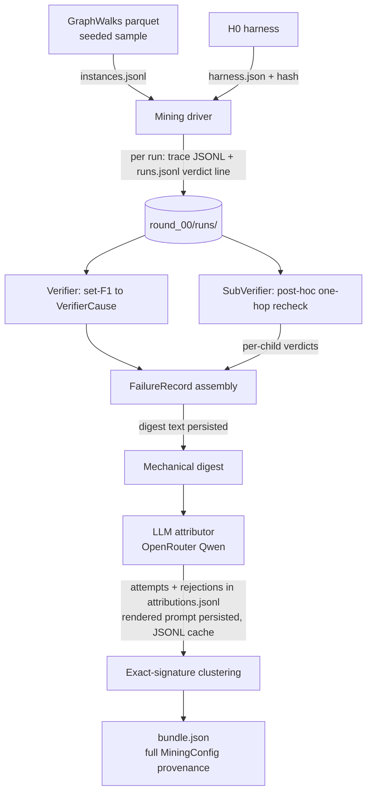

# Weakness Mining Completion - Plan

## Goal Capsule

- **Objective:** Complete stage 1 (Weakness Mining) of the Self-Harness loop for RLMs so that a round produces a fully auditable evidence bundle from GraphWalks runs, with tests for every module.
- **Authority hierarchy:** The Self-Harness paper (`paper/Self-Harness.pdf`, §3.2) is the source of truth for mining semantics. `paper/proposal.tex` adapts those semantics to RLMs (sub-verifier grounding, nine surfaces). Where existing code disagrees with the papers, the papers win.
- **Execution profile:** One unit at a time. Each unit lands with offline tests (no network, no model) plus at most one small live verification run (≤8 GraphWalks instances) via OpenRouter model `qwen/qwen3-30b-a3b-instruct-2507`.
- **Stop conditions:** Do not build stage 2 (Harness Proposal) or stage 3 (Proposal Validation). Do not fix substrate seam defects (`docs/residual-review-findings/feature-editable_surfaces.md`) beyond recording their known bias. Surface a blocker instead of guessing when paper and code conflict irreconcilably.
- **Tail ownership:** The plan ends at U8: one live `round_00` on disk whose audit chain has been walked link by link.

---

## Product Contract

### Summary

Complete the Weakness Mining stage on top of the existing `shrlm/optimization/` pipeline: merge it, align its taxonomy with the nine merged editable surfaces, add harness identity and full run provenance, port the GraphWalks environment with a mining-side Verifier and SubVerifier, build the mining driver, and harden attribution and bundle emission for auditability — each step verified with a small local GraphWalks experiment.

### Problem Frame

The proposal (`paper/proposal.tex` §3.3, Timeline) claims stage 1 is operational. In reality the `shrlm/optimization/` pipeline (merged to `main` from `feature/trace-clustering` on 2026-08-07) is well designed but entirely untested (its README references tests that do not exist), its taxonomy names six editable surfaces while the merged harness declares nine (S1–S9), no harness identity or serialization exists anywhere, and the evidence bundle cannot be traced back to raw traces, instances, digests, or prompts. The GraphWalks example (also merged to `main`) predates the editable surfaces and carries an in-run `verify_child` tool rather than the mining-side sub-verifier the papers require. Everything handed to Harness Proposal must be auditable; today almost none of it is.

### Requirements

**Mining semantics (Self-Harness §3.2, proposal §3.3)**

- R1. A mining round runs the current harness on held-in GraphWalks instances and produces, end to end: verifier verdicts, per-sub-call sub-verifier labels, structured failure records, validated LLM attributions, exact-signature clusters, and an evidence bundle on disk.
- R2. The bundle separates verifier-level cause from agent-level mechanism, orders clusters by support and actionability, and describes weaknesses without prescribing edits.
- R3. Failing level (root vs child) is derived from sub-verifier labels when checkable; a record whose sub-calls were all uncheckable is not counted as grounded.

**Auditability**

- R4. Every run — pass, fail, or terminated — leaves a persisted record: raw trajectory JSONL, verdict, and instance identity. The round's pass rate is recomputable from disk alone.
- R5. From `bundle.json` an auditor can reach, per failure record: the digest text the attributor saw, the rendered attributor prompt, every attribution attempt including rejections, the content-hashed raw trace file, the instance, and the exact harness (full surface serialization, not only a hash).
- R6. Bundle provenance covers the complete mining configuration: taxonomy/prompt/digest/validator versions, verifier configuration, sampling seeds, attributor model and sampling args, and the attribution cache path.
- R7. A round is resumable and non-clobbering: mining consumes persisted traces, a re-run refuses to overwrite a round directory whose `bundle.json` carries a different `bundle_id`, and a transient attributor API error does not discard completed records.

**Editable-surface alignment**

- R8. Attributions map mechanisms to the nine declared surfaces (S1–S9 in `shrlm/rlm_harness.py`), with the taxonomy version bumped and each surface's reach (root-only vs child-reachable) recorded so clusters are not pointed at surfaces that cannot affect the failing level.

**GraphWalks environment**

- R9. GraphWalks loads locally from the `openai/graphwalks` parquet with deterministic seeded sampling and synthesized instance ids; the Verifier maps set-F1 grading onto `VerifierCause` including degenerate answers (empty sets, fallback text, resource terminations); the SubVerifier rechecks one-hop sub-problems post-hoc from the prompt text the child actually saw and returns None rather than raising on anything unparseable.

**Testing and experiment discipline**

- R10. Every `shrlm/optimization/` module has offline tests using `tests/mock_lm.py::MockLM` and fixture traces — none exist today.
- R11. Each implementation unit that exercises live-model behavior (U4, U5, U6, U8) ends with one small live GraphWalks verification via OpenRouter `qwen/qwen3-30b-a3b-instruct-2507`, one step only, before the next unit begins; pure-module units (U1, U2, U3, U7) land on offline tests alone.

### Scope Boundaries

**Deferred to Follow-Up Work**

- Stage 2 (Harness Proposal) and stage 3 (Proposal Validation). U3's harness serialization is designed as the substrate for stage 2's edit-history ledger, but the ledger itself is stage-2 work.
- Fixes for the recorded seam defects A1 (batched sub-call `syntax_error` always False), A2 (retried sub-calls billed once), C1, C6, C7. Mining records A1/A2 bias in the bundle's integrity report (KTD8) and accounts for C7 via the taxonomy's reach annotations (KTD2); C1 and C6 stay recorded findings only. None of the seams are repaired.
- OOLONG-Pairs environment, preregistration, split management at proposal scale, baselines H1/F1, and evaluation tooling.

**Outside this work's identity**

- Any optimization-loop execution beyond single verification rounds; the alignment-drift probe; changes to the three RLM invariants or the evaluator.

### Sources & Research

- `paper/Self-Harness.pdf` §3.2 (mining semantics, failure signature, evidence bundle), §3.4 (what validation will later need from the bundle).
- `paper/proposal.tex` §3.3 (RLM adaptation: sub-verifier grounding, nine surfaces, held-in mining), §Timeline (claimed completed work).
- `shrlm/optimization/` — merged to `main` via PR #2; the walker was verified field-by-field against the current trajectory format.
- `shrlm/rlm_harness.py` (`Harness`, `SURFACES` S1–S9, `H0`), `shrlm/runner.py` (`build_harnessed_rlm`, `HARNESS_OWNED_KWARGS`, `run_metrics`).
- `rlm/clients/openai.py:15,68` — `backend="openrouter"` resolves `OPENROUTER_API_KEY` from env; `rlm/core/types.py:284` — `RLMMetadata.to_dict` serializes `backend_kwargs` verbatim into logs (why the key must never be passed in kwargs).
- `examples/graphwalks_example.py` on `main` (loader, F1 grading, `verify_child` one-hop check) — written before the editable surfaces; U4 adapts its logic rather than its runner wiring.
- `docs/residual-review-findings/feature-editable_surfaces.md` — seam defects whose bias mining must record.

---

## Planning Contract

### Key Technical Decisions

- KTD1. **Base the work on current `origin/main`.** Main merged the trace-clustering, graphwalks, and oolong-pairs branches on 2026-08-07 (PRs #2–#4), so it already carries `shrlm/optimization/`, `examples/graphwalks_example.py`, and the `graphwalks` pyproject extra. U1 merges `origin/main` into the working branch and preserves the mining pipeline's design decisions (closed taxonomy, mechanical digest, exact-match clustering), which match Self-Harness §3.2.
- KTD2. **Remap the taxonomy to the nine surfaces with a major version bump.** `EditableSurface` becomes the S1–S9 ids from `shrlm/rlm_harness.py`; `MECHANISM_SURFACE` is re-pointed; `TAXONOMY_VERSION` goes to `2.0.0`, which by design invalidates the attribution cache. Each surface entry records its reach (root-only vs child-reachable) because S6/S7/S9 seams apply at the root only (defect C7) — a child-level failure must not be attributed to a surface that cannot reach children.
- KTD3. **Harness identity is a deterministic serialization plus hash.** Serialize all nine surface values plus the `orchestrator` scalar (callables by their source text, dicts sorted, prompt strings verbatim; the harness name rides along as unhashed metadata) to `harness.json` in the round directory; `harness_hash = sha256` of that serialization feeds `MiningConfig.harness_version`. The orchestrator flag is hashed because it changes the effective system prompt. Full serialization is persisted because a hash verifies but cannot reconstruct (R5).
- KTD4. **Mining runs use `H0` unmodified: no `root_prompt` strategy text, no in-run `verify_child` tool.** The example's `TASK_STRATEGY` and `verify_child` REPL tool are orchestration guidance — exactly what the optimization loop must recover on its own (proposal §3.1, sparse `H0`). Sub-verification is mining-side and post-hoc, per Self-Harness §3.2 / proposal §3.3. `verify_child`'s one-hop recompute logic is reused inside the mining `SubVerifier`.
- KTD5. **Persist first, mine second.** The driver writes each raw completion and its verdict to disk immediately after the run; mining reads only persisted artifacts. This makes rounds resumable, keeps a crash from losing paid runs, and makes the pass set auditable (R4, R7).
- KTD6. **OpenRouter via existing client path.** `backend="openrouter"`, `backend_kwargs={"model_name": "qwen/qwen3-30b-a3b-instruct-2507"}`, key only via env `OPENROUTER_API_KEY` — never in `backend_kwargs`, which is serialized verbatim into trajectory logs. `(session-settled: user-directed — chosen over other providers/models: user named OpenRouter and Qwen3-30B-A3B-Instruct-2507.)` The driver fails fast if the model id is rejected at the first call.
- KTD7. **Run identity is `(instance_id, attempt)`; cluster rank uses distinct-instance support.** Run ids deduplicate resumed or replayed runs, key `bundle_id`, and make instance repeats visible in the audit trail. Each cluster records both its run count and its distinct-instance support, and cluster ordering uses distinct-instance support (then actionability, per R2), so repeated attempts on one flaky instance cannot inflate a cluster's rank.
- KTD8. **Known substrate bias is recorded, not repaired.** The bundle's integrity report names defects A1/A2 (syntax-error undercount, retry cost undercount) so downstream consumers can discount the affected `TreeStats` symptoms.
- KTD9. **Prescription lint applies only to mining-generated prose.** Quoted model output (`verdict.produced`, trace excerpts) is exempt — a wrong answer containing "instead of" must not crash bundle emission; the lint's job is keeping stage-1 prose non-prescriptive, per §3.2's evaluator/optimizer separation.

### High-Level Technical Design

Data flow for one round, with the audit artifact each step persists:

Audit chain (R5): `bundle.json` → pattern → record (run id) → `runs.jsonl` line → trace file (content hash) + instance → digest text → rendered prompt → attribution attempts → `harness.json`. U8 walks every link.

### Risks & Dependencies

- **Model nondeterminism:** even at temperature 0, OpenRouter runs are not reproducible; the attribution cache and persisted traces are the replay mechanism, not re-execution. Live smoke assertions must check artifact structure, never specific model behavior.
- **Dataset access:** GraphWalks requires one Hugging Face download; tests use committed fixture graphs, never the network.
- **Cost control:** all live verifications are ≤8 short instances; the cost gate is not in scope, but `usage_summary.total_cost` is recorded per run.
- **Attribution quality with Qwen3-30B:** a weaker attributor may reject often; per-attempt audit records (U6) make the rejection rate measurable rather than invisible.
- **Sub-verifier checkability under `H0`:** child prompts are model-authored with no imposed format, so the SubVerifier's parse rate on `H0` traces is unknown and may be near zero. U4's live smoke measures the checkable-verdict fraction and U8's summary reports grounding coverage; a near-zero rate is a named observation motivating later surface work, never a silently vacuous pass.

---

## Implementation Units

### U1. Merge main's mining pipeline and build its missing test floor

- **Goal:** `shrlm/optimization/` lives on the working branch with baseline tests for every pure module.
- **Requirements:** R10 (foundation for all others).
- **Dependencies:** none.
- **Files:** merge of `origin/main` (brings `shrlm/optimization/`, `examples/graphwalks_example.py`, and the oolong-pairs environment); new `tests/optimization/` with `test_taxonomy.py`, `test_types.py`, `test_walker.py`, `test_grounding.py`, `test_digest.py`, `test_clustering.py`, `test_bundle.py`; fixture trajectories under `tests/optimization/fixtures/`.
- **Approach:** merge `origin/main`; write the tests the mining README already promises, from synthetic `RLMChatCompletion` fixtures (one shallow tree, one nested depth-2 tree, one with a swallowed sub-call error, one fallback-terminated). Update the README's stale claims (six surfaces, phantom test paths) in U2 when the taxonomy changes.
- **Test scenarios:**
  - Every mechanism in `MECHANISM_DOCS` is documented and mapped to exactly one surface; taxonomy render matches the enums.
  - Walker on the nested fixture derives depth from nesting, counts lost sub-calls on the swallowed-error fixture, and flags `terminated_by_fallback` on the fallback fixture.
  - `walk()` on a completion with `metadata=None` raises the documented error (driver precondition, gap found in flow analysis).
  - Grounding: any wrong child ⇒ CHILD; all-correct children ⇒ ROOT; no descendants ⇒ NO_RECURSION.
  - Digest never leaks REPL locals; truncation is announced in the text; `coverage` reflects what survived.
  - Clustering groups iff all four signature strings match; below-`min_support` patterns are flagged, never dropped.
  - Bundle round-trip: `write_bundle` output re-reads into an equal bundle; `bundle_id` excludes the timestamp.
- **Verification:** `uv run pytest tests/optimization/` green; `make check` clean. No live run — pure-module unit.

### U2. Remap the taxonomy to the nine surfaces

- **Goal:** Attributions name surfaces that stage 2 can actually edit.
- **Requirements:** R8.
- **Dependencies:** U1.
- **Files:** `shrlm/optimization/taxonomy.py`, `shrlm/optimization/README.md`, `tests/optimization/test_taxonomy.py`.
- **Approach:** replace the six-member `EditableSurface` with the S1–S9 ids; re-point `MECHANISM_SURFACE` (natural correspondence: decomposition guidance→S2, sub-call policy→S3/S6 split by mechanism, metadata→S7, answer middleware→S9, error policy→S5/S6 split, helpers→S8); extend the mechanism vocabulary so every one of the nine surfaces is reachable — including S1 (REPL contract, e.g. a contract-misuse mechanism) and S4 (pre-submission verification, e.g. a skipped-verification mechanism or a re-homed premature-termination) — so stage 2 can receive evidence against all nine surfaces; add a per-surface reach field (root-only vs child-reachable, from defect C7); bump `TAXONOMY_VERSION` to `2.0.0`.
- **Test scenarios:**
  - Every surface id in the taxonomy exists in `shrlm.rlm_harness.SURFACES` (imported, not duplicated).
  - Every mechanism maps to exactly one surface; a child-level mechanism never maps to a root-only surface.
  - `render_taxonomy_block()` reflects the new vocabulary; the old six-surface strings are absent.
  - The set of surfaces reachable from `MECHANISM_SURFACE` is exactly the nine declared surfaces — a shrunken or drifted reachable set fails loudly.
- **Verification:** taxonomy tests green; attribution prompt renders the nine-surface menu.

### U3. Harness serialization and identity

- **Goal:** Any run is attributable to an exact, reconstructible harness.
- **Requirements:** R5, R6; substrate for the stage-2 edit-history ledger.
- **Dependencies:** U1.
- **Files:** new `shrlm/harness_identity.py` (or extend `shrlm/rlm_harness.py`); `tests/test_harness_identity.py`.
- **Approach:** `serialize_harness(harness) -> dict` covering all nine surface values plus the `orchestrator` scalar — prompt strings verbatim, `runtime_policy` sorted, callables (`metadata`, `answer_middleware`, helper entries) by `inspect.getsource`, S7 `declared_bound` included; `name` recorded outside the hashed material; `harness_hash(harness) -> str` as sha256 of the canonical JSON. Deterministic across processes.
- **Test scenarios:**
  - Same harness serializes byte-identically across two processes/orderings; hash is stable.
  - Changing any single surface (each of the nine, including one helper docstring and one policy field) changes the hash.
  - Two harnesses identical in all nine surfaces but differing only in `orchestrator` produce different hashes.
  - `H0` and `H0_STAR` produce distinct hashes; serialization of `H0` re-read from JSON names every surface.
- **Verification:** tests green; `harness.json` for `H0` written by a scratch invocation is human-readable and complete.

### U4. GraphWalks environment port with mining-side Verifier and SubVerifier

- **Goal:** GraphWalks instances, verdicts, and per-child labels feed the miner on current `main`.
- **Requirements:** R9, R3.
- **Dependencies:** U1.
- **Files:** new `shrlm/environments/graphwalks.py` (loader, instance synthesis, Verifier, SubVerifier — reusing `extract_answer_nodes`, `score`, and the one-hop recompute from the branch's `examples/graphwalks_example.py`); `pyproject.toml` (add the `graphwalks` extra: `huggingface_hub`, `pyarrow`); `tests/environments/test_graphwalks.py` with small committed fixture graphs; `shrlm/optimization/grounding.py` and `tests/optimization/test_grounding.py` (zero-checkable-verdicts grounding fix, Approach step 4).
- **Approach:**
  1. Loader: parquet download, filter by `problem_type`/`prompt_chars`, seeded balanced sample; synthesize `instance = {"id": sha of prompt+seed+index, "question": query line, "prompt", "answer_nodes", "problem_type"}` (rows have no id — miner requires one).
  2. Verifier adapter: pass iff F1 == 1.0; map failures to `VerifierCause` — missing nodes→INCOMPLETE, extra→SPURIOUS, both→MIXED_SET_ERROR, unparseable final answer→WRONG_FORMAT, empty/fallback answer→NO_ANSWER; `gold` serialized sorted (it feeds the digest sha and hence the cache). RESOURCE_TERMINATED is driver-owned (U5) — the Verifier's `(instance, produced)` signature never sees exceptions.
  3. SubVerifier: parse the child node's own prompt text for an edge slice + query; if parseable, recompute the hop and compare with `extract_answer_nodes(node.response)`; return None for unparseable prompts, errored nodes, or non-str prompts — never raise. Depth>1 nodes are graded against the slice in their own prompt, never the root graph.
  4. Grounding fix (in `shrlm/optimization/grounding.py`): a record with zero checkable child verdicts is `grounded=False` even when a SubVerifier was supplied — "ran" must not count as "checked" (R3).
- **Test scenarios:**
  - Loader determinism: same seed → same sample and same ids; different seed differs.
  - Verifier: exact match passes; each cause branch hit by a constructed answer, including the both-empty-sets F1 edge and a root fallback answer.
  - SubVerifier: correct one-hop child passes; wrong child fails; unparseable prompt → None; dict-shaped prompt → None; a raise inside parsing is impossible by construction (test asserts None, not exception).
  - Grounding: all-None verdicts → `grounded=False`, level UNDETERMINED.
- **Verification (live, one step):** load 2 instances with a fixed seed and run them under unmodified `H0` (no strategy text, no in-run `verify_child` tool — the condition mining will actually see) against OpenRouter Qwen; confirm verdict objects are produced and record the fraction of sub-calls with checkable (non-None) SubVerifier verdicts. The fraction is an observation to record, not a gate. ≤2 instances.

### U5. Mining driver: run, persist, then mine

- **Goal:** One command executes a round's runs under `H0` and persists everything mining needs.
- **Requirements:** R1, R4, R7 (run side), R11.
- **Dependencies:** U1, U3, U4.
- **Files:** new `shrlm/optimization/driver.py`; `shrlm/optimization/mining.py` (precomputed-verdict acceptance); new `tests/optimization/test_driver.py` (MockLM-backed).
- **Approach:**
  1. For each `(instance, attempt)`: `build_harnessed_rlm(H0, backend="openrouter", backend_kwargs={"model_name": ...}, log_dir=round_runs_dir).completion(instance["prompt"])`; catch `BudgetExceededError` / `TimeoutExceededError` / `TokenLimitExceededError` / `ErrorThresholdExceededError` at the root and synthesize a RESOURCE_TERMINATED verdict with whatever partial trajectory the logger holds — root terminations must not vanish from the round.
  2. Immediately after each run: write the completion `to_dict` JSONL, then append a `runs.jsonl` line: run id `(instance_id, attempt)`, verdict, trace path + sha256, cost, timestamp. Every run — including passes and terminations — gets a line (KTD5, KTD7).
  3. Write `harness.json` + hash (U3) and `instances.jsonl` (the sampled instances with seed) at round start.
  4. Mining phase reads persisted traces only; resuming skips run ids already present in `runs.jsonl`. `WeaknessMiner` accepts an optional precomputed `Verdict` per run, keyed by run id from `runs.jsonl` — the path by which driver-synthesized RESOURCE_TERMINATED verdicts (with partial trajectories reconstructed from logger output) enter mining.
  5. Assert at construction that the logger is attached (walker precondition).
- **Test scenarios:**
  - MockLM round: 3 instances (1 pass, 1 fail, 1 raising a budget error) → `runs.jsonl` has 3 lines, the termination is RESOURCE_TERMINATED, pass rate recomputable from disk.
  - Resume: kill after 2 of 3 runs (simulated), re-invoke → only the missing run executes; existing lines untouched.
  - Repeated instance with two attempts → two distinct run ids in the manifest; the cluster records run count 2 with distinct-instance support 1 (KTD7).
  - Missing `OPENROUTER_API_KEY` / rejected model id → fail fast before any run, with a clear error.
- **Verification (live, one step):** one driver invocation, 4 short instances, 1 attempt each → `round_00/runs/` populated, `runs.jsonl` complete, at least the artifact structure valid regardless of pass/fail mix.

### U6. Attribution auditability and robustness

- **Goal:** Every attribution — including failures — is replayable and inspectable; transient errors don't destroy a round.
- **Requirements:** R5, R6, R7 (attribution side).
- **Dependencies:** U1, U2, U5 (the live check attributes a failed trace from U5's round under U2's taxonomy).
- **Files:** `shrlm/optimization/attribution.py`, `shrlm/optimization/digest.py`, `shrlm/optimization/mining.py`, `tests/optimization/test_attribution.py`.
- **Approach:**
  1. Persist the digest text and the rendered system prompt into the round dir (hashes alone cannot be re-derived without the exact code commit).
  2. Write per-attempt entries — including rejected attempts with the named violation — into `attributions.jsonl` for unattributed records; today an attribution that never validates leaves nothing.
  3. Add a validator version to the cache key material (`config_sha256`) so validator changes cannot replay stale responses.
  4. Wide-tree fix: in per-depth aggregate digest mode, the prompt permits empty or focus-node-only `evidence_node_ids`; validation accepts it. Otherwise wide decompositions — the most mining-relevant traces — spiral into rejection.
  5. Transient (non-rejection) API errors: retry with backoff a bounded number of times; on final failure, checkpoint completed records and surface the error instead of discarding the round.
- **Test scenarios:**
  - MockLM valid response → cached; second call replays without an LM call.
  - Off-vocabulary label → re-ask with named violation; 3 strikes → unattributed record with all attempts in `attributions.jsonl`.
  - Wide fixture (>40 children) → digest in aggregate mode, attribution accepts empty evidence ids.
  - Validator-version bump → cache miss on previously cached digest.
  - LM raising a connection error twice then succeeding → attribution completes; raising persistently → `mine()` returns checkpointed records plus an explicit error, not an empty round.
- **Verification (live, one step):** attribute one real failed trace from U5's round via OpenRouter Qwen; inspect the persisted digest, rendered prompt, and attempt log.

### U7. Bundle hardening and provenance completion

- **Goal:** `bundle.json` is the auditable root of the round.
- **Requirements:** R2, R5, R6, R7 (bundle side), plus KTD8/KTD9.
- **Dependencies:** U1, U3, U5.
- **Files:** `shrlm/optimization/bundle.py`, `shrlm/optimization/clustering.py`, `shrlm/optimization/types.py` (`MiningConfig` fields), `tests/optimization/test_bundle.py`.
- **Approach:**
  1. Extend `MiningConfig`: verifier configuration (pass threshold, extraction rule identifier, gold ordering), sampling seed, validator version, attribution cache path, harness hash (backed by U3's serialization file).
  2. Per-record trace links: each record carries its run id, trace path, and trace sha256.
  3. Scope `assert_no_prescription` to mining-generated prose; quoted model output is exempt (KTD9).
  4. Non-clobbering writes: refuse to overwrite a `round_NN` whose existing `bundle.json` has a different `bundle_id`; same id → idempotent rewrite.
  5. Integrity report names substrate biases A1/A2 (KTD8) and the counts of unattributed, ungrounded, and excluded runs.
  6. Cluster support fields per KTD7: run count plus distinct-instance support, ordering by distinct-instance support then actionability (R2).
- **Test scenarios:**
  - A `verdict.produced` containing "instead of" or "the fix is" flows through bundle emission unflagged; the same phrase in `shared_symptoms` raises.
  - Re-run with identical config/instances → same `bundle_id`, write succeeds; changed instance set → different id, write refused with a clear error.
  - Bundle → record → trace link resolves for every record in a MockLM round; trace hash matches file content.
  - `MiningConfig` round-trips with all new fields; two rounds with different verifier config produce different `bundle_id`s.
  - Zero-failure round → valid bundle with empty patterns, and `runs.jsonl` still proves the pass set.
  - Two failing attempts of one instance in a cluster yield run count 2 and distinct-instance support 1; a three-cluster fixture round-trips ordered by distinct-instance support, ties broken by actionability (R2, KTD7).
- **Verification:** offline tests green; bundle from U5's MockLM round passes an automated link-resolution check.

### U8. End-to-end audited round on GraphWalks

- **Goal:** One live round proves the full chain and the audit walk.
- **Requirements:** R1–R9, R11 (capstone).
- **Dependencies:** U1–U7.
- **Files:** new `shrlm/optimization/audit.py` (link-walking check: bundle → patterns → records → attempts → digests → prompts → traces → instances → harness, verifying every hash and path); small runner script or `make` target for the round; `tests/optimization/test_audit.py` (MockLM round).
- **Approach:** run the driver on ≤8 short held-in-style GraphWalks instances under unmodified `H0` via OpenRouter Qwen; mine; emit `round_00`; run the audit walk; record the observed pass rate, cluster set, grounding coverage (fraction of failure records with checkable child verdicts), and unattributed/ungrounded counts as the round's summary.
- **Test scenarios:**
  - Audit walk on a complete MockLM round passes; deleting any single artifact (a trace file, the digest text, `harness.json`) makes it fail naming the broken link.
  - Audit walk on the pre-U7 artifact layout fails (guards against silent regression to hash-only provenance).
- **Verification (live, one step):** `round_00` exists with every artifact; audit walk exits clean; a human can follow one failure record from `bundle.json` to its raw trace in one sitting.

---

## Verification Contract

| Gate | Command | Applies to |
|---|---|---|
| Unit tests (offline, no network/model) | `uv run pytest` | every unit; new tests under `tests/optimization/`, `tests/environments/` |
| Lint/format | `make check` (ruff check + format, per `AGENTS.md`) | every unit |
| Live smoke (one step per unit) | driver/example invocation, ≤8 GraphWalks instances, `OPENROUTER_API_KEY` from env | U4, U5, U6, U8 as specified per unit |
| Audit walk | `shrlm/optimization/audit.py` against the round dir | U8 (and MockLM rounds in CI-style local runs) |

Tests never download the dataset or call a model; fixtures are committed. Live smokes assert artifact structure and provenance, never specific model behavior.

## Definition of Done

- All eight units landed in dependency order; `uv run pytest` and `make check` green.
- One live `round_00` on disk whose audit walk passes: every failure record traceable to digest text, rendered prompt, attribution attempts, content-hashed raw trace, instance, and full harness serialization.
- Pass rate and exclusions recomputable from `runs.jsonl` alone; re-invoking the round resumes instead of clobbering.
- Taxonomy at version 2.0.0 references exactly the nine declared surfaces with reach annotations; `shrlm/optimization/README.md` matches reality (nine surfaces, real test paths).
- No stage-2/stage-3 code, no seam-defect fixes, and no abandoned experimental code left in the diff.
