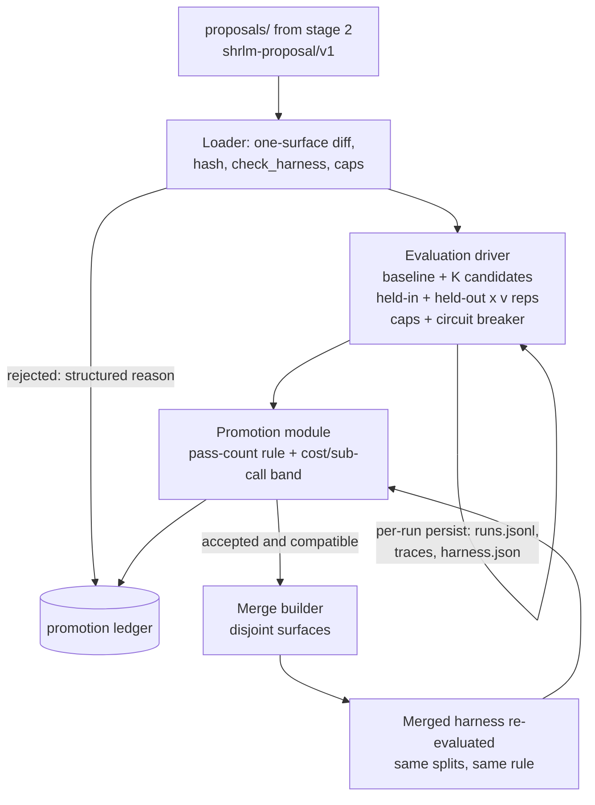

# Proposal Validation Stage - Plan

## Goal Capsule

- **Objective:** Build stage 3 (Proposal Validation) of the Self-Harness loop: consume K candidate harness edits, evaluate each against the incumbent on held-in and held-out splits with repetition under hard cost control, promote by the preregistered rule, re-evaluate merged compatible edits, and record every decision in an auditable ledger.
- **Authority hierarchy:** Self-Harness paper §3.4 (acceptance rule, repetition aggregation, merge semantics, reject non-modifying/failed candidates, auditable transitions) is the source of truth; `paper/proposal.tex` §3.3.3 carries our deltas — the preregistered sub-call/cost band on top of the pass-count rule, and merged-harness re-evaluation before promotion. Where existing code disagrees with the papers, the papers win.
- **Execution profile:** One unit at a time; offline MockLM tests per unit; at most one small live GraphWalks verification (≤8 runs) via OpenRouter `qwen/qwen3-30b-a3b-instruct-2507`.
- **Stop conditions:** Stage 2 (the proposer) is another developer's work — build only the interface contract and loader here. The optimization loop (rounds, patience, stopping) is out. Do not modify the evaluator, the three RLM invariants, or the mining stage beyond additive reuse.
- **Tail ownership:** Plan ends at U6's live smoke: one hand-written candidate validated end-to-end with a complete ledger.

---

## Product Contract

### Summary

Define the versioned candidate-proposal artifact contract as the stage-2 boundary, load and safety-check candidates into runnable harnesses, evaluate baseline and candidates over both splits with repetition by reusing the persist-first round infrastructure under experiment-owned cost caps with a per-candidate circuit breaker, apply the promotion rule plus band check offline, re-evaluate the merged harness, and emit an auditable promotion ledger that doubles as stage-2's edit history.

### Problem Frame

Weakness Mining (stage 1) ships and hands stage 2 an auditable evidence bundle. Stage 2 is being built by another developer, so validation cannot depend on its unbuilt code — but the two stages meet at a concrete artifact, and nobody has defined it. Without stage 3, no edit can ever be promoted, and without hard cost control a candidate edit could weaken recursion limits and let an RLM spawn copies until the token budget or GPUs are gone: the runtime policy is itself an editable surface, so the harness cannot be trusted to bound its own evaluation.

### Requirements

**Stage-2 interface**

- R1. A versioned candidate-proposal artifact format is documented and enforced by a loader: candidate identity, base-harness hash, targeted failure-pattern signature, the full serialized candidate harness, predicted behavioral effect, and regression risks (the paper's audit record).
- R2. The loader rejects, with structured reasons, candidates that: modify zero or more than one declared surface relative to the base; fail harness invariant checks; carry a serialization whose hash does not match its content; or declare a base hash that is not the incumbent.

**Cost control**

- R3. Evaluation caps (max depth, max iterations, per-run budget, per-run timeout) are experiment-owned validation config applied at the RLM constructor level; a candidate's runtime-policy surface may tighten but never exceed them.
- R4. A per-candidate cumulative-spend circuit breaker aborts that candidate's remaining runs when tripped; completed runs persist, and the candidate is recorded as over-budget (rejected), never silently dropped.

**Evaluation and promotion**

- R5. Baseline and every candidate are evaluated on the held-in and the disjoint held-out split with a configurable repetition count, using the persist-first round infrastructure (every run persisted with verdict, trace sha, cost; resumable).
- R6. Promotion follows the paper's rule on pass counts aggregated across repeats — candidate accepted only if it degrades neither split beyond a configurable noise tolerance and improves at least one beyond a configurable margin (both thresholds default to 0, reproducing the paper's exact rule) — AND proposal.tex's band: candidate sub-call count and cost within the preregistered band relative to baseline.
- R7. When multiple accepted candidates are compatible (disjoint surfaces), the merged harness is built and re-evaluated under R5/R6 before promotion; the merge is promoted only if it passes on its own. When the merged harness fails, the round promotes nothing — a fallback to individually accepted candidates after seeing merge results is post-hoc selection the preregistered rule never validated; constituents are ledgered as merged_failed.
- R8. Every candidate's outcome — metrics per split, deltas, band values, accept/reject with reason, merge participation — lands in a promotion ledger that is auditable (links to the evaluation round artifacts and harness serializations) and serves as prior-edit history for the next proposal round.

**Verification discipline**

- R9. Everything above is provable offline with MockLM (including the circuit breaker and merge re-evaluation); one live smoke validates a hand-written candidate end to end.

### Scope Boundaries

- Stage 2 (proposer) implementation — out; only the contract and loader.
- The optimization loop (round iteration, patience, early stopping, freeze) — deferred follow-up; this stage exposes a single-round evaluate-and-promote API.
- Preregistered numeric values (band multipliers, noise-margin thresholds τ_reg/τ_imp, split sizes, repetition counts) — config parameters with placeholder defaults; the pilot fixes them, not this plan.
- Baselines H1/F1, OOLONG splits, final-evaluation tooling — out.

### Sources & Research

- Self-Harness paper §3.4: acceptance rule (Δ_in ≥ 0, Δ_ho ≥ 0, max > 0 on pass counts), repeat-and-aggregate under stochasticity, merge of compatible candidates, rejection of non-modifying/failed candidates, per-candidate audit records.
- `paper/proposal.tex` §3.3.3 (band + merged re-evaluation), §Feasibility (R_round accounting: v(K+1)(n_in+n_ho) validation runs).
- `shrlm/runner.py` — `acceptance_inputs(baseline, candidate)` already computes the cost/sub-call gate inputs and documents that the gate lives here; `check_harness` is the invariant gate; `HARNESS_OWNED_KWARGS` protects seams.
- `shrlm/harness_identity.py` — `serialize_harness` / `harness_hash` / envelope (candidate payload format), source-text callable serialization (the materialization seam).
- `shrlm/optimization/driver.py` — `RoundConfig` (forwards `max_iterations`/`max_depth`/`max_budget`/`max_timeout` to the RLM), `run_round` persist-first rounds, resume semantics; `rlm/core/rlm.py` `max_budget` (USD, cost-tracking backend) and `max_timeout`.
- `shrlm/optimization/bundle.py` — non-clobber writes, `bundle_dir_for` layout ownership; audit-walk pattern in `audit.py` to mirror for ledger links.

---

## Planning Contract

### Key Technical Decisions

- KTD1. **The candidate payload is a full serialized harness, not a surface delta.** `shrlm-harness/v1` envelopes already serialize and hash through `harness_identity`; materialization (the reverse direction) is new work U1 adds. The one-surface constraint is enforced by diffing the candidate serialization against the incumbent's, which is simpler and stricter than trusting a declared delta.
- KTD2. **Candidates materialize file-backed, gated before any code runs.** (session-settled: user-approved — chosen over restricting v1 candidates to text/dict surfaces: the REPL already executes model-written code by design, and callable surfaces S7–S9 are where structural edits live.) Order is text-level gates first — envelope hash recompute, base-hash match, one-surface diff, cap comparison, none of which require materialization — then materialization plus `check_harness` inside a subprocess with a wall-clock timeout (`check_harness` calls candidate middleware, so it sits inside the boundary). Callable surfaces are written to a real module file under the candidate's directory and imported, so `inspect.getsource` recovers the exact source and serialization/hash round-trips — bare `exec`-built callables cannot re-serialize and would crash the evaluation driver's harness-hash step. Unchanged surfaces reuse the incumbent's live objects. The materialization namespace is defense-in-depth, not a security boundary; the contract doc names the allowed-import vocabulary candidate source may reference.
- KTD3. **Cost governance is experiment-owned.** (session-settled: user-directed — chosen over trusting harness-level policy: the runtime policy is an editable surface, so an edit could lift its own limits.) Caps bind at the RLM constructor via the round config; candidate S6 values are merged tighten-only; the circuit breaker (R4) is driver-level accounting over persisted run costs.
- KTD4. **Evaluation reuses the persist-first round infrastructure.** Each (candidate × split) evaluation is a `run_round` with its own directory and `harness.json` identity; resumability, sha-linked traces, and recomputable pass rates come for free, and the ledger links into the same audit fabric.
- KTD5. **Promotion math is a pure offline module over persisted artifacts.** Pass counts, deltas, band checks, compatibility, and merge selection read runs.jsonl files and return decision records — fully testable without a model, mirroring the miner's consume-not-execute design.
- KTD6. **Single-round API; the loop is out.** (session-settled: user-approved — chosen over building round iteration now: validation exposes `validate_round(...)` and the ledger; stop rules compose later.)

### High-Level Technical Design

### Risks & Dependencies

- **Stage-2 alignment:** the contract doc is written here without the other developer in the loop; their sign-off may change field names before they build. The loader owns the schema version, so a v2 is additive.
- **Budget enforcement depends on cost-reporting backends:** `max_budget` requires cost tracking (OpenRouter supplies it; MockLM tests must stub costs). The circuit breaker uses persisted costs, so it works wherever `usage_summary.total_cost` is populated — `acceptance_inputs` already fails fast when cost is missing.
- **Merged-edit conflicts:** disjoint-surface merges can still interact behaviorally; the merged re-evaluation (R7) is the guard, per proposal.tex.

---

## Implementation Units

### U1. Candidate contract and loader

- **Goal:** The stage-2 boundary exists as a schema doc and an enforcing loader (R1, R2; KTD1, KTD2).
- **Requirements:** R1, R2; KTD1, KTD2.
- **Dependencies:** none.
- **Files:** new `shrlm/optimization/candidates.py`; new `docs/harness-proposal-interface.md` (schema doc the stage-2 developer targets); new `tests/optimization/test_candidates.py`.
- **Approach:**
  1. Define `shrlm-proposal/v1`: `proposal.json` per candidate under a proposals directory — candidate id, base_harness_hash, target signature (the four φ strings), surface id, the full `shrlm-harness/v1` envelope, predicted_effect, regression_risks, proposer provenance (model, prompt sha) — plus the allowed-import vocabulary for candidate surface source (KTD2).
  2. Loader, in KTD2's order: text-level gates on the envelope first (hash recompute; base hash matches the incumbent; exactly one surface differs; S6 within caps — tighten-only merge lives in U2, here only the comparison); only then file-backed materialization plus `check_harness`, both inside a subprocess with a wall-clock timeout.
  3. Materialization: edited callable surfaces written to a module file under the candidate directory and imported (round-trips through `serialize_harness`); unchanged surfaces reuse the incumbent's live objects.
  4. Rejections return structured `CandidateRejection` reasons; never exceptions for expected-invalid input.
- **Patterns to follow:** `harness_identity.serialize_harness`/`hash_of_serialization`; `attribution.py`'s validate-with-named-violation style for structured rejection.
- **Test scenarios:**
  - Round-trip: serialize a modified `H0` (each surface class: string S2, dict S6, callable S9) → loader materializes a harness whose serialization is byte-identical.
  - Zero-surface diff (byte-identical to base) → rejected "modifies no surface"; two-surface diff → rejected naming both.
  - Tampered envelope (hash mismatch) → rejected; wrong base hash → rejected.
  - A candidate whose callable source raises at materialization → structured rejection, not a crash.
  - A candidate whose source hangs → subprocess timeout → structured rejection (the host never blocks).
  - A materialized callable-surface candidate passes the evaluation driver's harness-hash step (`_prepare_round_dir`) without serialization errors.
  - Text-level rejections (hash, base, diff, caps) occur with zero candidate code executed (assert no materialization side effect).
  - `check_harness` failure (e.g. unbounded S7) → rejected with the runner's message.
- **Verification:** loader tests green; schema doc reviewed against the handoff doc's stage-2 contract section for consistency.

### U2. Cost governor

- **Goal:** No candidate evaluation can exceed experiment-owned limits (R3, R4; KTD3).
- **Requirements:** R3, R4; KTD3.
- **Dependencies:** U1 (cap-compliance check surface).
- **Files:** new `shrlm/optimization/costs.py` (or fold into `validation.py` if small — implementer's call); `tests/optimization/test_costs.py`.
- **Approach:**
  1. `ValidationCaps` config: max_depth, max_iterations, per-run max_budget, per-run max_timeout, per-candidate cumulative budget.
  2. Tighten-only merge: candidate S6 policy values may lower but never raise the corresponding caps; violations are U1-style structured rejections. Forwarding rule for the runner's S6-ownership guard: when a candidate's enabled policy declares `max_depth`, the governor validates it against the cap and omits the constructor value (the policy binds via the runner, avoiding the double-declaration ValueError); when the policy is silent, the governor forwards the cap.
  3. Circuit breaker: driver-level accumulation over persisted run costs per candidate; on trip, remaining runs for that candidate are skipped, persisted runs stand, candidate outcome = over_budget.
- **Test scenarios:**
  - Candidate S6 with max_depth above the cap → rejected; below → accepted with candidate's value in force.
  - Cumulative spend crossing the per-candidate budget mid-split → remaining runs skipped, manifest shows the completed prefix, outcome over_budget.
  - Caps flow into the round config (constructor-level) — a MockLM run asserts the RLM received them; an S6-declaring candidate builds without the runner's double-declaration ValueError.
  - Terminated-run cost policy: a budget-terminated run persists the limit exception's spent amount as its cost; a termination that genuinely carries no cost (timeout on a cost-less backend) is counted at the per-run budget ceiling for breaker accounting, never zero; the loud missing-cost error fires only for non-terminated runs.
- **Verification:** offline tests green; breaker semantics pinned.

### U3. Candidate evaluation driver

- **Goal:** Baseline and candidates produce persisted, resumable, comparable evaluation rounds (R5; KTD4).
- **Requirements:** R5; KTD4.
- **Dependencies:** U1, U2.
- **Files:** new `shrlm/optimization/validation.py` (evaluation half); `tests/optimization/test_validation.py`.
- **Approach:**
  1. Directory shape: `validation/round_NN/<candidate_id|baseline>/<heldin|heldout>/` — each `<split>` directory is the out_dir handed to `run_round`, so its contents land under a nested `round_00/` (`harness.json`, `runs.jsonl`, traces); repetition via the existing `(instance, attempt)` run ids. Document the nesting in the module docstring and use it in ledger links.
  2. Evaluate baseline once per round, candidates against it; resume skips persisted runs (crash-safe by construction).
  3. Aggregation: pass counts and costs come from `runs.jsonl`; sub-call counts come from rehydrating persisted traces through `load_round` + `run_metrics` (sha-verified, disk-only). Each per-candidate aggregate is written once as a validation-owned summary file so the band check and ledger never re-read traces, and the shared mining manifest is never extended.
- **Patterns to follow:** `run_round`/`RoundConfig`; the mining stage's round-directory layout conventions; `audit.py` link style for anything the ledger will cite.
- **Test scenarios:**
  - MockLM: baseline + 2 candidates × 2 splits × 2 reps → all round dirs complete; pass counts and cost aggregates recomputable from disk alone.
  - Resume mid-candidate → only missing runs execute.
  - A candidate whose runs all terminate on budget → runs persisted as RESOURCE_TERMINATED, aggregates still computable.
- **Verification:** offline tests green; directory layout documented in the module docstring.

### U4. Promotion module

- **Goal:** The promotion decision is pure, offline, and matches paper + proposal deltas (R6, R7 selection and merge construction; KTD5).
- **Requirements:** R6, R7 (selection + merge construction — the merged-harness re-evaluation orchestration is U6's); KTD5.
- **Dependencies:** U3 (aggregate shapes).
- **Files:** `shrlm/optimization/validation.py` (promotion half) or sibling `promotion.py`; `tests/optimization/test_promotion.py`.
- **Approach:**
  1. Acceptance rule on aggregated pass counts with a noise margin: Δ_in ≥ -τ_reg and Δ_ho ≥ -τ_reg and max(Δ_in, Δ_ho) > τ_imp. Both thresholds default to 0, reproducing the paper's exact rule; the pilot's preregistered empirical margin (proposal.tex Week 2) drops into these config parameters, and both values are recorded in every ledger record.
  2. Band check: candidate mean sub-calls and mean cost within the preregistered band expressed relative to baseline (config: multiplier bounds); both the rule and the band must pass.
  3. Candidates already rejected upstream (loader, over-budget) enter as rejections with their reasons; never re-scored.
  4. Compatibility = pairwise disjoint edited surfaces among accepted candidates; merge builder composes the incumbent with each accepted edit's surface value. The merged harness is the promotion artifact: it goes back through evaluation and this rule (R7, orchestrated by U6) before promotion is final, and when it fails, the round promotes nothing (no post-hoc single fallback — that is unpreregistered selection).
- **Test scenarios:**
  - Each rule branch: improves both splits → accept; trades one for the other → reject; flat on both → reject (max > τ_imp fails).
  - Noise margin: with τ_reg > 0, a one-split single-run regression within tolerance still accepts; with τ_imp > 0, a sub-margin improvement rejects. τ_reg = τ_imp = 0 reproduces the strict rule.
  - Band: pass-rule-passing candidate with cost outside the band → reject with band reason; boundary values inclusive/exclusive pinned.
  - Merge construction: two accepted disjoint-surface candidates → merged harness built with both edits; same-surface accepted pair → not merged, the candidate with the higher held-out delta (tiebreak: then held-in, then candidate id) promoted alone.
  - Merged harness failing the rule → round promotes nothing; constituents ledgered as merged_failed (the promotes-nothing decision, R7).
- **Verification:** pure-function tests green with zero model/filesystem dependencies beyond fixture aggregates; the merged-harness re-evaluation itself is exercised in U6.

### U5. Promotion ledger

- **Goal:** Every transition in the harness lineage is auditable and machine-readable for stage 2 (R8).
- **Requirements:** R8.
- **Dependencies:** U3, U4.
- **Files:** `shrlm/optimization/validation.py` (ledger writer) ; `tests/optimization/test_validation.py` additions.
- **Approach:** `validation/round_NN/promotions.jsonl` — one record per candidate and per merged harness: ids, harness hashes, per-split pass counts and deltas, band metrics, decision + reason, links (relative paths) to evaluation round dirs and harness serializations; plus a `decision.json` summary (promoted harness hash or "no promotion"). Non-clobbering writes following the bundle pattern.
- **Test scenarios:**
  - Full MockLM validation round → ledger contains every candidate incl. loader-rejected and over-budget ones with reasons; links resolve to existing dirs; re-run is idempotent, divergent rewrite refused.
  - decision.json names the merged harness when a merge promoted; "no promotion" round produces a valid ledger.
- **Verification:** ledger link-resolution check in tests (audit-walk style).

### U6. End-to-end validation round: offline proof + live smoke

- **Goal:** The stage works as one call, offline and live, including the merged-harness re-evaluation orchestration (R9, R7 orchestration).
- **Requirements:** R9 (capstone over R1–R8); R7 (the merged-harness re-evaluation orchestration U4 constructs but does not run).
- **Dependencies:** U1–U5.
- **Files:** `tests/optimization/test_validation_e2e.py`; handoff-doc section update (`docs/handoff-harness-proposal.md`) pointing stage 2 at the contract doc and ledger.
- **Approach:** `validate_round(incumbent, proposals_dir, splits, caps, band, reps)` composes loader → evaluation → promotion → merge re-evaluation → ledger; the merge leg re-runs the merged harness through U3 evaluation and the U4 rule before promotion. Offline: four fabricated candidates under the MockLM script — two genuinely better on disjoint surfaces (so a merge is built and re-evaluated), one regressing, one over-budget — asserting the merged harness is what promotes and the ledger is complete. Live (one step): one hand-written candidate (e.g. a decomposition-instruction edit to `H0`), 2 instances × both fabricated splits × 1 rep via OpenRouter — asserts artifact structure and ledger completeness, never model behavior.
- **Test scenarios:**
  - Offline e2e as above: the merged harness of the two disjoint winners is built, re-evaluated, and promoted (or, in a variant where the merge fails, the round promotes nothing and both are ledgered merged_failed).
  - Zero valid candidates → clean "no promotion" round; all candidates rejected by loader → evaluation never runs (no model calls).
  - Live smoke: ledger + round dirs complete; total spend under a stated ceiling.
- **Verification:** offline e2e green; live `validation/round_NN` artifacts on disk with clean link resolution.

---

## Verification Contract

| Gate | Command | Applies to |
|---|---|---|
| Offline tests | `uv run pytest tests/optimization -q` | every unit |
| Lint/format | `uv run ruff check shrlm/ tests/` + `ruff format --check` | every unit |
| Live smoke (one step) | U6 script, ≤8 runs total, `OPENROUTER_API_KEY` from env | U6 only |
| Mining regression | full `uv run pytest tests/ -q` stays green; `python -m shrlm.optimization.audit examples/mining_rounds 0` exits 0 | before ship |

## Definition of Done

- U1–U6 landed in dependency order; suite and lint green; mining stage untouched except additive reuse.
- The contract doc exists and the handoff doc points stage 2 at it and at the ledger as edit history.
- Offline e2e proves: loader gates, tighten-only caps, circuit breaker, both-split repetition evaluation, rule + band promotion, merge re-evaluation of two disjoint-surface winners (promotes-nothing on merge failure), complete auditable ledger.
- One live validation round on disk from a hand-written candidate, artifact-complete.
- No optimization-loop code, no stage-2 proposer code, no abandoned experiments in the diff.
