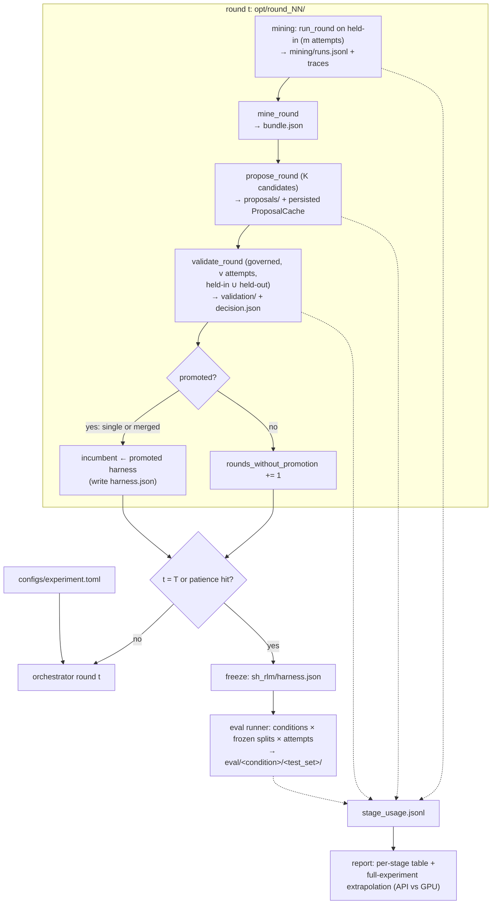

# Self-Harness Experiment Scaffold - Plan

## Goal Capsule

- **Objective:** Make the full experiment in `docs/plans/experiments_draft.md` runnable and measurable end to end: one config file owns every parameter, every stage reports tokens/time/cost, a cheap smoke (1 shrunk optimization round + 1 small eval round) proves the pipeline live and yields the numbers that decide hosted-API vs A100.
- **Authority:** `docs/plans/experiments_draft.md` and `paper/proposal.tex` §Methods/§Feasibility govern experiment semantics (splits, promotion rule, run counts). This plan governs scaffold implementation. Repo conventions in `AGENTS.md` govern style (ruff, fail-fast, no defensive fallbacks).
- **Stop conditions:** Stop and surface if (a) OpenRouter stops returning `usage.cost` for the backbone model (breaks the cost band and spend breaker), (b) the persisted `harness.json` → `materialize_harness` round-trip fails (breaks freeze/eval and merged-promotion resume), or (c) live smoke spend exceeds $5.
- **Execution profile:** Standard branch/test/commit flow on `feat/experiment_scaffold`. Live-API tests are opt-in and never run in CI.

---

## Product Contract

### Summary

Add an experiment layer over the existing `shrlm` stage functions: a TOML config, an outer round orchestrator, an eval runner, both environments with short and long splits, stage-level usage instrumentation, a cost/time report with API-vs-GPU extrapolation, and a two-tier smoke (free mock, then bounded live).

### Problem Frame

The optimization stages (mining, proposal, validation/promotion) exist and are individually tested, but nothing chains them into rounds, nothing runs the evaluation stage, OOLONG-Pairs is not a first-class environment, and parameters live as scattered dataclass defaults. Cost and wall-time are only partially recorded (per-run USD; no tokens, no stage totals), so the project's central budgeting decision — hosted inference vs a rented A100 — currently rests on unverified estimates (~5-6e9 tokens, ~$1.2k-2k hosted). Running the full experiment to find out is not acceptable; a single full-size round is already ~1,328 runs.

### Requirements

**Configuration**

- R1. A single TOML config file holds every experiment parameter from `experiments_draft.md` §3.10 — decoding config, split sizes, loop counts (m, v, K, T, patience), promotion thresholds (τ_reg, τ_imp, cost band, sub-call band), runtime caps, dataset/split definitions, backend and model names for runner/attributor/proposer — with the draft's proposed values as defaults. No experiment parameter is hardcoded in scaffold code.
- R2. The config carries a `[smoke]` profile that overrides scale counts (instances, repetitions, candidate width, rounds) without touching semantics, so the same pipeline runs at smoke scale and full scale.
- R3. Every behavior-changing config value — runner/attributor/proposer models, sampling_args, caps, attempts, loop counts (m, v, K, T, patience), promotion thresholds and bands, split seeds and definitions, dataset revision pins — is hashed into a config identity persisted with each experiment; resume against a changed identity hash refuses rather than silently mixing state. Only operational keys (paths, pricing/GPU tables, report settings) stay free.

**Instrumentation**

- R4. Every run persists input tokens, output tokens, wall time, and USD cost in its manifest entry, alongside the existing `cost` field.
- R5. Every pipeline stage (mining runs, attribution, proposal, validation, eval) persists an append-only usage record: tokens, wall time, USD, cache hits, and a resumed flag. Terminated runs are marked as lower bounds.
- R6. A report command emits a per-stage measured table (runs, tokens in/out, wall time, USD) and extrapolates to the full experiment under hosted-API pricing and self-hosted GPU throughput scenarios. Run counts are derived from config — the per-round formula plus a merge-leg term, and the full-experiment eval grid — never hardcoded.

**Pipeline**

- R7. An outer orchestrator runs complete optimization rounds — mining → proposal → validation → promotion — with the T/patience stopping rule, per-round directory layout, prior-history threading, and crash-safe resume.
- R8. An eval runner evaluates fixed harness conditions on frozen test splits with repeated attempts per instance; all conditions consume byte-identical split files.
- R9. Both environments provide short and long splits from config: GraphWalks long from the native `graphwalks_256k_to_1mil.parquet` HF file, OOLONG-Pairs long via larger `context_lengths` in its generator. (session-settled: user-directed — long-split construction included now, chosen over deferring it: source-long is a primary comparison and blocks the paper without it)
- R10. OOLONG-Pairs is a first-class environment in `shrlm/environments/` implementing the same verifier protocol as GraphWalks.
- R11. Source-short is partitioned into disjoint held-in/held-out/test subsets by a one-shot split materialization step, persisted with hashes.

**Safety and validation**

- R12. Per-run `max_budget` and `max_timeout` are mandatory config values, and mining and eval run under a cumulative spend breaker (validation already does).
- R13. A $0 mock-LM smoke exercises the full chained round and eval wiring; a live smoke runs 1 shrunk optimization round plus a small eval sample (short and long instances, both environments) on OpenRouter with a hard spend ceiling, asserting artifact structure — never model behavior or promotion outcomes.

### Success Criteria

- Mock smoke passes in CI with zero network access.
- Live smoke completes for under ~$5 and produces a populated cost report with a full-experiment estimate and an API-vs-A100 recommendation — or a provisional comparison naming what is missing, per the U7 recommendation policy.
- Editing one TOML value re-parameterizes the whole pipeline without code changes.

### Scope Boundaries

Out of scope: running the full 15-round optimization or full evaluation; H1 (λ-RLM) integration; F1 fine-tuned baseline; leave-one-edit-out and sub-verification ablations; alignment drift probe; bootstrap/significance analysis tooling; pilot calibration proper (§3.9 — the smoke yields first token/cost numbers, but τ, cost band, and max-output-token finalization remain a later pilot run using this scaffold).

**Deferred to Follow-Up Work**

- Per-attempt sampling seeds for the "3 seeded repetitions" eval claim (see Open Questions).
- GraphWalks instances in the 128k–256k-token gap between the two HF parquet files, if the pilot needs mid-length bins.
- Self-hosted (vLLM) backend wiring; the scaffold only estimates that path.
- Trace-body retention/compression policy, once the U7 report gives a measured disk footprint.

---

## Planning Contract

### Key Technical Decisions

- KTD1. **TOML via stdlib `tomllib`, one file at `configs/experiment.toml`.** No new dependency; matches the `training/configs/rlm-qwen3-30b-example.toml` precedent. Values load into frozen dataclasses that feed the existing constructors (`RoundConfig`, `EvaluationConfig`, `ValidationCaps`, `PromotionConfig`, `ProposerConfig`); the config module is the only place that reads the file.
- KTD2. **New `shrlm/experiment/` package for the orchestration layer.** `shrlm/optimization/` owns single stages; the experiment layer (config, splits, orchestrator, eval, usage, report) owns chaining and measurement. Keeps stage modules untouched except for additive metrics fields.
- KTD3. **Config identity hash on resume.** Identity keys — every value that changes generated artifacts or decisions: runner/attributor/proposer models, sampling_args, caps, attempts, loop counts, promotion thresholds/bands, split seeds and definitions, dataset revision pins — hash into a `config.json` persisted at the experiment root and each round dir, checked on resume — extending the existing `harness.json`-hash and `instances.jsonl` byte-compare idiom in `shrlm/optimization/driver.py`. Lowering `attempts` mid-experiment is refused; orphan attempt lines would otherwise skew the equal-`n_runs` precondition of the pass-count τ rule.
- KTD4. **Instrumentation is additive-only.** New keys on `run_metrics` output and manifest lines (both are dict-shaped and tolerant of extra keys); stage usage goes to new append-only sidecar files (`stage_usage.jsonl`), never into `summary.json`, whose byte-compare on resume (`shrlm/optimization/validation.py`) makes any schema change a resume-breaker. Stage usage has two capture paths: run-executing stages (mining, validation, eval) aggregate the new per-run manifest token/time/cost keys — the runtime constructs a fresh client per completion (`rlm/core/rlm.py`), so no client handle exists to snapshot for those stages — while snapshot-diffing `lm.get_usage_summary()` applies only to the experiment-held proposer and attributor clients. Every stage record carries a stable stage-work id so the report counts each execution attempt exactly once across resumes.
- KTD5. **GraphWalks long split = native HF file.** Research found `openai/graphwalks` ships `graphwalks_256k_to_1mil.parquet`; the loader gains `dataset_file` and `min_chars`/`max_chars` parameters instead of new construction code — concatenation and regeneration (draft §3.10 row 4 options a/b) are dropped. Note the dataset's 2026-02-27 ground-truth correction: re-pull, don't trust old caches.
- KTD6. **Extrapolation keys off measured per-run tokens at each length, not scaled smoke totals.** Long-run cost is superlinear in context length (recursive re-reads), so the report multiplies measured short-run and long-run per-run token/time means into the config-derived run counts. Smoke therefore includes long runs with budgets sized so at least one uncapped long run completes per environment; the report marks the API-vs-A100 recommendation provisional whenever any contributing long-run mean carries a lower-bound flag (R13).
- KTD7. **Spend control at two levels.** Mandatory per-run `max_budget`/`max_timeout` in config validation (fail fast per `AGENTS.md`), plus reuse of `CandidateSpendBreaker`/`run_governed_round` around mining and eval — today only validation is governed and `RoundConfig.max_budget` defaults to `None`, i.e. a runaway long-context run is unbounded.
- KTD8. **Eval repetitions are unseeded temperature samples.** `RoundConfig.attempts=3` gives repeated sampling; per-attempt seed plumbing doesn't exist and provider seed support is unreliable. Documented in config comments; upgrading to true seeded repetitions is deferred (Open Questions).
- KTD9. **Smoke asserts wiring, not statistics.** At smoke scale (v=1, 3 instances) the τ pass-count rule is meaningless (±1 deltas); the smoke follows the `examples/validation_live_smoke.py` stance — assert artifact structure, resume-safety, and populated usage records only.

### High-Level Technical Design

One optimization round under the orchestrator, with artifacts and instrumentation points:

Stage-completion markers make resume decidable at every boundary: mining manifest complete → `bundle.json` exists → proposals dir sealed → `decision.json` exists. On resume the orchestrator recomputes the incumbent from the `decision.json`/promotion-ledger chain, rematerializing promoted harnesses via `materialize_harness`; the merged-promotion case round-trips through the persisted `harness.json` envelope (verified by test before the orchestrator lands — see U5).

Cost model carried by the report (measured inputs in bold):

| Quantity | Source |
|---|---|
| **tokens/run, time/run (short, long, per env)** | smoke + later pilot measurements from manifests |
| runs per round = m·n_in + v(K+1)(n_in+n_ho) + p_merge·v(n_in+n_ho) | config values; p_merge = merge-round frequency assumption (merge re-evaluation adds up to 256 runs/round at draft sizes) |
| eval runs = conditions × (40 short + 150 long) × attempts | config values; full-experiment grid is 3 conditions (H1 included in the budget projection) while scaffold smoke evaluates b1 + sh_rlm only |
| API $ = tokens × price (in/out split) | config: $/1M tokens (default $0.10/$0.30; OpenRouter promo $0.048/$0.193 noted as volatile) |
| GPU hours = tokens ÷ throughput(context) | config: throughput scenarios/GPU profile table |
| GPU $ = hours × hourly rate | config: rate table (A100 80GB $0.47-2.06/h, H100 $1.49-4.29/h) |

### Assumptions carried as config defaults

Pilot-owned placeholders get the draft's proposed values and stay editable: patience=3, τ_reg = τ_imp = 0 (strict rule) until pilot variance sets them, cost band [0.5×, 2×], max output tokens 4096. The GPU-side estimate encodes the researched constraint that 1× A100 80GB cannot serve BF16 at 262k (weights ≈61 GB + KV ≈24.6 GB/seq); scenarios are 2×A100 TP2, 1×A100 INT4, and 1×H100 FP8. The INT4 scenario changes model numerics — measured tokens and accuracy do not transfer — so the report prefers precision-preserving scenarios unless quantization is explicitly accepted. GPU hourly rates follow the Sources & Research ranges (A100 80GB $0.47-2.06/h, H100 $1.49-4.29/h).

### Sources & Research

- Repo grounding: `shrlm/optimization/driver.py` (RoundConfig, run_round, persist-first idioms), `shrlm/optimization/validation.py` (validate_round, summary.json byte-compare), `shrlm/optimization/promotion.py` (two-threshold τ already implemented — draft row 6's worry about a hardcoded default in `acceptance_inputs()` is unfounded), `shrlm/optimization/costs.py` (ValidationCaps, CandidateSpendBreaker, SIGALRM main-thread-only backstop), `shrlm/runner.py:537` (`run_metrics` omits tokens/time although `RLMChatCompletion` carries both), `tests/optimization/test_driver.py` (MockLM + `get_client` monkeypatch pattern), `examples/validation_live_smoke.py` (live-smoke template).
- External (2026-08-12): Qwen3-30B-A3B-2507 hosted at $0.048-0.20/1M in across providers, all serving 262k (openrouter.ai, artificialanalysis.ai); full experiment ≈ $265-1,100 hosted. A100 80GB $0.47-2.06/h, H100 $1.49-4.29/h. KV cache 96 KiB/token BF16 from model config.json → single-A100 BF16 262k infeasible. `openai/graphwalks` ships a native 256k-1M parquet; generation code not public. The repo's `examples/oolong_pairs/dataset.py` synthesizes nothing: it filters upstream `oolongbench/oolong-synth` rows by their existing `context_len` (`ALL_CONTEXT_LENGTHS` only enumerates the lengths OOLONG-Pairs is defined over), and upstream window inventory at any given length is unverified — U3 verifies distinct-window coverage at the configured lengths before dependent work proceeds.
- OpenRouter `usage.cost` can be `None` on BYOK routes; the spend breaker and cost band both depend on it (`rlm/clients/openai.py:174-182`). Live smoke verifies it before anything bigger runs.

### Risks & Dependencies

- **OpenRouter `usage.cost` absent (BYOK/zero-cost routes).** The spend breaker, cost band, and `acceptance_inputs` all raise without it (`rlm/clients/openai.py:174-182`, `shrlm/optimization/costs.py:245`). Mitigation: live smoke asserts `usage.cost` is present before anything bigger runs (U8, Goal Capsule stop condition (a)).
- **Disk footprint and resume cost.** Every trace embeds the full prompt; 2,700 long eval runs at ~1 MB+ prompts plus per-condition `instances.jsonl` copies reach tens of GB, and resume re-sha256s all of it. Mitigation: U7 reports the projected footprint so the compute-instance choice accounts for disk; retention/compression policy is deferred follow-up once a measured footprint exists.
- **HF dataset drift.** `openai/graphwalks` shipped a 2026-02-27 ground-truth correction; upstream edits silently change splits. Mitigation: pin dataset revision in config (U1) and record it in the split hash manifest (U2).
- **Hosted pricing volatility.** The $0.048/1M OpenRouter promo may not survive a multi-billion-token run; the report always shows the $0.10/$0.30 list tier alongside it (KTD6/U7, Open Questions).
- **SIGALRM backstop is main-thread/POSIX-only** (`costs.py:134-136`). Orchestrator and eval runner stay single-threaded in the main thread (U5), or hangs run unguarded.

### Open Questions

- Deferred: should eval attempts become true seeded repetitions (per-attempt seed plumbing through `backend_kwargs`), or does the paper's claim get reworded to "repeated sampling"? Non-blocking; KTD8 is the working default.
- Deferred: hosted pricing volatility — the OpenRouter 55%-off promo rate may not survive a multi-billion-token run; report shows both promo and list-price tiers.

---

## Implementation Units

Dependency order: U1 → U2/U3/U4 (parallel) → U5 → U6 → U7 → U8.

### U1. Experiment config module and TOML file

- **Goal:** One editable file owns every experiment parameter; typed loading with fail-fast validation and an identity hash.
- **Requirements:** R1, R2, R3, R12 (validation half)
- **Dependencies:** none
- **Files:** `configs/experiment.toml`, `shrlm/experiment/__init__.py`, `shrlm/experiment/config.py`, `tests/experiment/test_config.py`
- **Execution note:** Before U4-U7 land, run one live probe call (gated on `OPENROUTER_API_KEY`) asserting `usage.cost` is present and non-null and `extra_body` sampling args are accepted for `qwen/qwen3-30b-a3b-instruct-2507` — Goal Capsule stop condition (a) checked while it costs ~$0.01, not after four units are built on it.
- **Approach:**
  - Frozen dataclasses mirroring §3.10 groups: decoding (`sampling_args` including `extra_body` routing for top_k/min_p — `max_tokens` renamed to `max_completion_tokens` happens in the client), splits, loop, promotion, caps, environments, pricing/GPU scenario tables for the report, backend/model names for runner, attributor, and proposer.
  - `[smoke]` table overrides scale counts only; loader exposes `load_config(profile="full"|"smoke")`.
  - `identity_hash()` over the KTD3 subset; `require` missing mandatory caps (per-run `max_budget`, `max_timeout`, `candidate_budget`) with immediate `ValueError` per `AGENTS.md` fail-fast rule.
  - Operational keys beyond §3.10: `loader_timeout_seconds`, proposal/attribution cache paths, eval repetitions, OpenRouter provider allow-list/order, report pricing and GPU scenario tables (each GPU profile carries provenance and a sensitivity range). Dataset revision pins are identity keys per KTD3.
  - Factory helpers produce `RoundConfig`, `EvaluationConfig`, `ValidationCaps`, `PromotionConfig`, `ProposerConfig` kwargs from the dataclasses so call sites never touch raw TOML.
- **Patterns to follow:** frozen dataclasses with keyword fields as in `shrlm/optimization/driver.py:RoundConfig`; TOML shape as in `training/configs/rlm-qwen3-30b-example.toml`.
- **Test scenarios:**
  - Loads the shipped TOML; every §3.10 row lands in a typed field with the draft's proposed value (spot-check n_in=24, m=2, v=4, K=4, T=15, patience=3, temperature=0.7, top_p=0.8).
  - Smoke profile overrides counts (e.g. n_in=3, v=1, K=2, T=1) but leaves decoding and promotion semantics identical to full.
  - Missing `max_budget` (or any mandatory cap) raises `ValueError` naming the key.
  - Identity hash changes when temperature, attempts, any loop count, a promotion threshold, or a dataset revision changes; unchanged when a report-only key (e.g. GPU hourly rate) changes.
  - `eval_repetitions` and the provider allow-list load with working defaults; `eval_repetitions` is an integer ≥ 1.
  - Unknown top-level TOML key raises rather than silently ignoring.
- **Verification:** `uv run pytest tests/experiment/test_config.py` green; `ruff check` clean.

### U2. Split materialization and GraphWalks long split

- **Goal:** Disjoint, persisted, hash-pinned splits for both environments at both lengths, from config.
- **Requirements:** R9 (GraphWalks half), R11
- **Dependencies:** U1
- **Files:** `shrlm/experiment/splits.py`, `shrlm/environments/graphwalks.py`, `tests/experiment/test_splits.py`, `tests/environments/test_graphwalks.py`
- **Approach:**
  - Parameterize `load_graphwalks(dataset_file=..., min_chars=..., max_chars=...)`; default preserves today's behavior (`graphwalks_128k_and_shorter.parquet`, 128k cap). Long split reads `graphwalks_256k_to_1mil.parquet` (KTD5).
  - `materialize_splits(config, out_dir)`: one seeded sample per environment/length, partitioned disjointly into held-in/held-out/test (source-short) and test-only sets, written as `splits/<env>_<length>_<role>.jsonl` plus a hash manifest. Idempotent: re-invocation verifies hashes, never resamples.
  - Consumers (orchestrator, eval) only ever read the persisted files.
- **Patterns to follow:** content-derived instance ids and `sample_seed` provenance in `shrlm/environments/graphwalks.py:row_to_instance`; byte-compare persistence idiom from `driver.py`.
- **Test scenarios:**
  - Partition of source-short into 24/40/40 is disjoint (no shared instance ids) and exactly sized.
  - Same seed → byte-identical split files; different seed → different membership.
  - Re-invocation over an existing splits dir with matching hashes is a no-op; with mismatched hashes it raises.
  - Split manifest records the configured HF dataset revision; a loader invoked with a different revision than the manifest raises (dataset-drift guard).
  - Long-split loader request routes to the 256k-1M dataset file and every returned row has `prompt_chars` above the configured floor (network-touching test marked/skipped by default; core logic tested with a stubbed download returning a fixture parquet).
- **Verification:** split files appear under the experiment dir with a hash manifest; tests green.

### U3. OOLONG-Pairs environment port

- **Goal:** OOLONG-Pairs usable everywhere GraphWalks is, at short and long context lengths.
- **Requirements:** R9 (OOLONG half), R10
- **Dependencies:** U1 (context lengths from config)
- **Files:** `shrlm/environments/oolong_pairs.py`, `shrlm/environments/__init__.py`, `tests/environments/test_oolong_pairs.py`
- **Approach:**
  - Package `examples/oolong_pairs/{dataset,tasks}.py` generation plus `extract_answer_pairs`/`score` from `examples/oolong_pairs_example.py` behind the GraphWalks-style interface: `load_oolong_pairs(task_ids, context_lengths, n, seed)` → instance dicts, `OolongPairsVerifier` callable `(instance, produced) -> Verdict` with `config()`.
  - Derive stable filesystem-safe ids (task_id + context_window_id + content hash) and stamp `sample_seed`/`sample_index` to satisfy `driver.py` instance validation.
  - Determinism: pin window selection by documenting the `max_scan`/first-n-windows behavior of `_stream_context_windows` and fixing `max_scan` in config.
  - Coverage pre-step: the generator filters existing `oolong-synth` rows by `context_len` — it cannot mint new lengths. Verify distinct-window inventory at each configured length before splits materialize, record whether `context_len` is tokens or characters, and set the long length from verified coverage while keeping the draft's 8-32× long/short ratio (e.g. short=4096, long=32768 if larger inventory is absent).
  - No sub-verifier, matching the example's documented stance; mining-side code already treats absent sub-verification as all-ungrounded.
- **Patterns to follow:** `shrlm/environments/graphwalks.py` verifier/`Verdict`/taxonomy usage; `pyproject.toml` optional-extra pattern if new deps are needed.
- **Test scenarios:**
  - Generated instances pass `driver.py`'s instance validation (id, prompt, gold fields, seed provenance).
  - Same seed and config → identical instance ids across two invocations (determinism).
  - Verifier: correct pair set → pass verdict; wrong pair → fail with taxonomy cause; unparseable output → fail, not crash.
  - Coverage check: the configured long length yields at least the required distinct-window count for the target-long split size; an unsatisfiable length raises naming the available inventory.
- **Verification:** a `run_round` over 2 OOLONG-Pairs instances with MockLM completes and persists valid traces.

### U4. Run- and stage-level usage instrumentation

- **Goal:** Tokens, wall time, and cost are persisted at run and stage granularity, resume-safely.
- **Requirements:** R4, R5
- **Dependencies:** U1
- **Files:** `shrlm/runner.py`, `shrlm/optimization/driver.py`, `shrlm/experiment/usage.py`, `tests/experiment/test_usage.py`, `tests/optimization/test_driver.py`
- **Approach:**
  - Add `input_tokens`, `output_tokens`, `execution_time` to `run_metrics()` (all already on `RLMChatCompletion`) and to persisted manifest lines — additive keys only (KTD4).
  - `shrlm/experiment/usage.py`: `StageMeter` context manager — `perf_counter` wall clock, usage per KTD4's two capture paths (manifest aggregation for run stages; snapshot-diff for the caller-held proposer/attributor clients), appended as one JSON line to `stage_usage.jsonl` (stage name, stable stage-work id, round, tokens, USD, wall seconds, cache_hits, resumed flag).
  - Terminated/partial runs (`_partial_completion`) persist the tokens, wall time, and cost observed before termination; only fields still unknown carry `"usage_lower_bound": true`, so the most expensive runs are never zeroed out of the report.
  - Cache-hit accounting: proposal/attribution cache hits recorded so a resumed (near-free) stage is never extrapolated as if it were a fresh one.
- **Patterns to follow:** existing manifest write path `driver.py:_persist_run`; cumulative `UsageSummary` semantics in `rlm/core/types.py`.
- **Test scenarios:**
  - `run_metrics` on a MockLM completion reports nonzero token counts and wall time; manifest line carries the new keys plus legacy `cost`.
  - Old-format manifest lines (no token keys) still load through `load_round` (backward compatibility).
  - Snapshot-diff around two sequential proposer/attributor stages sharing one LM client attributes usage disjointly; a run-stage record equals the sum of its manifest lines.
  - A partial run's usage record preserves nonzero observed tokens/time/cost with lower-bound flags only on missing fields.
  - Interrupted stage re-run appends a second record flagged `resumed: true` rather than overwriting; aggregation by stage-work id counts each execution attempt exactly once.
  - Resuming an existing validation dir with instrumented code does not touch `summary.json` (byte-compare survives).
- **Verification:** `uv run pytest tests/experiment tests/optimization` green.

### U5. Round orchestrator with T/patience loop

- **Goal:** One command runs N optimization rounds crash-safely and freezes the final harness.
- **Requirements:** R3 (enforcement half), R7, R12 (mining breaker)
- **Dependencies:** U1, U2, U4
- **Files:** `shrlm/experiment/orchestrator.py`, `tests/experiment/test_orchestrator.py`
- **Execution note:** Before building resume logic, land a round-trip test proving `materialize_harness(json.loads(harness_json)["harness"], workdir)` reconstructs a promoted (including merged) harness with matching `harness_hash` — flows 2 and 4 both stand on it.
- **Approach:**
  - `run_experiment(config, out_dir)` loop: for t in 1..T — governed mining `run_round` on held-in (m attempts) → `mine_round` → `propose_round` (prior history via `load_promotion_ledger`, persisted `ProposalCache` path so crash-and-rerun cannot mint a divergent candidate set) → `validate_round` → incumbent update / patience counter; stop on T or patience.
  - Directory contract: `opt/round_NN/{mining,proposals,validation}` plus root-level `config.json` (identity hash, checked every invocation) and `sh_rlm/harness.json` on freeze.
  - Stage-completion markers per the HTD; resume recomputes stage position and incumbent from `decision.json` chain; distinguishes "round complete, no promotion" from "round incomplete".
  - Mining and any non-validation runs go through `run_governed_round`/`CandidateSpendBreaker` (KTD7); single-threaded main thread preserved for the SIGALRM backstop.
- **Patterns to follow:** persist-first idempotent idioms of `run_round`/`_persist_once`; ledger shape from `validation.py:load_promotion_ledger`.
- **Test scenarios (MockLM throughout):**
  - Full T=2 experiment with scripted promotions produces the directory contract and a frozen harness whose hash equals the last promoted harness.
  - Patience: 2 consecutive no-promotion rounds with patience=2 stops before T.
  - Kill mid-mining (via `stop_after`), re-invoke: round completes without re-running persisted runs (run count asserted via scripted LM call counter).
  - Kill after `bundle.json` but before proposals sealed, re-invoke: proposal stage resumes from the persisted cache; candidate set identical.
  - Merged promotion round-trips: merged harness frozen, reloaded via `materialize_harness`, hash-verified.
  - Identity-hash mismatch on resume raises before any run executes — one case per identity class: changed temperature, lowered `v`, changed proposer model, changed dataset revision.
  - Spend breaker: scripted per-run costs exceeding the mining budget trip the breaker and persist a partial, resumable state.
- **Verification:** `uv run pytest tests/experiment/test_orchestrator.py` green; a MockLM T=1 experiment leaves a fully populated `stage_usage.jsonl`.

### U6. Evaluation runner

- **Goal:** Fixed-harness conditions evaluated on frozen test splits with per-condition aggregation.
- **Requirements:** R8, R12 (eval breaker)
- **Dependencies:** U2, U3, U4, U5 (frozen harness loading)
- **Files:** `shrlm/experiment/evaluation.py`, `tests/experiment/test_evaluation.py`
- **Approach:**
  - `run_evaluation(config, conditions, out_dir)`: thin loop — condition × test set × `run_round(attempts=config.eval_repetitions)` under a spend breaker, writing `eval/<condition>/<test_set>/` with the standard round-dir layout.
  - Conditions given as named harness sources: `b1` (registry `H0`), `sh_rlm` (frozen `harness.json` via `materialize_harness`), extensible for `h1` later.
  - All conditions read the same persisted split files (R8); aggregation mirrors `split_aggregate` plus token/time sums, written to a new `eval_summary.json` (new artifact, no byte-compare hazard).
  - Attempts are unseeded temperature samples (KTD8).
- **Patterns to follow:** `evaluate_subject`/`split_aggregate` shapes in `validation.py` without inheriting its two-split hardwiring.
- **Test scenarios (MockLM):**
  - Two conditions over two tiny test sets produce four round dirs, and both conditions' `instances.jsonl` are byte-identical.
  - `attempts=3` yields 3 manifest lines per instance with distinct run ids.
  - Aggregation reports pass counts, mean cost, token totals, wall time per condition per set.
  - Frozen-harness condition loads from `harness.json` and its hash matches the freeze-time hash.
  - Breaker trip mid-eval persists resumable partial state.
- **Verification:** `uv run pytest tests/experiment/test_evaluation.py` green.

### U7. Cost/time report and extrapolation

- **Goal:** Turn persisted usage into the API-vs-A100 decision artifact.
- **Requirements:** R6
- **Dependencies:** U4 (data), U5/U6 (producers)
- **Files:** `shrlm/experiment/report.py`, `tests/experiment/test_report.py`
- **Approach:**
  - Read manifests + `stage_usage.jsonl` across an experiment dir; emit (stdout markdown + `report.json`): per-stage measured table (runs, tokens in/out, wall time, USD, cache-hit and lower-bound annotations), per-run means split by environment and length.
  - Extrapolate with the HTD cost model: config-derived run counts (per-round formula including the `p_merge·v(n_in+n_ho)` merge-leg term, plus the 3-condition full-experiment eval grid) × measured per-length per-run means; API scenarios from the config pricing table (promo and list tiers); GPU scenarios from the config profile table (2×A100 TP2, 1×A100 INT4, 1×H100 FP8) using tokens ÷ context-bucketed throughput × hourly rate.
  - Pessimistic scenario: scale optimization-round per-run means by the configured cost-band ceiling — promoted harnesses may cost up to 2× their incumbent, compounding across rounds — so the decision sees the drift-adjusted upper bound alongside the point estimate.
  - Recommendation policy (explicit, tested): recommend the cheapest scenario that passes validity — no lower-bound flag on any contributing long-run mean, long coverage present for both environments, and GPU scenarios eligible only when their throughput input carries validated provenance. Otherwise emit the comparison labeled provisional, naming what is missing. GPU profiles without validation are scenario-only, never the recommendation.
  - Flag when extrapolation inputs are lower bounds (terminated runs) or thin (fewer than N long-run samples).
- **Patterns to follow:** plain-dataclass + JSON output style used across `shrlm/optimization`.
- **Test scenarios:**
  - Fixture experiment dir (checked-in small manifests/usage files) → deterministic report numbers, hand-verified: e.g. round extrapolation equals `(m·n_in + v(K+1)(n_in+n_ho) + p_merge·v(n_in+n_ho)) × mean short-run tokens × price`.
  - Recommendation policy: a fixture with a lower-bound long-run mean yields a provisional label, not a recommendation; a clean fixture yields the cheapest valid scenario.
  - Long-run means absent → report emits the short-only estimate with an explicit "long unmeasured" warning, not a silent zero.
  - Lower-bound flags propagate from usage records to the report.
  - GPU scenario math: tokens ÷ throughput × rate matches a hand computation for one scenario.
- **Verification:** `uv run pytest tests/experiment/test_report.py` green; report renders on the U8 smoke output.

### U8. Two-tier smoke pipeline

- **Goal:** Prove the whole scaffold end to end — free first, then live with real numbers.
- **Requirements:** R13, R2 (consumes smoke profile)
- **Dependencies:** U1-U7
- **Files:** `examples/experiment_smoke.py`, `tests/experiment/test_smoke_mock.py`
- **Execution note:** Mostly wiring/integration; prefer runtime smoke assertions over unit coverage, per the `validation_live_smoke.py` stance (KTD9).
- **Approach:**
  - Tier 1 (mock, CI-safe): smoke profile + MockLM/`get_client` monkeypatch — full T=1 experiment + eval over both environments and both lengths from checked-in tiny split fixtures (no HF download; the test asserts zero network access), asserting the directory contract, populated `stage_usage.jsonl`, and a rendering report. $0.
  - Tier 2 (live, opt-in): same profile against OpenRouter `qwen/qwen3-30b-a3b-instruct-2507` with configured `sampling_args`; gated on `OPENROUTER_API_KEY` plus an explicit `--live` flag; hard spend ceiling ≤ $5 via breaker budgets. Includes long instances per environment with budgets sized from a worst-case back-of-envelope so at least one uncapped long run completes per environment; capped runs land as lower bounds (KTD6).
  - Tier 2 asserts: artifact structure, `usage.cost` present on live responses (Goal Capsule stop condition (a)), persisted `run_metadata.backend_kwargs` show the intended sampling args, the response's provider field is in the configured allow-list (OpenRouter routes per-request across providers, which can silently drop `extra_body` args and make the effective backbone non-stationary — pinning keeps the preregistered decoding invariant testable), report emits a full-experiment estimate. Never asserts accuracy or promotion outcomes.
- **Patterns to follow:** `examples/validation_live_smoke.py` (unreachable-ceiling budgets, structure-only assertions); `tests/optimization/test_driver.py:231` monkeypatch pattern; the cost-stubbed scripted client in `tests/optimization/test_costs.py` for governed (breaker-wrapped) mock stages — plain MockLM persists no cost and `breaker_run_cost` refuses cost-less runs.
- **Test scenarios:**
  - Tier 1 runs in CI: full smoke experiment completes; report contains every stage with nonzero synthetic tokens.
  - Tier 2 declines to run without the flag and key (exits with a clear message, spends nothing).
  - Budget arithmetic: sum of configured smoke budgets < $5 asserted statically in the test, not just documented.
- **Verification:** Tier 1 in `uv run pytest`; Tier 2 run once manually — completes under $5 and prints the populated cost report with API-vs-GPU recommendation.

---

## Verification Contract

| Gate | Command | Applies to |
|---|---|---|
| Unit + integration tests | `uv run pytest` | all units; new tests under `tests/experiment/` |
| Lint/format | `uv run ruff check --fix . && uv run ruff format .` | all units |
| Mock smoke (free) | `uv run pytest tests/experiment/test_smoke_mock.py` | U8 tier 1; proves R7, R8, R13 wiring |
| Live smoke (opt-in, ~$1-5) | `uv run python examples/experiment_smoke.py --live` | U8 tier 2; proves R4-R6 with real numbers |
| Round-trip gate | harness.json → `materialize_harness` → hash-equal test | precedes U5 resume logic |

CI never runs live tiers. Live smoke requires `OPENROUTER_API_KEY` and the explicit flag.

## Definition of Done

- All eight units merged on `feat/experiment_scaffold` with tests green and ruff clean.
- `configs/experiment.toml` contains every §3.10 parameter with the draft's proposed values; `docs/plans/experiments_draft.md` placeholders map 1:1 to config keys.
- Mock smoke passes with zero network; live smoke has been run once, spent < $5, and produced a cost report with measured per-run tokens/time at short and long lengths for both environments — including at least one uncapped long run per environment — and a full-experiment API-vs-A100 estimate (config-derived run counts, recommendation or provisional label per the U7 policy).
- Resume behavior demonstrated: killed-and-reinvoked smoke completes without re-spending (run counts asserted).
- No abandoned experimental code paths left in the diff.
