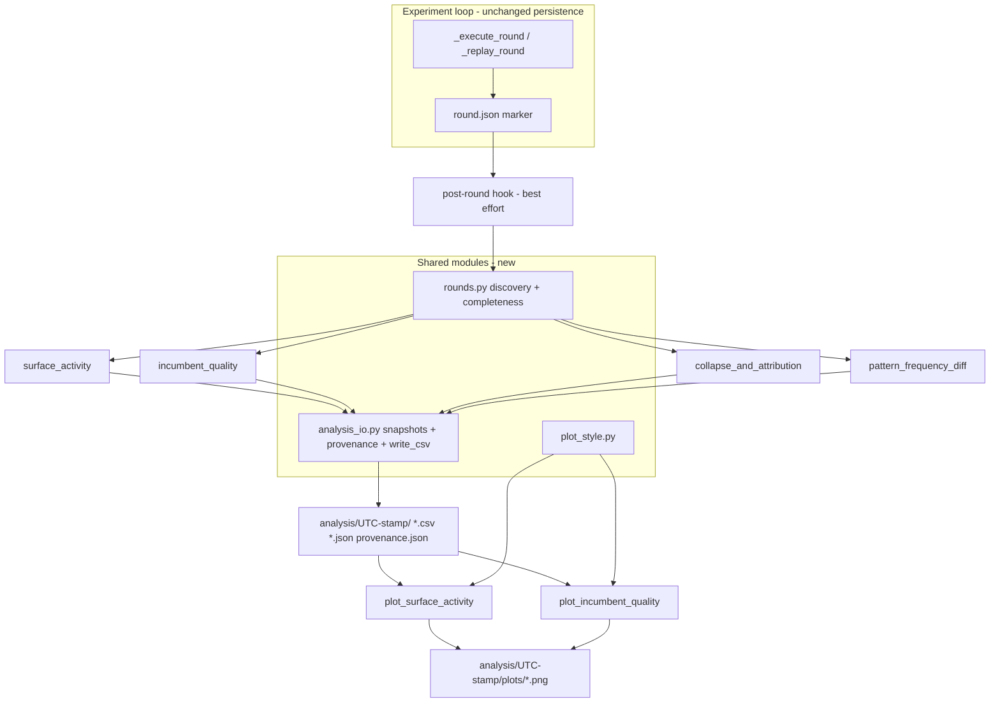

# Analysis Reproducibility Fixes - Plan

## Goal Capsule

- **Objective:** Every analysis output from the SELF-HARNESS experiment is reproducible and honest: derived from exactly the artifacts the loop wrote, stamped with provenance, never silently overwritten, never presenting partial or legacy data as complete — and all eleven findings from the PR #12 code review are resolved.
- **Means:** One experiment-owned round-discovery module consumed by both the loop and the analyses (KTD1); timestamped provenance-stamped snapshot outputs (KTD2); proposal-join surface backfill (KTD3); best-effort post-round auto-run (KTD4); regression tests for the ledger `surface` field and merge crediting.
- **Authority:** This plan's KTDs govern implementation mechanism; its R-IDs govern behavior. Experimental reproducibility and scientific honesty decide any judgement call the plan leaves open.
- **Stop conditions:** Stop and surface if any change would alter bytes the loop persists for experiment state (ledgers, manifests, markers, bundles) — analysis fixes must not touch experiment evidence. Stop if the post-round hook cannot be made non-fatal to the loop.
- **Tail:** Verification Contract gates plus Definition of Done below.

---

## Product Contract

### Summary

Fix the eleven code-review findings on the PR #12 analysis layer: unify round discovery into one experiment-owned module, propagate completeness into every analysis output, write analyses into provenance-stamped snapshot directories, backfill legacy ledger surfaces from persisted proposals, auto-run aggregation after each round, add the missing regression tests, and consolidate duplicated helpers.

### Problem Frame

The PR #12 review (run artifacts: `/tmp/compound-engineering-501/ce-code-review/20260818-160850-da62ef66/`) validated 11 findings. The structural ones threaten scientific validity, not uptime: analysis scripts re-derive the on-disk layout independently of the loop (two duplicate walkers), read partial rounds as complete, overwrite prior outputs with no timestamp or identity, and render pre-change experiments as having no surface history. The user's governing concern: no uncertainty or difference between how the experiment is done and how it is analyzed.

### Requirements

**Discovery and fidelity**
- R1. All analyses and reporting — including `report.py` — derive their round and test-set inventory from one shared discovery module built on the loop's own layout functions and marker files; no module re-implements globbing or path construction.
- R2. Every analysis output row or group distinguishes complete from partial data (missing runs, tripped budget, absent markers, skipped eval runs); partial data is emitted flagged, never dropped and never presented as complete.

**Provenance**
- R3. Each analysis invocation writes into a fresh UTC-timestamped snapshot directory with a provenance record (experiment identity, creation time, analysis revision, rounds/test sets analyzed, and a content-hash manifest of every consumed artifact). A published snapshot's aggregation artifacts are never overwritten; its `plots/` subdirectory is re-renderable, and a re-rendered figure carries its own render time.

**Legacy data**
- R4. Ledger records lacking the `surface` key get their surface recovered by joining `subject_id` to the round's persisted proposal artifacts, marked as backfilled; the merged harness's record is counted as its own `merged` category, not folded into "unattributed".

**Automation**
- R5. The orchestrator invokes the aggregation analyses (not plots) after each completed round, best-effort: an analysis failure is logged and never fails, blocks, or mutates the experiment.

**Quality**
- R6. The `surface` ledger field (serialization, threading, merged-record None) and the merge-constituent promoted-crediting rule are covered by regression tests, including a legacy fixture without the `surface` key.
- R7. The shared CSV writer (`write_csv` in the shared IO module — the per-module `_write_csv` copies are deleted), the plot palette/rcParams block, and round discovery each exist exactly once; no `# type: ignore` without justification.
- R8. The plot footnote counts only rounds that actually had excluded rows; `shrlm/docs/evaluation-metrics.md` starts with its full heading.

### Scope Boundaries

- **Deferred to Follow-Up Work:** plot rendering in the auto-run hook; mitigation for the pre-upgrade in-flight ledger-resume risk (documented in Risks); a retention or pruning policy for accumulated snapshots.
- **Out:** any change to what the experiment loop persists (ledger bytes, manifests, markers); re-running or re-scoring any experiment data.

---

## Planning Contract

### Key Technical Decisions

- KTD1. **Shared discovery module `shrlm/experiment/rounds.py`** (session-settled: user-directed — chosen over keeping duplicate analysis-side walkers: analyses must read exactly what the experiment writes). One `discover_rounds(out_dir)` returning per-round records (index, paths, marker/ledger/manifest presence, completeness signals) **plus the evaluation test-set inventory** (condition ids, test-set ids, their round paths, and per-set completeness from `eval_summary.json`), built only on the loop's own layout code (`experiment_round_dir`, `OPT_DIR`/`VALIDATION_DIR`/`MINING_DIR`/`PROPOSALS_DIR`, `round_dir`, `MANIFEST_FILE`, `PROMOTIONS_FILENAME`, `ROUND_MARKER_FILENAME`, `EVIDENCE_MARKER_FILENAME`, `PROPOSAL_FILENAME`, `EVAL_DIR`, `EVAL_ROUND_INDEX`). No analysis enumerates rounds, test sets, or proposal paths locally. The loop consumes it too: the post-round hook (KTD4) feeds it, and `_replay_round`'s marker validation is the loop-side check that discovery and execution agree. Named `rounds.py` because `shrlm/optimization/walker.py` already means the trace-tree walker. Import direction stays `shrlm.experiment` -> `shrlm.optimization` (verified: no reverse imports exist).
- KTD2. **Snapshot outputs under `analysis/<UTC-stamp>/`** (session-settled: user-directed — chosen over fixed-name overwrite-in-place: reruns must never destroy a published snapshot). **One snapshot per invocation batch, not per tool:** the caller (a CLI run, or `_run_post_round_analysis` for the hook) allocates one `<out_dir>/analysis/<YYYYMMDDTHHMMSSZ>/` directory and passes it to every aggregation it runs. Allocation is atomic exclusive-create; an existing stamp retries with a monotonic suffix (`-2`, `-3`), so two invocations in the same UTC second can never share or overwrite a directory. The batch writes one `provenance.json` (`format: shrlm-analysis-provenance/v1`, `identity_hash`, `identity_source`, `created_at`, `analysis_revision` (the repo commit), analyzed round indices / test-set ids, the list of tools that wrote into it with each tool's success or failure, and `sources`: a manifest of every consumed artifact as repo-relative path plus content hash). The source manifest is what makes the reproducibility claim checkable — experiment identity plus round number does not distinguish two snapshots built from a re-mined or resumed round, and the content hashes do. `identity_hash` comes from `<out_dir>/config.json` with `identity_source: config`; when that file is absent (a pre-orchestrator tree, which KTD6 also supports), the identity is derived deterministically from the `sources` hashes with `identity_source: derived`, and the snapshot is marked legacy-derived so a reader can tell the two apart. A snapshot is **published** — marked complete — only after every tool in the batch has finished and provenance is written; an unpublished directory is never selected as "latest". JSON outputs also embed `identity_hash` and `created_at` (`eval_summary.json` stamps `identity_hash` but no timestamp, so this extends that precedent rather than mirroring it).

  **The never-overwrite guarantee scopes to the aggregation artifacts** — the CSVs, JSONs, and `provenance.json` are immutable once published. `<snapshot>/plots/` is deliberately re-renderable, so improved plotting code can regenerate a figure from frozen data; the figure's footer carries the render time alongside the snapshot stamp and identity, so a re-rendered PNG never misrepresents when it was drawn. Plot CLIs read a named snapshot (default: latest published) and write into that snapshot's `plots/`.
- KTD3. **Surface backfill by proposal join** (session-settled: user-directed — chosen over a legacy-unresolved category alone: real history is recoverable from raw data already on disk). Backfill fires whenever a record's `surface` is absent **or present with a null value** — the current ledger format always writes the key, so a loader rejection serializes as `surface: null`, and a key-absence-only trigger would never recover it. For such a record, read the proposal artifact discovery resolves for `<subject_id>` and take its top-level `"surface"`. Outputs carry `surface_source` (`ledger` | `backfilled` | `merged` | `none`). Loader-rejected candidates have persisted proposals, so they resolve. `MERGED_SUBJECT_ID` records short-circuit before backfill and carry `surface_source=merged` — `surface: None` is correct for them (KTD7).
- KTD4. **Best-effort post-round auto-run** (session-settled: user-directed — chosen over manual-only and end-of-experiment: outputs must not go stale mid-study). Hook in `_Experiment.run` after `rounds.append(outcome)`, allocating one snapshot (KTD2) and invoking the aggregation functions in-process. It fires once per **executed** round, and during a resume once when the replay phase catches up (at the first executed round, or at loop exit if the resume completes the configured rounds) — firing per replayed round would run one full pass per already-finished round before any new work, and only the last of those carries current information. **Each aggregation is isolated:** a failure logs a warning, records that tool as failed in provenance, and the batch continues; the experiment is never failed or blocked. Aggregations only — plots need the optional `plotting` extra. The optimization-phase aggregations always run; the evaluation-phase aggregation runs only when `<out_dir>/eval/eval_summary.json` exists, and its absence mid-experiment is expected and logs nothing. `pattern_frequency_diff` computes a comparison only across evidence-complete bundles but still emits a completeness-flagged row for every discovered bundle (KTD5), so a partial bundle is visible rather than dropped.
- KTD5. **Flag, don't refuse.** Incomplete rounds/test sets are analyzed and emitted with explicit completeness columns (per R2); refusing to analyze partial data would hide it, which is the failure mode the review flagged.
- KTD6. **Expected-run counts, phase-aware.** `n_expected = len(instances.jsonl) x repetitions`, where `repetitions` is read from the experiment config **per stage**: `loop.m` for mining rounds, `loop.v` for validation rounds, `operational.eval_repetitions` for evaluation test sets — the config assigns these separately, so one fixed multiplier would misreport whichever stage it does not match. When the config is unavailable, `n_expected` is null and the row is flagged `count_unknown`. There is deliberately no inference from observed run ids: the manifest records only completed runs, so a round truncated after attempt 2 of 3 would infer an expected count of 2 and report itself complete — the fallback would manufacture the false-completeness this plan exists to remove.
- KTD9. **Completeness truth table.** One authoritative definition, consumed by every analysis, so no module re-decides what complete means:

  | Field | true | false | unknown |
  |---|---|---|---|
  | `round_complete` | `round.json` present and its round index matches | round directory discovered without `round.json` | never — marker presence is always knowable |
  | `evidence_complete` | `evidence_complete.json` present and its recorded line counts match the persisted `records.jsonl` / `attributions.jsonl` | marker absent, or counts disagree | never |
  | `runs_complete` | `n_expected` known and `n_present == n_expected` | `n_expected` known and `n_present < n_expected` | `n_expected` null (config unavailable) — reported as `count_unknown`, never as false |
  | eval set `complete` | set outcome is completed and no skipped runs recorded | outcome is over-budget, or any skipped runs recorded | set absent from `eval_summary.json` |

  A no-op round (completed, no ledger) is `round_complete` true with `has_ledger` false — it is a real outcome, not missing data. `unknown` is always its own value and never collapses into false, so an unmeasurable round is never presented as a failed one.
- KTD7. **`merged` is a category, not missing data.** The merged harness's record spans multiple surfaces by construction; count it as `merged` in surface tallies and exclude it from backfill and from the unattributed warning.
- KTD8. **One IO module.** `shrlm/experiment/analysis_io.py` owns the shared CSV writer `write_csv(path, rows, *, fieldnames)` (public name; rows typed via a `to_dict()` Protocol — resolves the `# type: ignore`s; every per-module `_write_csv` copy is deleted). Field order is passed explicitly because headers cannot be derived from `rows[0]` when a result set is empty, and an empty result must still write a header-only CSV. The module also owns snapshot allocation and publication (KTD2) and provenance writing. `shrlm/experiment/plot_style.py` owns the shared palette constants and an `apply_style()` for the rcParams block.

### Assumptions

- The `analysis/` directory name does not collide with any loop-written directory (loop writes `opt/`, `eval/`, `sh_rlm/`, `work/`, `splits` per config).
- In-process invocation of aggregations from the orchestrator is acceptable runtime cost (they re-read persisted files only; no LM calls).

### High-Level Technical Design

---

## Implementation Units

### U1. Shared round-discovery module

- **Goal:** One source of truth for what rounds exist and how complete each is.
- **Requirements:** R1, R2, R7 (KTD1, KTD5, KTD6)
- **Dependencies:** none
- **Files:** `shrlm/experiment/rounds.py` (new), `shrlm/experiment/promotion_rounds.py` (becomes thin wrapper or is absorbed), `shrlm/experiment/collapse_and_attribution.py` (drop `discover_mining_rounds`), `tests/experiment/test_rounds.py` (new)
- **Approach:**
  1. `discover_rounds(out_dir)` returns ordered per-round records: index, opt-round path, mining/validation round paths, proposal-directory path, presence of `ROUND_MARKER_FILENAME`, `EVIDENCE_MARKER_FILENAME`, `PROMOTIONS_FILENAME`, `MANIFEST_FILE`, and completeness fields per KTD6.
  2. The same module owns the evaluation test-set inventory (condition ids, test-set ids, per-set round paths, and each set's `outcome` / `skipped_run_ids` from `eval_summary.json`), so no evaluation analysis enumerates test sets locally.
  3. Path construction only via the loop's own functions/constants (KTD1); no local glob-and-parse beyond enumerating `round_*` entries with the same `removeprefix` convention, kept in exactly one place.
  4. Keep `iter_promotion_rounds` as a thin wrapper for its existing callers; delete the duplicate mining walker. If `promotion_rounds.py` is absorbed instead, update its callers' imports in the same unit.
- **Patterns to follow:** `shrlm/optimization/driver.py` `load_manifest` (documented read-only view); marker payload validation in `orchestrator._replay_round`.
- **Test scenarios:**
  - Discovery against the tree the existing mock-LM end-to-end run produces (`tests/experiment/test_smoke_mock.py`): round indices, paths, and marker presence match what the loop actually wrote. This is the scenario that grounds KTD1's premise — a fabricated tree only tests the test author's model of the layout.
  - Fabricated tree with rounds 1-3: all discovered in order with correct paths.
  - Non-contiguous rounds (1 and 3): both returned; no invented round 2.
  - Round with manifest but no `round.json`: discovered with `round_complete` false.
  - Round with ledger absent: `has_ledger` false, still discovered when a completed round marker exists (no-op round visible, closes review residual #8).
  - Malformed `round_x` directory name: skipped without crash.
  - Test-set inventory: every condition x test set in `eval_summary.json` is returned with its outcome and skipped-run count.
  - `n_expected` per KTD6, including the null-and-flag case.
- **Verification:** `uv run pytest tests/experiment/test_rounds.py`; `grep -rn 'round_\*' shrlm/ --include='*.py'` matches only `rounds.py`.

### U2. Completeness propagation in analyses

- **Goal:** Partial rounds and eval sets are visibly partial in every output (review #2).
- **Requirements:** R2 (KTD5, KTD6)
- **Dependencies:** U1
- **Files:** `shrlm/experiment/collapse_and_attribution.py`, `shrlm/experiment/surface_activity.py`, `shrlm/experiment/incumbent_quality.py`, `shrlm/experiment/pattern_frequency_diff.py`, `tests/experiment/test_collapse_and_attribution.py` (new)
- **Approach:**
  1. `collapse_and_attribution` optimization phase: rows gain `n_expected_runs`, `n_missing_runs`, `evidence_complete`, `round_complete`.
  2. Evaluation phase: take each test set's `outcome` and skipped-run count from the shared inventory (U1); emit `outcome`, `n_skipped`, `complete` columns.
  3. `surface_activity` and `incumbent_quality` rows gain `round_complete` from discovery.
  4. `pattern_frequency_diff` emits a completeness-flagged row for every discovered bundle and computes the comparison only across evidence-complete pairs, so an excluded partial bundle is visible with its exclusion reason instead of vanishing (KTD5).
- **Test scenarios:**
  - Partial mining manifest (budget stop): row emitted with `complete` false and correct missing count.
  - Eval set with non-empty skipped runs: flagged, not dropped.
  - Fully complete round: flags all true, numbers match the pre-change behavior.
  - One evidence-complete bundle and one partial: the partial appears with `complete=false` and a reason; no comparison is computed for it.
- **Verification:** `uv run pytest tests/experiment/`.

### U3. Snapshot output + provenance module

- **Goal:** Reruns never clobber; every output traceable to experiment identity and time (review #5, #10, #13).
- **Requirements:** R3, R7 (KTD2, KTD8)
- **Dependencies:** U1
- **Files:** `shrlm/experiment/analysis_io.py` (new), all four aggregation CLIs, `shrlm/experiment/pattern_frequency_diff.py` (shared writer replaces its diverged copy), `tests/experiment/test_analysis_io.py` (new)
- **Approach:**
  1. `analysis_io` provides batch snapshot allocation and publication per KTD2 (atomic exclusive-create, monotonic collision suffix, completion marker written last), `write_csv(path, rows, *, fieldnames)`, and `write_provenance` recording every tool in the batch with its success or failure.
  2. Aggregation CLIs accept an allocated snapshot from their caller rather than each allocating one; a standalone CLI run allocates its own. `--out` overrides the snapshot parent, stamping still applies. `surface_activity` and `incumbent_quality` gain `--out` (they have only a positional today), mirroring `collapse_and_attribution`'s existing flag.
  3. `pattern_frequency_diff` gains a required experiment-directory argument so snapshot resolution and identity lookup have an anchor; its `--out` stays the parent override. Its bundle-path arguments are unchanged.
  4. Delete all four duplicate `_write_csv` bodies and both `# type: ignore[attr-defined]`; restructure the signature-key tuple in `pattern_frequency_diff.py` to drop its `# type: ignore[return-value]`.
- **Test scenarios:**
  - Two runs within the same UTC second produce two distinct snapshot directories; the first is byte-identical afterwards.
  - A batch whose second tool raises: the first tool's output is present, provenance records the failure, and the directory is not marked published.
  - "Latest" resolution skips an unpublished directory and returns the newest published one.
  - `provenance.json` carries `identity_hash` matching `config.json` with `identity_source: config`, `created_at`, `analysis_revision`, analyzed rounds, the tool list, and a `sources` entry with a content hash for every consumed artifact.
  - Tree with no `config.json`: identity derived from the `sources` hashes, `identity_source: derived`, snapshot marked legacy-derived; the run does not fail.
  - Changing one consumed artifact between two runs produces a different `sources` hash for that file and leaves the others unchanged.
  - Empty rows with explicit fieldnames: header-only CSV.
- **Verification:** `uv run pytest tests/experiment/test_analysis_io.py`; `uv run ty check` passes with zero new ignores.

### U4. Legacy surface backfill

- **Goal:** Historical experiments regain surface history honestly (review #9).
- **Requirements:** R4 (KTD3, KTD7)
- **Dependencies:** U1
- **Files:** `shrlm/experiment/rounds.py` (resolver helper), `shrlm/experiment/surface_activity.py`, `tests/experiment/test_surface_activity.py` (new)
- **Approach:**
  1. `resolve_surface(record, round_record)`: `MERGED_SUBJECT_ID` short-circuits to the `merged` category first; then a non-null ledger value is taken verbatim; then a missing-or-null value triggers the proposal join per KTD3.
  2. `surface_activity` outputs gain `surface_source`; unattributed warning text reworded to name only genuinely unresolvable rows.
- **Test scenarios:**
  - Current-format loader rejection (key present, value null) with a persisted proposal: backfilled, `surface_source=backfilled`. This is the case a key-absence-only trigger would silently miss.
  - Legacy record (no `surface` key) with persisted proposal: backfilled, `surface_source=backfilled`, counted in its surface's tallies.
  - Record with no proposal on disk: `surface_source=none`, counted unattributed.
  - Merged record: `merged` category and `surface_source=merged`, never backfilled, excluded from unattributed warning.
  - New-format record with a real surface: `surface_source=ledger`, value taken verbatim.
- **Verification:** `uv run pytest tests/experiment/test_surface_activity.py`.

### U5. Post-round auto-run hook

- **Goal:** Aggregation snapshots refresh automatically each round without ever touching experiment outcome (review question 2; R5).
- **Requirements:** R5 (KTD4)
- **Dependencies:** U1, U2, U3
- **Files:** `shrlm/experiment/orchestrator.py`, `tests/experiment/test_orchestrator.py`
- **Approach:**
  1. After `rounds.append(outcome)` in `_Experiment.run`, call `_run_post_round_analysis(out_dir)`: allocate one snapshot (KTD2), run each aggregation inside its own guard so one failure neither aborts the batch nor propagates, record per-tool outcomes in provenance, publish the snapshot, and log a warning naming any failed tool.
  2. The evaluation-phase aggregation runs only when `<out_dir>/eval/eval_summary.json` exists; its absence mid-experiment is the normal state and logs nothing.
  3. No new persisted experiment state; the hook writes only under `analysis/`.
- **Execution note:** Prove the isolation first — a test where the analysis hook raises and the round still completes and persists identically.
- **Test scenarios:**
  - Completed round produces one published `analysis/<stamp>/` snapshot containing every aggregation's output.
  - Injected analysis exception in one tool: the other tools' outputs still land, provenance records the failure, experiment result unchanged, marker files identical to a no-hook run.
  - No `eval/` directory present: hook runs clean with no warning.
  - Replayed (resumed) round also refreshes a snapshot.
- **Verification:** `uv run pytest tests/experiment/test_orchestrator.py`.

### U6. Ledger `surface` regression tests

- **Goal:** The PR's two behavioral changes get the coverage the review demanded (review #4, #3).
- **Requirements:** R6
- **Dependencies:** none (parallel to U1)
- **Files:** `tests/optimization/test_promotion.py`, `tests/optimization/test_validation_e2e.py`, `tests/experiment/test_surface_activity.py`
- **Approach:**
  1. `TestAssessRound.test_decision_records_serialize_for_the_ledger` (tests/optimization/test_promotion.py): assert `payload["surface"]` round-trips.
  2. `test_ledger_records_every_candidate_including_the_never_ran`: assert per-candidate surfaces (`cand-s2` -> `S2`, `cand-s3` -> `S3`), loader-rejected record `surface is None` (current contract — backfill covers it at analysis time), `MERGED_SUBJECT_ID` `surface is None`.
  3. `_is_promoted` cases: `promoted` credited; `accepted` + `merge.role == constituent` credited; plain `accepted` not credited; **non-merged** rows with no resolvable surface excluded from surface counts and tallied unattributed, while `MERGED_SUBJECT_ID` rows are counted only in the `merged` category (KTD7) — asserting the merged record as unattributed would contradict the plan's own rule.
- **Test scenarios:** as listed in Approach (they are the scenarios).
- **Verification:** `uv run pytest tests/optimization/test_promotion.py tests/optimization/test_validation_e2e.py tests/experiment/test_surface_activity.py`.

### U7. Plot fixes and shared style

- **Goal:** Plots read snapshots, share one style module, mark partial data, and caption honestly (review #7, #11).
- **Requirements:** R2, R7, R8 (KTD2, KTD8)
- **Dependencies:** U3
- **Files:** `shrlm/experiment/plot_style.py` (new), `shrlm/experiment/plot_surface_activity.py`, `shrlm/experiment/plot_incumbent_quality.py`
- **Approach:**
  1. Extract shared constants + `apply_style()`; keep single-consumer pieces (ORANGE, sequential ramp) local.
  2. Plot CLIs take the experiment dir, resolve the latest published snapshot by default (`--snapshot` to pin), write into `<snapshot>/plots/`, and render a provenance footer carrying the identity short form, the snapshot stamp, and the render time.
  3. Rounds whose `round_complete` or `runs_complete` is not true render with a distinct marker (hollow or hatched), and the caption names how many plotted rounds are partial. The completeness columns U2 adds must reach the figure — the PNG is the artifact a reader draws conclusions from, so completeness that stops at the CSV leaves the objective unmet at the surface that matters.
  4. Footnote counts only rounds with `unattributed_count > 0`.
- **Test scenarios:**
  - A partial round in the input CSV renders with the incomplete marker, and the caption reports one partial round.
  - Footnote count with one excluded row across three rounds reads 1 round, not 3.
  - Missing companion CSV: clear CLI error, non-zero exit (closes review residual #6).
  - Re-rendering a pinned snapshot replaces only files under `plots/` and leaves every aggregation artifact byte-identical.
- **Verification:** `uv run pytest tests/experiment/`; manual render of both PNGs from the checked-in fixture tree.

### U8. Doc fix

- **Goal:** `shrlm/docs/evaluation-metrics.md` first line restored (review #12); reference doc updated for the new snapshot/auto-run behavior.
- **Requirements:** R8
- **Dependencies:** U3, U5, U9 (to document final behavior)
- **Files:** `shrlm/docs/evaluation-metrics.md`, `shrlm/docs/SH-RLM Metrics & Graphs — Reference.md`
- **Approach:** restore the truncated heading; add a short section documenting snapshot layout, provenance fields, completeness columns, `surface_source`, and the post-round auto-run.
- **Test scenarios:** `Test expectation: none -- documentation-only unit.`
- **Verification:** doc renders; first line is a complete heading.

### U9. Migrate report.py onto shared discovery

- **Goal:** The module that writes the experiment's own report reads the same inventory the analyses do, so no third view of the layout survives.
- **Requirements:** R1 (KTD1)
- **Dependencies:** U1
- **Files:** `shrlm/experiment/report.py`, `tests/experiment/test_report.py`
- **Approach:**
  1. Replace `optimization_manifests`' own directory walk with the shared discovery inventory; keep the report's output shape unchanged.
  2. Reuse the existing checked-in fixture tree so the report's current expectations pin the behavior across the swap.
- **Test scenarios:**
  - Report output over the checked-in fixture tree is unchanged from pre-migration.
  - A round discovery finds but the old walk missed (a completed no-op round) now appears in the report's round accounting.
- **Verification:** `uv run pytest tests/experiment/test_report.py`; the discovery-consumer gate below covers `report.py`.

---

## Verification Contract

| Gate | Command | Proves |
|------|---------|--------|
| Full suite | `make test` (`uv run pytest`) | No regression across optimization + experiment tests |
| Type check | `uv run ty check` | Zero unjustified `# type: ignore` (R7) |
| No stray walkers | `grep -rn 'round_\*' shrlm/ --include='*.py'` -> only `rounds.py` (matches the pattern string, so a walker holding it in a constant is caught too) | R1, R7 |
| One CSV writer | `grep -rnE 'def _?write_csv' shrlm/ --include='*.py'` -> only `analysis_io.py` (both spellings, proving the per-module copies are gone) | R7 |
| One plot style | `grep -rn 'rcParams' shrlm/ --include='*.py'` -> only `plot_style.py`; the palette hex constants appear in no other module | R7 |
| Discovery consumers | Every analysis module **and `report.py`** imports its inventory from `rounds.py`; none builds round, test-set, or proposal paths itself | R1 |
| Reproducibility | Run any aggregation twice in the same second on the fixture tree: two distinct snapshots, first's aggregation artifacts unchanged byte-for-byte | R3 |
| Provenance completeness | Every published `provenance.json` carries an `identity_source`, an `analysis_revision`, and a `sources` hash for each consumed artifact | R3 |
| Isolation | Orchestrator test with failing analysis hook: experiment artifacts byte-identical to no-hook run | R5 |

## Definition of Done

- All 9 units land; every R1-R8 is demonstrably true via the gates above, with no deferred exception to R1.
- The nine actionable review findings (#1-#4, #7, #10-#13) and both decision gates (#5, #9) are resolved as specified; review residuals #6 (plotter crash on missing companion) and #8 (no-op rounds invisible) are closed by U7 and U1.
- No experiment-persisted byte changes: ledgers, manifests, markers, bundles are written identically to pre-plan behavior (loop diff limited to the additive hook).
- No dead or abandoned experimental code left in the diff.

---

## Risks & Dependencies

- **Pre-upgrade in-flight rounds** (review residual): a ledgered-but-unmarked round resumed after the `surface` field merge can trip validation's non-clobber ledger check. Not caused by this plan; document in the reference doc that in-flight experiments should complete before upgrading. Deferred: ledger format bump.
- **Auto-run cost:** aggregations re-read all prior rounds each invocation, and the source-hash manifest adds one read per consumed artifact; O(rounds^2) file reads over an experiment. Acceptable at current scale (tens of rounds); revisit with incremental discovery beyond roughly a hundred rounds.
- **Repetition-count availability** for `n_expected` (KTD6) — a historical tree without the experiment config reports `count_unknown` rather than a number. That is the honest output, and KTD9 keeps `unknown` distinct from `false` so it is never read as a failure.
- **Snapshot volume:** one snapshot per executed round for the life of an experiment, with no retention policy (deferred). Provenance records the tool list and outcomes but not the trigger, so a deliberately published snapshot is not distinguishable from the machine-generated series around it.
- **Silent analysis failure:** the hook logs a warning per failed tool and records it in provenance, but a systematic failure (import error, missing optional dependency) would produce a study with a warning on every round and no usable snapshots. The provenance record is the audit trail; nothing checks it at end of run.

## Sources / Research

- Review artifacts: `/tmp/compound-engineering-501/ce-code-review/20260818-160850-da62ef66/report.md`, `synthesized-findings.json` (validated 9/9).
- Round lifecycle: `shrlm/experiment/orchestrator.py` (`_execute_round`, `_replay_round`, `ROUND_MARKER_FILENAME`, `EVIDENCE_MARKER_FILENAME`, `_persist_once`).
- Layout owners: `shrlm/optimization/bundle.py` (`round_dir`), `shrlm/optimization/driver.py` (`MANIFEST_FILE`, `load_manifest`, `run_id_for`), `shrlm/optimization/validation.py` (`PROMOTIONS_FILENAME`, `EVAL_ROUND_INDEX`).
- Backfill source: `shrlm/optimization/proposal.py` (`write_proposal`, `PROPOSAL_FILENAME`, top-level `"surface"` key; loader-rejected proposals persist; materialization failures have no artifact and no ledger row).
- Provenance anchor: `shrlm/experiment/config.py` `identity_hash`, `orchestrator.check_identity`, `eval_summary.json` stamping pattern.
- Test templates: `tests/experiment/test_smoke_mock.py` (the mock-LM end-to-end run whose produced tree grounds U1's discovery test), `tests/experiment/fixtures/report_experiment/`, `tests/optimization/test_validation_e2e.py` (`run_merge_round`), `tests/mock_lm.py`.
- Ledger `surface` semantics: `shrlm/optimization/promotion.py` `CandidateDecision.to_dict` always emits the key, so a loader rejection serializes as `surface: null` rather than an absent key (the fact KTD3's trigger turns on).
- Per-stage repetition counts: `shrlm/experiment/config.py` (`loop.m` mining, `loop.v` validation, `operational.eval_repetitions` evaluation) — the basis for KTD6's phase-aware multiplier.
