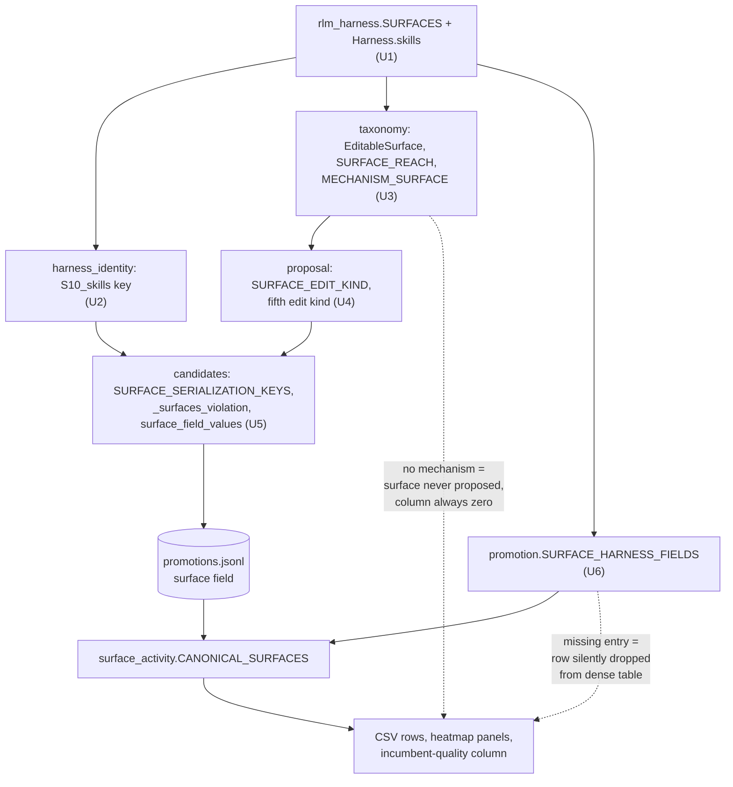

# S10 Skills Edit Surface - Plan

## Goal Capsule

- **Objective:** The RLM harness declares a skills surface the optimization loop can target, edit, promote, and be measured on, and every per-surface analysis reads the tenth surface exactly as it reads the other nine.
- **Means:** A prompt-side `build_skills() -> list[str]` declared as S10 (KD1), threaded through the four surface-keyed tables the optimization layer already uses for S1-S9 (KTD2, KTD3, KTD4), with the analysis layer's hardcoded surface counts replaced by each round's own declared set (KTD5, KTD6).
- **Authority:** R-IDs govern behavior; KTDs govern mechanism. Where the plan leaves a judgement call open, experimental reproducibility and scientific honesty decide it — the surface set is preregistered scaffold, and a figure that misstates it is worse than a missing figure.
- **Stop conditions:** Stop and surface if the change would alter bytes an in-flight experiment tree has already persisted as evidence (ledgers, manifests, markers, bundles). Stop if S10 cannot be made reachable from at least one mined failure mechanism — a declared-but-unreachable surface is a worse artifact than no surface. Stop if H0* stops being byte-identical to the shipped reference.
- **Tail:** Verification Contract gates plus Definition of Done below.

---

## Product Contract

### Summary

Declare `build_skills() -> list[str]` as a tenth editable harness surface, S10, holding named procedure texts the root model reads and follows. Register it in `SURFACES`, give `Harness` a `skills` field, assemble its entries into the system prompt after S1-S5, and add an S10 entry to each of the four surface-keyed tables the optimization layer uses to propose, load, materialize, merge, and promote an edit. Add one `AgentMechanism` that maps to S10 so a mined pattern can address it. Bump the harness serialization envelope and the taxonomy version, because both encode the surface set. In the analysis layer, replace the one hardcoded surface count in the surface-activity figure with a derived value, and add a per-cell flag distinguishing a round whose harness never declared S10 from a round that declared it and left it alone.

### Problem Frame

`shrlm/docs/plans/2026-07-21-002-feat-rlm-harness-surfaces-from-paper-failures-plan.md:77` maps Self-Harness's `build_skills` and `build_subagents` jointly onto S8, "functions and data injected into the REPL". That collapse loses a distinction the reference harness draws: S8 is a Python namespace the root *calls*, while a skill is procedural know-how the root *reads*. The paper's own instantiation is a "dependency-verifier skill" on a missing-module failure branch (`paper/Self-Harness.md:267`) — guidance, not a callable. Under the current mapping, a mined pattern about the root re-deriving a procedure it has already carried out has nowhere legible to land: it either becomes an S3 execution-instruction rewrite, which drags unrelated per-turn guidance along, or an S8 helper, which is the wrong object.

**Provenance.** S10 is derived from the reference harness's declared configuration points, not from any pattern this project's own mining has produced. The distinction is load-bearing: `paper/Self Harnessing RLMs.md:75` claims surfaces are declared from the loop's phase structure rather than selected from documented failures, precisely so that what the loop discovers stays separable from what its designer already knew. A surface reverse-engineered from this project's mining output would forfeit that claim.

### Key Decisions

- KD1. **Skills are prompt-side procedure texts, not REPL callables.** (session-settled: user-directed — chosen over REPL-side callable skills and a text-plus-helper hybrid: keeps S10 disjoint from S8, which already owns the REPL namespace.) Governs R1, R2, R5.
- KD2. **S10 is edited whole, the same way every other surface is.** (session-settled: user-directed — chosen over an accumulating skill library that grows across rounds: one edit shape, one bounds story, and one diff semantics across all ten surfaces.) Governs R3, R7.
- KD3. **Analyses back-fill prior rounds rather than starting a new experiment identity.** (session-settled: user-directed — chosen over a fresh experiment identity and over a per-experiment feature flag: existing snapshots stay readable.) Governs R11, R13.
- KD4. **The analysis hookup is parity-only.** (session-settled: user-directed — chosen over adding skill-specific measures such as library size over rounds or per-skill survival: the tenth surface should read exactly like the other nine.) Governs R11, R12.

### Requirements

**Declaration**

- R1. `build_skills() -> list[str]` is declared as surface S10 in `shrlm/rlm_harness.py`, registered in `SURFACES`, backed by a `Harness.skills` field, and returns `[]` at both H0 and H0*.
- R2. S10's entries assemble into the root system prompt as a named-procedure section placed after S1-S5, so an empty S10 contributes no bytes and H0* stays byte-identical to the shipped reference.

**Optimization-loop reachability**

- R3. Every surface-keyed table in the optimization layer carries an S10 entry, so a proposal targeting S10 is loaded, gated, materialized, merged, and promoted through the same path as S1-S9.
- R4. At least one `AgentMechanism` maps to S10, so a mined failure pattern is addressable to skills and the surface is not declared-but-unreachable.

**Prompt safety and edit bounds**

- R5. A skill entry is format-ready: it survives `str.format` with a placeholder `custom_tools_section`, so braces are doubled and that slot is the one live replacement field. Entries that would raise are rejected at proposal validation and again at harness construction, before any run starts.
- R6. A skill entry may not state a runtime limit that `check_stated_limits` governs, so S10 text cannot contradict the bound the runtime honors.
- R7. S10 edits are bounded by entry count, per-entry length, and total length, enforced where the other edit kinds are shape-checked.
- R14. Each S10 entry is one named, reusable procedure — a name line followed by ordered steps — and may not restate per-turn execution or decomposition guidance. The contract is stated in the surface's `governs` text so the attributor and the proposer both see it, and enforced structurally where the edit is shape-checked. Without it nothing separates a legal S10 edit from an S3 rewrite, and per-surface attribution becomes a label rather than an observation.

**Identity and version contracts**

- R8. The harness serialization carries an `S10_skills` key and its envelope format tag is bumped, so a nine-surface serialization is rejected loudly rather than accepted and mis-hashed.
- R9. Every artifact a loader gate reads is regenerated under the new key set, and the committed real-run round trees are preserved unchanged as the repo's pre-S10 evidence.
- R10. The taxonomy version is bumped to reflect the changed surface contract, and the frequency comparison excludes bundles written under a different version rather than diffing across the boundary.

**Analysis parity and honesty**

- R11. Every per-surface analysis output enumerates S10 by deriving its surface list from the declaration, never from a literal count.
- R12. No figure states or draws a surface total from a hardcoded number; the surface-activity reference line, y-limits, ticks, and axis label are all derived.
- R13. Each per-surface analysis cell distinguishes three states — "not declared in that round's harness", "declared and not edited", and "that round's harness could not be read" — and figures render all three differently.

### Scope Boundaries

**In scope**

The tenth surface end to end: declaration, serialization, taxonomy, proposal, candidate loading, promotion, runner construction checks, analysis parity, fixture regeneration, and the prose that states the surface contract.

**Deferred to follow-up work**

- Closing the brace hazard for S1-S5. KTD8 adds a construction-time format check that covers the whole assembled prompt, which incidentally protects S1-S5 too, but proposal-time brace validation for the existing text surfaces is not retrofitted here.
- The `incumbent_quality.py:276` asymmetry, where the candidate-quality table reads `surface` straight from the ledger and never back-fills through `resolve_surface`. Pre-existing and orthogonal to S10.

**Outside this change's identity**

- `build_subagents`, and any further surface. The declared surface set is closed at ten for this study. Self-Harness declares the subagent builder beside `build_skills`, so it has identical provenance and would otherwise be a standing candidate — but each addition costs a taxonomy bump, a repo-wide hash move, a preregistration edit, and one more boundary the frequency comparison cannot diff across. Pricing this change as one-time is only honest if it is one-time.
- Skill-specific metrics. KD4 settles this: the tenth surface reads like the other nine.
- Any mechanism by which the root model writes its own skills at runtime. Skills change between rounds, through a validated proposal, like every other surface (KD2).

### Success Criteria

- A proposal targeting S10 completes the full loop offline — mined pattern, proposal, candidate load, validation, merge, promotion, ledger row — with no surface-specific special-casing outside the tables named in R3.
- `surface_activity.csv` and both heatmap panels show ten rows, and a round whose harness predates S10 is visually distinguishable from a round that declared S10 and left it empty.
- H0* still hashes to the shipped-reference prompt bytes.

### Sources

- `shrlm/docs/plans/2026-07-21-002-feat-rlm-harness-surfaces-from-paper-failures-plan.md:77` — the S8 mapping this plan splits.
- `paper/Self-Harness.md:208` — Figure 3's `def build_skills() -> list[str]: return []`, the signature this plan adopts verbatim.
- `paper/Self-Harness.md:275` — Figure 6(a) caption: the skill branch was accepted then discarded for no further improvement. The paper never defines a skill entry's semantics beyond `list[str]`.
- `paper/Self Harnessing RLMs.md:75` — this project's preregistered claim that surface selection is fixed scaffold shared by every condition. R10 and U11 exist because of it.
- `shrlm/optimization/promotion.py:84` — `SURFACE_HARNESS_FIELDS`, the single upstream source the whole analysis layer derives its surface list from.

---

## Planning Contract

### Key Technical Decisions

- KTD1. **Append S10 after S5 in `assemble_system_prompt`.** The existing `parts` list is a literal five-element sequence and `tests/test_invariants.py:468` asserts S1-S5 appear in phase order. Appending leaves that ordering intact, and an empty list contributes nothing, which is what keeps H0* byte-identical. Governs R2.
- KTD2. **Add a fifth edit kind for `list[str]`.** `proposal.py:116-119` declares four legal edit shapes — text, policy, code, repl-helper — and `SURFACE_EDIT_KIND` maps each surface to exactly one. S10 is prompt-side but its value is a list, so it fits none of the four: `TEXT_SURFACE_FIELDS` assumes `str`. A fifth kind carries the entry-count and length bounds of R7 and the format check of R5. Governs R3, R5, R7.
- KTD3. **Bump the harness envelope to `shrlm-harness/v2`.** `candidates.py:240` gates on exact key-set equality between a proposal's serialized surfaces and the expected set, so the key set *is* the contract; a nine-surface document under a `v1` tag would be rejected with a shape error rather than a version error. Bumping the tag makes the rejection say what actually happened. Governs R8.
- KTD4. **Add one `AgentMechanism` keyed to a failed run, bump `TAXONOMY_VERSION` to 3.0.0, and gate the frequency diff on it.** `tests/optimization/test_taxonomy.py:101` asserts every declared surface is the target of some mechanism, so S10 without one fails the suite and would leave the surface permanently unproposable. The mechanism must describe a *failure*, because `mining.py:126` attributes only runs that failed verification — a mechanism phrased as a correctly-executed repetition never reaches the attributor. The version is declared to be the surface contract (`tests/optimization/test_taxonomy.py:141`), so changing the contract forces the bump; and because nothing reads that version today, the bump only means something once the frequency diff excludes on it. Governs R4, R10.
- KTD5. **Derive the surface-activity figure's totals from each round's declared surface set, not from a literal and not from the current code's count.** `plot_surface_activity.py` carries five literal `9`s — an `axhline(9)` labelled "all surfaces", the `ax.text` anchor that places that label at y=9, `set_ylim(0, 9.6)`, `set_yticks(range(0, 10))`, and the axis label `"distinct surfaces (of 9)"`. This is the only site in the analysis layer that renders a *wrong but plausible* figure rather than simply omitting data. `len(CANONICAL_SURFACES)` fixes the clipping but not the honesty: it is the count the code has now, so it would draw a ten-surface reference line over a round that only ever had nine. KTD6's per-round reader supplies the count that is actually true of each round. Governs R12.
- KTD6. **Read each round's declared surface set from its persisted `harness.json`, not from the current code.** The back-fill of KD3 is only honest if a pre-S10 round reports the surfaces it actually had. The round's frozen harness serialization already carries exactly that key set. Governs R13.
- KTD7. **S10's reach is child-reachable, matching the other prompt surfaces.** `tests/optimization/test_taxonomy.py:74` asserts the root-only set is exactly `{S6, S7, S9}`; S10 assembles into the system prompt that sub-calls also receive. Governs R3.
- KTD8. **Add a format-safety check to `check_harness`.** `escape_braces` is exported from `shrlm/rlm_harness.py:82` but never called in production — the single `.format()` happens at `rlm/utils/prompts.py:234`, at completion time, so a stray brace surfaces as an infrastructure error mid-run rather than as a bad score. Skill texts are the likeliest surface to contain a literal brace, since procedures carry code examples. The check formats the assembled prompt with a placeholder `custom_tools_section` at construction. Governs R5.

### High-Level Technical Design

Directional guidance for review, not implementation specification.

**How a surface id propagates.** The analysis layer is almost entirely surface-generic: it derives its canonical list from `promotion.SURFACE_HARNESS_FIELDS`, not from `SURFACES`. Adding the S10 entry there extends the tables, the dense zero-fill, and the heatmap rows automatically. Everything upstream of it is a literal table that must gain an entry, and each omission fails differently.

**How a per-surface cell resolves.** `rounds.resolve_surface` already returns a `(category, source)` pair, and every output cell carries `surface_source` beside its count. R13 adds one state ahead of the existing ladder rather than changing it.

| Condition on the cell | Resolution | Rendering |
|---|---|---|
| Subject is the merged harness | merged category | own row, never in the S1-S10 grid |
| Round's `harness.json` is absent or unreadable | **unknown** (new) | visually distinct from both cells below |
| Round's `harness.json` lacks the surface's serialization key | **undeclared** (new) | visually distinct from an empty declared cell |
| Ledger row carries a non-null surface | ledger | normal |
| Ledger surface null, proposal join succeeds | backfilled | weaker-claim marking, unchanged |
| Ledger surface null, no proposal join | none | tallied as unattributed, unchanged |

### Assumptions

- Nothing currently stops an in-flight tree from adopting S10 mid-run. The frozen-harness refusal at `orchestrator.py:376` fires at run conclusion, not on the load path, and `driver.py:222` compares hashes only within a single round directory — so a resumed tree writes a ten-surface envelope for its next round without complaint, and ends up with early rounds on a nine-surface scaffold and later ones on ten. S10 is intended for trees created after it lands; U5's key-set check makes the load path fail with a named error rather than a bare `KeyError`, but a round-start refusal comparing the incumbent's key set against the tree's earlier rounds is not in this plan's scope and is recorded as an open question.
- Analysis over pre-S10 trees keeps working without a compatibility shim. Old `harness.json` files are re-hashed from their stored serialization by `audit.py:238`, which is surface-generic, and `_surfaces_violation`'s exact key-set gate applies to newly loaded candidates, not to archived artifacts.
- `paper/Self Harnessing RLMs.md` and `shrlm/docs/Self Harnessing RLMs.md` are the same draft in two locations, and both need the same edit.

### System-Wide Impact

- **Harness identity.** Every hash in the repo moves. This is the change's widest blast radius and the reason U9 and U10 exist.
- **Taxonomy comparability.** U3 adds the version gate that makes the bump mean something: bundles written under 2.0.0 are excluded from a diff against new ones. That is the correct behavior for a changed surface contract, but it means a diff spanning the change reports nothing rather than something misleading. Before U3 lands, nothing reads the version at all.
- **Preregistered claim.** `paper/Self Harnessing RLMs.md:75` states nine surfaces and `:114` states seven of nine start sparse. Both become ten and eight of ten. This is a preregistration edit, not a documentation chore.
- **Prompt bytes.** Every harness with a non-empty S10 carries more system-prompt text, which competes with context for the root's window.

### Risks & Dependencies

- **S10 lands declared but dead.** If the new mechanism never fires in mining, no pattern is ever addressable to skills and the column stays zero for the whole experiment — the surface would then be scaffolding that inflates the denominator of "fraction of declared surfaces the promoted lineage modifies" (`shrlm/docs/experiment-metrics.md:56`). Mitigation: U3 defines the mechanism against a failed run, since the miner attributes nothing else, and states its precedence over the budget-exhaustion and depth-degradation mechanisms that claim the same terminal signal. The Definition of Done requires a real archived trace to resolve to S10, not a hand-built record.
- **Skill text breaks the run rather than scoring badly.** A literal brace in a skill entry raises `KeyError`/`IndexError` at the first turn, which reads as infrastructure failure, not as a rejected edit. KTD8 and R5 are the mitigation, and the check must run at construction, before any instance is spent.
- **Skill text contradicts the runtime.** `runner.py:272` scans the whole assembled prompt for the truncation sentence and requires the stated set to be exactly the expected one. A skill mentioning truncation trips it. R6 makes that a proposal-time rejection instead of a construction-time surprise.
- **Fixture regeneration hides a real behavior change.** U10 rewrites persisted artifacts wholesale, which is exactly the operation that could mask an unintended serialization change. Mitigation: U10 lands after U2's tests pin the new key set, and its diff is reviewed for key-set changes only.

---

## Implementation Units

### Unit index

| U-ID | Title | Primary files | Depends on |
|---|---|---|---|
| U1 | Declare S10 in the harness | `shrlm/rlm_harness.py`, `shrlm/__init__.py` | — |
| U2 | Serialize S10 and bump the envelope | `shrlm/harness_identity.py`, `optimization/candidates.py`, `optimization/proposal.py` | U1 |
| U3 | Taxonomy: enum, reach, mechanism, version | `shrlm/optimization/taxonomy.py`, `experiment/pattern_frequency_diff.py` | U1 |
| U4 | Proposal: fifth edit kind and bounds | `shrlm/optimization/proposal.py` | U1, U2, U3 |
| U5 | Candidate load, gate, and materialize | `shrlm/optimization/candidates.py` | U1, U2 |
| U6 | Promotion field map and merge | `shrlm/optimization/promotion.py` | U1 |
| U7 | Runner construction checks | `shrlm/runner.py` | U1, U4 |
| U9 | Declared-vs-untouched provenance | `shrlm/experiment/rounds.py`, `surface_activity.py`, `plot_surface_activity.py` | U2, U6 |
| U8 | Analysis parity: derive the surface total | `shrlm/experiment/plot_surface_activity.py` | U6, U9 |
| U10 | Regenerate loader-gated artifacts | `experiment_smoke/opt/round_01/proposals/`, `examples/validation_rounds/proposals/` | U2, U4, U5 |
| U11 | Surface-contract prose and preregistration | `README.md`, `shrlm/README.md`, `shrlm/docs/`, `paper/` | U1-U9 |

### U1. Declare S10 in the harness

**Goal:** `build_skills` exists as a registered tenth surface with a `Harness` field, and its entries reach the assembled system prompt.

**Requirements:** R1, R2, R14 (KD1, KTD1)

**Dependencies:** none

**Files:**
- `shrlm/rlm_harness.py`
- `shrlm/__init__.py`
- `tests/test_harness_surfaces.py`
- `tests/test_invariants.py`

**Approach:**

1. Add `build_skills() -> list[str]` returning `[]`, with a docstring containing its `Surface.phase` string — `tests/test_harness_surfaces.py:100` asserts that.
2. Add the `S10` entry to `SURFACES` with a phase and governs description. Phase names the position skills occupy: reusable procedure, available across turns. The governs text carries R14's content contract verbatim — one named procedure per entry, name line plus ordered steps, no per-turn execution or decomposition guidance — because `render_surface_block()` renders that string into both the proposer and attributor prompts.
3. Add `skills: list[str] = field(default_factory=build_skills)` to `Harness`. A mutable default requires `default_factory`, matching how `repl_helpers` is declared.
4. Extend `assemble_system_prompt` to append a named-procedure section after the S1-S5 parts when `harness.skills` is non-empty. An empty list contributes nothing.
5. Add `skills=build_skills()` to both `H0` and `H0_STAR`.
6. Update the module docstring's "nine editable surfaces" and "S1 through S9" statements, and the same statements in `shrlm/__init__.py`.
7. Update `tests/test_harness_surfaces.py:73` to ten, and `test_seven_of_nine_h0_defaults_are_empty_disabled_or_one_line` to eight of ten.

**Patterns to follow:** the existing builder-plus-`SURFACES`-entry-plus-`Harness`-field triple that every one of S1-S9 already forms. Harness variants in tests are always built with `dataclasses.replace(H0, ...)`, never by hand-constructing `Harness(...)`.

**Test scenarios:**
- `SURFACES` has ten entries and its keys are `S1`..`S10` in order.
- Every module-level `build_*` in `shrlm.rlm_harness` is registered in `SURFACES` — `build_skills` must not be an orphan.
- `build_skills.__name__.removeprefix("build_")` names a `Harness` field.
- `assemble_system_prompt(H0)` is byte-identical to its pre-change output, because S10 is empty.
- `assemble_system_prompt(H0_STAR)` is byte-identical to the shipped reference prompt.
- A harness with two skill entries renders both into the assembled prompt, after the S5 position.
- The rendered surface block carries S10's content contract, so the proposer and attributor both receive it.
- S1-S5 still appear in phase order in the assembled prompt, with five distinct positions.
- Exactly eight of the ten H0 surfaces are empty, disabled, or a single generic line.

**Verification:** the harness-surface and invariant suites pass, and H0*'s assembled prompt is unchanged from `main`.

### U2. Serialize S10 and bump the envelope

**Goal:** the harness serialization names S10 and rejects a nine-surface document with a version error rather than a shape error.

**Requirements:** R8 (KTD3)

**Dependencies:** U1

**Files:**
- `shrlm/harness_identity.py`
- `shrlm/optimization/candidates.py`
- `shrlm/optimization/proposal.py`
- `tests/test_harness_identity.py`
- `tests/optimization/test_driver.py`

**Approach:**

1. Add `S10_skills` to the `surfaces` dict in `serialize_harness`, serializing each entry through `json_safe_value` with the surface label so a non-string entry fails loudly naming S10.
2. Bump the envelope tag to `shrlm-harness/v2` at all three declaration sites: the literal in `write_harness_json`, and the `HARNESS_FORMAT` constants at `candidates.py:84` and `proposal.py:82`. The candidate loader's format check at `candidates.py:336` reads the second of those, so it is the site that actually produces KTD3's version error; leaving it at `v1` also makes the proposal writer stamp a different tag than the harness writer.
3. Update the docstrings stating "all nine surfaces" and "`S1_...` through `S9_...`".
4. Update the literal expected-key list at `tests/test_harness_identity.py:179` and add S10 to the one-edit-per-surface `VARIANTS` table, and update the envelope-tag assertion at `tests/optimization/test_driver.py:432`.

**Execution note:** pin the new key list and the hash-moves-per-surface parametrization before changing `serialize_harness`, so the key-set change is proven rather than observed.

**Patterns to follow:** `serialize_helper_entry`'s per-entry labelling, which is how S8 names the offending key in its error.

**Test scenarios:**
- `serialize_harness(H0)["surfaces"]` has exactly the eleven expected keys, sorted, including `S10_skills`.
- All three envelope-tag declaration sites agree on `shrlm-harness/v2`.
- A pre-change envelope is rejected by the candidate loader's format check with a version error naming both tags.
- Editing S10 alone moves the harness hash.
- `H0`'s serialization round-trips.
- A skills entry that is not a string fails with an error naming S10.
- The written envelope carries the `v2` format tag.
- Two runs in separate interpreters produce the same hash for the same harness.

**Verification:** the identity suite passes and the hash for H0 is stable across a fresh interpreter.

### U3. Taxonomy: enum, reach, mechanism, version

**Goal:** a mined failure pattern can be attributed to S10, and the taxonomy version states the changed contract.

**Requirements:** R4, R10 (KTD4, KTD7)

**Dependencies:** U1

**Files:**
- `shrlm/optimization/taxonomy.py`
- `shrlm/experiment/pattern_frequency_diff.py`
- `tests/optimization/test_taxonomy.py`
- `tests/optimization/test_clustering.py`
- `tests/experiment/test_pattern_frequency_diff.py`

**Approach:**

1. Add `SKILLS = "S10"` to `EditableSurface`.
2. Add the S10 entry to `SURFACE_REACH` as child-reachable, matching the other prompt surfaces.
3. Add one `AgentMechanism` member describing the failure S10 addresses, with its `MECHANISM_DOCS` entry and its `MECHANISM_SURFACE` mapping to `SKILLS`. Define it against a **failed** run: `mining.py:126` only attributes runs that failed verification, so a mechanism phrased as a correctly-executed repetition never reaches the attributor and leaves S10 unproposable. Phrase it as the root re-deriving a procedure it has already carried out in this run and failing before it answers.
3b. State the precedence rule against the two mechanisms that already claim that terminal signal — budget exhaustion, which maps to S6, and depth degradation, which maps to S3. Without it the attributor has no deterministic tie-break and the new mechanism loses every contest.
4. Bump `TAXONOMY_VERSION` to `3.0.0`.
4b. Make `pattern_frequency_diff.bundle_completeness` exclude any bundle whose `taxonomy_version` differs from the majority version among the discovered bundles, with the exclusion reason naming both versions. Nothing reads the version today — it is written and never consulted — so the bump alone changes a recorded string and leaves cross-boundary diffs running silently.
5. Update the `AgentMechanism` docstring's mechanism-count and surface-count arithmetic, and `clustering.py`'s "has nine buckets" docstring.

**Approach note on the mechanism:** define it against something the attributor can observe in a trace, not against an intent. The distinguishing signal is repetition of an equivalent procedure across turns or across instances within a run, not a single suboptimal decomposition — that is already S2's mechanism.

**Patterns to follow:** the existing mechanism entries, each of which pairs a trace-observable behavior with exactly one surface.

**Test scenarios:**
- `{m.value for m in EditableSurface}` equals `set(SURFACES)`.
- `set(SURFACE_REACH)` equals `set(EditableSurface)`.
- The root-only reach set is still exactly `{S6, S7, S9}`.
- Every declared surface, S10 included, is the target of at least one mechanism.
- `TAXONOMY_VERSION` is `3.0.0`.
- `render_surface_block()` shows all ten surfaces with reach annotations.
- The rendered block carries no retired surface values.
- A synthetic failure record carrying the new mechanism resolves to S10 through `FailureSignature.surface()`.
- A record whose signal would also match budget exhaustion resolves to S10 under the stated precedence rule.
- Re-attributing an archived mining bundle under the new taxonomy version resolves at least one real trace to S10.
- Clustering's by-surface marginal has a bucket for S10.
- A bundle written under the prior taxonomy version is excluded from a frequency diff, with both versions named in the exclusion reason.

**Verification:** the taxonomy and clustering suites pass, and a real trace from an archived mining bundle resolves to S10 under the new mechanism.

### U4. Proposal: fifth edit kind and bounds

**Goal:** the proposer is told S10 exists, can emit a legal S10 edit, and an illegal one is rejected before materialization.

**Requirements:** R3, R5, R6, R7, R14 (KTD2)

**Dependencies:** U1, U2, U3

**Files:**
- `shrlm/optimization/proposal.py`
- `tests/optimization/test_proposal.py`

**Approach:**

1. Add `EDIT_KIND_SKILLS` and map `S10` to it in `SURFACE_EDIT_KIND`. S10 does not belong in `TEXT_SURFACE_FIELDS`, which assumes a `str` field.
2. Add the S10 branch to `_validate_edit_shape`: a list of non-empty strings, within an entry-count cap, a per-entry length cap, and a total length cap (R7); each entry must survive `str.format` with a placeholder `custom_tools_section` (R5); no entry may state a runtime limit `check_stated_limits` governs (R6); and each entry must carry R14's shape — a name line followed by ordered steps.
3. Add the S10 branch to `materialize_candidate_harness`, setting the `skills` field.
4. Update `PROPOSER_INTRO`'s "The nine editable surfaces:" and add an S10 bullet to `EDIT_FORMATS`. The bullet states the list-of-procedures shape, R14's name-plus-steps contract, and the brace convention verbatim — every literal brace doubled, `{custom_tools_section}` the one live replacement field. The existing prompt states the brace rule for no surface, and S10 is the likeliest to break it, so a proposer that is never told the rule would carry a rejection rate no other surface faces and bias the promotion counts.

**Execution note:** write the rejection cases first. The value of this unit is what it refuses, and a permissive validator passes its happy-path test while letting a run-killing brace through.

**Patterns to follow:** `_validate_edit_shape`'s existing per-kind branches, each of which raises with the surface id in the message.

**Test scenarios:**
- A well-formed S10 edit validates and materializes into a harness whose only changed surface is S10.
- A skill entry with doubled braces is accepted; an entry with an undoubled brace is rejected at validation.
- A skill entry containing `{custom_tools_section}` is accepted, since that is the one legal replacement field.
- An entry lacking the name-plus-steps shape is rejected.
- Candidate ids for an S1 edit and an S10 edit are distinct strings.
- A skill entry stating a truncation limit is rejected.
- An edit exceeding the entry-count cap is rejected.
- An edit exceeding the per-entry length cap is rejected.
- An edit exceeding the total length cap is rejected.
- An S10 edit whose value is a bare string, not a list, is rejected.
- An empty-string entry is rejected.
- The rendered proposer prompt names S10 and its edit format.
- A pattern whose mechanism maps to S10 is in the addressable set.

**Verification:** the proposal suite passes, and a hand-written S10 proposal payload materializes a harness with exactly one changed surface.

### U5. Candidate load, gate, and materialize

**Goal:** a persisted S10 proposal loads through the candidate gates and rebuilds the harness field.

**Requirements:** R3, R8

**Dependencies:** U1, U2

**Files:**
- `shrlm/optimization/candidates.py`
- `tests/optimization/test_candidates.py`

**Approach:**

1. Add the `S10` entry to `SURFACE_SERIALIZATION_KEYS`, pointing at `S10_skills`.
2. Add the per-key type check to `_surfaces_violation`: a list whose entries are all strings.
3. Add the S10 branch to the `surface_field_values` if/elif chain, which currently raises on an unknown surface id.
4. Leave the callable-surface literal `("S7", "S8", "S9")` at `candidates.py:813` unchanged — S10 carries no module — but assert in a test that S10 is not treated as callable.
5. Make `materialize_harness` check the serialization's surface key set against `SURFACE_SERIALIZATION_KEYS` before dispatching, and raise `CandidateMaterializationError` naming the missing keys and the envelope version. Without it, `rematerialize_harness_envelope` — the resume and frozen-evaluation load path — dies on a bare `KeyError` when handed a pre-S10 document.
6. Update the `_surfaces_violation` docstring's "nine serialized surfaces" statement.

**Patterns to follow:** the `_STRING_SURFACE_FIELDS` branch is the closest analogue, but S10 needs its own because the field type differs.

**Test scenarios:**
- Grouped serialization keys equal `serialize_harness(H0)["surfaces"]` keys, and `set(SURFACE_SERIALIZATION_KEYS)` equals `set(SURFACES)`.
- An S10 proposal envelope round-trips: serialize, write, load, materialize, compare.
- A proposal whose serialization omits `S10_skills` is rejected on key-set mismatch.
- A proposal whose `S10_skills` value is a list containing a non-string is rejected.
- `changed_surfaces` reports exactly `["S10"]` for an S10-only edit.
- A proposal changing S10 and S3 together is rejected as a multi-surface diff, with both ids in the reason.
- Loading an S10 candidate imports no candidate module.
- Materializing a pre-S10 serialization raises `CandidateMaterializationError` naming `S10_skills` and the envelope version, not `KeyError`.

**Verification:** the candidates suite passes and an S10 proposal loads end to end from disk.

### U6. Promotion field map and merge

**Goal:** an accepted S10 edit merges into the incumbent, and the analysis layer's canonical surface list gains S10.

**Requirements:** R3, R11

**Dependencies:** U1

**Files:**
- `shrlm/optimization/promotion.py`
- `tests/optimization/test_promotion.py`

**Approach:** add `"S10": ("skills",)` to `SURFACE_HARNESS_FIELDS`. This single entry is what extends `CANONICAL_SURFACES`, `ROW_CATEGORIES`, the dense zero-fill, and the heatmap rows in the analysis layer; nothing downstream of it needs an S10-specific change. Verify `merge_harnesses` and `plan_promotion` need no edit, since both iterate the map. Update the module's "the one S1-S9 surface" docstring statements at lines 169, 299, and 390.

**Test scenarios:**
- `set(SURFACE_HARNESS_FIELDS)` equals `set(SURFACE_SERIALIZATION_KEYS)`, and every named field exists on `H0`.
- Merging an S10 edit with an S3 edit produces a harness carrying both.
- Two accepted S10 edits in one round collide and raise, matching same-surface behavior for the other nine.
- `plan_promotion` selects one winner per surface with S10 in the candidate set.

**Verification:** the promotion suite passes and `CANONICAL_SURFACES` has ten entries.

### U7. Runner construction checks

**Goal:** an unusable S10 value fails at harness construction, before any instance is spent.

**Requirements:** R5, R6, R7 (KTD8)

**Dependencies:** U1, U4 — U4 picks R7's caps, and this unit enforces the same numbers at construction.

**Files:**
- `shrlm/runner.py`
- `tests/test_runtime_seams.py`

**Approach:**

1. Add a skills check to the explicit call list in `check_harness`: entries are strings, and the bounds of R7 hold at construction as well as at proposal time.
2. Add a format-safety check over the whole assembled prompt — format it once with a placeholder `custom_tools_section` and fail naming the offending surface. This closes the gap where `escape_braces` is exported but never called in production.
3. Confirm `check_stated_limits` still reads the assembled prompt correctly with an S10 section present, and that its expected-set equality is unaffected by legal skill text.
4. Update the module docstring's "nine surfaces" statement and the "nine-surface assignment" argument doc.

**Execution note:** this is a guard unit; prove it by constructing harnesses that should be refused, not only ones that pass.

**Test scenarios:**
- A harness whose skills entry has an undoubled brace is refused at construction, with S10 named.
- A harness whose skills entry states a different truncation bound is refused.
- A harness whose skills entry is not a string is refused.
- H0 and H0* both pass `check_harness` unchanged.
- A harness with a legal multi-entry S10 passes and reaches `build_harnessed_rlm`.
- `check_stated_limits` still passes when S10 text is present and states no limit.

**Verification:** the runtime-seam suite passes and a brace-carrying harness cannot be constructed.

### U8. Analysis parity: derive the surface total

**Goal:** no figure states or draws a surface total from a literal.

**Requirements:** R11, R12 (KD4, KTD5)

**Dependencies:** U6, U9 — Panel A's totals come from U9's per-round declared-set reader, so this unit follows it despite its lower number.

**Files:**
- `shrlm/experiment/plot_surface_activity.py`
- `tests/experiment/test_plots.py`

**Approach:** replace the five literals in Panel A — the `axhline` reference line and its label anchor, `set_ylim`, `set_yticks`, and the `"distinct surfaces (of 9)"` y-label — with values derived from the declared surface sets U9's reader returns for the plotted rounds, not from `len(CANONICAL_SURFACES)`. The current code's count is not the count a pre-S10 round had, and drawing a ten-surface reference line over a nine-surface round is the wrong-but-plausible figure KTD5 exists to prevent. Take the y-limit and ticks from the largest declared count across the plotted rounds, and step the reference line per round. Panel B's heatmap already derives its rows and tick labels and needs no change. Update the module docstrings asserting "nine canonical" and "not a tenth heatmap row" — the latter is about the `merged` category, which is still not a surface row and must stay out of the grid.

**Test scenarios:**
- The Panel A y-limit exceeds the largest declared surface count across the plotted rounds, so a round touching every surface plots inside the axes.
- The reference line steps from nine to ten across a mixed-vintage tree.
- The y-axis label states the largest declared surface count, not the current code's count.
- The Panel B heatmap has one row per canonical surface, S10 included.
- The `merged` category still does not enter either heatmap.
- A figure built from a fixture where all ten surfaces were touched renders with no clipped artist.

**Verification:** the plots suite passes and a ten-surface fixture renders within the axes.

### U9. Declared-vs-untouched provenance

**Goal:** a round whose harness never declared S10 is distinguishable from a round that declared it and left it alone.

**Requirements:** R13 (KD3, KTD6)

**Dependencies:** U2, U6 — U8 depends on this unit's reader, not the other way round.

**Files:**
- `shrlm/experiment/rounds.py`
- `shrlm/experiment/surface_activity.py`
- `shrlm/experiment/plot_surface_activity.py`
- `tests/experiment/test_rounds.py`
- `tests/experiment/test_surface_activity.py`
- `tests/experiment/test_plots.py`
- `examples/mining_rounds/round_00/harness.json` — read-only; the pinned pre-S10 fixture (see U10)

**Approach:**

1. In `rounds.py`, add a reader that returns the surface ids declared by a round's persisted harness serialization, derived from its `surfaces` key set through the same serialization-key map `candidates.py` uses. A round with no readable harness document reports unknown, not empty — the same three-valued discipline the completeness flags already use.
2. In `surface_activity.py`, add two values to the existing `surface_source` vocabulary — undeclared and unknown — and set them on cells whose surface is absent from, or unresolvable against, the round's declared set. Place both ahead of the empty-cell resolution in `_cell_source`, and leave merged's short-circuit first. This adds values to a column that already exists; it does not add a column, so the declared fieldname list is unchanged.
3. In `plot_surface_activity.py`, render three states distinctly in the heatmap: undeclared, unknown, and a zero-activity declared cell.
4. Update the "nine surfaces" and "nine canonical" docstrings and comments in `rounds.py` and `surface_activity.py`.

**Execution note:** the surface-activity tests fabricate round trees through the loop's own layout functions and serialize ledger rows through the production `CandidateDecision.to_dict()`. Keep that discipline — a hand-built path or hand-written ledger byte would make this unit's back-fill claim untestable. The undeclared path is the one case the production writer can no longer produce once U2 lands, so test it against the pinned committed harness document rather than fabricating a nine-surface serialization.

**Patterns to follow:** `rounds.resolve_surface`'s `(category, source)` pair and the tristate completeness flags in `analysis_io.tristate`, which never collapse unknown into false.

**Test scenarios:**
- A harness serialization without `S10_skills` reports S10 as undeclared, read from the pinned committed document rather than a fabricated one.
- A harness serialization with `S10_skills` and no S10 ledger row reports S10 as declared and untouched.
- A round with no readable harness document reports unknown rather than undeclared.
- An undeclared cell is not tallied as unattributed — it is not a missing attribution, it is an absent surface.
- The merged category still resolves before the declared check.
- A mixed tree with pre-S10 and post-S10 rounds renders both states distinctly in the heatmap.
- An unknown cell renders distinctly from both an undeclared cell and a zero-activity declared cell.
- The CSV's `surface_source` column reads the undeclared value for every undeclared cell, including in rounds where every surface is declared.

**Verification:** the rounds, surface-activity, and plots suites pass, and a mixed-vintage fixture tree renders the two states differently.

### U10. Regenerate loader-gated artifacts

**Goal:** every artifact a loader gate reads is regenerated under the ten-surface contract, and the committed real-run evidence is preserved as the repo's pre-S10 fixture.

**Requirements:** R9

**Dependencies:** U2, U4, U5

**Files:**
- `experiment_smoke/opt/round_01/proposals/r01-c01-s4/proposal.json` and its `surfaces.py`
- `examples/validation_rounds/proposals/smoke-s2-restate/`
- `examples/validation_live_smoke.py`

**Approach:** regenerate only the proposal artifacts that pass through a loader gate — the candidate loader's envelope-format check and its exact key-set check — using the production writers, so the stored hash and the stored serialization stay consistent. Everything else stays as committed.

The committed round trees are **not** regenerated. `experiment_smoke/` and `examples/mining_rounds/round_00/` are outputs of real paid runs, not test fixtures: the smoke tree records actual spend and wall-clock, `examples/experiment_smoke.py` refuses to start without a live API key, and no test loads either tree by path. Rewriting them would replace real cost and trace evidence with scripted-client numbers, which the Goal Capsule's stop condition forbids, and would delete the only genuine pre-S10 rounds in the repo — the artifacts U9's undeclared path is tested against.

**Execution note:** confirm before regenerating that no test loads the committed trees by path; if one does, that changes the scope of this unit and should be surfaced rather than worked around.

**Test scenarios:**
- Each regenerated proposal carries the `v2` envelope tag and eleven serialization keys.
- Each regenerated document's stored hash matches a recomputation from its stored serialization.
- The committed round trees are unchanged in the diff.
- The offline mock smoke test builds a complete tree and its analyses run.
- The example validation smoke script constructs and loads its proposal.

**Verification:** the full suite passes, including the smoke test; the diff touches no file under `experiment_smoke/opt/round_01/mining/`, `experiment_smoke/opt/round_01/validation/`, or `examples/mining_rounds/`, and contains no hand-edited JSON.

### U11. Surface-contract prose and preregistration

**Goal:** every document stating the surface contract states ten, and the preregistered claim is updated deliberately rather than incidentally.

**Requirements:** R1, R10

**Dependencies:** U1-U9

**Files:**
- `README.md`
- `shrlm/README.md`
- `shrlm/optimization/README.md`
- `shrlm/docs/Self Harnessing RLMs.md`, `shrlm/docs/Experimental Setup Self Harness in RLM.md`, `shrlm/docs/handoff-harness-proposal.md`, `shrlm/docs/harness-proposal-interface.md`, `shrlm/docs/experiment-metrics.md`, `shrlm/docs/SH-RLM Metrics & Graphs — Reference.md`
- `paper/Self Harnessing RLMs.md`

**Approach:**

1. Update the surface tables and counts in the READMEs and the interface docs, adding the S10 row.
2. In the paper draft and the experimental-setup doc, change "nine editable surfaces" to ten and "seven of the nine surfaces are empty" to eight of ten, and add a sentence stating why skills is declared separately from S8: the reference harness declares it as its own configuration point, and a procedure the root reads is a different object from a namespace the root calls. This is the one prose change that is a claim, not bookkeeping.
2b. Repair the parity clause at `paper/Self Harnessing RLMs.md:75`. Its current warrant is numerical parity with the reference — nine reference builders, so nine surfaces — which a tenth surface breaks. Restate the mapping rule as phase-keyed rather than one-per-reference-builder, say why skills earns its own surface under that rule, and state that the set is closed at ten with `build_subagents` remaining mapped to S8.
2d. Carry the Problem Frame's provenance statement into the paper's rationale sentence: S10 is derived from the reference harness's declared configuration points, independently of this project's mining output.
2c. Add a preregistration-amendment note to `paper/Self Harnessing RLMs.md` and `shrlm/docs/Experimental Setup Self Harness in RLM.md` recording the date S10 was declared, that the surface set was nine before it and ten after, and which persisted experiment trees ran the nine-surface scaffold. Without it, U11's renumbering presents ten surfaces as the set declared up front, while the repo's own figures mark early rounds undeclared — the prose and the evidence disagree, and R13's per-cell marking cannot travel into the paper.
3. In the metrics reference, note that `merged` remains a category beside the surfaces and is now the eleventh row rather than the tenth — the doc currently calls it "a tenth category", which becomes wrong.
4. Record the taxonomy version bump and its comparability consequence in the metrics reference.

**Test expectation:** none — documentation only. The claims are verified by review against the code the earlier units land.

**Verification:** no document in this unit's file list states nine surfaces as the current set or enumerates S1-S9 as the full set, except the preregistration-amendment note, which states the prior count deliberately; the paper's surface table has ten rows and its rationale sentence is present. Dated plan records under `shrlm/docs/plans/` stay as written.

---

## Verification Contract

Repo commands, all uv-driven:

- `make lint` — `uv run ruff check .`
- `make format` — `uv run ruff format .`
- `make test` — `uv run pytest`
- `make check` — all three

Targeted gates per area:

- Declaration and identity: `uv run pytest tests/test_harness_surfaces.py tests/test_harness_identity.py tests/test_invariants.py`
- Optimization loop: `uv run pytest tests/optimization/`
- Analysis layer: `uv run pytest tests/experiment/`
- Full-tree proof: `uv run pytest tests/experiment/test_smoke_mock.py`

Quality gates:

- `make check` is green.
- `assemble_system_prompt(H0_STAR)` is byte-identical to its output on `main`. This is the plan's sharpest regression signal — it proves the tenth surface added no bytes at the floor.
- A figure rendered from a fixture where all ten surfaces were touched has no artist outside the axes.
- No JSON under `experiment_smoke/` or `examples/` was hand-edited; every regenerated document's stored hash recomputes from its stored serialization.

Note that CI's coverage is scoped to `rlm`, not `shrlm`, and no workflow runs the analysis entry points. The analysis units are proven by their pytest suites and by the offline smoke test, not by CI coverage.

---

## Definition of Done

Global:

- All eleven units are landed, each as its own commit.
- `make check` is green.
- H0* is byte-identical to the shipped reference.
- Every surface-keyed table in the optimization layer has exactly ten entries, and each equality test between those tables passes.
- S10 is reachable from at least one `AgentMechanism`, proven by re-attributing an existing archived mining bundle and resolving at least one **real** trace to S10 — not by a hand-constructed pattern record, and not by the enum-coverage assertion. A synthetic record proves the plumbing, not the observability, and observability is what the Goal Capsule's stop condition is about.
- Both heatmap panels and the surface-activity CSV carry S10, and Panel A's totals derive from each round's declared surface set.
- A pre-S10 round and a declared-but-untouched round render differently.
- No loader-gated artifact carries the nine-surface serialization, and the committed real-run round trees under `experiment_smoke/opt/` and `examples/mining_rounds/` are byte-unchanged.
- No document in U11's file list states nine surfaces as the current set, except the preregistration-amendment note, which records the prior count on purpose. Dated plan records under `shrlm/docs/plans/` are historical and stay as written — this plan's own Problem Frame cites one of them as the record of the old mapping.
- Abandoned or experimental code from approaches that did not pan out is removed from the diff — in particular, any temporary compatibility shim written while regenerating fixtures.

Per unit: the unit's test scenarios are implemented and passing, and its verification line holds.

---

## Open Questions

- Deferred: whether `paper/Self Harnessing RLMs.md` and `shrlm/docs/Self Harnessing RLMs.md` should be deduplicated rather than edited twice. U11 edits both; consolidation is a separate call.
- Deferred: the entry-count and length caps in R7 are stated as a shape, not as numbers. Pick them in U4 against the S1-S5 text bounds already in force, and record the chosen values in the unit's commit.
- Deferred: whether the loop should refuse at round start when the incumbent's serialization key set differs from the key set recorded by the tree's earlier rounds. Without it, a resumed pre-S10 tree can silently become mixed-vintage; see Assumptions.
