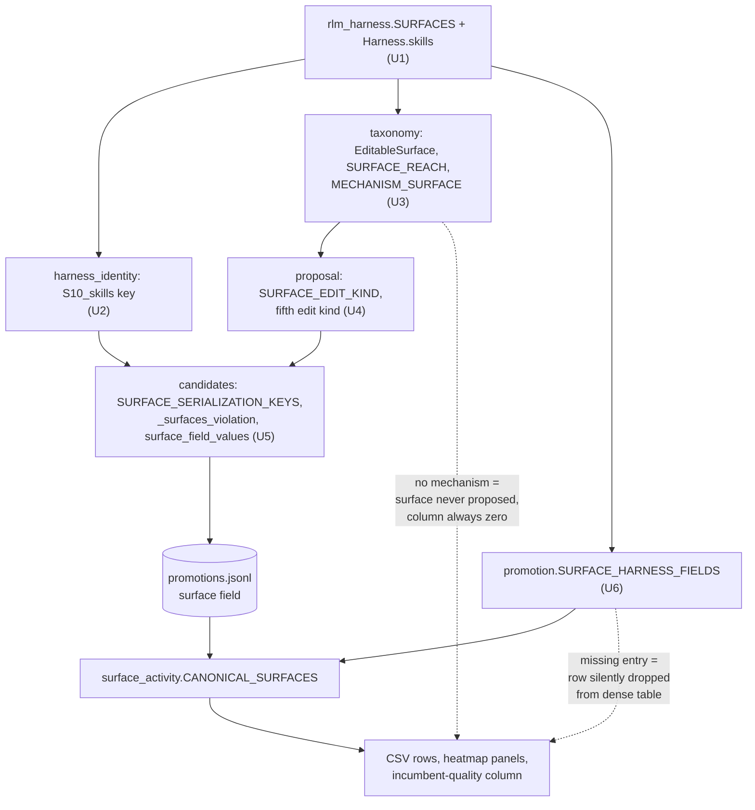

# S10 Skills Edit Surface - Plan

## Goal Capsule

- **Objective:** The RLM harness declares a skills surface the optimization loop can target, edit, promote, and be measured on, and every per-surface analysis reads the tenth surface exactly as it reads the other nine.
- **Means:** A `build_skills() -> list[SkillEntry]` declared as S10 (KD1) — a name-plus-description index in the system prompt, bodies loaded on demand through a fixed loader the runner installs (KTD9) — threaded through the four surface-keyed tables the optimization layer already uses for S1-S9 (KTD2, KTD3, KTD4, KTD7), with the analysis layer's hardcoded surface counts replaced by each round's own declared set (KTD5, KTD6).
- **Authority:** R-IDs govern behavior; KTDs govern mechanism. Where the plan leaves a judgement call open, experimental reproducibility and scientific honesty decide it — the surface set is preregistered scaffold, and a figure that misstates it is worse than a missing figure.
- **Stop conditions:** Stop and surface if the change would alter bytes an in-flight experiment tree has already persisted as evidence (ledgers, manifests, markers, bundles). Stop if S10 cannot be made reachable from at least one mined failure mechanism — a declared-but-unreachable surface is a worse artifact than no surface. Stop if H0* stops being byte-identical to the shipped reference.
- **Tail:** Verification Contract gates plus Definition of Done below.

---

## Product Contract

### Summary

Declare `build_skills() -> list[SkillEntry]` as a tenth editable harness surface, S10: an on-demand library of named procedures, each a record of name, one-line description, and body. Register it in `SURFACES`, give `Harness` a `skills` field, assemble only the index — name and description per skill — into the system prompt after S1-S5, install a fixed loader in the root and child REPL namespaces that returns a body by name whenever the library is non-empty, and add an S10 entry to each of the four surface-keyed tables the optimization layer uses to propose, load, materialize, merge, and promote an edit. Add one `AgentMechanism` that maps to S10 so a mined pattern can address it. Bump the harness serialization envelope and the taxonomy version, because both encode the surface set. In the analysis layer, replace the one hardcoded surface count in the surface-activity figure with a derived value, and add a per-cell flag distinguishing a round whose harness never declared S10 from a round that declared it and left it alone.

### Problem Frame

`shrlm/docs/plans/2026-07-21-002-feat-rlm-harness-surfaces-from-paper-failures-plan.md:77` maps Self-Harness's `build_skills` and `build_subagents` jointly onto S8, "functions and data injected into the REPL". That collapse loses a distinction the reference harness draws: S8 is editable helper code the proposer writes into the REPL namespace, while a skill is procedural *content* — a named procedure the root discovers from an index and reads on demand through a fixed loader the harness, not the proposer, supplies. The paper's own instantiation is a "dependency-verifier skill" on a missing-module failure branch (`paper/Self-Harness.md:267`) — guidance, not a callable. Under the current mapping, a mined pattern about the root re-deriving a procedure it has already carried out has nowhere legible to land: it either becomes an S3 execution-instruction rewrite, which drags unrelated per-turn guidance along, or an S8 helper, which is the wrong object.

**Provenance.** S10 is derived from the reference harness's declared configuration points, not from any pattern this project's own mining has produced. The reference harness is DeepAgent-based and declares `build_skills() -> list[str]` as a configuration point; DeepAgents' `skills` option (its documentation, not the paper, is the source for this) gives such a skills list progressive-disclosure semantics — a name-plus-description index in the system prompt, with the skill body read on demand. The paper's printed figure does not show how the reference wires the list, so the claim is about DeepAgents' semantics, not the reference's wiring. S10's index-plus-loader design adopts those semantics rather than inventing a mechanism, so the surface's existence inherits reference-harness provenance and its load-on-demand shape inherits DeepAgents' documented semantics. The structured entry shape and the hand-off of a loaded body to sub-calls are this project's instantiation choices, and the preregistration-amendment note (U11) dates them as such. The distinction is load-bearing: `paper/Self Harnessing RLMs.md:75` claims surfaces are declared from the loop's phase structure rather than selected from documented failures, precisely so that what the loop discovers stays separable from what its designer already knew. A surface reverse-engineered from this project's mining output would forfeit that claim.

### Key Decisions

- KD1. **Skills are an on-demand library: a name-plus-description index in the system prompt, with bodies loaded at run time through a fixed loader the runner installs.** (session-settled: user-directed — revised 2026-08-22 from "prompt-side procedure texts, not REPL callables"; chosen over verbatim bodies in the prompt and over a proposer-editable loader: the loader is scaffold, not surface content, so S10 (skill content) stays disjoint from S8 (proposer-written helpers), and S8's governs text excludes it.) Governs R1, R2, R5, R15.
- KD2. **S10 is edited whole, the same way every other surface is.** (session-settled: user-directed — chosen over an accumulating skill library that grows across rounds: one edit shape, one bounds story, and one diff semantics across all ten surfaces.) Governs R3, R7.
- KD3. **Analyses back-fill prior rounds rather than starting a new experiment identity.** (session-settled: user-directed — chosen over a fresh experiment identity and over a per-experiment feature flag: existing snapshots stay readable.) Governs R11, R13.
- KD4. **The analysis hookup is parity-only.** (session-settled: user-directed — chosen over adding skill-specific measures such as library size over rounds or per-skill survival: the tenth surface should read exactly like the other nine.) Governs R11, R12.

### Requirements

**Declaration**

- R1. `build_skills() -> list[SkillEntry]` is declared as surface S10 in `shrlm/rlm_harness.py`, registered in `SURFACES`, backed by a `Harness.skills` field, and returns `[]` at both H0 and H0*. A `SkillEntry` is a record of `name` (unique within the list, a REPL-safe identifier), `description` (one line), and `body` (the procedure text); it serializes as a plain mapping so the existing canonical-JSON path hashes it deterministically. (The reference's `list[str]` carried DeepAgents skill paths whose files hold the same three fields; this plan carries the fields inline.)
- R2. S10's entries assemble into the root system prompt as a compact index — one line per skill, name and description — placed after S1-S5 inside a fixed wrapper (harness code, not surface content) that is purely declarative: it names the loader and states that it returns a listed skill's full procedure. When to consult a skill is carried by each entry's one-line description, which R14 already owns, so the behavioral cue stays proposable surface content rather than unproposable scaffold. Bodies never enter the assembled prompt. An empty S10 contributes no bytes and installs no loader, so H0* stays byte-identical to the shipped reference.
- R15. A fixed skill loader, built by the runner from `Harness.skills` and installed in both the root and child REPL namespaces whenever S10 is non-empty, returns a skill's body verbatim by name and raises a named error listing the available names for an unknown one. It is scaffold, not surface content: never serialized as an S8 helper, never proposable, and its REPL name is harness-reserved. Forwarding a loaded body to a sub-call is the root interpolating it into the sub-call prompt; no further pass-through exists.
- R16. Each loader invocation is a run-trace fact recorded by the REPL environment beside its sub-call events (skill name, depth, turn), persisted with the turn result, summed into a per-run `skill_load_count` in run metrics, and aggregated beside the sub-call counts in the validation round summary and per-instance comparison — so a candidate whose validation runs never loaded a skill is visible before it is scored. The harness's skill index (names and descriptions) is recorded once as a run-start trace event so the digest can name what was available. These are trace facts beside the sub-call counts, not per-skill analyses; KD4's parity-only hookup is untouched.

**Optimization-loop reachability**

- R3. Every surface-keyed table in the optimization layer carries an S10 entry, so a proposal targeting S10 is loaded, gated, materialized, merged, and promoted through the same path as S1-S9.
- R4. At least one `AgentMechanism` maps to S10, so a mined failure pattern is addressable to skills and the surface is not declared-but-unreachable.

**Prompt safety and edit bounds**

- R5. A skill entry's index fields — name and one-line description — are format-ready: they carry no brace, so the assembled prompt still survives `str.format` with a placeholder `custom_tools_section` and that slot stays the one live replacement field. Skill bodies are stored raw and returned verbatim by the skill loader; they never pass through `str.format` and carry no brace convention. Index fields that would raise are rejected at proposal validation and again at harness construction, before any run starts.
- R6. No skill index field or skill body may state a runtime limit that `check_stated_limits` governs, so S10 text cannot contradict the bound the runtime honors. The index is checked as part of the assembled prompt; each body is scanned individually with the same truncation and capacity patterns, at proposal validation and again at construction, because a runtime-loaded body never appears in the assembled prompt.
- R7. S10 edits are bounded by entry count, per-field length, and total length, enforced where the other edit kinds are shape-checked. The caps split by representation: name and description caps sit in the S1-S5 text-budget family because the index is paid in every prompt; the body cap is looser because a body costs context only when loaded.
- R14. Each S10 entry is one named, reusable procedure: `name` identifies it, `description` is a single line stating when to consult it, and `body` is ordered steps; neither description nor body may restate per-turn execution or decomposition guidance. The contract is stated in the surface's `governs` text so the attributor and the proposer both see it, and enforced structurally where the edit is shape-checked. Without it nothing separates a legal S10 edit from an S3 rewrite, and per-surface attribution becomes a label rather than an observation.

**Identity and version contracts**

- R8. The harness serialization carries an `S10_skills` key and its envelope format tag is bumped, so a nine-surface serialization is rejected loudly rather than accepted and mis-hashed.
- R9. Every artifact a loader gate reads is regenerated under the new key set, and the committed real-run round trees are preserved unchanged as the repo's pre-S10 evidence.
- R10. The taxonomy version is bumped to reflect the changed surface contract, and the frequency comparison excludes bundles written under a different version rather than diffing across the boundary.

**Analysis parity and honesty**

- R11. Every per-surface analysis output enumerates S10 by deriving its surface list from the declaration, never from a literal count.
- R12. No figure states or draws a surface total from a hardcoded number; the surface-activity reference line, y-limits, ticks, and axis label are all derived.
- R13. Each per-surface analysis cell distinguishes three states — "not declared in that round's harness", "declared and not edited", and "that round's harness could not be read" — and figures render all three differently.

### Scope Boundaries

**In scope**

The tenth surface end to end: declaration, serialization, taxonomy, proposal, candidate loading, promotion, the fixed skill loader and its trace, runner construction checks, analysis parity, fixture regeneration, and the prose that states the surface contract.

**Deferred to follow-up work**

- Closing the brace hazard for S1-S5. KTD8 adds a construction-time format check that covers the whole assembled prompt, which incidentally protects S1-S5 too, but proposal-time brace validation for the existing text surfaces is not retrofitted here.
- The `incumbent_quality.py:276` asymmetry, where the candidate-quality table reads `surface` straight from the ledger and never back-fills through `resolve_surface`. Pre-existing and orthogonal to S10.

**Outside this change's identity**

- `build_subagents`, and any further surface. The declared surface set is closed at ten for this study. Self-Harness declares the subagent builder beside `build_skills`, so it has identical provenance and would otherwise be a standing candidate — but each addition costs a taxonomy bump, a repo-wide hash move, a preregistration edit, and one more boundary the frequency comparison cannot diff across. Pricing this change as one-time is only honest if it is one-time.
- Skill-specific metrics. KD4 settles this: the tenth surface reads like the other nine.
- Any mechanism by which the root model writes its own skills at runtime. Skills change between rounds, through a validated proposal, like every other surface (KD2).

### Success Criteria

- A proposal targeting S10 completes the full loop offline — mined pattern, proposal, candidate load, validation, merge, promotion, ledger row — with no surface-specific special-casing outside the tables named in R3 and the fixed loader install and construction checks R15, R16, and KTD8 declare.
- `surface_activity.csv` and both heatmap panels show ten rows, and a round whose harness predates S10 is visually distinguishable from a round that declared S10 and left it empty.
- H0* still hashes to the shipped-reference prompt bytes.
- A harness with a non-empty S10 renders exactly the name-plus-description index into the root system prompt, and in an offline scripted-client run the root loads one skill body through the loader and passes it into a sub-call prompt — proving the loader-to-sub-call plumbing offline, not only the edit path. Whether a live root consults the index is a behavioral question the loader-invocation trace (R16) answers per run; the scripted run cannot.

### Sources

- `shrlm/docs/plans/2026-07-21-002-feat-rlm-harness-surfaces-from-paper-failures-plan.md:77` — the S8 mapping this plan splits.
- `paper/Self-Harness.md:208` — Figure 3's `def build_skills() -> list[str]: return []`, the reference declaration S10 descends from; `paper/Self-Harness.md:220` — the harness builds on the DeepAgent SDK; DeepAgents' documented `skills` option has progressive-disclosure semantics (index in prompt, body on demand), which is the semantics S10 adopts. The paper does not show the wiring; cite DeepAgents' documentation for the semantics.
- `paper/Self-Harness.md:275` — Figure 6(a) caption: the skill branch was accepted then discarded for no further improvement. The paper itself defines a skill entry only as `list[str]`; the entry semantics S10 adopts come from DeepAgents' documented `skills` option.
- `paper/Self Harnessing RLMs.md:75` — this project's preregistered claim that surface selection is fixed scaffold shared by every condition. R10 and U11 exist because of it.
- `shrlm/optimization/promotion.py:84` — `SURFACE_HARNESS_FIELDS`, the single upstream source the whole analysis layer derives its surface list from.

---

## Planning Contract

### Key Technical Decisions

- KTD1. **Append the S10 index — not the bodies — after S5 in `assemble_system_prompt`.** The existing `parts` list is a literal five-element sequence and `tests/test_invariants.py:468` asserts S1-S5 appear in phase order. Appending leaves that ordering intact; the wrapper sentence and the index lines render only when the list is non-empty, so an empty list contributes nothing, which is what keeps H0* byte-identical. The wrapper sentence is harness code and purely declarative — it names the loader and what it returns, nothing about when to call it: the floor harness's S1 states facts only and S3 is one generic line, so without it the root would see names with no way to read them, but per-turn "when to consult" guidance is exactly what R14 forbids in S10 content and what no proposer could fix if the wrapper carried it, so the cue lives in each entry's description, which is proposable. Governs R2.
- KTD2. **Add a fifth edit kind for the skill-entry list.** `proposal.py:116-119` declares four legal edit shapes — text, policy, code, repl-helper — and `SURFACE_EDIT_KIND` maps each surface to exactly one. S10's value is a list of name/description/body records, so it fits none of the four: `TEXT_SURFACE_FIELDS` assumes `str`, and the repl-helper kind would make the entries proposer-written code. A fifth kind carries the per-field and total bounds of R7, the index-only format check of R5, the per-body limit scan of R6, and R14's structural shape (unique names, one-line descriptions, step-shaped bodies). Serialization needs no new path: `json_safe_value` and `canonical_json` already hash a list of sorted-key mappings deterministically. Rejected: keeping `list[str]` with a SKILL.md-style header parsed out of each string — it preserves the paper signature but makes the index a parsing convention the proposer can get wrong. Governs R3, R5, R6, R7, R14.
- KTD3. **Bump the harness envelope to `shrlm-harness/v2`.** `candidates.py:240` gates on exact key-set equality between a proposal's serialized surfaces and the expected set, so the key set *is* the contract; a nine-surface document under a `v1` tag would be rejected with a shape error rather than a version error. Bumping the tag makes the rejection say what actually happened. Governs R8.
- KTD4. **Add one `AgentMechanism` keyed to a failed run, bump `TAXONOMY_VERSION` to 3.0.0, and gate the frequency diff on it.** `tests/optimization/test_taxonomy.py:101` asserts every declared surface is the target of some mechanism, so S10 without one fails the suite and would leave the surface permanently unproposable. The mechanism must describe a *failure*, because `mining.py:126` attributes only runs that failed verification — a mechanism phrased as a correctly-executed repetition never reaches the attributor. It must also be *observable*: the attributor sees the taxonomy block and the trace digest, neither of which carries the incumbent's skill index, and an unloaded skill leaves no trace on its own. So loader invocations are recorded in the run trace (KTD9) and the digest emits an available-skills / loaded-skills line per run, and the mechanism is defined against exactly that observable: a skill whose description names the failing step was available in the index and was never loaded before the run failed. "Loaded and not followed" is deliberately excluded — the digest shows load events and code, not adherence, so it is not a trace fact. The root re-deriving a procedure it has already carried out is the no-skills fallback signal, the only one a pre-S10 trace can show. Tie-break runs the conservative way: S10 claims a terminal signal only when no S6 (budget-exhaustion) or S3 (depth-degradation) mechanism independently explains it, so attribution mass does not drift toward S10 after the first promotion merely because every failed run then carries an unloaded-skill line; the rule lives in `MECHANISM_DOCS` so the attributor and the analysis share it. The version is declared to be the surface contract (`tests/optimization/test_taxonomy.py:141`), so changing the contract forces the bump; and because nothing reads that version today, the bump only means something once the frequency diff excludes on it. Governs R4, R10.
- KTD5. **Derive the surface-activity figure's totals from each round's declared surface set, not from a literal and not from the current code's count.** `plot_surface_activity.py` carries five literal `9`s — an `axhline(9)` labelled "all surfaces", the `ax.text` anchor that places that label at y=9, `set_ylim(0, 9.6)`, `set_yticks(range(0, 10))`, and the axis label `"distinct surfaces (of 9)"`. This is the only site in the analysis layer that renders a *wrong but plausible* figure rather than simply omitting data. `len(CANONICAL_SURFACES)` fixes the clipping but not the honesty: it is the count the code has now, so it would draw a ten-surface reference line over a round that only ever had nine. KTD6's per-round reader supplies the count that is actually true of each round. Governs R12.
- KTD6. **Read each round's declared surface set from its persisted `harness.json`, not from the current code.** The back-fill of KD3 is only honest if a pre-S10 round reports the surfaces it actually had. The round's frozen harness serialization already carries exactly that key set. Governs R13.
- KTD7. **S10's reach is child-reachable, on two legs.** The index assembles into the system prompt that sub-calls also receive, and the loader is installed in both `custom_tools` and `custom_sub_tools` (KTD9), so a child can load any body itself; the root may additionally forward a loaded body into a sub-call prompt. `tests/optimization/test_taxonomy.py:74` asserts the root-only set is exactly `{S6, S7, S9}`, and it stays so. Both legs are live only for `rlm_query` children below `max_depth`: `llm_query` sub-calls and max-depth leaves are bare completions with no system prompt and no REPL, so for them the sole hand-off is the root interpolating a loaded body into the sub-call prompt. The experiment's `caps.max_depth` in `configs/experiment.toml` was raised from 1 to 2 on 2026-08-22 for exactly this reason — at 1 no child RLM ever existed and both legs were dormant; at 2 depth-1 `rlm_query` children inherit the index and the loader, and depth-2 leaves are bare. Rejected: a root-only loader with root-mediated forwarding — reach would become conditional on a per-run choice the binary reach enum cannot express, and a child following the index would hit a `NameError` the attributor files under S8. Governs R3, R15.
- KTD9. **The skill loader is fixed runtime scaffold built from `harness.skills`, not an S8 entry.** `build_harnessed_rlm` constructs a `load_skill(name) -> str` closure over the harness's entries and merges it into both `custom_tools` and `custom_sub_tools`, only when the list is non-empty — `build_rlm_system_prompt` renders every custom tool into the `{custom_tools_section}` slot, so an unconditional loader would change H0*'s effective prompt. The loader is never serialized into the helper dicts (so hashes move only with surface edits), never proposable, and its name is harness-reserved (U7 3c). An unknown name raises a named error listing the available skills; a body is returned verbatim (R5). `rlm_query` and `llm_query` already accept any string, so forwarding a body to a child is the root interpolating it into the sub-call prompt — no new pass-through. Loader invocations are recorded in the run trace, which is what makes the KTD4 mechanism observable. The converse cost is stated, not hidden: the wrapper sentence (KTD1) and the loader's rendered tool line are prompt bytes every non-empty-S10 harness carries, yet unhashed — scaffold identity rides on code version, not harness hash — so both are byte-pinned in a test, and any change to them is a dated scaffold amendment recorded in the preregistration-amendment note (U11 2c) and in the round manifest, never a silent edit between rounds. Governs R15, KTD7.
- KTD8. **Add a format-safety check to `check_harness`.** `escape_braces` is exported from `shrlm/rlm_harness.py:82` but never called in production — the single `.format()` happens at `rlm/utils/prompts.py:234`, at completion time, so a stray brace surfaces as an infrastructure error mid-run rather than as a bad score. Skill texts are the likeliest surface to contain a literal brace, since procedures carry code examples — which is exactly why bodies stay out of the formatted prompt and are returned raw by the loader. The check formats the assembled prompt (S1-S5 plus the S10 index) with a placeholder `custom_tools_section` at construction, and separately runs `check_stated_limits`' patterns over each skill body, since a body is never in the string the prompt-level scan reads. Governs R5, R6.

### High-Level Technical Design

Directional guidance for review, not implementation specification.

**How a surface id propagates.** The analysis layer is almost entirely surface-generic: it derives its canonical list from `promotion.SURFACE_HARNESS_FIELDS`, not from `SURFACES`. Adding the S10 entry there extends the tables, the dense zero-fill, and the heatmap rows automatically. Everything upstream of it is a literal table that must gain an entry, and each omission fails differently.

**How a per-surface cell resolves.** `rounds.resolve_surface` already returns a `(category, source)` pair, and every output cell carries `surface_source` beside its count. R13 adds one state ahead of the existing ladder rather than changing it.

| Condition on the cell | Resolution | Rendering |
|---|---|---|
| Subject is the merged harness | merged category | own row, never in the S1-S10 grid |
| Round's `harness.json` is absent or unreadable | **unknown** (new) | visually distinct from both cells below |
| Round's `harness.json` lacks the surface's serialization key | **undeclared** (new) | visually distinct from an empty declared cell |
| Ledger row carries a non-null surface | ledger | normal |
| Ledger surface null, proposal join succeeds | backfilled | weaker-claim marking, unchanged |
| Ledger surface null, no proposal join | none | tallied as unattributed, unchanged |

### Assumptions

- Nothing currently stops an in-flight tree from adopting S10 mid-run. The frozen-harness refusal at `orchestrator.py:376` fires at run conclusion, not on the load path, and `driver.py:222` compares hashes only within a single round directory — so a resumed tree writes a ten-surface envelope for its next round without complaint, and ends up with early rounds on a nine-surface scaffold and later ones on ten. S10 is intended for trees created after it lands; U5's key-set check makes the load path fail with a named error rather than a bare `KeyError`, but a round-start refusal comparing the incumbent's key set against the tree's earlier rounds is not in this plan's scope and is recorded as an open question.
- Analysis over pre-S10 trees keeps working without a compatibility shim. Old `harness.json` files are re-hashed from their stored serialization by `audit.py:238`, which is surface-generic, and `_surfaces_violation`'s exact key-set gate applies to newly loaded candidates, not to archived artifacts.
- `paper/Self Harnessing RLMs.md` and `shrlm/docs/Self Harnessing RLMs.md` are the same draft in two locations, and both need the same edit.
- `configs/experiment.toml` `caps.max_depth` is 2 (raised from 1 on 2026-08-22, in the same change as this plan). Nothing in the loop or analysis reads the cap other than the runtime (`ValidationCaps`), an enabled S6 policy may still set a lower depth but not a higher one, and the committed `experiment_smoke/` and `examples/mining_rounds/` trees ran at depth 1 and are preserved unchanged.

### System-Wide Impact

- **Harness identity.** Every hash in the repo moves. This is the change's widest blast radius and the reason U9 and U10 exist. One new thing does *not* move the hash: the fixed S10 wrapper sentence and the loader's rendered tool line are unhashed scaffold (KTD9), so their identity is carried by code version and the byte-pin test, and a change to either is a dated amendment, not a surface edit.
- **Taxonomy comparability.** U3 adds the version gate that makes the bump mean something: bundles written under 2.0.0 are excluded from a diff against new ones. That is the correct behavior for a changed surface contract, but it means a diff spanning the change reports nothing rather than something misleading. Before U3 lands, nothing reads the version at all.
- **Preregistered claim.** `paper/Self Harnessing RLMs.md:75` states nine surfaces and `:114` states seven of nine start sparse. Both become ten and eight of ten. This is a preregistration edit, not a documentation chore.
- **Recursion depth and cost.** Raising `caps.max_depth` to 2 lets `rlm_query` spawn real child RLMs — more sub-calls, child REPL turns, and tokens per run than the depth-1 trees the repo's smoke measurements came from. Per-run exposure is still bounded by `max_budget` and the cost band is unchanged; the pilot should re-measure mean and worst-case run cost at depth 2 before the `max_budget` headroom claim in the config is trusted. This is a preregistration parameter change and is dated in the amendment note (U11 2c).
- **Prompt bytes and load bytes.** Under the index design only the per-skill name and one-line description are an always-paid prompt cost, so the index belongs in the S1-S5 text-budget family. A skill body costs context only when it is loaded — into the root's REPL output, or into a sub-call prompt when the root forwards it — so body length is a per-load cost against REPL and sub-call context, not a permanent tax on the root prompt. The risk this inverts into — a promoted skill the root never loads — is recorded under Risks & Dependencies.

### Risks & Dependencies

- **S10 lands declared but dead.** If the new mechanism never fires in mining, no pattern is ever addressable to skills and the column stays zero for the whole experiment — the surface would then be scaffolding that inflates the denominator of "fraction of declared surfaces the promoted lineage modifies" (`shrlm/docs/experiment-metrics.md:56`). Mitigation: U3 defines the mechanism against a failed run, since the miner attributes nothing else, and states its precedence over the budget-exhaustion and depth-degradation mechanisms that claim the same terminal signal. The Definition of Done requires a real post-loader trace to resolve to S10 in a recorded live attribution, not a hand-built record.
- **A promoted skill the root never loads.** Under on-demand loading a candidate whose skill is never consulted is behaviorally the incumbent: its validation delta is sampling noise around zero, a promotion of it is a false positive the preregistered band cannot distinguish from a real effect, and S10 would then show activity in every parity figure with no causal role. Disposition: the per-run loader-invocation count (R16, U12) is recorded in run metrics and the validation summary for audit only; the promotion rule and its bands are unchanged, so a never-loaded promotion remains possible and is an accepted preregistered-band false positive, recorded as such in the preregistration-amendment note (U11 2c). Gating promotion on a non-zero load count was rejected: it would be a surface-specific admission criterion no other surface faces, the same bias the plan refuses elsewhere. The count is a trace fact beside the sub-call counts, not a per-skill analysis; KD4's parity-only hookup holds.
- **Skill text breaks the run rather than scoring badly.** A literal brace in a skill entry raises `KeyError`/`IndexError` at the first turn, which reads as infrastructure failure, not as a rejected edit. KTD8 and R5 are the mitigation, and the check must run at construction, before any instance is spent.
- **Skill text contradicts the runtime.** `runner.py:272` scans the whole assembled prompt for the truncation sentence and requires the stated set to be exactly the expected one. A skill mentioning truncation trips it. R6 makes that a proposal-time rejection instead of a construction-time surprise.
- **Fixture regeneration hides a real behavior change.** U10 rewrites persisted artifacts wholesale, which is exactly the operation that could mask an unintended serialization change. Mitigation: U10 lands after U2's tests pin the new key set, and its diff is reviewed for key-set changes only.

---

## Implementation Units

### Unit index

| U-ID | Title | Primary files | Depends on |
|---|---|---|---|
| U1 | Declare S10 in the harness | `shrlm/rlm_harness.py`, `shrlm/__init__.py` | — |
| U2 | Serialize S10 and bump the envelope | `shrlm/harness_identity.py`, `optimization/candidates.py`, `optimization/proposal.py` | U1 |
| U3 | Taxonomy: enum, reach, mechanism, version, digest line | `shrlm/optimization/taxonomy.py`, `digest.py`, `walker.py`, `mining.py`, `experiment/pattern_frequency_diff.py` | U1, U12 |
| U4 | Proposal: fifth edit kind and bounds | `shrlm/optimization/proposal.py` | U1, U2, U3, U12 |
| U5 | Candidate load, gate, and materialize | `shrlm/optimization/candidates.py` | U1, U2 |
| U6 | Promotion field map and merge | `shrlm/optimization/promotion.py` | U1 |
| U7 | Runner construction checks | `shrlm/runner.py` | U1, U4, U12 |
| U12 | Skill loader: install, hand-off, trace | `shrlm/runner.py`, `shrlm/rlm_harness.py` | U1 |
| U9 | Declared-vs-untouched provenance | `shrlm/experiment/rounds.py`, `surface_activity.py`, `plot_surface_activity.py` | U2, U5, U6 |
| U8 | Analysis parity: derive the surface total | `shrlm/experiment/plot_surface_activity.py` | U6, U9 |
| U10 | Regenerate loader-gated artifacts | `experiment_smoke/opt/round_01/proposals/`, `examples/validation_rounds/proposals/` | U2, U4, U5 |
| U11 | Surface-contract prose and preregistration | `README.md`, `shrlm/README.md`, `shrlm/docs/`, `paper/` | U1-U9 |

### U1. Declare S10 in the harness

**Goal:** `build_skills` exists as a registered tenth surface with a `Harness` field, and its entries reach the assembled system prompt.

**Requirements:** R1, R2, R14 (KD1, KTD1)

**Dependencies:** none

**Files:**
- `shrlm/rlm_harness.py`
- `shrlm/__init__.py`
- `tests/test_harness_surfaces.py`
- `tests/test_invariants.py`

**Approach:**

1. Add `build_skills() -> list[SkillEntry]` returning `[]`, with a docstring containing its `Surface.phase` string — `tests/test_harness_surfaces.py:100` asserts that. Define `SkillEntry` beside it as a frozen record of `name`, `description`, `body`.
2. Add the `S10` entry to `SURFACES` with a phase and governs description. Phase names the position skills occupy: reusable procedure, available across turns. The governs text carries R14's content contract verbatim — one named procedure per entry, name line plus ordered steps, no per-turn execution or decomposition guidance — because `render_surface_block()` renders that string into both the proposer and attributor prompts. Amend S8's governs text in the same edit — today "functions and data injected into the REPL", which describes the harness-installed skill loader exactly — to "proposer-written functions and data injected into the REPL; the harness-installed skill loader is scaffold and belongs to S10", so the S8/S10 boundary KD1 asserts actually reaches the attributor.
3. Add `skills: list[SkillEntry] = field(default_factory=build_skills)` to `Harness`. A mutable default requires `default_factory`, matching how `repl_helpers` is declared.
4. Extend `assemble_system_prompt` to append, after the S1-S5 parts and only when `harness.skills` is non-empty, the fixed declarative wrapper sentence (names the loader; it returns a listed skill's full procedure — no guidance on when) followed by one index line per skill — name and description, never the body. An empty list contributes nothing.
5. Add `skills=build_skills()` to both `H0` and `H0_STAR`.
6. Update the module docstring's "nine editable surfaces" and "S1 through S9" statements, and the same statements in `shrlm/__init__.py`.
7. Update `tests/test_harness_surfaces.py:73` to ten, and `test_seven_of_nine_h0_defaults_are_empty_disabled_or_one_line` to eight of ten.

**Patterns to follow:** the existing builder-plus-`SURFACES`-entry-plus-`Harness`-field triple that every one of S1-S9 already forms. Harness variants in tests are always built with `dataclasses.replace(H0, ...)`, never by hand-constructing `Harness(...)`.

**Test scenarios:**
- `SURFACES` has ten entries and its keys are `S1`..`S10` in order.
- Every module-level `build_*` in `shrlm.rlm_harness` is registered in `SURFACES` — `build_skills` must not be an orphan.
- `build_skills.__name__.removeprefix("build_")` names a `Harness` field.
- `assemble_system_prompt(H0)` is byte-identical to its pre-change output, because S10 is empty.
- `assemble_system_prompt(H0_STAR)` is byte-identical to the shipped reference prompt.
- A harness with two skill entries renders both index lines — name and description — after the S5 position, preceded by the wrapper sentence, and renders neither body.
- A harness with an empty S10 renders neither the wrapper sentence nor any index line.
- The rendered surface block carries S10's content contract, so the proposer and attributor both receive it.
- The rendered surface block's S8 line names the loader exclusion.
- S1-S5 still appear in phase order in the assembled prompt, with five distinct positions.
- Exactly eight of the ten H0 surfaces are empty, disabled, or a single generic line.

**Verification:** the harness-surface and invariant suites pass, and H0*'s assembled prompt is unchanged from `main`.

### U2. Serialize S10 and bump the envelope

**Goal:** the harness serialization names S10 and rejects a nine-surface document with a version error rather than a shape error.

**Requirements:** R8 (KTD3)

**Dependencies:** U1

**Files:**
- `shrlm/harness_identity.py`
- `shrlm/optimization/candidates.py`
- `shrlm/optimization/proposal.py`
- `tests/test_harness_identity.py`
- `tests/optimization/test_driver.py`

**Approach:**

1. Add `S10_skills` to the `surfaces` dict in `serialize_harness`, serializing each entry's name/description/body mapping through `json_safe_value` with the surface label so a malformed entry fails loudly naming S10.
2. Bump the envelope tag to `shrlm-harness/v2` at all three declaration sites: the literal in `write_harness_json`, and the `HARNESS_FORMAT` constants at `candidates.py:84` and `proposal.py:82`. The candidate loader's format check at `candidates.py:336` reads the second of those, so it is the site that actually produces KTD3's version error; leaving it at `v1` also makes the proposal writer stamp a different tag than the harness writer.
3. Update the docstrings stating "all nine surfaces" and "`S1_...` through `S9_...`".
4. Update the literal expected-key list at `tests/test_harness_identity.py:179` and add S10 to the one-edit-per-surface `VARIANTS` table, and update the envelope-tag assertion at `tests/optimization/test_driver.py:432`.

**Execution note:** pin the new key list and the hash-moves-per-surface parametrization before changing `serialize_harness`, so the key-set change is proven rather than observed.

**Patterns to follow:** `serialize_helper_entry`'s per-entry labelling, which is how S8 names the offending key in its error.

**Test scenarios:**
- `serialize_harness(H0)["surfaces"]` has exactly the eleven expected keys, sorted, including `S10_skills`.
- All three envelope-tag declaration sites agree on `shrlm-harness/v2`.
- A pre-change envelope is rejected by the candidate loader's format check with a version error naming both tags.
- Editing S10 alone moves the harness hash.
- `H0`'s serialization round-trips.
- A skills entry that is not a well-formed name/description/body record fails with an error naming S10.
- The written envelope carries the `v2` format tag.
- Two runs in separate interpreters produce the same hash for the same harness.

**Verification:** the identity suite passes and the hash for H0 is stable across a fresh interpreter.

### U3. Taxonomy: enum, reach, mechanism, version

**Goal:** a mined failure pattern can be attributed to S10, and the taxonomy version states the changed contract.

**Requirements:** R4, R10, R16 (KTD4, KTD7)

**Dependencies:** U1, U12 — U12 records the loader events and run-start index this unit's digest line renders.

**Files:**
- `shrlm/optimization/taxonomy.py`
- `shrlm/optimization/digest.py`
- `shrlm/optimization/walker.py`
- `shrlm/optimization/mining.py`
- `shrlm/optimization/types.py`
- `shrlm/optimization/driver.py`
- `shrlm/experiment/pattern_frequency_diff.py`
- `tests/optimization/test_taxonomy.py`
- `tests/optimization/test_digest.py`
- `tests/optimization/test_clustering.py`
- `tests/experiment/test_pattern_frequency_diff.py`

**Approach:**

1. Add `SKILLS = "S10"` to `EditableSurface`.
2. Add the S10 entry to `SURFACE_REACH` as child-reachable, matching the other prompt surfaces.
3. Add one `AgentMechanism` member describing the failure S10 addresses, with its `MECHANISM_DOCS` entry and its `MECHANISM_SURFACE` mapping to `SKILLS`. Define it against a **failed** run: `mining.py:126` only attributes runs that failed verification, so a mechanism phrased as a correctly-executed repetition never reaches the attributor and leaves S10 unproposable. Phrase it as: a skill whose description names the failing step was available in the index and the root never loaded it before failing; when no skill was available, the fallback signal is the root re-deriving a procedure it has already carried out in this run. Do not include "loaded and not followed" — adherence is not digest-observable. Make it observable: the trace digest emits an available-skills / loaded-skills line per run from the loader invocations U12 records, so the attributor can tell "no skill covered this" from "a skill covered it and was not consulted".
3b. State the precedence rule against the two mechanisms that already claim that terminal signal — budget exhaustion, which maps to S6, and depth degradation, which maps to S3 — the conservative way: S10 claims the signal only when neither S6 nor S3 independently explains it. Without a stated rule the attributor has no deterministic tie-break; with an S10-wins rule every post-promotion failure would drift toward S10. Record the rule in `MECHANISM_DOCS`; no code-level precedence exists today, so the rule is prompt text and is tested with a scripted attributor.
3c. Give the digest line an owner and a source. `build_digest` today renders only the call tree, the miner's `record_failure` receives no harness, and the walker reads only code, stdout, stderr, final answer, and sub-call records from each block — so nothing lifts skill events into the digest text. Extend the walker's iteration/code-block nodes and `build_iteration` to read the persisted loader events and run-start index event U12 writes; thread the round's available-skills names (derivable at mine time from the round envelope's `S10_skills` key, which `mine_round` already loads, without a live `Harness`) through `WeaknessMiner.record_failure` into `build_digest`; render an `available_skills:` / `loaded_skills:` pair in `render_header`; and bump `DIGEST_VERSION`, since the digest is a deterministic version-stamped artifact recorded per bundle. A trace under an empty S10 must render byte-identically to today.
4. Bump `TAXONOMY_VERSION` to `3.0.0`.
4b. Make `pattern_frequency_diff.bundle_completeness` exclude any bundle whose `taxonomy_version` differs from the running code's `TAXONOMY_VERSION`, with the exclusion reason naming both versions and the summary reporting every version seen with its bundle count; a majority rule was rejected because the pairwise diff has no majority and a tree where post-bump rounds are the minority would exclude the new bundles. A diff over only old-version bundles is an explicit opt-in flag, never an accident. Nothing reads the version today — it is written and never consulted — so the bump alone changes a recorded string and leaves cross-boundary diffs running silently.
5. Update the `AgentMechanism` docstring's mechanism-count and surface-count arithmetic, and `clustering.py`'s "has nine buckets" docstring.

**Approach note on the mechanism:** define it against something the attributor can observe in a trace, not against an intent. The distinguishing signal is repetition of an equivalent procedure across turns or across instances within a run, not a single suboptimal decomposition — that is already S2's mechanism.

**Patterns to follow:** the existing mechanism entries, each of which pairs a trace-observable behavior with exactly one surface.

**Test scenarios:**
- `{m.value for m in EditableSurface}` equals `set(SURFACES)`.
- `set(SURFACE_REACH)` equals `set(EditableSurface)`.
- The root-only reach set is still exactly `{S6, S7, S9}`.
- Every declared surface, S10 included, is the target of at least one mechanism.
- `TAXONOMY_VERSION` is `3.0.0`.
- `render_surface_block()` shows all ten surfaces with reach annotations.
- The rendered block carries no retired surface values.
- A synthetic failure record carrying the new mechanism resolves to S10 through `FailureSignature.surface()`.
- A record whose signal budget exhaustion independently explains resolves to S6, not S10, under the stated precedence rule; the same record with the budget signal removed resolves to S10.
- A synthetic digest with no available-skills line but a repeated-procedure signal resolves to S10 via the fallback.
- A synthetic digest carrying an available-skills line with a skill that was never loaded resolves to S10; the same digest with the skill loaded and followed does not.
- A trace with one load renders the `loaded_skills:` line naming it; a trace under an empty S10 renders byte-identically to the pre-change digest.
- `DIGEST_VERSION` is bumped and recorded per bundle.
- Clustering's by-surface marginal has a bucket for S10.
- A bundle written under the prior taxonomy version is excluded from a frequency diff, with both versions named in the exclusion reason and every version seen reported with its count; a pairwise diff of one old and one new bundle excludes the old one, not both.

**Verification:** the taxonomy and clustering suites pass. The real-trace proof is not a pytest gate: attribution cache keys fold in the rendered taxonomy prompt and the taxonomy version, so every archived entry is a cache miss under 3.0.0, and archived pre-S10 traces carry no index or load events in any case. Instead, the proof is a bundle produced by the real mining, attribution, and proposal-addressability path over a live smoke run with a non-empty S10 in which a skill was available and not loaded, plus an H0-lineage failed trace under an empty S10 that resolves to S10 through the fallback signal — both committed as evidence under `examples/` with the attributor model, taxonomy version, and attributor prompt sha beside them so staleness is detectable. The offline scripted-client run proves only the plumbing, since a scripted root is scripted not to load. The Definition of Done points at the committed bundle.

### U4. Proposal: fifth edit kind and bounds

**Goal:** the proposer is told S10 exists, can emit a legal S10 edit, and an illegal one is rejected before materialization.

**Requirements:** R3, R5, R6, R7, R14, R15 (KTD2, KTD9)

**Dependencies:** U1, U2, U3, U12 — U12 declares the loader's reserved name this unit's S8 branch rejects.

**Files:**
- `shrlm/optimization/proposal.py`
- `tests/optimization/test_proposal.py`

**Approach:**

1. Add `EDIT_KIND_SKILLS` and map `S10` to it in `SURFACE_EDIT_KIND`. S10 does not belong in `TEXT_SURFACE_FIELDS`, which assumes a `str` field.
2. Add the S10 branch to `_validate_edit_shape`: a list of well-formed skill entries, within an entry-count cap, per-field length caps, and a total length cap (R7); each entry's index fields must survive `str.format` with a placeholder `custom_tools_section` (R5) — bodies are not format-checked and are stored raw; no index field or body may state a runtime limit `check_stated_limits` governs, scanning each body individually (R6); and each body must carry R14's shape — ordered steps under the entry's name.
3. Add the S10 branch to `materialize_candidate_harness`, setting the `skills` field.
3b. Extend the existing repl-helper branch of `_validate_edit_shape` — which today rejects only `RESERVED_TOOL_NAMES` — to also reject an S8 helper entry whose name is the loader's harness-reserved name (U12 step 1), naming S10 in the error, so the proposal-time gate matches U7's construction-time refusal.
4. Update `PROPOSER_INTRO`'s "The nine editable surfaces:" and add an S10 bullet to `EDIT_FORMATS`. The bullet states the list-of-procedures shape, R14's name-plus-steps contract, and the brace rule verbatim — no brace in a name or description (those land in the formatted prompt), bodies written raw with literal braces allowed since the loader returns them verbatim. The existing prompt states the brace rule for no surface, and S10's index is the likeliest to break it, so a proposer that is never told the rule would carry a rejection rate no other surface faces and bias the promotion counts.

**Execution note:** write the rejection cases first. The value of this unit is what it refuses, and a permissive validator passes its happy-path test while letting a run-killing brace through.

**Patterns to follow:** `_validate_edit_shape`'s existing per-kind branches, each of which raises with the surface id in the message.

**Test scenarios:**
- A well-formed S10 edit validates and materializes into a harness whose only changed surface is S10.
- A skill description containing a brace is rejected at validation; a skill body containing undoubled braces is accepted and the loader returns it verbatim.
- A skill description containing `{custom_tools_section}` is rejected — the slot is live only in the S1 contract, and an index line must not introduce a second replacement field.
- An entry whose body lacks ordered steps, or whose description spans more than one line, is rejected.
- Two entries sharing a name are rejected; a name that is not a REPL-safe identifier is rejected.
- A description exceeding the index cap is rejected while the same length in a body is accepted.
- Candidate ids for an S1 edit and an S10 edit are distinct strings.
- A skill body stating a truncation limit is rejected, even though the body never appears in the assembled prompt; so is a description stating one.
- An edit exceeding the entry-count cap is rejected.
- An edit exceeding the per-entry length cap is rejected.
- An edit exceeding the total length cap is rejected.
- An S10 edit whose value is a bare string, not a list, is rejected.
- An empty-string entry is rejected.
- The rendered proposer prompt names S10 and its edit format.
- A pattern whose mechanism maps to S10 is in the addressable set.
- An S8 helper edit binding the loader's reserved name is rejected at proposal validation, naming S10.

**Verification:** the proposal suite passes, and a hand-written S10 proposal payload materializes a harness with exactly one changed surface.

### U5. Candidate load, gate, and materialize

**Goal:** a persisted S10 proposal loads through the candidate gates and rebuilds the harness field.

**Requirements:** R3, R8

**Dependencies:** U1, U2

**Files:**
- `shrlm/optimization/candidates.py`
- `tests/optimization/test_candidates.py`

**Approach:**

1. Add the `S10` entry to `SURFACE_SERIALIZATION_KEYS`, pointing at `S10_skills`.
2. Add the per-key type check to `_surfaces_violation`: a list whose entries are all well-formed records — name, description, body, each a string — with unique names.
3. Add the S10 branch to `surface_field_values` beside the S6 dict branch — before the `module is None` guard and the `_callable_slots` call — rebuilding `SkillEntry` records from the `S10_skills` list; `load_candidate` passes `module=None` for S10 (step 4), so a branch appended at the chain's tail, after the module guard, would raise "surface S10 needs the surface module" for every S10 candidate.
4. Leave the callable-surface literal `("S7", "S8", "S9")` at `candidates.py:813` unchanged — S10 carries no module — but assert in a test that S10 is not treated as callable.
5. Make `materialize_harness` check the serialization's surface key set against `SURFACE_SERIALIZATION_KEYS` before dispatching, and raise `CandidateMaterializationError` naming the missing keys and the envelope version. Without it, `rematerialize_harness_envelope` — the resume and frozen-evaluation load path — dies on a bare `KeyError` when handed a pre-S10 document.
6. Update the `_surfaces_violation` docstring's "nine serialized surfaces" statement.

**Patterns to follow:** the `_STRING_SURFACE_FIELDS` branch is the closest analogue, but S10 needs its own because the field type differs.

**Test scenarios:**
- Grouped serialization keys equal `serialize_harness(H0)["surfaces"]` keys, and `set(SURFACE_SERIALIZATION_KEYS)` equals `set(SURFACES)`.
- An S10 proposal envelope round-trips: serialize, write, load, materialize, compare.
- A proposal whose serialization omits `S10_skills` is rejected on key-set mismatch.
- A proposal whose `S10_skills` value is a list containing a malformed record is rejected.
- `changed_surfaces` reports exactly `["S10"]` for an S10-only edit.
- A proposal changing S10 and S3 together is rejected as a multi-surface diff, with both ids in the reason.
- Loading an S10 candidate imports no candidate module.
- Materializing a pre-S10 serialization raises `CandidateMaterializationError` naming `S10_skills` and the envelope version, not `KeyError`.

**Verification:** the candidates suite passes and an S10 proposal loads end to end from disk.

### U6. Promotion field map and merge

**Goal:** an accepted S10 edit merges into the incumbent, and the analysis layer's canonical surface list gains S10.

**Requirements:** R3, R11

**Dependencies:** U1

**Files:**
- `shrlm/optimization/promotion.py`
- `tests/optimization/test_promotion.py`

**Approach:** add `"S10": ("skills",)` to `SURFACE_HARNESS_FIELDS`. This single entry is what extends `CANONICAL_SURFACES`, `ROW_CATEGORIES`, the dense zero-fill, and the heatmap rows in the analysis layer; nothing downstream of it needs an S10-specific change. Verify `merge_harnesses` and `plan_promotion` need no edit, since both iterate the map. Update the module's "the one S1-S9 surface" docstring statements at lines 169, 299, and 390.

**Test scenarios:**
- `set(SURFACE_HARNESS_FIELDS)` equals `set(SURFACE_SERIALIZATION_KEYS)`, and every named field exists on `H0`.
- Merging an S10 edit with an S3 edit produces a harness carrying both.
- Two accepted S10 edits in one round collide and raise, matching same-surface behavior for the other nine.
- `plan_promotion` selects one winner per surface with S10 in the candidate set.

**Verification:** the promotion suite passes and `CANONICAL_SURFACES` has ten entries.

### U7. Runner construction checks

**Goal:** an unusable S10 value fails at harness construction, before any instance is spent.

**Requirements:** R5, R6, R7, R15 (KTD8, KTD9)

**Dependencies:** U1, U4, U12 — U4 picks R7's caps, and this unit enforces the same numbers at construction; U12 builds the loader this unit's install and reserved-name checks assert.

**Files:**
- `shrlm/runner.py`
- `tests/test_runtime_seams.py`

**Approach:**

1. Add a skills check to the explicit call list in `check_harness`: entries are well-formed, and the bounds of R7 hold at construction as well as at proposal time.
2. Add a format-safety check over the whole assembled prompt — S1-S5 plus the S10 index — format it once with a placeholder `custom_tools_section` and fail naming the offending surface. This closes the gap where `escape_braces` is exported but never called in production. Bodies are not part of this check; they are never formatted.
3. Run `check_stated_limits`' truncation, per-prompt, and per-batch patterns over each skill body individually, refusing any truncation figure other than the active S7 bound and any capacity or fan-out the active S6 policy contradicts, with S10 named; keep the assembled-prompt scan for the index and confirm its expected-set equality is unaffected by legal index text.
3b. Assert that the skill loader (built by U12) is installed into the REPL namespace only when `harness.skills` is non-empty. `build_rlm_system_prompt` renders every `custom_tools` entry into the `{custom_tools_section}` slot, so an unconditional loader would change the effective prompt of every harness, H0* included, while the pre-format identity gate stayed green.
3c. Consume the loader's harness-reserved name (declared by U12 step 1): have `check_plumbing` refuse any S8 helper that binds it (naming S10 in the error), and merge the loader last so a residual collision is a construction-time refusal, never a silent overwrite. U4 step 3b applies the same reserved-name rejection at proposal validation.
4. Update the module docstring's "nine surfaces" statement and the "nine-surface assignment" argument doc.

**Execution note:** this is a guard unit; prove it by constructing harnesses that should be refused, not only ones that pass.

**Test scenarios:**
- A harness whose skill description has a brace is refused at construction, with S10 named; a harness whose skill body has literal braces is accepted.
- A harness whose skill body states a different truncation bound is refused, with S10 named.
- A harness whose skills entry is not a well-formed entry is refused.
- H0 and H0* install no loader, and the formatted system prompt for H0* is byte-identical to its value on `main`.
- A harness with a non-empty S10 installs the loader; a child environment built from it can resolve the loader per the chosen reach contract.
- An S8 helper dict that binds the loader's reserved name is refused at construction, with S10 named; the same payload is rejected at proposal validation.
- H0 and H0* both pass `check_harness` unchanged.
- A harness with a legal multi-entry S10 passes and reaches `build_harnessed_rlm`.
- `check_stated_limits` still passes when S10 index text is present and no index field or body states a limit.

**Verification:** the runtime-seam suite passes and a brace-carrying harness cannot be constructed.

### U12. Skill loader: install, hand-off, trace

**Goal:** a non-empty S10 gives the root and every child a way to read a skill body by name, the root can hand a body to a sub-call, and each load is a trace fact.

**Requirements:** R2, R15, R16 (KTD7, KTD9)

**Dependencies:** U1

**Files:**
- `shrlm/runner.py`
- `shrlm/rlm_harness.py`
- `rlm/environments/local_repl.py`
- `rlm/core/rlm.py`
- `rlm/core/types.py`
- `shrlm/optimization/validation.py`
- `tests/test_runtime_seams.py`
- `tests/test_harness_surfaces.py`
- `tests/optimization/test_validation.py`

**Approach:**

1. Declare the loader's reserved REPL name as a constant in `shrlm/rlm_harness.py`, beside the existing reserved-name machinery, so U4 and U7 reject S8 helpers that bind it.
2. In `build_harnessed_rlm`, build a `load_skill(name) -> str` closure over `harness.skills`: return the body verbatim for a known name; raise a named error listing the available names for an unknown one. Merge it into both the root `custom_tools` and the child `custom_sub_tools` dicts, last, and only when `harness.skills` is non-empty. The loader is not part of the harness serialization.
3. Make each load a trace fact (R16) through the seams that already carry sub-call events — a runner-built closure has no handle on the environment, the turn, or the depth, so the recording lives where sub-calls are recorded: the local REPL environment records each loader call (skill name, its own `depth`) in a per-turn list beside its pending sub-call list; the per-turn `REPLResult` carries that list and `to_dict` persists it; `RLM._build_turn_metrics` adds `skill_load_count` beside the sub-call fields; `run_metrics` in the runner sums it into the per-run summary; and `shrlm/optimization/validation.py` — which today aggregates only sub-call counts — carries the count into the validation round summary and the per-instance comparison. Record the harness's skill index (name and description per entry) once as a run-start trace event beside the sub-call events, so U3's digest line can name what was available as well as what was loaded. This is a trace fact beside the sub-call counts, not a per-skill analysis; the analysis layer stays parity-only (KD4).
4. State the hand-off contract in the loader's docstring and in the S10 index wrapper: a body reaches a sub-call when the root interpolates it into the sub-call prompt; children may also call the loader themselves.

**Execution note:** prove the child path by constructing a child environment from the harness and calling the loader there, not by inspecting the dict.

**Patterns to follow:** the way `llm_query` / `rlm_query` are installed as required plumbing rather than as S8 content; `REQUIRED_REPL_PLUMBING` for the reserved-name shape.

**Test scenarios:**
- A harness with a non-empty S10 exposes the loader in both the root and a child REPL environment; H0 and H0* expose it in neither.
- The loader returns a body verbatim, braces and all.
- An unknown name raises an error that names the available skills.
- In an offline scripted-client run, the root loads one skill body and passes it into a sub-call prompt, and the sub-call receives the body text — a plumbing proof, since the scripted root is scripted to load.
- With `max_depth = 2`, an `rlm_query` child built from a non-empty-S10 harness sees the index in its system prompt and can call the loader; an `llm_query` sub-call sees neither.
- Each load appears in the run trace with its depth and turn, the run-start event carries the index, and the per-run `skill_load_count` matches.
- A persisted trace round-trips the loader events and the run-start index event through `to_dict`.
- A candidate whose validation runs never invoke the loader reports zero loader invocations in the validation round summary and per-instance comparison, beside the sub-call counts.
- The loader is absent from `serialize_harness` output, so installing it moves no hash.

**Verification:** the runtime-seam and harness-surface suites pass, and the offline read-path scenario runs end to end.

### U8. Analysis parity: derive the surface total

**Goal:** no figure states or draws a surface total from a literal.

**Requirements:** R11, R12 (KD4, KTD5)

**Dependencies:** U6, U9 — Panel A's totals come from U9's per-round declared-set reader, so this unit follows it despite its lower number.

**Files:**
- `shrlm/experiment/plot_surface_activity.py`
- `tests/experiment/test_plots.py`

**Approach:** replace the five literals in Panel A — the `axhline` reference line and its label anchor, `set_ylim`, `set_yticks`, and the `"distinct surfaces (of 9)"` y-label — with values derived from the declared surface sets U9's reader returns for the plotted rounds, not from `len(CANONICAL_SURFACES)`. The current code's count is not the count a pre-S10 round had, and drawing a ten-surface reference line over a nine-surface round is the wrong-but-plausible figure KTD5 exists to prevent. Take the y-limit and ticks from the largest declared count across the plotted rounds, and step the reference line per round. Panel B's heatmap already derives its rows and tick labels and needs no change. Update the module docstrings asserting "nine canonical" and "not a tenth heatmap row" — the latter is about the `merged` category, which is still not a surface row and must stay out of the grid.

**Test scenarios:**
- The Panel A y-limit exceeds the largest declared surface count across the plotted rounds, so a round touching every surface plots inside the axes.
- The reference line steps from nine to ten across a mixed-vintage tree.
- The y-axis label states the largest declared surface count, not the current code's count.
- The Panel B heatmap has one row per canonical surface, S10 included.
- The `merged` category still does not enter either heatmap.
- A figure built from a fixture where all ten surfaces were touched renders with no clipped artist.

**Verification:** the plots suite passes and a ten-surface fixture renders within the axes.

### U9. Declared-vs-untouched provenance

**Goal:** a round whose harness never declared S10 is distinguishable from a round that declared it and left it alone.

**Requirements:** R13 (KD3, KTD6)

**Dependencies:** U2, U5, U6 — U5 supplies the serialization-key map this unit's reader inverts; U8 depends on this unit's reader, not the other way round.

**Files:**
- `shrlm/experiment/rounds.py`
- `shrlm/experiment/surface_activity.py`
- `shrlm/experiment/plot_surface_activity.py`
- `tests/experiment/test_rounds.py`
- `tests/experiment/test_surface_activity.py`
- `tests/experiment/test_plots.py`
- `examples/mining_rounds/round_00/harness.json` — read-only; the pinned pre-S10 fixture (see U10)

**Approach:**

1. In `rounds.py`, add a reader that returns the surface ids declared by a round's persisted harness serialization, derived from its `surfaces` key set through the same serialization-key map `candidates.py` uses. A round with no readable harness document reports unknown, not empty — the same three-valued discipline the completeness flags already use.
2. In `surface_activity.py`, add two values to the existing `surface_source` vocabulary — undeclared and unknown — and set them on cells whose surface is absent from, or unresolvable against, the round's declared set. Place both ahead of the empty-cell resolution in `_cell_source`, and leave merged's short-circuit first. This adds values to a column that already exists; it does not add a column, so the declared fieldname list is unchanged.
3. In `plot_surface_activity.py`, render three states distinctly in the heatmap: undeclared, unknown, and a zero-activity declared cell.
4. Update the "nine surfaces" and "nine canonical" docstrings and comments in `rounds.py` and `surface_activity.py`.

**Execution note:** the surface-activity tests fabricate round trees through the loop's own layout functions and serialize ledger rows through the production `CandidateDecision.to_dict()`. Keep that discipline — a hand-built path or hand-written ledger byte would make this unit's back-fill claim untestable. The undeclared path is the one case the production writer can no longer produce once U2 lands, so test it against the pinned committed harness document rather than fabricating a nine-surface serialization.

**Patterns to follow:** `rounds.resolve_surface`'s `(category, source)` pair and the tristate completeness flags in `analysis_io.tristate`, which never collapse unknown into false.

**Test scenarios:**
- A harness serialization without `S10_skills` reports S10 as undeclared, read from the pinned committed document rather than a fabricated one.
- A harness serialization with `S10_skills` and no S10 ledger row reports S10 as declared and untouched.
- A round with no readable harness document reports unknown rather than undeclared.
- An undeclared cell is not tallied as unattributed — it is not a missing attribution, it is an absent surface.
- The merged category still resolves before the declared check.
- A mixed tree with pre-S10 and post-S10 rounds renders both states distinctly in the heatmap.
- An unknown cell renders distinctly from both an undeclared cell and a zero-activity declared cell.
- The CSV's `surface_source` column reads the undeclared value for every undeclared cell, including in rounds where every surface is declared.

**Verification:** the rounds, surface-activity, and plots suites pass, and a mixed-vintage fixture tree renders the two states differently.

### U10. Regenerate loader-gated artifacts

**Goal:** every artifact a loader gate reads is regenerated under the ten-surface contract, and the committed real-run evidence is preserved as the repo's pre-S10 fixture.

**Requirements:** R9

**Dependencies:** U2, U4, U5

**Files:**
- `experiment_smoke/opt/round_01/proposals/r01-c01-s4/proposal.json` and its `surfaces.py`
- `examples/validation_rounds/proposals/smoke-s2-restate/`
- `examples/validation_live_smoke.py`

**Approach:** regenerate only the proposal artifacts that pass through a loader gate — the candidate loader's envelope-format check and its exact key-set check — using the production writers, so the stored hash and the stored serialization stay consistent. Everything else stays as committed.

The committed round trees are **not** regenerated. `experiment_smoke/` and `examples/mining_rounds/round_00/` are outputs of real paid runs, not test fixtures: the smoke tree records actual spend and wall-clock, `examples/experiment_smoke.py` refuses to start without a live API key, and no test loads either tree by path. Rewriting them would replace real cost and trace evidence with scripted-client numbers, which the Goal Capsule's stop condition forbids, and would delete the only genuine pre-S10 rounds in the repo — the artifacts U9's undeclared path is tested against.

**Execution note:** confirm before regenerating that no test loads the committed trees by path; if one does, that changes the scope of this unit and should be surfaced rather than worked around.

**Test scenarios:**
- Each regenerated proposal carries the `v2` envelope tag and eleven serialization keys.
- Each regenerated document's stored hash matches a recomputation from its stored serialization.
- The committed round trees are unchanged in the diff.
- The offline mock smoke test builds a complete tree and its analyses run.
- The example validation smoke script constructs and loads its proposal.

**Verification:** the full suite passes, including the smoke test; the diff touches no file under `experiment_smoke/opt/round_01/mining/`, `experiment_smoke/opt/round_01/validation/`, or `examples/mining_rounds/`, and contains no hand-edited JSON.

### U11. Surface-contract prose and preregistration

**Goal:** every document stating the surface contract states ten, and the preregistered claim is updated deliberately rather than incidentally.

**Requirements:** R1, R10

**Dependencies:** U1-U9

**Files:**
- `README.md`
- `shrlm/README.md`
- `shrlm/optimization/README.md`
- `shrlm/docs/Self Harnessing RLMs.md`, `shrlm/docs/Experimental Setup Self Harness in RLM.md`, `shrlm/docs/handoff-harness-proposal.md`, `shrlm/docs/harness-proposal-interface.md`, `shrlm/docs/experiment-metrics.md`, `shrlm/docs/SH-RLM Metrics & Graphs — Reference.md`
- `paper/Self Harnessing RLMs.md`

**Approach:**

1. Update the surface tables and counts in the READMEs and the interface docs, adding the S10 row.
2. In the paper draft and the experimental-setup doc, change "nine editable surfaces" to ten and "seven of the nine surfaces are empty" to eight of ten, and add a sentence stating why skills is declared separately from S8: the reference harness declares it as its own configuration point, and a procedure the root reads is a different object from a namespace the root calls. This is the one prose change that is a claim, not bookkeeping.
2b. Repair the parity clause at `paper/Self Harnessing RLMs.md:75`. Its current warrant is numerical parity with the reference — nine reference builders, so nine surfaces — which a tenth surface breaks. Restate the mapping rule as phase-keyed rather than one-per-reference-builder, say why skills earns its own surface under that rule, and state that the set is closed at ten with `build_subagents` remaining mapped to S8. Carry S8's loader-exclusion qualifier (U1 step 2) into the paper's S8 table row.
2d. Carry the Problem Frame's provenance statement into the paper's rationale sentence, split in two: the surface's existence comes from the reference harness's declared configuration point and its index-plus-on-demand-load semantics from DeepAgents' documented skills option (the paper does not show the wiring), both independently of this project's mining output; the structured entry shape and the forwarding of a loaded body to sub-calls are this project's instantiation choices, dated in the preregistration-amendment note.
2c. Add a preregistration-amendment note to `paper/Self Harnessing RLMs.md` and `shrlm/docs/Experimental Setup Self Harness in RLM.md` recording the date S10 was declared, that the surface set was nine before it and ten after, which persisted experiment trees ran the nine-surface scaffold, that S10's entry shape is `list[SkillEntry]` (name, one-line description, body inline) rather than the reference's `list[str]` of skill paths, that bodies are served on demand by a fixed, non-proposable loader the runner installs — the last two dated as this project's instantiation choices, not reference-inherited — and that `caps.max_depth` in `configs/experiment.toml` was raised from 1 to 2 on 2026-08-22 so that `rlm_query` children exist and can see the index and loader, with the committed smoke and mining-round trees recorded as having run at depth 1. Without it, U11's renumbering presents ten surfaces as the set declared up front, while the repo's own figures mark early rounds undeclared — the prose and the evidence disagree, and R13's per-cell marking cannot travel into the paper.
3. In the metrics reference, note that `merged` remains a category beside the surfaces and is now the eleventh row rather than the tenth — the doc currently calls it "a tenth category", which becomes wrong.
4. Record the taxonomy version bump and its comparability consequence in the metrics reference.

**Test expectation:** none — documentation only. The claims are verified by review against the code the earlier units land.

**Verification:** no document in this unit's file list states nine surfaces as the current set or enumerates S1-S9 as the full set, except the preregistration-amendment note, which states the prior count deliberately; the paper's surface table has ten rows and its rationale sentence is present. Dated plan records under `shrlm/docs/plans/` stay as written.

---

## Verification Contract

Repo commands, all uv-driven:

- `make lint` — `uv run ruff check .`
- `make format` — `uv run ruff format .`
- `make test` — `uv run pytest`
- `make check` — all three

Targeted gates per area:

- Declaration and identity: `uv run pytest tests/test_harness_surfaces.py tests/test_harness_identity.py tests/test_invariants.py`
- Optimization loop: `uv run pytest tests/optimization/`
- Analysis layer: `uv run pytest tests/experiment/`
- Full-tree proof: `uv run pytest tests/experiment/test_smoke_mock.py`

Quality gates:

- `make check` is green.
- `assemble_system_prompt(H0_STAR)` is byte-identical to its output on `main`, and so is the formatted system prompt `build_rlm_system_prompt` produces for H0* with its custom tools — the post-format check is what catches a loader rendered into the `{custom_tools_section}` slot, which the pre-format check cannot see. Together these are the plan's sharpest regression signal — they prove the tenth surface added no bytes at the floor.
- A figure rendered from a fixture where all ten surfaces were touched has no artist outside the axes.
- No JSON under `experiment_smoke/` or `examples/` was hand-edited; every regenerated document's stored hash recomputes from its stored serialization.

Note that CI's coverage is scoped to `rlm`, not `shrlm`, and no workflow runs the analysis entry points. The analysis units are proven by their pytest suites and by the offline smoke test, not by CI coverage.

---

## Definition of Done

Global:

- All twelve units are landed, each as its own commit.
- `make check` is green.
- H0* is byte-identical to the shipped reference.
- Every surface-keyed table in the optimization layer has exactly ten entries, and each equality test between those tables passes.
- S10 is reachable from at least one `AgentMechanism`, proven by a committed bundle produced through the real mining, attribution, and proposal-addressability path over a **real** live smoke run — a non-empty S10 in which a skill was available and not loaded — together with an H0-lineage failed trace under an empty S10 that resolves to S10 via the fallback signal, each recorded with attributor model, taxonomy version, and prompt sha — not by a hand-constructed pattern record, not by a scripted-client run (a scripted root is scripted not to load, so it proves plumbing only), not by the enum-coverage assertion, and not by a pytest gate that would need live spend. The synthetic-record resolution tests are the pytest gate for the plumbing; the committed bundle is the proof of observability, which is what the Goal Capsule's stop condition is about, and the empty-S10 case is what proves the library can be bootstrapped from H0.
- Both heatmap panels and the surface-activity CSV carry S10, and Panel A's totals derive from each round's declared surface set.
- The loader-to-sub-call plumbing is proven end to end offline: a non-empty S10 renders only its index into the prompt, and a scripted-client run loads one body through the loader and hands it to a sub-call — not only the proposal-to-promotion loop. (A scripted root is scripted to load; whether a live root consults the index is what the per-run loader trace answers.)
- The validation round summary carries the per-run loader-invocation count beside the sub-call counts, so a never-loaded candidate is visible before it is scored.
- A pre-S10 round and a declared-but-untouched round render differently.
- No loader-gated artifact carries the nine-surface serialization, and the committed real-run round trees under `experiment_smoke/opt/` and `examples/mining_rounds/` are byte-unchanged.
- No document in U11's file list states nine surfaces as the current set, except the preregistration-amendment note, which records the prior count on purpose. Dated plan records under `shrlm/docs/plans/` are historical and stay as written — this plan's own Problem Frame cites one of them as the record of the old mapping.
- Abandoned or experimental code from approaches that did not pan out is removed from the diff — in particular, any temporary compatibility shim written while regenerating fixtures.

Per unit: the unit's test scenarios are implemented and passing, and its verification line holds. A documentation-only unit (U11) has no test scenarios by design; its verification line alone is its gate.

---

## Open Questions

- Deferred: whether `paper/Self Harnessing RLMs.md` and `shrlm/docs/Self Harnessing RLMs.md` should be deduplicated rather than edited twice. U11 edits both; consolidation is a separate call.
- Deferred: the entry-count and length caps in R7 are stated as a shape, not as numbers. Pick them in U4 against the S1-S5 text bounds already in force, and record the chosen values in the unit's commit.
- Deferred: whether the loop should refuse at round start when the incumbent's serialization key set differs from the key set recorded by the tree's earlier rounds. Without it, a resumed pre-S10 tree can silently become mixed-vintage; see Assumptions.

## Deferred / Open Questions

### From 2026-08-22 review

- Whether declaring S10 should be gated on one demonstrated local failure bundle that S8 or S3 cannot address (cross-model product-lens and adversarial reviewers). The Problem Frame's provenance paragraph deliberately rejects this — surfaces are declared from the reference harness's configuration points, not selected from local failures, so what the loop discovers stays separable from what its designer knew — and the round-2 review recorded the challenge rather than acting on it.
