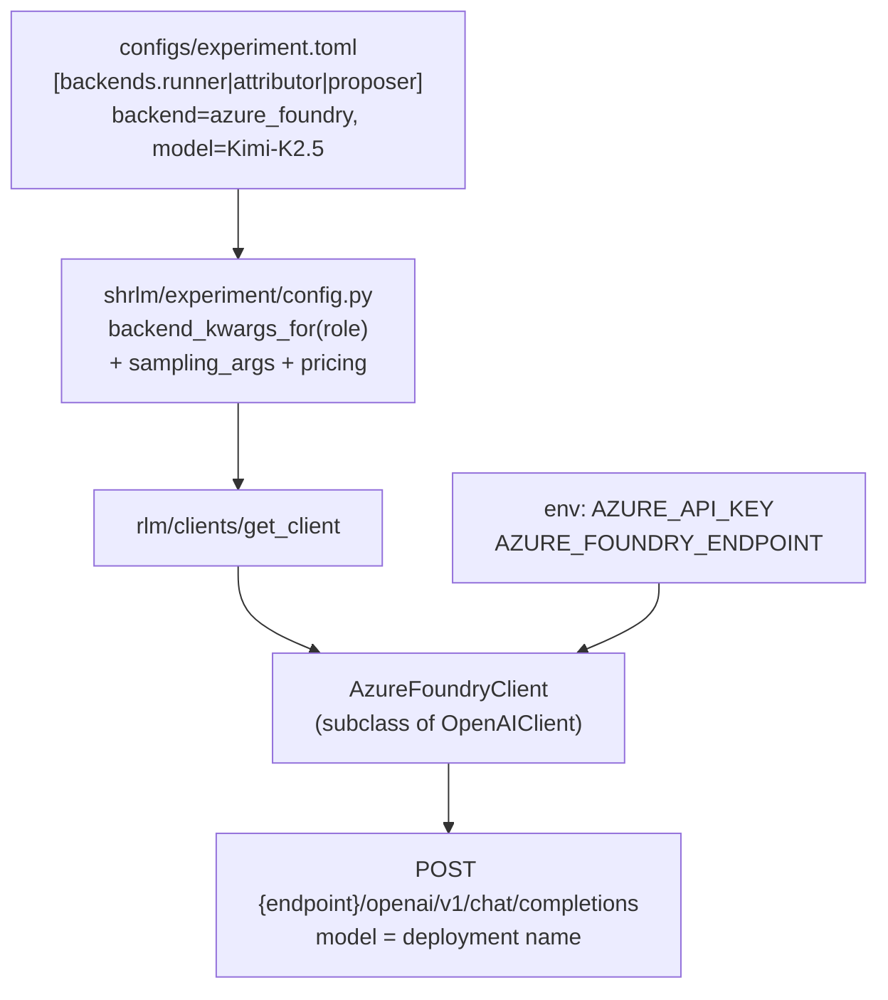
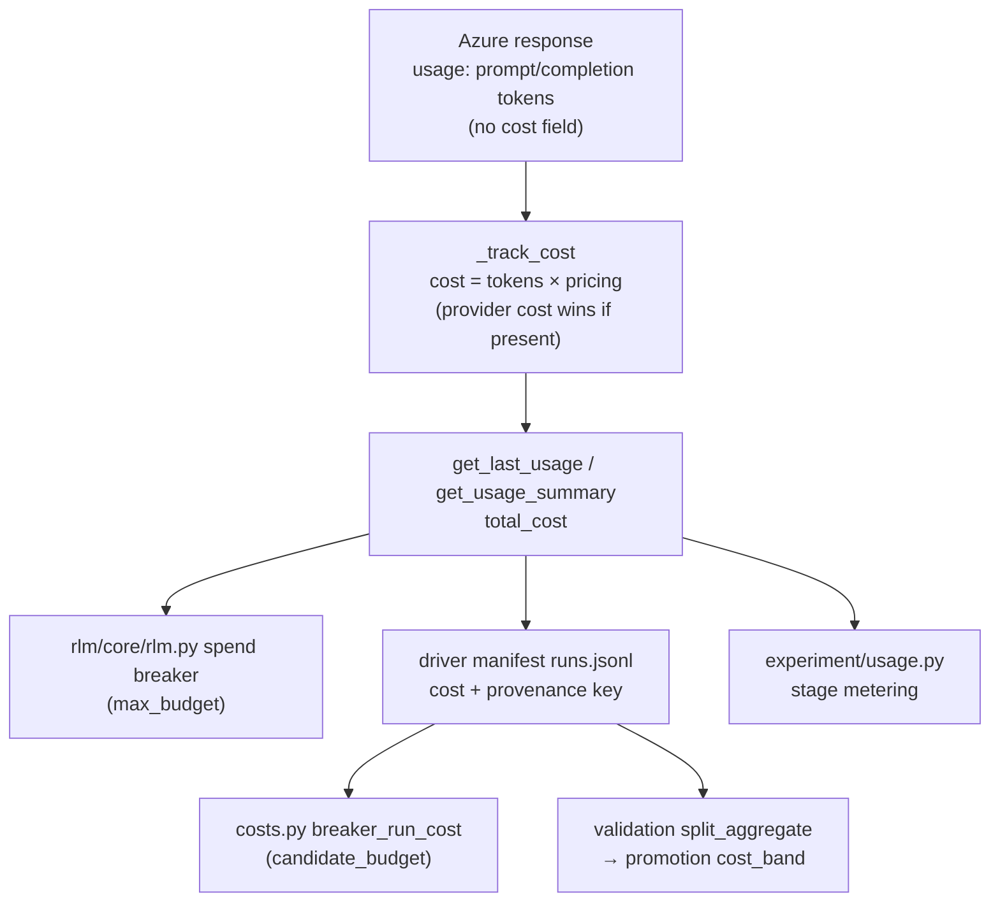

# Azure Foundry Kimi-K2.5 Provider Switch - Plan

## Goal Capsule

- **Objective:** The experiment loop (mining, validation, evaluation, attribution, proposal) runs end-to-end against Kimi-K2.5 served from Azure AI Foundry, with the spend breaker, candidate budget, and promotion cost band fully armed, proven by live smoke tests that call the real model.
- **Means:** A new `azure_foundry` client backend on the OpenAI-compatible `/openai/v1` route (KTD1, KTD2) with client-side cost synthesis from token counts × configured pricing (KTD3).
- **Authority hierarchy:** Experimental reproducibility and scientific honesty decide judgement calls (per `docs/plans/2026-08-18-1648-fix-analysis-reproducibility-plan.md`); the preregistered smoke contract in `shrlm/docs/plans/2026-08-12-001-feat-experiment-scaffold-plan.md` binds smoke design.
- **Stop conditions:** (a) the probe shows Azure responses missing the token counts cost synthesis needs, or rejecting the decoding arguments — stop and surface before building further units on the provider; (b) live smoke spend approaching the $5 ceiling; (c) any change that would weaken `IDENTITY_SECTIONS`, resume gates, or bytes the loop persists as experiment evidence.
- **Execution profile:** One unit at a time; offline mocked tests per unit; probe before any multi-call live smoke (probe ≈ $0.01).

---

## Product Contract

### Summary

Switch all three model roles (runner, attributor, proposer) from OpenRouter/Qwen3-30B to Kimi-K2.5 on Azure AI Foundry via a new `azure_foundry` backend, keep OpenRouter selectable, make cost governance provider-independent by synthesizing cost client-side, and prove the switch with opt-in live smoke tests that call the real model inside the experiment loop under a hard spend ceiling.

### Problem Frame

Qwen is not available via API where the project has credits. Azure and AWS are where credits exist; Kimi-K2.5 is available on Azure AI Foundry and is the user's chosen first target. The entire cost-governance stack (spend breaker, candidate budget circuit breaker, promotion cost band, manifest `cost` entries) currently depends on OpenRouter's per-response `usage.cost` field, which Azure does not provide — a naive backend swap would silently disarm the per-run budget (`rlm/core/rlm.py` treats `total_cost=None` as $0) while hard-crashing every governed round (`shrlm/optimization/costs.py` raises on cost-less non-terminated runs).

### Key Decisions

- **Kimi-K2.5 on Azure AI Foundry is the first replacement provider** (session-settled: user-directed — chosen over other OpenRouter-hosted models: user pre-vetted which models are available on both Azure and AWS where credits exist). Governs R1, R2.
- **Smoke proof must call the real LLM inside the experiment loop** (session-settled: user-directed — chosen over mock-only verification: the point is to prove the provider actually works end-to-end). Governs R10, R11.

### Requirements

**Provider switch**
- R1. All three roles (runner, attributor, proposer) run Kimi-K2.5 through a new `azure_foundry` backend, selected solely via `configs/experiment.toml` — scaffold code hardcodes no experiment parameter.
- R2. The backend targets the OpenAI-compatible `/openai/v1` route with the plain `openai.OpenAI` client — never the legacy `/models` (Azure AI Model Inference) route or the `azure-ai-inference` SDK, both retiring 2026-08-26.
- R3. Credentials and endpoint come from environment variables only (`AZURE_API_KEY`, `AZURE_FOUNDRY_ENDPOINT`); neither appears in `backend_kwargs`, which are serialized verbatim into persisted traces.
- R4. The `openrouter` backend remains selectable; its provider-routing config table becomes optional rather than mandatory.

**Cost governance**
- R5. When the provider returns no cost, the client synthesizes it from response token counts × configured per-million pricing, exposed through the same `total_cost` surfaces (`get_last_usage`, `get_usage_summary`) — so the spend breaker, candidate budget, cost band, manifest `cost` field, and stage usage metering work unchanged.
- R6. A cost-synthesizing backend with no pricing configured raises at client construction — never defaults to $0 (fail fast, fail loud).
- R7. Synthesized costs are distinguishable from provider-reported ones via an additive `cost_source` manifest key with exactly two values, `synthesized` and `provider`, carried from the client's usage summary into each `runs.jsonl` line; no existing persisted byte changes shape.

**Decoding**
- R8. Decoding defaults switch to the Kimi-K2.5 model-card instant-mode values, applied identically to root and sub-calls (section 3.0 invariant); sampling keys the model card does not specify are omitted from requests rather than sent blind.

**Smoke proof**
- R9. The $0 mock tier (`tests/experiment/test_smoke_mock.py`) stays green in CI with zero network.
- R10. An opt-in probe (one real call, ≈$0.01) verifies — before anything bigger runs — that responses carry the token counts synthesis needs, the client's synthesized cost is positive, the decoding arguments are accepted, and instant (non-thinking) mode is honored.
- R11. Opt-in live smoke exercises the real experiment loop on `azure_foundry`: a minimal driver round via pytest, and the generalized `examples/experiment_smoke.py --live`, asserting artifact structure and populated usage/cost records — never model behavior or promotion outcomes — under the $5 ceiling with budget arithmetic re-derived for Kimi pricing.
- R12. The identity-hash change from editing `[backends]` and `[decoding]` is accepted: existing experiment trees refuse resume by design; live smoke uses fresh out-dirs.

### Scope Boundaries

- In scope: the `azure_foundry` backend, config schema generalization, cost synthesis, decoding update, smoke generalization and new live tests, doc touch-ups for setup.
- Out of scope: AWS (Bedrock) support — next provider after Azure works; training configs under `training/`; changing promotion rules, caps semantics, or any experiment-design value beyond decoding and pricing.

#### Deferred to Follow-Up Work

- `examples/validation_live_smoke.py` generalization (second live entrypoint, same pattern as `experiment_smoke.py` — mechanical once U5 lands).
- AWS/Bedrock backend for the same model set.
- Re-deriving full-experiment cost projections in the paper/report prose for Kimi pricing (report tables update automatically from `[pricing]`; narrative estimates do not).

### Success Criteria

- `uv run pytest` passes with no network (mock tier).
- Probe passes against the real deployment; live pytest tier persists a driver round whose `runs.jsonl` lines carry positive synthesized costs.
- A budget-arithmetic check proves the full `--live` ceiling stays under $5 with Kimi prices before any live spend.

### Outstanding Questions

- **Blocking for live runs only, not for implementation:** the exact deployment name in the user's Foundry resource (config assumes the catalog default `Kimi-K2.5`; the `model` field must equal the deployment name) and the value of `AZURE_FOUNDRY_ENDPOINT` — both supplied by the user before the probe runs.
- **Deferred to probe:** whether the v1 route honors `extra_body={"chat_template_kwargs": {"thinking": false}}` for instant mode (UNCONFIRMED in Azure docs). Contingency in KTD6.
- **Prerequisite to any live spend:** verify the deployment's actual pricing against the Azure portal before the probe runs ($0.60/$3.00 per 1M in/out per catalog + aggregators, 2026-08, is the working assumption); the live tiers fail fast when the configured `[pricing]` rates differ from the verified figure, and `[pricing]` is refreshed again before the main run.

---

## Planning Contract

### Key Technical Decisions

- KTD1. **New `rlm/clients/azure_foundry.py` subclassing `OpenAIClient` — not extending `rlm/clients/azure_openai.py`.** `azure_openai.py` calls `chat.completions.create(model, messages)` only, silently dropping `sampling_args` — that breaks the section 3.0 decoding invariant. `OpenAIClient` already has the correct `_merge_extra_body` + `_normalize_sampling_args` path (`max_tokens` → `max_completion_tokens` rename included); the only genuinely new code is env resolution and cost synthesis.
- KTD2. **Endpoint = `AZURE_FOUNDRY_ENDPOINT` env var, composed to the `/openai/v1` base URL; auth = `AZURE_API_KEY` as bearer.** No `api-version` parameter (v1 uses implicit versioning). Env rather than config keeps the resource name out of the repo and out of `backend_kwargs`/traces (R3); the model deployment name in config carries the identity-relevant part. Missing env raises at construction.
- KTD3. **Cost synthesis lives in the client's `_track_cost`** (session-settled: user-approved — chosen over disabling budget enforcement: the spend breaker is the experiment's one hard cost guarantee). Pricing reaches the client via `backend_kwargs` nested under a single `pricing` key — nested because `_SENSITIVE_KWARG_FRAGMENTS` substring-matches top-level kwarg names and `"token"` would reject e.g. `input_per_million_tokens`; pricing is non-secret so persisting it in traces is fine. Provider-reported cost, when present, wins over synthesis. Client-side is the only insertion point that fixes all five downstream consumers at once (spend breaker, manifest, `breaker_run_cost`, `split_aggregate`/promotion, `snapshot_usage`).
- KTD4. **Pricing schema unchanged; both tiers repurposed.** `[pricing.promo]` and `[pricing.list_price]` are both set to the Azure Kimi-K2.5 rate ($0.60/$3.00 per 1M), with comments recording provenance. Synthesis reads `list_price`. Rejected alternative: restructuring `PricingConfig` to single-tier — ripples through `scenarios.py` and the report for no informational gain.
- KTD5. **Config schema generalizes provider tables.** `check_keys` for `[backends]` accepts the three role tables plus *optional* provider tables `openrouter` and `azure_foundry`; `BackendsConfig.openrouter` becomes optional (`None` when absent). `sampling_args()` injects OpenRouter provider routing only when a role actually uses the `openrouter` backend and the table is present; for `azure_foundry` it injects `chat_template_kwargs: {thinking: false}` from the new table's `thinking` flag. The `[backends.azure_foundry]` table stays in the identity hash like the rest of `[backends]`.
- KTD6. **Decoding = Kimi-K2.5 instant-mode card defaults** (session-settled: user-approved — chosen over keeping Qwen values: the Qwen numbers are that model's card defaults, not experiment-design constants): temperature 0.6, top_p 0.95. The section 3.0 invariant — the experiment-design rule that root and sub-calls receive identical decoding parameters, never silently dropped or partially applied; defined in the experiment draft's section 3.0 and restated in `configs/experiment.toml` `[decoding]` — is preserved; `top_k`/`min_p` become optional in `DecodingConfig` (`None` = omitted from `extra_body`) since the Kimi card specifies neither and the v1 route's handling of unknown body params is unconfirmed. `max_output_tokens` stays 4096. Contingency if the probe shows thinking cannot be disabled: surface to the user before proceeding — reasoning tokens change cost and behavior materially; do not silently strip `<think>` content.
- KTD7. **Identity-hash churn is accepted, not worked around.** `[backends]` and `[decoding]` are identity sections; old experiment dirs (e.g. `experiment_smoke/`) refusing resume is intended behavior — a provider switch is a new experiment. `IDENTITY_SECTIONS` is not weakened.
- KTD8. **Live gating:** pytest live tests use the repo's `skipif`-on-env pattern (`tests/clients/test_gemini.py` precedent) requiring `AZURE_API_KEY`, `AZURE_FOUNDRY_ENDPOINT`, and an explicit `SHRLM_RUN_LIVE=1` opt-in, and skipping whenever a `CI` environment variable is present — credential presence alone never spends; `examples/experiment_smoke.py` keeps its double opt-in (env key + explicit `--probe`/`--live` flag); CI never runs live tiers.
- KTD9. **OpenRouter stays selectable** (session-settled: user-approved — chosen over removing it: cheap to keep, preserves fallback and comparison runs). Config keeps it working; only the mandatory-table assumption is removed.

### High-Level Technical Design

Backend construction — how config and env compose into a client (per R1–R3):

Cost data path — where synthesis enters and who consumes it (per R5–R7):

### Assumptions

- The user's Foundry deployment keeps the default deployment name `Kimi-K2.5`; if renamed, only the config `model` values change.
- Kimi-K2.5 Global Standard quota defaults (400K TPM / 1K RPM) are sufficient for smoke scale; a 262K-token long-context call consumes most of a minute's quota, which is a throughput concern for full runs, not smoke.

---

## Implementation Units

### U1. `azure_foundry` client with synthesized cost

- **Goal:** A registered `azure_foundry` backend whose client hits the Foundry v1 route with full sampling-args fidelity and always reports a cost.
- **Requirements:** R2, R3, R5, R6 (KTD1, KTD2, KTD3).
- **Dependencies:** none.
- **Files:** `rlm/clients/azure_foundry.py` (new), `rlm/clients/__init__.py`, `rlm/core/types.py` (`ClientBackend` literal; additive optional `cost_source` field on `ModelUsageSummary`, omitted from `to_dict` when unset), `tests/clients/test_azure_foundry.py` (new).
- **Approach:**
  1. Subclass `OpenAIClient`; resolve `AZURE_API_KEY` and `AZURE_FOUNDRY_ENDPOINT` from env in the constructor, composing the `/openai/v1` base URL; raise a `ValueError` naming the missing variable otherwise. Validate the endpoint before client construction: `https` scheme and an approved Foundry host suffix (`.services.ai.azure.com` or `.openai.azure.com`), rejecting anything else so the bearer key can never be sent to an unintended host. Raised client errors name the env variable, never the composed base URL.
  2. Accept a `pricing` kwarg (`{"input_per_million": float, "output_per_million": float}`); validate at construction: both keys present and both values strictly positive — absence, a missing key, or a zero/negative value raises (R6; a zero rate would silently disarm the spend breaker).
  3. Override `_track_cost`: call the parent, then when no provider cost was found, synthesize `last_cost` from the just-recorded prompt/completion tokens × pricing and accumulate `model_costs`; set `cost_source` (`synthesized` or `provider`) on the per-call usage record (R7). Raise loudly when a response carries missing or invalid token counts, or a non-finite/negative provider cost — a paid call must never be counted as free.
  4. Treat a response with `finish_reason == "content_filter"` or empty content as a loud error, not a `None` return.
  5. Register in `get_client` (extend the error-message backend list) and add `"azure_foundry"` to `ClientBackend`.
- **Patterns to follow:** `rlm/clients/openai.py` (`_merge_extra_body`, `_normalize_sampling_args`, per-model usage dicts); AGENTS.md client requirements (BaseLM surface, env-only keys); `rlm/clients/azure_openai.py` env-default style for endpoint resolution only.
- **Test scenarios** (mocked OpenAI client; no network):
  - Happy path: a mocked response with 1000 prompt / 500 completion tokens and no cost field yields `last_cost == 1000×in/1e6 + 500×out/1e6`, matching `get_usage_summary().total_cost`, and `cost_source == "synthesized"`.
  - Provider-cost precedence: a mocked response carrying `usage.cost` uses it verbatim, no synthesis, `cost_source == "provider"`.
  - Missing `AZURE_API_KEY` or `AZURE_FOUNDRY_ENDPOINT` → `ValueError` naming the variable.
  - Endpoint validation: an `http://` endpoint or one outside the approved Foundry host suffixes → `ValueError` before any client is constructed.
  - Pricing validation: missing kwarg, missing key, or zero/negative value → `ValueError` at construction.
  - Fail-closed usage: a mocked response with absent or malformed token counts → loud error, never a $0 cost.
  - Error-message hygiene: a construction or completion error's message contains no endpoint host.
  - Sampling fidelity: `sampling_args` with temperature/top_p/max_tokens produce a create call carrying `max_completion_tokens` and the merged `extra_body`.
  - Error path: mocked `finish_reason == "content_filter"` → raises with a message naming content filtering.
- **Verification:** `uv run pytest tests/clients/test_azure_foundry.py` green offline; ruff clean.

### U2. Config schema: optional provider tables, Kimi decoding, Azure pricing

- **Goal:** `configs/experiment.toml` selects `azure_foundry`/`Kimi-K2.5` for all three roles; the loader validates the generalized schema; kwargs carry pricing and instant-mode routing.
- **Requirements:** R1, R4, R8 (KTD4, KTD5, KTD6); R12 follows automatically.
- **Dependencies:** U1.
- **Files:** `configs/experiment.toml`, `shrlm/experiment/config.py`, `tests/experiment/test_config.py`.
- **Approach:**
  1. TOML: three role tables → `backend = "azure_foundry"`, `model = "Kimi-K2.5"`; new `[backends.azure_foundry]` table with `thinking = false`; keep `[backends.openrouter]` as a commented example or present-but-unused; `[decoding]` → temperature 0.6, top_p 0.95, drop `top_k`/`min_p` lines; `[pricing.*]` → 0.60/3.00 with provenance comments.
  2. Loader: `BackendsConfig` gains optional `azure_foundry` config and optional `openrouter`; `check_keys` accepts role tables plus the known optional provider tables; `DecodingConfig.top_k`/`min_p` optional with omit-when-None semantics in `sampling_args()`.
  3. `sampling_args()` branches on the role's backend for provider-specific `extra_body` (OpenRouter routing vs `chat_template_kwargs`); the new role/backend parameter is required, not defaulted — its call sites outside this unit update in U3. `backend_kwargs_for` adds the nested `pricing` entry for cost-synthesizing backends.
- **Patterns to follow:** existing `build_section`/`check_keys` fail-fast style; `tests/experiment/test_config.py` string-surgery + `write_config` pattern; identity-hash tests via `dataclasses.replace`.
- **Test scenarios:**
  - Shipped config loads for both profiles; identity hash differs from the pre-change hash (assert it moved, not its value).
  - Absent `[backends.openrouter]` loads fine when no role uses openrouter; a role using `openrouter` with routing table present still injects `extra_body["provider"]`.
  - `azure_foundry` role kwargs carry nested `pricing` matching `[pricing.list_price]` and `extra_body["chat_template_kwargs"]["thinking"] is False`.
  - A role set to `openrouter` with no `[backends.openrouter]` table present: loading succeeds and `extra_body` carries no provider-routing block (the selectable-fallback promise, R4).
  - `top_k`/`min_p` absent from `extra_body` when unset; still routed when set.
  - Unknown key inside `[backends.azure_foundry]` → `ValueError` naming it.
  - Smoke profile still rejects non-scale keys (unchanged `SMOKE_SCALE_KEYS`).
- **Verification:** `uv run pytest tests/experiment/test_config.py` green; loading `full` and `smoke` profiles from the shipped TOML succeeds.

### U3. Backend credential gating and mock-tier updates

- **Goal:** Governed stages fail fast on missing Azure env vars before any spend; the $0 mock tier stays green with the new default backend.
- **Requirements:** R3, R9.
- **Dependencies:** U2.
- **Files:** `shrlm/optimization/driver.py`, `examples/experiment_smoke.py` (the `sampling_args` call sites only), `tests/experiment/test_smoke_mock.py`, `tests/optimization/test_driver.py` (only if its fixtures name a backend).
- **Approach:**
  1. Extend `_BACKEND_ENV_KEYS` so `azure_foundry` requires both `AZURE_API_KEY` and `AZURE_FOUNDRY_ENDPOINT` (value becomes a tuple; `_require_backend_credential` checks all).
  2. Update mock-smoke env stubs and the decline-message assertions that currently hardcode `OPENROUTER_API_KEY`.
  3. The driver's manifest writer copies `cost_source` from the completion's usage summary into each `runs.jsonl` line as an additive key (R7); lines from clients that report no source omit the key.
  4. Update the three role-less `sampling_args(config)` call sites in `examples/experiment_smoke.py` to pass the runner role — U2's signature change breaks them, and this unit's gate is the full offline pytest run.
- **Patterns to follow:** existing `_require_backend_credential` error wording; mock smoke's `ClientFactory` seam (`rlm.core.rlm.get_client` monkeypatch) — unchanged.
- **Test scenarios:**
  - Driver round with `backend="azure_foundry"` and one env var missing → fails fast naming the variable, zero runs persisted.
  - Full mock smoke passes offline with the network-block wrapper intact.
  - `backend_kwargs` containing a top-level key with a sensitive fragment still rejected (regression guard for the nested-pricing choice).
  - Manifest provenance: a mocked round persists `runs.jsonl` lines whose `cost_source` matches the client's reported value.
  - Credential-leak sentinels: with sentinel values in `AZURE_API_KEY` and `AZURE_FOUNDRY_ENDPOINT`, neither value appears in serialized `backend_kwargs`, persisted traces, or exception text from a failed round.
- **Verification:** `uv run pytest` fully green offline.

### U4. Live pytest tier: real-model client check and minimal experiment-loop round

- **Goal:** Cheap, repeatable pytest proof that the real Kimi-K2.5 deployment works inside the actual experiment machinery.
- **Requirements:** R10, R11 (KTD8); Covers the Key Decision governing R10/R11.
- **Dependencies:** U1, U2, U3.
- **Files:** `tests/clients/test_azure_foundry.py` (live section), `tests/experiment/test_smoke_live.py` (new).
- **Approach:**
  1. Client live test (one call, trivial prompt, low max tokens): asserts non-empty content, positive prompt/completion tokens, positive synthesized `total_cost`, no HTTP 400 from the decoding args, and — instant-mode check — **fails** on any reasoning signal: `<think>` markup in content, a non-empty `reasoning_content` or `model_extra` reasoning field, a nonzero reasoning-token count in usage details, or completion tokens grossly exceeding what the trivial prompt warrants. Any of these is the KTD6 contingency trigger, not a recordable observation. A second tiny-cap call (e.g. `max_tokens=16` on a verbose prompt) asserts `finish_reason == "length"` with completion tokens at or near the cap — proving the output cap is honored, not merely tolerated, before the budget arithmetic that assumes it is trusted.
  2. Loop live test: `run_round` (the mining driver) over 1–2 tiny synthetic instances (trivial prompts, not GraphWalks downloads), 1 attempt, tight caps (`max_budget` ≈ $0.05, few iterations) against the real backend; assert the round directory contract: `harness.json`, `instances.jsonl`, `runs.jsonl` lines carrying positive `cost`, token counts, and the cost-provenance key; verdicts present. Never assert pass/fail outcomes (structure, not behavior).
  3. Both `skipif` unless `AZURE_API_KEY`, `AZURE_FOUNDRY_ENDPOINT`, **and** an explicit `SHRLM_RUN_LIVE=1` opt-in are set, and always skipped when a `CI` environment variable is present — credential presence alone must never trigger spend (KTD8).
- **Patterns to follow:** `tests/clients/test_gemini.py` live gating; driver-round construction from `tests/optimization/test_driver.py` (real `RoundConfig` path, no monkeypatch).
- **Test scenarios:** the two live tests above, plus: rerunning the loop test with the same out_dir resumes from the manifest without re-spending (persist-first contract).
- **Execution note:** Run the client live test before the loop test; a single-call failure is the cheapest possible diagnosis of endpoint/deployment-name/auth problems.
- **Verification:** With env set, `uv run pytest tests/experiment/test_smoke_live.py tests/clients/test_azure_foundry.py` passes against the real service; without env, both skip.

### U5. Generalize `examples/experiment_smoke.py` probe and live tiers

- **Goal:** The preregistered two-tier smoke runs on the configured backend rather than assuming OpenRouter, with budget arithmetic re-derived for Kimi pricing.
- **Requirements:** R10, R11, R12 (KTD8).
- **Dependencies:** U2, U3; run only after U4's client live test has passed once.
- **Approach:**
  1. Gate on the configured backend's env keys via `_BACKEND_ENV_KEYS` instead of the hardcoded `OPENROUTER_API_KEY` check.
  2. `probe()`: assert the client's synthesized cost path (the raw-response `usage.cost` half becomes backend-conditional); assert sampling-arg acceptance and instant mode per R10 — failing, not recording, on any reasoning signal (same detector set as U4's client live test).
  3. `check_provider`: applies only when the backend is `openrouter`; for `azure_foundry` record endpoint host + deployment name in its place.
  4. Re-derive the ceiling arithmetic: `UNGOVERNED_CONTEXT_TOKENS`, per-call worst-case prices, and the `LIVE_*` caps recomputed for $0.60/$3.00 per 1M — output cost is ~10× the Qwen rate, so `check_budget_arithmetic` will likely force smaller live counts or caps; shrink counts rather than raising the $5 ceiling.
  5. Update `check_costs_present` wording off OpenRouter specifics.
  6. `--live` assertions cover all three roles: non-empty attribution and proposal artifacts plus positive stage usage records for the attributor and proposer, so a green run cannot leave "all three roles on Azure" as a config-only claim.
- **Files:** `examples/experiment_smoke.py`.
- **Patterns to follow:** the file's own docstring budget-proof convention (arithmetic proven before any spend); decline-path spends nothing.
- **Test scenarios** (static assertions already exercised by the mock tier plus):
  - `check_budget_arithmetic` with Kimi prices stays under $5.00 — computed statically in the mock tier, no network.
  - Decline path: no env keys → exits without spend, message names the Azure variables.
  - Probe against real service: synthesized cost > 0, decoding args accepted, thinking off.
- **Execution note:** Probe first (`--probe`), inspect, then `--live` in a fresh out-dir (R12 — old dirs refuse resume by identity hash, expected).
- **Verification:** Mock tier's static checks green in CI; `--probe` then `--live` complete against the real service with measured spend under the ceiling.

### U6. Setup documentation touch-up

- **Goal:** A newcomer can configure Azure env vars and run the smoke tiers without reading the plan.
- **Requirements:** R3, R10.
- **Dependencies:** U5.
- **Files:** `shrlm/docs/experiment-metrics.md` (env setup line), `README.md` (provider mention if it names OpenRouter/Qwen).
- **Approach:** Replace the `OPENROUTER_API_KEY` setup instruction with the two Azure variables and the probe-first workflow; note the deployment-name assumption.
- **Test scenarios:** Test expectation: none — documentation only.
- **Verification:** Docs name both env vars, the probe command, and the fresh-out-dir requirement.

---

## Verification Contract

| Gate | Command | Proves | Network / spend |
|---|---|---|---|
| Unit + mock smoke | `uv run pytest` | U1–U3, R5–R6, R8–R9 offline | none / $0 |
| Lint | `uv run ruff check --fix . && uv run ruff format .` | AGENTS.md style | none |
| Client live | env-gated pytest (U4) | R10 endpoint/auth/decoding/cost | 1 call / ~$0.01 |
| Loop live | env-gated pytest (U4) | R7, R11 driver round artifacts + costs | few calls / <$0.50 |
| Probe | `uv run python examples/experiment_smoke.py --probe` | R10 preregistered probe | 1 call / ~$0.01 |
| Full live smoke | `uv run python examples/experiment_smoke.py --live` (fresh out-dir) | R11–R12 whole loop | bounded / <$5 |

Quality gates: mock tier must never gain a network dependency; live tiers must never run in CI; budget arithmetic must be proven statically before `--live` spends. The $5 ceiling is cumulative across all live tiers — probe, client live, loop live, and full `--live` together — so the static proof reserves each earlier tier's worst case before `--live`'s allowance, rather than treating $5 as a per-tier bound.

---

## Definition of Done

- All six units landed; `uv run pytest` and ruff green offline.
- Probe and both live pytest tests pass against the real Kimi-K2.5 deployment; `runs.jsonl` from the live round shows positive synthesized costs with the provenance key.
- `--live` completes under the $5 ceiling in a fresh out-dir, or the recorded blocker names which stop condition fired.
- No abandoned-attempt code in the diff; `[backends.openrouter]` path still loads when selected.

---

## Risks & Dependencies

- **Instant mode unconfirmed (highest):** if Foundry ignores `chat_template_kwargs`, Kimi may emit reasoning (`<think>`/`reasoning_content`), changing cost and REPL-output parsing. The probe detects this before real spend; KTD6 contingency routes to the user.
- **Output pricing 10× Qwen:** $3.00/1M output re-prices every ceiling; U5's re-derived arithmetic is the guard. Full-experiment projections change materially (deferred follow-up).
- **Quota throughput:** 400K TPM default means one 262K-token long-context call per ~40s; fine for smoke, a real constraint for full runs (quota-increase request form exists; note in ops docs when it bites).
- **Content filtering:** Azure wraps all Foundry models; `finish_reason == "content_filter"` is a loud error per U1. GraphWalks/OOLONG content is benign, but the failure mode must be visible, not a silent `None`.
- **Deployment-name mismatch:** config `model` must equal the user's deployment name; the probe's single call surfaces this immediately.

## Sources & Research

- Foundry v1 endpoint, deprecations, auth: learn.microsoft.com/en-us/azure/foundry/foundry-models/concepts/endpoints; api-version lifecycle: learn.microsoft.com/en-us/azure/foundry/openai/api-version-lifecycle
- Kimi-K2.5 catalog entry, Global Standard availability, pricing: ai.azure.com/catalog/models/Kimi-K2.5; cloudprice.net/models/azure_ai/kimi-k2.5
- Kimi-K2.5 model card (decoding defaults, instant mode): huggingface.co/moonshotai/Kimi-K2.5
- Governing preregistration: `shrlm/docs/plans/2026-08-12-001-feat-experiment-scaffold-plan.md` (smoke tiers, $5 ceiling, probe-first, KTD3 identity doctrine, KTD9 assertion stance)
- Evidence-byte protection: `docs/plans/2026-08-18-1648-fix-analysis-reproducibility-plan.md`
- Cost-path anchors: `rlm/clients/openai.py` (`_track_cost`), `rlm/core/rlm.py` (spend breaker), `shrlm/optimization/costs.py` (`breaker_run_cost` raises on cost-less runs), `shrlm/optimization/driver.py` (`_BACKEND_ENV_KEYS`, sensitive-kwarg scan), `shrlm/experiment/config.py` (`IDENTITY_SECTIONS`, `sampling_args`, `check_keys`)

---

## Deferred / Open Questions

### From 2026-08-23 review

- **Endpoint changes can silently reuse an experiment identity** — KTD2 (endpoint and authentication from environment) (P1, adversarial + cross-model codex, confidence 75)

  Changing the endpoint environment variable can redirect a resumed experiment directory to a different Azure resource while the configuration identity stays unchanged — a different serving resource, quota, and billing context with no persisted distinction, weakening reproducibility evidence. A one-way fingerprint of the resolved endpoint in identity material (without storing the endpoint or key) would let resume refuse the mismatch; whether to adopt that identity-material change is an open design call.

- **Should the plan commit exact live counts and caps up front?** — U5 (generalize the smoke script's probe and live tiers) (P1, cross-model codex, confidence 75)

  Different implementers can shrink different dimensions (instance counts, caps, output limits) and both claim the live-smoke requirement is satisfied with materially different coverage. The static budget-arithmetic gate already blocks overspend; the open question is whether the plan should pin exact per-tier call counts and caps now or let the re-derivation own them at implementation.
