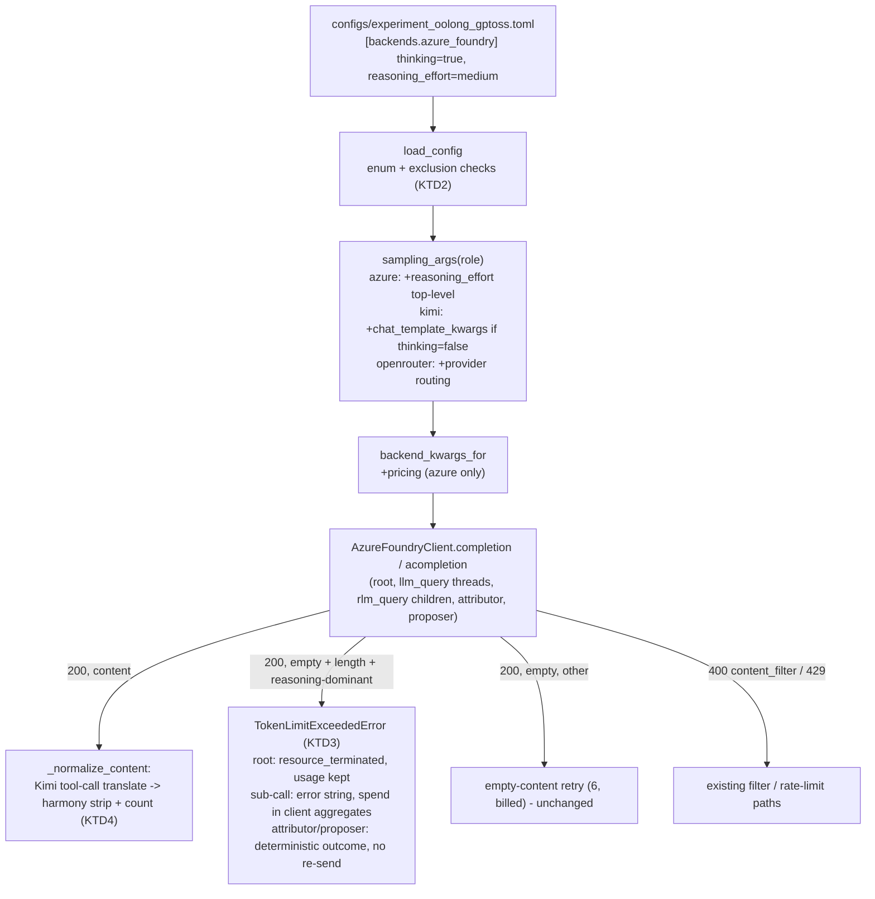
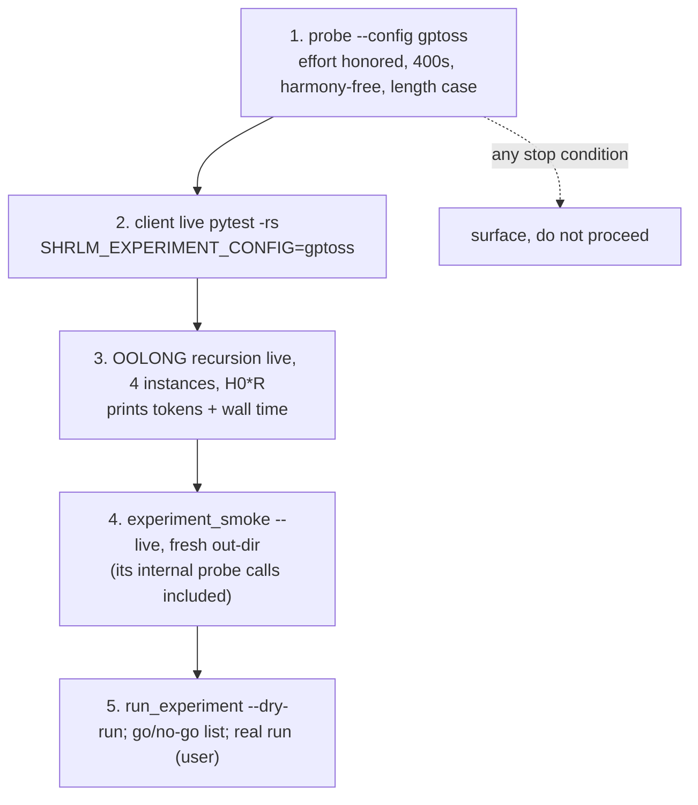

# OOLONG on Azure gpt-oss-120b - Plan

## Goal Capsule

- **Objective:** The OOLONG self-harness experiment can be run against Azure AI Foundry gpt-oss-120b with the same cost governance, identity rules, and live-gate discipline as the Kimi-K2.5 runs, while the Kimi-on-Azure and Qwen-on-OpenRouter configurations stay selectable and tested.
- **Means:** A per-model reasoning knob on the `azure_foundry` provider table, a cloned OOLONG config for gpt-oss, a provider-parametrized offline test matrix, and a probe-first live gate ladder that must pass before the real run (KTD1, KTD4, KTD7).
- **Authority hierarchy:** The preregistered smoke contract (`shrlm/docs/plans/2026-08-12-001-feat-experiment-scaffold-plan.md`, U8) and the provider-switch precedent (`docs/plans/2026-08-23-1550-feat-azure-foundry-kimi-k25-plan.md`, KTD7-KTD9) bind live-spend rules; this plan's Product Contract binds scope; the KTDs bind mechanism.
- **Stop conditions:** (a) the probe shows the configured `reasoning_effort` is rejected, `high` is indistinguishable from `low`, or reasoning leaks into `content`; stop and surface before any multi-call tier. (b) cumulative live spend approaching the $5 ceiling. (c) any change that weakens `IDENTITY_SECTIONS`, resume gates, or persisted-artifact bytes.
- **Execution profile:** One unit at a time; offline tests green per unit; the live ladder runs only after U1-U6 land; the real experiment is a separate, user-triggered step gated by the go/no-go list in Operational Notes.
- **Tail ownership:** The implementer owns the ladder run and its `-rs` evidence; the user owns starting the real experiment and its cron monitor.

---

## Product Contract

### Summary

Add gpt-oss-120b as a third tested provider row: a `reasoning_effort` knob in `[backends.azure_foundry]`, `configs/experiment_oolong_gptoss.toml`, client hardening for reasoning-model responses, a `ProviderCase` test matrix covering Kimi, gpt-oss, and Qwen, and a config-selectable live gate ladder.

### Problem Frame

The OOLONG experiment ran twice on Kimi-K2.5 (2026-08-29/30). Kimi's thinking mode costs $3.00/1M output and drove per-run budget kills, and the substrate bugs found there are now fixed. gpt-oss-120b on Azure costs $0.15/$0.60 per 1M and exposes reasoning through OpenAI-style `reasoning_effort`, not Kimi's `chat_template_kwargs.thinking`. The provider layer, the smoke probe, and the live pytest tiers are Kimi-shaped by name and behavior: the probe fails on any reasoning signal, `experiment_smoke.py` cannot load a non-default config, and the Azure live tiers gate on the shipped OpenRouter config. Switching models without generalizing those seams would either skip the gates silently or measure the wrong model.

### Key Decisions

- **Config `model` is the Foundry deployment name (`gpt-oss-120b`), not the `azureml://…/versions/4` registry URI.** (session-settled: user-approved — chosen over addressing the registry asset: the `/openai/v1` route addresses deployments.) Governs R1.
- **Kimi-on-Azure and Qwen-on-OpenRouter stay selectable and tested.** (session-settled: user-directed — chosen over a gpt-oss-only switch: fallback and comparison runs must keep working.) Governs R7, R8.
- **Caps stay identical to the Kimi OOLONG config.** (session-settled: user-approved — chosen over scaling caps down for the cheaper model: comparability across model runs.) Governs R2.
- **Decoding: temperature 0, top_p 1.0, `reasoning_effort = "medium"`, `max_output_tokens = 16384`.** (session-settled: user-directed — chosen over the gpt-oss card's temperature 1.0 and over keeping 8192: temperature 0 matches the Kimi run; a doubled output budget absorbs reasoning tokens at $0.60/1M.) Governs R2.

### Requirements

**Config and provider layer**

- R1. `configs/experiment_oolong_gptoss.toml` is a clone of `configs/experiment_oolong.toml` with all three roles on `azure_foundry` / `gpt-oss-120b`, `[pricing]` both tiers at $0.15 input / $0.60 output per 1M, and comments recording provenance.
- R2. The clone keeps `[caps]`, `[splits]`, `[loop]`, `[promotion]`, `[environments]`, and `[operational]` from the source config; `[decoding]` is temperature 0, top_p 1.0, `max_output_tokens = 16384`; `[backends.azure_foundry]` declares `thinking = true` and `reasoning_effort = "medium"`.
- R3. `[backends.azure_foundry]` accepts an optional `reasoning_effort` key restricted to `low`, `medium`, `high`, `none` (`none` is the Kimi route's instant switch, not a supported gpt-oss value); `sampling_args()` forwards it as a top-level request parameter for azure_foundry roles and never for openrouter roles.
- R4. `thinking = false` combined with a non-null `reasoning_effort` is refused at load time with a message naming both keys.
- R5. Adding `reasoning_effort` moves the identity hash of every existing config; the move is accepted and recorded in the dataclass docstring, and every shipped TOML still loads.

**Client behavior for reasoning models**

- R6. An `azure_foundry` response whose `content` is empty because reasoning consumed the output budget (`finish_reason == "length"` and reasoning tokens dominate `completion_tokens`, or no token detail is reported) terminates the call as a token-limit exceedance with its spend recorded, instead of being retried as a transient empty body — on every call surface: root, sub-calls, attributor, proposer.
- R6a. When `content` carries harmony channel structure, only the `final` channel's message body is kept (`analysis`/`commentary` bodies are dropped with their markers); bare control markers (`<|channel|>`, `<|message|>`, `<|call|>`, `<|return|>`, `<|start|>`, `<|end|>`, `<|constrain|>`) without channel structure are stripped. Dropped markers are counted on the client.

**Tests**

- R7. A shared provider matrix (`azure_kimi`, `azure_gptoss`, `openrouter_qwen`) drives the client, config, and offline live-round tests from one table; test bodies do not branch on provider name.
- R8. Every assertion that exists today for Kimi and Qwen still runs for its row after parametrization; the gpt-oss row adds `reasoning_effort` forwarding, reasoning-token accounting, harmony stripping, and the empty-content termination.
- R9. `pyproject.toml` registers a `live` marker, enables `--strict-markers`, and sets `xfail_strict = true`.

**Live gates**

- R10. `examples/experiment_smoke.py` accepts `--config <path>` and derives its probe expectations from that config (reasoning expected when `reasoning_effort` is set and not `none`; forbidden otherwise).
- R11. The gpt-oss probe proves `reasoning_effort` is honored (`high` yields more reasoning or completion tokens than `low`), that `content` is free of harmony markers and `<think>`, that usage carries token counts, and that a 16-token budget yields `finish_reason == "length"` with empty content. The `none`, `xhigh`, and `chat_template_kwargs` calls are recorded in `probe.json` as informational outcomes, never gates: harmony defines only low/medium/high, and the route's handling of unknown keys for gpt-oss is unverified.
- R12. The Azure live pytest tiers select their config through `SHRLM_EXPERIMENT_CONFIG` and read the harness from that config's registry name, so they run gpt-oss when pointed at the new config and Kimi when pointed at the old one.
- R13. The ladder — probe, client live, OOLONG recursion live (4 instances, H0*R), smoke `--live` in a fresh out-dir — runs under `SHRLM_RUN_LIVE=1`, `SHRLM_VERIFIED_PRICING='0.15/0.6'`, never in CI, within the cumulative $5 ceiling, and each pytest tier's `-rs` output shows the `azure_gptoss` rows passed, not skipped.

### Success Criteria

- `uv run pytest` offline: no new failures beyond the 14 pre-existing ones recorded in memory; collection lists all three provider ids.
- The ladder's spend total, printed by the smoke script, is under $5, and `run_experiment.py --dry-run --config configs/experiment_oolong_gptoss.toml` prints the identity hash, `gpt-oss-120b @ 0.15/0.6` per role, and the probe verdict.
- Every go/no-go criterion in Operational Notes is met before the real run starts.

### Scope Boundaries

- Harness prompts (`H0*R`), environments, and the promotion rule are unchanged.
- The 14 pre-existing suite failures (`test_report`, smoke guards, driver prompt persistence, loader fixtures) are not addressed.
- Relaxing the Azure content filter is a portal action, not code.

#### Deferred to Follow-Up Work

- Attributor/proposer JSON extraction accepting prose before the fence (`shrlm/optimization/attribution.py`, `proposal.py` first-brace fallback) — a role-level "starts with fence or `{`" check is a separate change.
- `rlm_query` at max depth builds a fresh client and folds no usage on error (`rlm/core/rlm.py` max-depth branch); a reasoning exhaustion there is spend the run does not account for. Pre-existing lower-bound gap; record, do not fix here.
- Persisting the harmony-marker count into traces (`get_last_usage` / `UsageSummary`); this plan keeps it process-local and relies on the raw-content probe.
- `rlm/utils/token_utils.py` explicit `gpt-oss` context entry (default 128K already matches).
- Per-test spend recording via `record_property` in the live tiers.

### Outstanding Questions

- Deferred: the $0.15/$0.60 rate is confirmed only by third-party trackers; the operator verifies it in the portal before exporting `SHRLM_VERIFIED_PRICING`, which is the existing gate.
- Deferred: whether Azure reports `completion_tokens_details.reasoning_tokens` for gpt-oss chat completions is undocumented; the probe records it, and R6 falls back to `finish_reason == "length"` with empty content when the detail block is absent.

---

## Planning Contract

### Key Technical Decisions

- KTD1. **`reasoning_effort` rides `sampling_args` top-level, not `extra_body`.** `rlm/clients/openai.py::_normalize_sampling_args` forwards every non-null key to `chat.completions.create`, and SDK 2.14.0 accepts `reasoning_effort` as a first-class parameter. No client change is needed for the request; the config layer emits it only for azure_foundry roles and only when set. `extra_body.chat_template_kwargs` stays Kimi's instant-mode switch. The string `"none"` is forwarded as-is (it is the route's documented instant switch for Kimi).
- KTD2. **`AzureFoundryConfig.reasoning_effort: str | None = None`, validated at load.** `build_section` rejects unknown keys and requires only non-defaulted fields, so existing configs load unchanged. Load-time checks: enum `{low, medium, high, none}`; `thinking = false` with a set effort is an error (R4). The field enters the identity hash via `asdict` (R5); the move is accepted as it was for `LoopConfig.initial_harness` (`shrlm/experiment/config.py` docstring precedent).
- KTD3. **Reasoning-exhausted empty content maps to `TokenLimitExceededError`, on every role path.** A pure helper on `AzureFoundryClient` classifies a response as reasoning-exhausted when `finish_reason == "length"`, content is empty, and either `completion_tokens_details.reasoning_tokens >= 0.9 × completion_tokens` or the detail block is absent. `_empty_content_retry_reason` returns no retry for it; `_validate_response` raises `TokenLimitExceededError(tokens_used=completion_tokens, token_limit=sampling_args["max_tokens"])` with a message that names reasoning exhaustion so the audit can tell it from the RLM's own iteration cap. Spend is recorded first (`_track_cost` order unchanged). Because the attributor and proposer retry loops classify any non-`NON_TRANSPORT_ERRORS` exception as transient (`attribution.py::_completion_with_retry`, `proposal.py`), the same class must be treated as deterministic there — a parallel of the existing `AttributionContentFiltered` outcome — or a temperature-0 exhaustion is billed three times and then routed to the re-invocation gate (attribution) or escapes the orchestrator (proposal). Rejected alternative: keeping the six billed retries — the Kimi "transient empty body" rationale does not hold for a deterministic budget exhaustion.
- KTD4. **Harmony markers are stripped in `_normalize_content`, counted, never raised.** Raising would escape `execute_run` as a non-limit exception and take the experiment down; stripping keeps the answer text. The pass runs after `translate_native_tool_calls` (Kimi) and applies on both `completion` and `acompletion`, so root, batched sub-calls, children, attributor, and proposer all receive stripped text. The counter is process-local (incremented under `_cost_lock`); the probe and client-live tests read raw `chat.completions.create` output on purpose so a leak fails there instead of being repaired silently.
- KTD5. **Provider matrix = `ProviderCase` table in `tests/conftest.py` with `pytest_generate_tests` on the `provider` fixture name.** Rows carry backend, model, env keys, config-text builder, `make_client` callable, expected and forbidden sampling keys, expected `cost_source`, `config_path`, and a fresh-`SimpleNamespace` response factory with optional `reasoning_content` and `completion_tokens_details`. Provider-specific divergence lives in row fields or a `pytest.mark.xfail(strict=True)` attached in `pytest_collection_modifyitems`, never in test bodies. No existing fixture or argname is called `provider`. Sequencing: the two-row table lands first (suite green, ids change), gpt-oss row last.
- KTD6. **Probe expectations derive from the config, not from a provider name.** `experiment_smoke.py` computes `expects_reasoning = reasoning_effort not in (None, "none")` from the loaded `[backends.azure_foundry]`; `check_probe_reasoning(payload, expectation=<no reasoning>)` keeps today's behavior by default and inverts its checks when reasoning is expected; it always forbids `<think>` and harmony markers in `content`. `--config` is threaded through `live_config()`; budget arithmetic already reads `pricing.list_price` and `max_output_tokens`, so it re-prices itself.
- KTD7. **Live pytest tiers read `SHRLM_EXPERIMENT_CONFIG`.** A helper `live_config_path(default)` in `shrlm/experiment/live_gates.py` returns the env path when set and otherwise the caller's own current default (`CONFIG_PATH` for client-live, smoke-live and the smoke script; `OOLONG_CONFIG` and `KIMI_CONFIG` for the two recursion modules), so behavior is unchanged when unset — one global default would make the recursion modules load the Qwen smoke profile and fail at client construction. Every live load site uses it — five, listed in System-Wide Impact — and `live_skip_reason` receives that config so the pricing attestation compares against its rate card. The recursion live tests resolve the harness via `HARNESSES[config.loop.initial_harness]` instead of asserting a name. The provider-parametrized live client class loads only the env-selected config; a `provider` row whose backend/model do not match that config's runner skips with a reason naming the mismatch, so `-rs` shows exactly one `PASSED` row per test; a row's `config_path` serves offline tests only.
- KTD8. **Ladder evidence is `-rs` output plus printed numbers, not green-ness.** Each pytest tier is run with `-rs`; a skipped `azure_gptoss` row fails the step. The recursion tier prints per-run `output_tokens`, `input_tokens`, and wall time so the go/no-go thresholds in Operational Notes are observable. Rejected alternative: a session-scoped probe fixture that raises `pytest.skip` — pytest re-runs a skipping fixture per test and would re-spend.

### High-Level Technical Design

### System-Wide Impact

- **Four call surfaces share the client class.** One `AzureFoundryClient` per RLM serves the root loop and every `llm_query` handler thread; `rlm_query` children build their own from the same `backend_kwargs`; the attributor and proposer are built through the same `get_client(...)` path (`shrlm/experiment/orchestrator.py`). KTD3 and KTD4 therefore change behavior on all four at once.
- **`TokenLimitExceededError` propagates differently per surface.** Root: caught by `execute_run` as a limit (`driver.ROOT_LIMIT_EXCEPTIONS`), persisted `resource_terminated` with the usage the client banked before raising. `llm_query`: `lm_handler.handle` converts it to an error string for the model; spend stays in the client aggregates the iteration check reads, but the call is absent from the trace's llm-call list. `rlm_query` child: the parent folds `_terminated_child_usage`. `rlm_query` at max depth: fresh client, empty usage, no fold (deferred gap). Attributor/proposer: see KTD3 — without the deterministic classification the failure is re-sent and then either gated or fatal.
- **Identity blast radius.** `identity_hash` covers `asdict(backends)`; the new field moves the hash of all four shipped TOMLs (`configs/experiment.toml` carries the azure table too). `experiment_oolong_b1` (`c2cd7108…`) and `experiment_oolong_r` (`b621f0a5…`) refuse resume after U1; both are finished. No test or fixture pins a literal hash; the report fixture uses a dummy.
- **Persisted bytes.** Only gpt-oss traces gain `run_metadata.backend_kwargs.sampling_args.reasoning_effort` (key omitted when null); manifests are unchanged; `check_sampling_args` and `reject_sensitive_backend_kwargs` accept the key without change. The marker counter is not persisted (deferred).
- **Bypass paths.** `experiment_smoke.raw_completion` and the client-live `_raw_live_completion` call `chat.completions.create` directly and see unstripped content — the intended place for the marker-forbidding assertions.
- **Live-gate load sites (five).** `live_gates.live_skip_reason` default config; `tests/clients/test_azure_foundry.py` (`_azure_live_skip`, `_live_runner_kwargs`); `tests/experiment/test_smoke_live.py` gate; `tests/experiment/test_recursion_live.py` and `test_oolong_recursion_live.py` (both assert a harness name today); `examples/experiment_smoke.live_config`. Under `reasoning_effort`, the existing 16-token "cap honored" client-live test exercises KTD3 and must expect `TokenLimitExceededError` with recorded cost rather than truncated content.

### Assumptions

- The Foundry deployment is named `gpt-oss-120b` and is the Azure-sold model (not the Fireworks `FW-GPT-OSS-120B` listing).
- Azure returns gpt-oss reasoning in `message.reasoning_content` (Microsoft's own v1 sample reads it there); the harness never reads that field, so a different name only affects the probe's informational record.
- Default Global Standard quota for gpt-oss-120b (5M TPM / 5K RPM) exceeds Kimi's; `validation_run_workers = 1` is kept from the source config and re-chosen from the recursion tier's measured latency before the real run.

---

## Implementation Units

Sequencing: U4 (two-row table) → U1 → U3 → U2 → U4 (gpt-oss row) → U5 → U6 → U7. U1 and U3 are independent of each other.

### U1. `reasoning_effort` on the azure_foundry provider table

- **Goal:** Config can declare a per-model reasoning effort that reaches the request, with Kimi's `thinking` behavior unchanged.
- **Requirements:** R3, R4, R5. Cites KTD1, KTD2.
- **Dependencies:** none.
- **Files:** `shrlm/experiment/config.py` (`AzureFoundryConfig`, `load_config` validation, `sampling_args`, module docstring and absent-table error text), `tests/experiment/test_config.py`.
- **Approach:**
  1. Add `reasoning_effort: str | None = None` with a docstring recording the identity-hash move and the Kimi/gpt-oss split.
  2. In `load_config`, after `build_section`: reject values outside the enum; reject `thinking is False and reasoning_effort is not None`.
  3. In `sampling_args`, for azure roles: keep the `chat_template_kwargs` branch; add `args["reasoning_effort"] = value` when set.
  4. Generalize the absent-table error text to name both knobs.
  5. Do not add a `reasoning_effort` line to `configs/experiment.toml` or `experiment_ox.toml`, and keep `\nthinking = false\n` as the last line of the shipped azure table: `test_config.py` helpers (`azure_role_text`, `drop_optional_decoding_knobs`, the unknown-key test, `_with_initial_harness`) are exact-string anchors on that file.
  6. Add a `with_azure_table(text, *, thinking, reasoning_effort)` helper next to `azure_role_text`; rename the unknown-key test's bogus key so it no longer shares the `reasoning` prefix with a valid key.
- **Patterns to follow:** `tests/experiment/test_config.py` text-surgery helpers; `test_identity_hash_changes_with_behavior_changing_values` (`dataclasses.replace` variants) for the identity check; the `LoopConfig.initial_harness` docstring for the identity-move note.
- **Test scenarios:**
  - `thinking = true`, `reasoning_effort = "medium"`: loads; `sampling_args("runner")["reasoning_effort"] == "medium"`; `extra_body` carries no `chat_template_kwargs`.
  - `thinking = true`, no effort: neither `reasoning_effort` nor `chat_template_kwargs` emitted (current `experiment_kimiK25.toml` behavior).
  - `thinking = false`, no effort: `extra_body["chat_template_kwargs"] == {"thinking": False}` and `reasoning_effort` absent (existing behavior preserved).
  - `thinking = false` with `reasoning_effort = "low"` raises `ValueError` naming both keys.
  - `reasoning_effort = "xhigh"` raises `ValueError` listing the allowed values.
  - OpenRouter roles never carry `reasoning_effort` even when the azure table sets it.
  - Every shipped TOML (`experiment.toml`, `experiment_kimiK25.toml`, `experiment_ox.toml`, `experiment_oolong.toml`) loads in both profiles (parametrized).
  - Identity: the `replace(..., reasoning_effort="high")` variant hashes differently; explicit `None` hashes identically to absent.
- **Verification:** `uv run pytest tests/experiment/test_config.py` green; `run_experiment.py --dry-run` against each shipped TOML prints a hash.

### U2. `configs/experiment_oolong_gptoss.toml`

- **Goal:** The gpt-oss OOLONG config exists, loads, and documents its provenance.
- **Requirements:** R1, R2. Cites the Key Decisions on deployment name, caps, and decoding.
- **Dependencies:** U1.
- **Files:** `configs/experiment_oolong_gptoss.toml` (new), `tests/experiment/test_config.py`.
- **Approach:** Copy `configs/experiment_oolong.toml`; change the three role tables' `model`, `[decoding]` (temperature 0, top_p 1.0, max_output_tokens 16384), `[pricing]` both tiers 0.15/0.60, `[backends.azure_foundry]` (`thinking = true`, `reasoning_effort = "medium"`); keep `initial_harness = "H0*R"`, `candidate_budget = 100.0`, `validation_run_workers = 1`; rewrite the Kimi-specific comment blocks to gpt-oss facts (harmony default effort, 131K context, quota, where reasoning lands, the ladder command sequence); keep `[smoke]` overrides inside the smoke-overridable key set.
- **Patterns to follow:** `test_config.py::test_kimi_config_starts_from_h0_star` for a per-config load test.
- **Test scenarios:**
  - Loading `full` and `smoke` profiles succeeds; runner/attributor/proposer are `azure_foundry` / `gpt-oss-120b`.
  - `backend_kwargs_for(config, role)["pricing"] == {"input_per_million": 0.15, "output_per_million": 0.60}` for every role.
  - `sampling_args` carries `temperature == 0`, `top_p == 1.0`, `max_tokens == 16384`, `reasoning_effort == "medium"`.
  - `identity_hash` differs from `configs/experiment_oolong.toml`'s.
- **Verification:** `uv run python examples/run_experiment.py --dry-run --config configs/experiment_oolong_gptoss.toml --out-dir /tmp/x` prints identity and `gpt-oss-120b` per role.

### U3. Client and role hardening for reasoning-model responses

- **Goal:** Reasoning-exhausted responses terminate once with spend recorded on every call surface, and harmony markers never reach the REPL parser.
- **Requirements:** R6, R6a. Cites KTD3, KTD4.
- **Dependencies:** none (parallel with U1).
- **Files:** `rlm/clients/azure_foundry.py`, `shrlm/optimization/attribution.py`, `shrlm/optimization/proposal.py`, `shrlm/optimization/mining.py` (outcome routing, mirroring the content-filtered branch), `shrlm/optimization/types.py` (new `AttributionErrorKind` member), `shrlm/optimization/audit.py` (attempts-audit exemption for the new kind), `shrlm/optimization/bundle.py` (non-transport routing), `tests/clients/test_azure_foundry.py`, `tests/optimization/test_attribution.py`, `tests/optimization/test_proposal.py`, `tests/optimization/test_audit.py`.
- **Approach:**
  1. Pure helper `_reasoning_exhausted(response) -> bool` (no instance flag; the client is shared across threads) reading `usage.completion_tokens_details.reasoning_tokens` defensively.
  2. `_empty_content_retry_reason` returns `None` when the helper is true; `_validate_response` raises `TokenLimitExceededError` with `token_limit = self.sampling_args.get("max_tokens")` (fallback to `completion_tokens` when unset) and a message naming reasoning exhaustion; other paths unchanged.
  3. `_normalize_content`: after `translate_native_tool_calls`, if channel structure is present keep only the `final` channel body and drop other channels' bodies with their markers; otherwise strip bare control tokens; count dropped markers under `_cost_lock`.
  4. Attribution and proposal: classify `TokenLimitExceededError` as deterministic in `_completion_with_retry` — no re-send. Attribution surfaces it as a recorded outcome parallel to `AttributionContentFiltered` (mining routes it like the content-filtered branch, not to the re-invocation gate). Proposal raises a deterministic budget-exhausted exception (parallel to the attribution one) immediately with the attempts so far — not a rejected attempt, which `propose_round` treats as a re-send — and the orchestrator's proposal stage records it as a stage failure with zero candidates instead of re-asking.
- **Patterns to follow:** spend-first ordering in `_track_cost`; `translate_native_tool_calls` docstring style; `ScriptedCreate` in `tests/clients/test_openai_transport.py` for per-call scripted responses (retries call `time.sleep`; monkeypatch it); `TestNativeToolCallTranslation` for the pure-function + round-trip test shape; `mining.py`'s `AttributionContentFiltered` handling.
- **Test scenarios:**
  - `_make_response` gains `reasoning_tokens: int | None`; emits `completion_tokens_details` only when set.
  - Empty content, `finish_reason="length"`, `reasoning_tokens == completion_tokens`: no retry; `TokenLimitExceededError` raised; `model_costs` already incremented by the synthesized cost; message contains "reasoning".
  - Empty content, `finish_reason="length"`, no details: same termination.
  - Empty content, `finish_reason="stop"`: still retried up to `EMPTY_CONTENT_ATTEMPTS` then `RuntimeError` (Kimi behavior preserved).
  - Content `"<|channel|>final<|message|>42<|return|>"` returns `"42"`; counter reads 3; same through `acompletion`.
  - Content `"<|channel|>analysis<|message|>think think<|end|><|start|>assistant<|channel|>final<|message|>42<|return|>"` returns `"42"` with the analysis body dropped; counter reflects every dropped marker.
  - Kimi `<|tool_call_begin|>` content still becomes a fenced `repl` block, then harmony stripping applies (ordering).
  - Plain content is byte-identical after normalization.
  - Concurrency: `TestThreadSafety` shape with mixed harmony/plain responses; counter equals the exact marker total.
  - Attribution: a client raising `TokenLimitExceededError` yields one call (no re-send), a recorded non-transport outcome, and the round-close gate does not hold the bundle.
  - Proposal: the same exception is raised once as the deterministic budget-exhausted outcome (no re-ask); the proposal stage records zero candidates and the orchestrator continues.
  - Audit: a mining record carrying the new error kind passes the attempts audit without attempts.
  - Root path proof is existing: `RaisingLM(TokenLimitExceededError)` through `execute_run` is covered by `test_termination_accounting.py` / `test_driver.py` terminated-line tests; cite, do not duplicate.
- **Verification:** `uv run pytest tests/clients/test_azure_foundry.py tests/optimization/test_attribution.py tests/optimization/test_proposal.py tests/optimization/test_mining.py` green.

### U4. Provider test matrix

- **Goal:** Client, config, and offline live-round tests run once per provider row from a single table, with Kimi and Qwen coverage intact.
- **Requirements:** R7, R8, R9. Cites KTD5.
- **Dependencies:** none for the two-row table; U1, U2, and U3 for the `azure_gptoss` row (its `config_path` names the U2 file).
- **Files:** `tests/conftest.py` (new), `tests/clients/test_azure_foundry.py`, `tests/clients/test_openai_transport.py` (fake builders / `make_client` reuse), `tests/experiment/test_config.py`, `tests/experiment/test_smoke_live.py` (offline `TestLiveRoundConstructionOffline` class), `pyproject.toml`.
- **Approach:**
  1. Define `ProviderCase` (frozen dataclass): `id`, `backend`, `model`, `env_keys`, `pricing`, `role_table_text(role)`, `make_client`, `expected_sampling_keys`, `forbidden_sampling_keys`, `expected_extra_body`, `cost_source`, `response(**overrides)` factory, `config_path`.
  2. `pytest_generate_tests` parametrizes any test requesting `provider`; ids equal row ids.
  3. Keep `azure_role_text` as a thin wrapper over the Kimi row so `drop_table`/`write_config` call sites are untouched; add `all_roles_text(provider)`.
  4. Generalize `TestSamplingArgsFidelity` to assert `expected_sampling_keys ⊆ create kwargs`, `forbidden ∩ kwargs == ∅`, and `extra_body` equality per row; the Qwen row uses the OpenRouter `make_client` from `test_openai_transport.py`.
  5. Provider-parametrize the offline live-round construction test in `test_smoke_live.py` (env stubs, `ClientFactory` cost source, `backend_kwargs` keys); do not parametrize the module-scoped `smoke` pipeline fixture in `test_smoke_mock.py`.
  6. `pyproject.toml`: `markers = ["live: ..."]`, `addopts = "--strict-markers"`, `xfail_strict = true` (no custom marks exist today, so nothing breaks).
  7. Land 1-6 with the Kimi and Qwen rows; add the `azure_gptoss` row after U1 and U3.
- **Execution note:** Prove the refactor first — with two rows the suite must be green, `--collect-only` must list both ids, and this coverage-invariant set must still pass: `test_azure_surgered_sampling_args_carry_instant_mode_and_omit_absent_knobs`, `test_azure_surgered_backend_kwargs_carry_list_price_pricing`, `test_shipped_sampling_args_route_qwen_knobs_and_omit_provider`, `test_shipped_openrouter_backend_kwargs_omit_pricing`, `test_openrouter_role_with_provider_order_injects_provider`, and the `chat_template_kwargs` assertion in `test_smoke_live.py`'s offline class.
- **Patterns to follow:** `SimpleNamespace` fakes (not `MagicMock`); `pytest.param(..., id=...)`; existing `_make_client` monkeypatch seam.
- **Test scenarios:**
  - `--collect-only` shows `[azure_kimi]`, `[azure_gptoss]`, `[openrouter_qwen]` ids for the sampling-fidelity test.
  - Kimi row: `chat_template_kwargs` present when `thinking=false`, `reasoning_effort` absent; cost source `synthesized`; pricing required at construction.
  - gpt-oss row: `reasoning_effort` present top-level, `chat_template_kwargs` absent, `max_completion_tokens == 16384`; cost source `synthesized`.
  - Qwen row: no `pricing` kwarg, no `reasoning_effort`, provider routing only when `provider_order` is non-empty; cost source `provider`.
  - Response factory: gpt-oss row yields `reasoning_content` and `completion_tokens_details`; other rows yield neither; each call returns a new object.
  - A guard test greps test bodies for `if provider.id` and fails on a hit.
- **Verification:** `uv run pytest tests/clients tests/experiment/test_config.py tests/experiment/test_smoke_live.py` green offline; the coverage-invariant set passes.

### U5. Smoke script: `--config` and config-derived probe

- **Goal:** The preregistered probe and live tiers run against any config and prove gpt-oss's reasoning contract before spending more.
- **Requirements:** R10, R11. Cites KTD6.
- **Dependencies:** U1, U2, U3.
- **Files:** `examples/experiment_smoke.py`, `examples/run_experiment.py` (preflight print of `model @ in/out` and probe verdict), `tests/experiment/test_smoke_mock.py`, `tests/clients/test_azure_foundry.py` (the `check_probe_reasoning` call site keeps working through the default argument).
- **Approach:**
  1. Add `--config` (default `CONFIG_PATH`); `live_config(path)` loads its smoke profile; env gating and attestation use that config.
  2. Derive `ProbeExpectation` from the config: `expects_reasoning`, `effort`, `max_output_tokens`.
  3. `check_probe_reasoning(payload, expectation=<no reasoning>)`: default reproduces today's checks; when reasoning is expected, require a reasoning signal (field or token detail), forbid `<think>` and harmony markers in `content`, and replace the 64-token ceiling with `completion_tokens <= max_output_tokens`.
  4. gpt-oss probe sequence (one call each): configured effort; `low` and `high` on the same hard prompt used for the 16-token case; `max_completion_tokens=16` on that prompt expecting `length` and empty content (billed; assert usage present); then informational calls `none`, `xhigh`, and `extra_body.chat_template_kwargs` whose status codes and token counts are recorded, not asserted. Hard gates: `high > low` on reasoning tokens when details are reported, otherwise on `completion_tokens` (record the branch; equality is "inconclusive" — rerun once, then surface); no harmony markers or `<think>` in any `content`; the `length` case.
  5. Persist the probe payloads and verdict to `<out-dir>/probe.json`; `run_experiment.py` gains `--probe-json <path>` (default `<out-dir>/probe.json`) and `--dry-run` prints the verdict from that file when present, plus `model @ in/out` per role. The ladder writes the probe under the smoke out-dir and passes that path explicitly in step 5.
  6. Update the docstring arithmetic for $0.15/$0.60 and `max_output_tokens = 16384` (the functions already re-price); the `stub_live_stages` probe stub must stay accepted (`sampling_args: {}`, new keys optional).
- **Patterns to follow:** the existing `probe()` structure and `SmokeError` wording; `run_experiment.py` argparse for `--config`.
- **Test scenarios (mock):**
  - `--config` pointing at the gpt-oss TOML selects azure env keys and attests `0.15/0.6`; unset `--config` keeps the shipped path.
  - Probe check with reasoning expected: payload with `reasoning_content` passes; payload with `<|channel|>` in content fails naming the marker; payload with no reasoning signal fails.
  - Probe check default: unchanged behavior on the existing fixtures.
  - Budget arithmetic at gpt-oss pricing: ungoverned per-call ceiling equals `49_152 × 0.15/1e6 + 16_384 × 0.60/1e6`; cumulative under $5.
  - `probe.json` round-trips through the dry-run printer via `--probe-json`; a missing file prints "no probe verdict" rather than failing.
- **Verification:** mock smoke green offline with the network block intact; `--probe --config configs/experiment_oolong_gptoss.toml` prints the seven probe results and writes `probe.json`.

### U6. Config-selectable live pytest tiers

- **Goal:** The Azure live tiers can target the gpt-oss config and prove they ran.
- **Requirements:** R12, R13. Cites KTD7, KTD8.
- **Dependencies:** U1, U2, U4.
- **Files:** `shrlm/experiment/live_gates.py` (`live_config_path()`), `tests/clients/test_azure_foundry.py` (`_azure_live_skip`, `_live_runner_kwargs`, live class), `tests/experiment/test_smoke_live.py`, `tests/experiment/test_oolong_recursion_live.py`, `tests/experiment/test_recursion_live.py`, `README.md` (live section).
- **Approach:**
  1. `live_config_path(default)` returns `SHRLM_EXPERIMENT_CONFIG` or the caller's current default; all five load sites pass their own default; `live_skip_reason` is called with the selected config; the live client class skips rows that do not match the selected config's runner (KTD7).
  2. Recursion tests: `harness = HARNESSES[config.loop.initial_harness]`; drop the name asserts; keep `N_INSTANCES = 4`, `LIVE_MAX_BUDGET_USD = 0.40`; print per-run `input_tokens`, `output_tokens`, wall seconds alongside the existing columns.
  3. Mark live classes `@pytest.mark.live`; `pytest_collection_modifyitems` deselects `live` unless `SHRLM_RUN_LIVE == "1"` and `CI` is unset.
  4. Client live under a reasoning row: the cap test expects `TokenLimitExceededError` with recorded cost; the trivial-call test uses the config-derived expectation; add the reasoning-effort honored check (`none` vs `high`).
- **Test scenarios:**
  - Offline: `live_skip_reason` with the gpt-oss config and `SHRLM_VERIFIED_PRICING='0.60/3.00'` returns a mismatch naming `0.15/0.6`.
  - Offline: with `SHRLM_EXPERIMENT_CONFIG` unset, every live module resolves the config it loads today (shipped smoke profile, `configs/experiment_oolong.toml`, or `configs/experiment_kimiK25.toml`).
  - Offline: with the env pointing at the gpt-oss config, the `azure_kimi` and `openrouter_qwen` rows of the live client class report a skip reason naming the runner mismatch.
  - Offline: `-m live` deselection leaves zero live items when `SHRLM_RUN_LIVE` is unset.
  - Live (ladder): client live rows for `azure_gptoss` `PASSED` in `-rs` and the other rows skip only with the runner-mismatch reason; recursion tier prints the token and wall-time columns and `integrity.n_resource_terminated` is reported.
- **Verification:** offline suite green; ladder steps 2-3 pass with `-rs` evidence captured in the PR.

### U7. Ladder runbook and setup docs

- **Goal:** An operator can run the ladder, decide go/no-go, and run the real experiment without reading this plan.
- **Requirements:** R13.
- **Dependencies:** U5, U6.
- **Files:** `README.md` (Azure section), `configs/experiment_oolong_gptoss.toml` (header comment with the exact command sequence).
- **Approach:** Document the env (`AZURE_API_KEY`, `AZURE_FOUNDRY_ENDPOINT`, `SHRLM_RUN_LIVE=1`, `SHRLM_VERIFIED_PRICING='0.15/0.6'`, `SHRLM_EXPERIMENT_CONFIG=configs/experiment_oolong_gptoss.toml`), the five ladder steps with their spend bounds, the go/no-go list, the cron thresholds, the stop/restart rules, and the real-run command with a fresh `--out-dir`.
- **Test expectation:** none -- documentation only.
- **Verification:** a dry read-through matches the Verification Contract and Operational Notes.

---

## Verification Contract

| Gate | Command | Proves | Spend |
|---|---|---|---|
| Offline unit | `uv run pytest tests/clients tests/experiment/test_config.py tests/experiment/test_smoke_mock.py tests/experiment/test_smoke_live.py tests/optimization/test_attribution.py tests/optimization/test_proposal.py tests/optimization/test_mining.py tests/optimization/test_driver.py` | U1-U5 offline scenarios; three provider ids collected | $0 |
| Full offline | `uv run pytest` | no new failures beyond the 14 pre-existing | $0 |
| Lint | `uv run ruff check --fix . && uv run ruff format .` | touched files only | $0 |
| 1. Probe | `uv run python examples/experiment_smoke.py --probe --config configs/experiment_oolong_gptoss.toml --out-dir ./smoke_gptoss` | R11; `probe.json` written | ~7 calls, < $0.05 |
| 2. Client live | `SHRLM_EXPERIMENT_CONFIG=configs/experiment_oolong_gptoss.toml SHRLM_RUN_LIVE=1 uv run pytest -rs -m live tests/clients/test_azure_foundry.py` | R12 rows PASSED | ~4 calls, < $0.05 |
| 3. Recursion live | same env, `uv run pytest -rs -m live tests/experiment/test_oolong_recursion_live.py -s` | children spawn under H0*R; token and wall-time columns printed | 4 × $0.40 max |
| 4. Smoke live | `uv run python examples/experiment_smoke.py --live --config configs/experiment_oolong_gptoss.toml --out-dir ./smoke_gptoss_live` | whole loop, three roles, cost provenance | bounded by static proof |
| 5. Dry run | `uv run python examples/run_experiment.py --dry-run --config configs/experiment_oolong_gptoss.toml --out-dir ./experiment_oolong_gptoss --probe-json ./smoke_gptoss/probe.json` | identity, `model @ rate`, probe verdict | $0 |

Quality gates: the mock tier never gains a network dependency; live tiers never run in CI; the $5 ceiling is cumulative across steps 1-4 and proven statically before step 4; a skipped `azure_gptoss` row in `-rs` fails the step; the go/no-go list in Operational Notes must hold before the real run.

---

## Definition of Done

- All seven units landed in the stated order; offline suite has no new failures; three provider ids collect.
- Ladder steps 1-5 executed in order with captured output; total live spend printed under $5; every go/no-go criterion met and recorded.
- Every shipped config loads under the new schema; old and new identity hashes recorded in the PR description.
- No `if provider.id` branches in test bodies; the coverage-invariant set still passes.
- Dead-end code from abandoned approaches removed before merge.

---

## Risks & Dependencies

- **`reasoning_effort` silently ignored by the gateway.** Mitigated by the probe's `low`/`high` comparison on a hard prompt (R11); stop condition (a).
- **Greedy decoding may loop in the analysis channel.** temperature 0 on a MoE reasoning model can repeat inside reasoning until the 16384 budget is spent (the R6 path). The recursion tier's `TokenLimitExceededError` and output/input-ratio criteria are the detector; if they fire, retest at temperature 1.0 before touching caps.
- **Reasoning token details not reported.** R6 falls back to `finish_reason` + empty content; the probe records what the deployment returns.
- **Wall clock, not price, is the binding constraint.** At Kimi latencies (mean 509 s mining, 918 s validation) and `validation_run_workers = 1`, one 192-run subject is 27-49 h. The identity-exempt `validation_run_workers` is chosen from the recursion tier's measured latency before the real run (Operational Notes), not inherited.
- **Timeouts dominate terminations and do not scale with price.** 30% of Kimi validation runs were `resource_terminated`, 85% of those on `max_timeout`; repriced Kimi volumes never exceed $0.60, so budget kills should vanish and `TimeoutExceededError` becomes the frequent terminator. A rising share signals latency or 429s, not spend.
- **`cost: null` phantom charges.** A run child that dies without a trace persists `cost: null`, `cause = resource_terminated`, and the breaker charges `max_budget` ($1) — ~25× the projected gpt-oss mean run. Ten such lines appeared in one Kimi validation stage; they are the fastest way for a cheap subject to reach `candidate_budget`.
- **An over-budget baseline is unrecoverable in place.** `assess_round` raises, `summary.json` is non-clobbering, resume re-charges persisted runs, and `caps.*` are identity keys; the only exit is a fresh `--out-dir`. Same for `MiningBudgetExceededError`.
- **The OOLONG-real check has no breaker and no manifest.** 20 in-process runs, capped per-run only ($1 / 1800 s), failures swallowed to stderr; worst case $20 per check, two checks per 3-round run.
- **Identity hash move** invalidates resume for `experiment_oolong_b1` and `experiment_oolong_r`; both are finished (R5).
- **Content filter** applies to gpt-oss deployments as to Kimi; existing paths handle it; relaxing is a portal action.
- **Docs inconsistency** on model version (catalog v4 vs retirement-table v1); lifecycle is GA with no retirement date.

### Operational Notes

**Go/no-go from the ladder (all must hold):**

1. Probe (`smoke_gptoss/probe.json`, seven payloads): `high` > `low` on reasoning tokens (or the `completion_tokens` fallback, branch recorded); the `none`, `xhigh`, and `chat_template_kwargs` outcomes are recorded only; zero harmony markers and no `<think>` in any `content`; integer token counts; `cost_source == "synthesized"`; the 16-token call is `length` with empty content and billed; at `medium` on the probe prompt `completion_tokens <= 4096`.
2. Client live `-rs`: every `azure_gptoss` row `PASSED`; the only skips are the other rows' runner-mismatch skips.
3. Recursion tier (4 instances): sub-calls `>= 1` and metrics == tree on every row; `cause != resource_terminated` on at least 3 of 4; no `TokenLimitExceededError` in any `detail`; `mean(cost_usd) <= $0.10`, `max <= $0.42`; `output_tokens / input_tokens <= 0.5` per run (Kimi: 0.33-0.37; above 1.0 means reasoning will dominate the long instances); no 429 retry at depth `>= 5/20`; choose `validation_run_workers = ceil(192 × T_run / 12 h)` bounded to 1-3 from the printed wall time, and do not start if `T_run > 900 s` at `run_workers = 1` until that choice is made.
4. Smoke live: printed cumulative spend `< $5`; every manifest line `cost_source == "synthesized"`; no `cost: null`; `stage_usage.jsonl` has no `lower_bound: true` on attribution or proposal.
5. Dry run (with `--probe-json ./smoke_gptoss/probe.json`): identity hash printed and saved; three roles `azure_foundry / gpt-oss-120b`; `SHRLM_VERIFIED_PRICING='0.15/0.6'` accepted; probe verdict line present.

**Out-dir invariants while running:** `config.json.identity_hash` equals the dry-run hash; every `runs.jsonl` line carries the `shrlm-accounting/v2` key set with `cost_source == "synthesized"`; `cost` is null only when `cause == "resource_terminated"` and `usage_lower_bound` is true; `resource_terminated` details start with `TimeoutExceededError`, `BudgetExceededError`, `TokenLimitExceededError`, `HardDeadlineExceeded`, `RateLimitError`, or `RunWorkerError`; `execution_time <= 2730` except `RunWorkerError` lines; a subject's `heldout/` appears only after 96 held-in lines; `summary.outcome == "completed"` for `baseline`; no live `worker.pid` under a dead process.

**Cron monitor (every 30 min, read-only), stop thresholds over the last 20 manifest lines unless stated:** `resource_terminated` share `> 40%`; `BudgetExceededError` share `> 10%`; timeout/hard-deadline share `> 30%` or 3 consecutive; `RateLimitError`-terminated runs `>= 2`; any `retrying (N/20)` with `N >= 10` or `> 60` retry lines in the window; `content_filtered` share `> 15%`; any `Empty completion content (finish_reason='length')` after U3 (the R6 classifier did not fire); `cost: null` lines `>= 2` in the window or `>= 5` per subject; any run with `cost > 1.0`; projected subject spend `sum(cost)/n × 192 > $80` (the reservation gate refuses at $98); `baseline` `summary.outcome == "over_budget"` (stop immediately); a subject projected past 36 h; `run.log` silent `> 90 min`, any `Traceback`, or an `OOLONG-real check failed` line.

**Stop / restart:** interrupt the parent and wait until every `worker.pid` and run-worker child is gone (`SplitClaimedError` otherwise). Resume in place (same `--out-dir`, TOML, attestation) after interrupts, crashes, 429 storms, or log silence; run `--dry-run` first and confirm the identity matches `config.json`; only `validation_run_workers`, `validation_workers`, and `real_check_every_n_rounds` may change in place. A fresh `--out-dir` is required after an over-budget baseline, `MiningBudgetExceededError`, any `caps`/`[loop]`/`[splits]`/`[pricing]`/model change, or an `accounting_version` mismatch. Never edit `config.json`, delete a `summary.json`, or raise `candidate_budget` under an existing dir.

**Budget projection (Kimi H0*R token volumes repriced at $0.15/$0.60; ×2 sensitivity for the doubled output budget and unknown reasoning volume):** mining 48 runs $4.8 (×2 $9.7); validation 2 subjects × 192 runs $15.9 (×2 $31.7), 5-6 subjects $40-48 (×2 $79-95); OOLONG-real check ~$2 (×2 $4) per check with no breaker; per round with 2 subjects $21 (×2 $42); 3 rounds + 2 real checks with 2 subjects $67 (×2 $134), with 5-6 subjects $140-160 (×2 $280-320). `candidate_budget = 100` gives a 192-run subject 6-12× headroom; `max_budget = 1.0` is ~25× the projected mean; `max_timeout = 1800` is the cap that will terminate runs and is untested against gpt-oss latency until the recursion tier measures it.

---

## Sources & Research

- `docs/plans/2026-08-23-1550-feat-azure-foundry-kimi-k25-plan.md` — KTD7-KTD9 (identity churn accepted, live gating pattern, OpenRouter kept), Verification Contract shape.
- `shrlm/docs/plans/2026-08-12-001-feat-experiment-scaffold-plan.md` U8 — $5 cumulative ceiling, probe-first.
- `rlm/clients/openai.py` (`_normalize_sampling_args`, empty-content retry, `_normalize_content` seam), `rlm/clients/azure_foundry.py` (`_track_cost` ordering, `_empty_content_retry_reason`), `rlm/core/rlm.py` (child spawn, `_terminated_child_usage`, max-depth branch), `rlm/core/lm_handler.py` (sub-call error conversion).
- `shrlm/experiment/config.py` (provider table, `build_section`, `IDENTITY_SECTIONS`, `sampling_args`), `shrlm/experiment/orchestrator.py` (role clients, `check_identity`), `shrlm/optimization/attribution.py` / `proposal.py` (`_completion_with_retry`, `NON_TRANSPORT_ERRORS`), `shrlm/optimization/costs.py` (breaker, reservation gate, `cost: null` charging), `shrlm/optimization/promotion.py` (`assess_round` over-budget raise).
- `shrlm/experiment/live_gates.py` — attestation format `"<in>/<out>"`, CI-wins rule. `examples/experiment_smoke.py` — config loading, probe detector, CLI, budget arithmetic.
- Measured baselines: `experiment_oolong_r/` and `experiment_oolong_b1/` manifests (2026-08-29/30).
- Microsoft Learn: Azure OpenAI v1 API lifecycle (2026-05-13), model retirement schedule (2026-08-26, gpt-oss-120b GA), quotas (gpt-oss-120b 5M TPM / 5K RPM), reasoning models guidance (empty content on budget exhaustion), Foundry content filtering.
- Microsoft sample `guygregory/gpt-oss` `chat-basic-aoai-v1.py` — reads `message.reasoning_content` on the v1 route; sends `temperature`/`top_p`/`max_tokens` successfully.
- OpenAI `openai/gpt-oss` README and harmony cookbook — effort levels, default `medium`.
- Harmony leak reports: LangChain forum (Azure Foundry), vLLM #32587, NVIDIA forum, unsloth #5162.
- pytest docs: parametrize how-to and examples, fixtures, skipping, markers; pytest issue #467 (skipping fixtures re-run).
