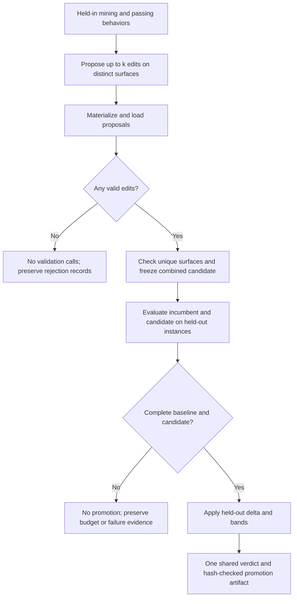

# Cheaper Batch Validation - Plan

## Goal Capsule

- **Objective:** Researchers can run harness optimization rounds with substantially fewer paid validation runs.
- **Means:** Evaluate one combined candidate against the incumbent using held-out instances, with the requested OOLONG-Pairs DeepSeek profile set to one validation repetition (R1–R6).
- **Authority:** The requested validation policy governs promotion; persisted evidence must describe the harness actually evaluated.
- **Stop conditions:** A protocol mismatch, conflicting proposal surfaces, incomplete baseline, or mismatched harness hash prevents promotion. Never select a subset after seeing validation outcomes.
- **Execution profile:** Implement U1–U5 on the current branch, `feat/cheaper-validation`, with deterministic offline verification. U6 completes documentation and integration checks.
- **Tail ownership:** The implementer owns all units and verification. Live experiment execution and publishing are separate actions.

---

## Product Contract

### Summary

Set validation repetitions to one in `configs/experiment_oolong_pairs_DeepSeekV4Flash.toml`, evaluate promotion only on held-out instances, and combine a round's valid edits before evaluation. Proposals must target distinct surfaces, with fewer proposals when fewer surfaces warrant changes.

### Problem Frame

`validate_round` currently evaluates the incumbent and every candidate on held-in and held-out instances. It selects individually accepted edits, then evaluates their merged harness again. The requested `configs/experiment_oolong_pairs_DeepSeekV4Flash.toml` profile uses `v = 3` and `k = 4`, so four loadable edits cost 300 validation runs before an optional 60-run merge evaluation. This duplicates evaluation work and encourages competing proposals that cannot be composed.

### Requirements

**Validation sample**

- R1. Set `loop.v = 1` in `configs/experiment_oolong_pairs_DeepSeekV4Flash.toml`; preserve its `n_in = 10`, `n_ho = 10`, mining repetitions, and final evaluation repetitions. Other TOML profiles remain unchanged.
- R2. Promotion validation executes only held-out instances for both incumbent and candidate. Held-in instances remain available for weakness mining and passing-behavior extraction.
- R3. Promotion uses only the held-out pass-count delta and held-out cost/sub-call measurements, retaining configured thresholds and bands.

**Proposal batch**

- R4. A round proposes at most one edit per S1–S10 surface. Each proposal remains a minimal edit on one mechanism-eligible surface and retains the existing one-proposal-per-pattern constraint.
- R5. `k` is a maximum, not a quota. If only one surface reasonably warrants an edit, return one proposal; return an empty batch if none does. Do not select a weaker target solely to fill the batch.
- R6. Combine all loadable, disjoint edits before validation and evaluate that candidate once against the incumbent. Promote or reject the entire evaluated candidate, with no individual validation, post-validation subset selection, or second merged evaluation.

**Evidence and integration**

- R7. Existing materialization, surface-diff, cap, budget, and hash checks still apply. Invalid proposals retain rejection records; only proposals that clear these checks enter the fixed batch.
- R8. Record every constituent's identity and surface without implying an individual pass/fail measurement. A round emits at most one promoted harness record.
- R9. New-protocol resume reuses matching persisted runs without new calls. Old-protocol evidence cannot anchor, resume, or complete a new-protocol optimization run.
- R10. Recovery, prior-edit history, analysis, and projections support the new artifacts. Missing held-in validation measurements remain absent, never fabricated from mining scores or reported as zero accuracy.

### Acceptance Examples

| ID | Input and action | Expected result | Covers |
|---|---|---|---|
| AE1 | Two supported patterns both warrant S2 changes | Proposer chooses one S2 edit; duplicate-S2 output enters bounded correction | R4, R5 |
| AE2 | Valid S2 and S10 edits, incumbent passes 5/10, combined candidate passes 6/10, bands pass | Exactly 20 validation runs at `v=1`; one combined promotion | R2, R3, R6 |
| AE3 | Combined candidate ties or regresses at zero thresholds | Whole batch rejected; no individual fallback or ablation run | R3, R6 |
| AE4 | One valid proposal and one loader rejection | One candidate versus incumbent; rejection is preserved and is not a constituent | R7, R8 |
| AE5 | Empty proposals, or all proposals fail loading | Zero validation calls; retain rejection-only ledger where applicable | R6, R7 |
| AE6 | Interrupted new-protocol round resumes after several held-out runs | Only missing runs execute; promoted harness is restored from held-out evidence | R9, R10 |

### Scope Boundaries

This change covers the optimization proposal and promotion pipeline, the named profile, and direct artifact consumers. Shared proposal/validation behavior changes for all callers; configuration tuning is limited to the named TOML file. Mining repetitions, attribution/clustering, split membership, final evaluation, real-generalization checks, providers, and concurrency tuning are outside the requested change. Historical research plans and experiment outputs remain untouched.

### Success Criteria

With 10 held-out instances, `v=1`, a complete nonempty valid batch costs exactly 20 validation subject-runs regardless of whether it contains one or four edits. Mining adds its existing `m*n_in` runs. This is a reduction in run count; measured dollar and wall-clock reductions depend on the edited harness's behavior.

---

## Planning Contract

### Assumptions

- “Merge all edits” means all proposals admitted before evaluation. Existing materialization failures and loader rejections may exclude invalid edits before the candidate is frozen; validation results may not exclude constituents afterward.
- Retain the existing positive-integer `v` setting. Other profiles keep their configured repetition counts; this work does not introduce a second runtime mode for the old validation policy.
- Retain pass-count thresholds and cost/sub-call bands numerically. With defaults, the candidate must improve held-out passes strictly; a tie is rejected.

### Key Technical Decisions

- KTD1. **Keep split membership separate from evaluation iteration.** Retain `ValidationSplits`' nonempty/disjoint checks and held-in access used by mining. Give validation an explicit held-out-only iteration path instead of weakening split checks or creating empty held-in evaluations. Subject worker reconstruction must preserve the same policy (R2).
- KTD2. **Enforce surface uniqueness before materialization and again at batch assembly.** Extend the proposer's existing batch validation/re-ask loop with a surface set. The prompt uses the existing mechanism-to-surfaces mapping and explicitly prioritizes the best-supported edit when patterns compete. An effective cap of `min(k, number of distinct eligible surfaces)` bounds output but does not force that many edits. Manually supplied duplicate-surface batches fail before paid work; no arbitrary winner is chosen (R4, R5).
- KTD3. **Move composition ahead of evaluation.** Reuse `merge_harnesses` and its S1–S10 field mapping. One valid proposal uses its own harness/id; multiple proposals use the reserved `merged` subject. Run the incumbent and this one subject through the existing evaluation/worker machinery. Replace the accepted-candidate ranking and merge-re-evaluation path; preserve two-level worker and spend-breaker semantics (R6, R7).
- KTD4. **Score a single measured split.** Require complete, nonempty, equal-sized held-out samples under matching accounting and the current validation protocol; reject missing or legacy protocol identifiers even when both inputs share them. Let `delta_ho = candidate_passes - baseline_passes`; retain the checks `delta_ho >= -tau_regression` and `delta_ho > tau_improvement`. Cost and sub-call band means use only held-out totals and denominators. Held-in data cannot affect scoring even if a legacy payload contains it (R3).
- KTD5. **Distinguish constituent participation from measured decisions.** Introduce a `bundled` constituent status with `surface`, harness hash, shared subject reference, and null rule/band/evaluation links. The evaluated merged row owns the measured decision and lists constituent IDs. A single-proposal batch needs only its measured row. Loader failures remain rejected rows; batch failure or budget exhaustion leaves constituents `bundled` with the shared result reference, not individually rejected or accepted (R8).
- KTD6. **Version the changed evidence contract and fail early on resume mismatch.** New validation summaries, promotion records, and decisions use v2 format tags and carry a fixed protocol identifier such as `heldout-batch/v1`. Include that identifier in experiment identity even when numeric settings already equal `v=1`. Persist and check round-level protocol, incumbent/batch hashes, constituent IDs, held-out sample identity, repetitions, and behavior-changing evaluation settings before launching workers. Worker requests carry this contract too. Legacy populated validation directories without it cannot resume under the new writer. Read-only analysis may support explicitly recognized v1 and v2 artifacts; writers never upgrade old evidence (R9).
- KTD7. **Update the small set of direct consumers together.** Promotion recovery reads the promoted row's held-out harness link. Quality analysis treats held-in measurements as unavailable on v2; surface activity counts `bundled` participation separately from measured acceptance. Prior-edit history summarizes the shared verdict once and identifies its constituent surfaces (R8, R10).
- KTD8. **Project two evaluation subjects per nonempty round.** Replace the current estimate with `m*n_in + 2*v*n_ho`. Label it as the full-run estimate for rounds with a valid batch; empty rounds cost mining only, and budget stops may execute fewer runs. Retain `report.p_merge` as a documented legacy report input so untouched profiles continue loading, but exclude it from the new projection formula. Update its comment in the named profile to state that it is unused under the new protocol. Keep final-evaluation projections and measured usage accounting unchanged (R10).

### High-Level Technical Design

The same fixed candidate moves through construction, evaluation, decision, and recovery. Separate per-proposal artifacts remain provenance inputs; they never become extra validation subjects.

### Risks and Operational Notes

One repeat gives a noisier promotion signal, and ten held-out instances make the zero-threshold improvement step one additional pass. Combined validation also loses individual edit attribution: one edit can offset another. These are consequences of the requested cheaper protocol; retain independent final evaluation and avoid presenting constituent participation as evidence of individual benefit.

Distinct surfaces prevent write conflicts, not behavioral interaction. Composition must retain callable, tool, and skill fields intact and evaluate the exact resulting hash. Existing `merge_harnesses`, materialization, and cap checks are the starting patterns.

Start a fresh experiment output directory after adopting the new protocol. Changing `v` alone would miss old smoke runs that already used one repeat; KTD6 closes that gap. Preserve legacy artifacts for read-only comparison and label their protocol.

---

## Implementation Units

### U1. Constrain proposal batches to distinct surfaces

**Goal:** Produce composable proposals without filling a quota.

**Requirements:** R4, R5; AE1. **Dependencies:** None.

**Files:** `shrlm/optimization/proposal.py`, `tests/optimization/test_proposal.py`.

**Approach:** Apply KTD2 to `PROPOSER_TASK`, `render_prompt`, and the existing batch validation in `propose_round`. Keep mechanism eligibility and one-pattern uniqueness checks. Preserve bounded retries, response caching, and materialization-failure records.

**Patterns:** Existing `ProposalRejection` correction loop and `validate_candidate_spec`.

**Test scenarios:**

1. Covers AE1. Different patterns proposing S2 twice reject the batch, then accept a corrected single-S2 response without writing the rejected batch.
2. Distinct S2/S10 proposals pass; same-pattern duplicates and ineligible surfaces still reject.
3. A fixture with only S2 eligible advertises a maximum of one; a mixed-eligibility fixture accepts one proposal despite unused capacity.
4. Empty output is valid; repeated duplicate surfaces exhaust the existing attempt bound without candidate artifacts.
5. Prompt assertions cover skipping weak alternative surfaces, the combined verdict, and the instruction that `k` is a ceiling.

**Verification:** Offline proposer tests prove both prompt guidance and enforced uniqueness; no additional model call is introduced to select surfaces.

### U2. Establish held-out evaluation and protocol identity

**Goal:** Make held-out-only execution consistent across sequential, process, and resumed runs.

**Requirements:** R2, R7, R9; AE6. **Dependencies:** None.

**Files:** `shrlm/optimization/validation.py`, `shrlm/optimization/subject_worker.py`, `shrlm/experiment/config.py`, `shrlm/experiment/orchestrator.py`, `tests/optimization/test_validation.py`, `tests/optimization/test_subject_worker.py`, `tests/experiment/test_config.py`, `tests/experiment/test_orchestrator.py`.

**Approach:** Implement KTD1 and the pre-dispatch contract in KTD6. Keep the split object available to `_mine_runs`; route `evaluate_subject` to held-out instances only. Update worker payload/reconstruction and summary format handling. Preserve existing trace verification, cost accounting, idempotent persistence, and partial-run budget behavior.

**Patterns:** `check_identity`, `_persist_once`, `evaluate_subject`, and subject-worker request validation.

**Test scenarios:**

1. Held-in sentinel instances reach mining but never appear in validation manifests or calls; no validation `heldin` directory is created.
2. Empty held-out or overlapping splits still reject before execution.
3. Sequential and worker evaluations produce equivalent held-out evidence after removing timing fields; validation-run parallelism retains its existing limits.
4. Matching partial rounds resume only missing run IDs; changed sample, candidate composition, or evaluation settings reject before another call.
5. Old populated round directories, including incomplete ones and old `v=1` runs, fail the protocol guard without rewriting files.
6. Changing worker count remains operationally permitted, subject to existing live-worker protection; changing the validation protocol changes experiment identity.

**Verification:** Persisted run IDs prove execution scope, and spy clients prove mismatches cause zero calls.

### U3. Compose before scoring and record one batch verdict

**Goal:** Replace per-edit tournaments with one evaluated candidate.

**Requirements:** R3, R6–R9; AE2–AE5. **Dependencies:** U1, U2.

**Files:** `shrlm/optimization/validation.py`, `shrlm/optimization/promotion.py`, `shrlm/optimization/subject_worker.py`, `tests/optimization/test_promotion.py`, `tests/optimization/test_validation_e2e.py`, `tests/optimization/test_validation.py`, `tests/optimization/test_subject_worker.py`.

**Approach:** Apply KTD3–KTD6 to `validate_round`, promotion scoring, result dataclasses, and ledger writing. Compose only after loader admission, validate combined caps before dispatch, and give the evaluator exactly two subjects. Replace obsolete individual-winner selection and merge-leg fields/functions where unused. Keep loader failures distinct from candidate budget outcomes and infrastructure failures.

**Patterns:** `merge_harnesses`, `governed_limits`, `evaluate_validation_round`, `decide_subject`, and non-clobbering ledgers.

**Test scenarios:**

1. Covers AE2. Four disjoint valid edits with ten held-out instances produce exactly 20 runs at `v=1`; only baseline and combined-subject evaluation directories exist.
2. Covers AE3. Tie, regression, cost-band failure, and sub-call-band failure reject the batch with no subset evaluation. Held-in score differences cannot change the verdict.
3. One proposal uses 20 runs and one measured decision; multiple proposals produce unscored constituent records plus one measured merged row.
4. Covers AE4/AE5. Mixed valid/invalid, rejection-only, and empty inputs preserve their distinct ledger and no-call behavior.
5. Duplicate surfaces and reserved IDs from manually supplied proposal directories fail before baseline execution.
6. A merged callable/tool/skill fixture preserves all edits and unchanged incumbent fields; the evaluated, ledgered, and promoted hashes match.
7. Incomplete or over-budget candidate evidence never scores or promotes; incomplete baseline raises the existing round failure. Budget and cap failures preserve audit records where evaluation occurred.
8. Replaying a completed batch makes zero calls and reproduces identical summary/ledger bytes; mismatched constituent hashes fail before dispatch.

**Verification:** Real orchestration with deterministic fake LM clients proves call counts, composition, scoring, and persisted artifacts together. Update existing end-to-end tests that currently expect individual acceptance before merge.

### U4. Recover and analyze batch promotions

**Goal:** Make existing consumers accurately read held-out batch evidence.

**Requirements:** R8–R10; AE6. **Dependencies:** U3.

**Files:** `shrlm/experiment/orchestrator.py`, `shrlm/optimization/proposal.py`, `shrlm/experiment/rounds.py`, `shrlm/experiment/incumbent_quality.py`, `shrlm/experiment/surface_activity.py`, `shrlm/experiment/plot_incumbent_quality.py`, `shrlm/experiment/plot_surface_activity.py`, `tests/experiment/test_orchestrator.py`, `tests/experiment/test_rounds.py`, `tests/experiment/test_incumbent_quality.py`, `tests/experiment/test_surface_activity.py`, `tests/experiment/test_plots.py`, `tests/optimization/test_proposal.py`.

**Approach:** Apply KTD7 and explicit legacy read support from KTD6. Update `_rematerialize_promoted`, prior-history rendering, ledger format checks, and measured-row filtering. Preserve existing CSV held-in columns as null for new evidence, and omit unavailable plotted series. Count constituent participation without manufacturing per-surface quality gains.

**Patterns:** Ledger-relative audit links, `resolve_surface`, `_IncumbentState.from_rule`, and existing nullable plotting inputs.

**Test scenarios:**

1. Covers AE6. Restart after a combined promotion restores the exact harness from held-out artifacts, including an edited callable or skill; next-round mining uses it.
2. A v2 ledger with several `bundled` rows generates one measured quality point; held-in accuracy remains null.
3. Surface activity attributes each constituent to its surface without counting `bundled` as individually accepted; history presents the shared verdict once.
4. Existing v1 two-split fixtures remain readable for analysis, while malformed/unknown versions fail explicitly.
5. Empty, rejection-only, over-budget, and partially persisted rounds produce valid analysis outputs without fabricated quality values.

**Verification:** End-to-end recovery and offline analysis fixtures pass; generated plot smoke checks handle all-null held-in series.

### U5. Update defaults and cost projections

**Goal:** Ship the cheaper settings and project the new workload.

**Requirements:** R1, R10. **Dependencies:** U3.

**Files:** `configs/experiment_oolong_pairs_DeepSeekV4Flash.toml`, `shrlm/experiment/config.py`, `shrlm/experiment/report.py`, `shrlm/experiment/render.py`, `tests/experiment/test_config.py`, `tests/experiment/test_report.py`.

**Approach:** Apply R1 to the named profile and KTD8 to report estimates and rendered formula labels. Keep other TOML files and the existing report input schema unchanged. Update stale comments describing held-in validation and candidate counts. Preserve split sizes and other scale settings.

**Test scenarios:**

1. The named full and smoke profile resolves to `v=1`; its split sizes, mining repetitions, and final evaluation repetitions stay as before. Every other shipped profile still parses without file edits.
2. For `m=2`, `n_in=10`, `n_ho=10`, `v=1`, projected optimization runs are 40 per full round, independent of positive `k`.
3. Explicit custom `v=2` projects 40 validation runs and reaches the existing evaluation repetition setting; this remains an intentional override.
4. Profile parsing and text/JSON reports agree; changing the legacy `p_merge` input does not change the new-protocol estimate.
5. Final evaluation counts and measured usage totals do not change due to the projection formula.

**Verification:** Configuration fixtures and projection assertions agree with U3's measured call counts for complete nonempty batches.

### U6. Document and verify the complete protocol

**Goal:** Make the implemented workflow and its evidence understandable to experiment operators.

**Requirements:** R1–R10. **Dependencies:** U4, U5.

**Files:** `shrlm/README.md`, `shrlm/optimization/README.md`, `shrlm/docs/harness-proposal-interface.md`, `shrlm/docs/experiment-metrics.md`, `shrlm/docs/evaluation-metrics.md`, `examples/run_experiment.py`, `examples/experiment_smoke.py`, `examples/validation_live_smoke.py`, `tests/experiment/test_smoke_mock.py`, `tests/experiment/test_orchestrator.py`.

**Approach:** Update active protocol descriptions, the cost formula, example expectations, and the fresh-output-directory instruction. Explain that the named profile uses `v=1` while other profiles retain their own counts. Explain shared batch verdicts and unavailable per-edit attribution. Adjust mock smoke fixtures to emit disjoint surfaces and exercise promotion followed by recovery. Retain archival plans and run artifacts.

**Test scenarios:**

1. A deterministic two-round smoke flow mines, proposes distinct edits, validates a combined candidate, promotes it, and resumes without repeat calls.
2. A single reasonable surface yields one proposal through the full flow; zero reasonable proposals consumes no validation runs.
3. Active docs and examples reference held-out-only scoring, maximum proposal count, the new workload formula, and fresh-run requirements consistently.

**Verification:** The Verification Contract passes and the final diff contains only implementation, tests, and documentation supporting this protocol.

---

## Verification Contract

Use deterministic fake LM clients and local fixtures. No paid benchmark is needed to prove the requested run-count reduction. Do not run tests during planning.

| Gate | Command or evidence | Purpose |
|---|---|---|
| Focused regression suite | `uv run pytest tests/optimization tests/experiment` | Proposal, batch evaluation, worker, recovery, and reporting behavior |
| Lint | `uv run ruff check --fix .` | Repository lint requirements; inspect resulting diff |
| Formatting | `uv run ruff format .` | Repository formatting requirements |
| Hooks | `uv run pre-commit run --all-files` | Required repository checks |
| Full regression suite | `uv run pytest` | Compatibility outside optimization; report credential-gated skips explicitly |
| Cost proof | U3 client call log plus persisted manifests | Exactly 20 validation runs for one or four valid edits with `n_ho=10`, `v=1`; zero for an empty valid batch |

---

## Definition of Done

- U1–U6 satisfy their verification outcomes and cover R1–R10.
- The cost proof succeeds in sequential and process-backed evaluation without altering mining or final evaluation scope.
- Every promoted hash names the exact evaluated candidate; recovery succeeds without held-in validation files.
- Existing evidence cannot silently resume under the changed protocol; legacy analysis remains explicit and read-only. Configuration edits are limited to `configs/experiment_oolong_pairs_DeepSeekV4Flash.toml`.
- Reports distinguish constituent participation from measured quality and show the current workload formula.
- Required checks pass, with any external-service skips recorded. Abandoned implementation paths, obsolete merge-re-evaluation code, and unused compatibility scaffolding are removed.
