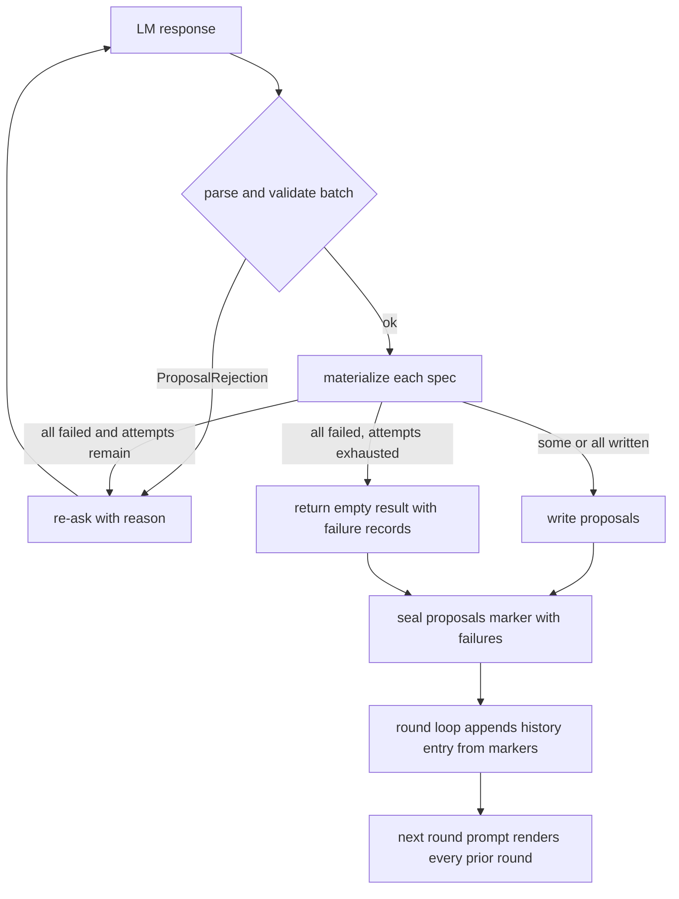

# Proposer No-Op Re-Ask and Cross-Round Failure Memory - Plan

## Goal Capsule

- **Objective:** An optimization run no longer spends rounds, and its patience budget, on a proposal the loop has already refused. When the proposer's edit changes nothing, it is re-asked within the same round with the reason; a round that still yields nothing closes with zero candidates but leaves a record, and every later round's proposer can see which edits already failed and why.
- **Means:** Reject an unmaterialized batch inside the proposer's existing re-ask loop (KTD1), and rebuild the proposer's prior-edit history from every persisted round rather than from validation ledgers alone (KTD3).
- **Authority:** Product Contract requirements govern behavior. Key Technical Decisions govern mechanism within those requirements. Units override neither.
- **Execution profile:** Four units, three in `shrlm` with tests, one in the paper. Land in dependency order; U2 and U3 share the persisted marker schema.
- **Stop conditions:** Stop and report if the proposals marker cannot carry the new fields without breaking `_persist_once` replay of existing experiment directories, or if the history change alters the proposer's cache key for already-sealed rounds.
- **Tail ownership:** The implementer runs the verification contract and removes any abandoned-attempt code before declaring done.

## Product Contract

### Summary

The proposer stage gains two coupled behaviors. A batch in which no candidate materializes as a real change to the incumbent is rejected with the reason and re-asked in the same round, the way a malformed batch is today. The proposer's prior-edit history block then covers every completed round, listing each attempted edit with its surface, its one-line predicted effect, its outcome, and the reason it failed, whether it died at materialization, at a loader gate, or at the promotion rule. The paper's proposal-stage paragraph gains one or two sentences stating this rule.

### Problem Frame

In the 2026-09-10 OOLONG-Pairs run on DeepSeek-V4-Flash, rounds 4, 5, and 6 each produced one proposal on surface S9 whose source was byte-identical to the incumbent's S9 middleware promoted in round 2. `build_candidate` rejected each as a materialization failure ("changes no surface"), `propose_round` recorded only a count, the orchestrator sealed the round with zero candidates, validation was skipped, and patience tripped after three such rounds. The frozen harness is the round 3 winner; twelve rounds of the preregistered fifteen were never used.

Two gaps combine to make this a deterministic loop at temperature 0. First, the re-ask loop in `propose_round` covers only `ProposalRejection` (malformed JSON, bad shape, validator failures), so a no-op edit is never re-asked. Second, `prior_history` is appended only when a round has a validation ledger (`shrlm/experiment/orchestrator.py`, the `has_ledger` branch of the round loop), so a zero-candidate round leaves no trace in the next round's prompt. The proposer sees the same evidence bundle shape, the same incumbent, and no record that its idea was refused.

### Requirements

**Re-ask within a round**

- R1. When every candidate in a validated batch fails to materialize, the proposer is re-asked with a rejection message naming each failed candidate's pattern index, surface, and failure reason, within the existing `max_attempts` budget.
- R2. A batch in which at least one candidate materializes proceeds with the survivors; materialization failures in a partially successful batch are recorded, not re-asked.
- R3. When the attempt budget is exhausted and the final attempt validated but failed to materialize, the round returns zero written candidates and its failure records, and the orchestrator seals the round unpromoted; no exception escapes. Exhaustion whose final attempt failed parse or validation keeps today's exception path.

**Persisted failure record**

- R4. The round's proposals marker records each materialization failure with its pattern index, surface, reason, and the candidate's predicted effect, alongside the existing count.

**Cross-round memory**

- R5. The proposer's prior-edit history block contains one entry per completed prior round, including rounds that wrote no candidates and rounds that reached validation.
- R6. Each history entry lists every attempted edit with its surface, its one-line predicted effect, its outcome, and its reasons, whether the edit failed at materialization, at a validation loader gate, or at the promotion rule.
- R7. The history is rebuilt identically on the resume path, from persisted markers, so a resumed experiment renders the same history block as an uninterrupted one.

**Paper**

- R8. The paper's proposal-stage description states, in one or two sentences, that a candidate that does not change the incumbent is rejected and re-asked, and that the proposer is shown every prior attempted edit with its outcome.

### Key Decisions

- **Cross-round memory is in scope alongside the in-round re-ask.** (session-settled: user-directed — chosen over an in-round re-ask alone: a later proposal may differ in bytes but repeat a direction, and the proposer should see what already failed to try other surfaces or ideas.) Governs R5, R6, R7.
- **Persist failure reasons, not just counts.** The marker is the only durable record a no-candidate round leaves; the history in R5 is built from it. Governs R4.

### Scope Boundaries

- No change to proposer sampling temperature, `k`, `max_attempts` default, `patience`, or promotion thresholds.
- No change to which surfaces or patterns are addressable.
- No retroactive rewrite of existing experiment directories; a pre-change round without the new marker fields renders as one history entry carrying its outcome and the line "no per-edit record persisted", and R7 holds for it because both paths read the same marker.

#### Deferred to Follow-Up Work

- A cap or summarization of the history block for very long runs. At `t = 15` rounds and `k = 4` the block holds at most 60 record lines.
- Feeding the proposer the failed candidate's full edit text rather than its predicted effect.
- Persisting a failure record for every refused attempt in a re-ask sequence, not only the final attempt's. This plan persists the final attempt's records; earlier refused attempts survive only in the attempt trail.
- A mandatory paper-consistency check in the Verification Contract.

## Planning Contract

### Key Technical Decisions

- KTD1. **Treat an all-failed materialization as a rejection in the existing re-ask loop.** Move the `build_candidate` pass inside the attempt loop in `propose_round`. When `specs` is non-empty and nothing materializes, set the rejection message from the joined failure reasons and continue to the next attempt. Partial success keeps the survivors, preserving `test_propose_round_materialization_failure_does_not_drop_the_rest`. The cache key already includes the attempt index, so a re-ask is a fresh call at temperature 0. Chosen over converting every materialization failure into a rejection: the live profile runs `k = 4`, and that would drop good candidates from mixed batches.
- KTD2. **Exhaustion is classified by the final attempt.** When the last attempt validated but failed to materialize, return an empty result: a persistent no-op is a proposer-quality outcome the round already knows how to close (zero candidates, unpromoted). When the last attempt failed parse or validation, keep the existing `ProposalRejection` raise. A mixed trail (malformed first, no-ops after) therefore returns empty. Raising on a no-op would escape the orchestrator, which catches only `ProposalBudgetExhausted`, and crash a resumable run, then re-crash on every resume because rejected attempts are cached. The attempt trail still records every refused attempt.
- KTD3. **Rebuild `prior_history` per round from persisted markers at the single append site.** In the orchestrator round loop, append one entry for every completed round on both the execute and replay paths. The decision element is always the `round.json` payload, which carries the round index, `promoted`, and the promoted hash, which is everything the renderer reads; the validation `decision.json` has no round index. Records come from two sources merged for every round: the validation ledger when one exists, which already persists loader-gate rejections and promotion outcomes, with each record's predicted effect attached from its `proposal.json` (tolerating the merged subject, which has none); and the marker's materialization failures, synthesized as `not_materialized` records whether or not a ledger exists, so a refused edit in a partially successful batch still appears. Keep the `(records, decision)` tuple shape so `_render_history_block` and its tests keep their contract; extend records with optional `predicted_effect`. Chosen over a new history dataclass: fewer signature changes and no test churn outside the render function.
- KTD4. **Bump `VALIDATOR_VERSION` and `PROMPT_VERSION`.** The loop semantics change what the proposer produces for a given prompt, and the history block changes the system prompt. Both are hashed into the cache key by design, so old cached responses do not replay under new semantics. A resumed round whose proposals marker is already sealed is unaffected; only an unsealed proposal stage re-bills.

### High-Level Technical Design

### Sequencing

U1 first, since U2 extends its failure record. U3 depends on U2's marker fields. U4 is independent of code but should quote the final behavior, so land it last.

## Implementation Units

### U1. Re-ask when a whole batch fails to materialize

- **Goal:** A batch whose every candidate fails materialization is re-asked with the reasons; exhaustion returns an empty result.
- **Requirements:** R1, R2, R3
- **Dependencies:** none
- **Files:** `shrlm/optimization/proposal.py`, `tests/optimization/test_proposal.py`
- **Approach:**
  1. In `propose_round`, run the `build_candidate` pass inside the attempt loop after batch validation, per KTD1.
  2. When nothing materialized and specs were non-empty, compose the rejection from each `MaterializationFailureRecord`: pattern index, surface, reason, plus one coaching sentence that the surface already contains this text and the edit must differ from the current surface shown in the pattern block, or address the pattern on another listed surface.
  3. On exhaustion, classify by the final attempt per KTD2: if it validated but failed to materialize, return a `ProposalRoundResult` with empty `written`, that attempt's failure records, and the full attempt trail; if it failed parse or validation, keep the existing `ProposalRejection` raise.
  4. Bump `VALIDATOR_VERSION` per KTD4.
- **Patterns to follow:** The existing `rejection` and `attempts` handling in the attempt loop; `test_propose_round_reask_loop_records_both_attempts` for the re-ask test shape; `edit_item(1, {"kind": "policy", "runtime_policy": {}})` as the canonical no-op edit.
- **Test scenarios:**
  - A first response holding only a no-op policy edit and a second response holding a text edit: two attempts recorded, the first not accepted with a violation naming the pattern index and surface, the second accepted, one proposal written.
  - A response mixing a no-op edit with a valid text edit: one attempt, one proposal written, one failure recorded, no re-ask (R2, existing test unchanged).
  - `max_attempts=2` with both responses no-op: no exception, `written` empty, `materialization_failures` has one record, two attempts recorded and both not accepted.
  - `max_attempts=2` with the first response malformed JSON and the second a no-op edit: no exception, `written` empty, one failure record (mixed trail, KTD2).
  - `max_attempts=2` with both responses malformed JSON: `ProposalRejection` still raised (existing behavior preserved).
  - The rejection message for a no-op names the current surface as already containing the text.
- **Verification:** `tests/optimization/test_proposal.py` passes; the no-op run from `experiment_oolong_pairs_dsv4f/opt/round_04/work/` would, under a mock LM returning that S9 source then a different edit, produce one written candidate.

### U2. Persist materialization failure records in the proposals marker

- **Goal:** Each failure's pattern index, surface, reason, and predicted effect survive in `proposals_complete.json`.
- **Requirements:** R4
- **Dependencies:** U1
- **Files:** `shrlm/optimization/proposal.py`, `shrlm/experiment/orchestrator.py`, `tests/optimization/test_proposal.py`, `tests/experiment/test_orchestrator.py`
- **Approach:**
  1. Add `predicted_effect` to `MaterializationFailureRecord`, taken from the spec, and a `to_dict`.
  2. In the orchestrator's proposal stage payload, add `materialization_failures` as the list of record dicts next to the existing count; the budget-exhausted branch writes an empty list.
  3. Readers default a missing key to an empty list so pre-change markers load.
- **Patterns to follow:** `ProposalAttempt.to_dict` for the record serialization; the existing `n_materialization_failures` field placement.
- **Execution note:** `max_attempts` is not reachable from `ExperimentConfig`; `proposer_config` builds `ProposerConfig(k=config.loop.k)` and the default budget is 8. For orchestrator-level exhaustion scenarios, monkeypatch the orchestrator module's `proposer_config` to return a two-attempt budget, since the mock LM raises once its response list empties and the retry wrapper would turn that into a transport error.
- **Test scenarios:**
  - A round whose proposer returns only a no-op edit seals a marker whose `materialization_failures` holds one entry with pattern index, surface `S6` or `S9` as fixtured, a non-empty reason, and the spec's predicted effect.
  - A round with a written candidate and no failures seals an empty list.
  - The budget-exhausted branch seals an empty list and count zero.
  - A marker written without the key loads through `_load_marker` and is treated as no failures.
- **Verification:** Both test files pass; `jq .materialization_failures` on a sealed marker from a mock run shows the records.

### U3. Cross-round history from every persisted round

- **Goal:** The proposer's history block lists every prior round's attempted edits with surface, predicted effect, outcome, and reasons.
- **Requirements:** R5, R6, R7
- **Dependencies:** U2
- **Files:** `shrlm/experiment/orchestrator.py`, `shrlm/optimization/proposal.py`, `tests/experiment/test_orchestrator.py`, `tests/optimization/test_proposal.py`
- **Approach:**
  1. Add an orchestrator helper that builds one `(records, decision)` entry for a completed round from its persisted markers, per KTD3: the decision is the `round.json` payload; records are the ledger's records (when a ledger exists) with `predicted_effect` attached from each candidate's `proposal.json`, tolerating a missing file, plus `not_materialized` records synthesized from the marker's failures for every round; a pre-change marker without the field yields no synthesized records.
  2. Call it at the single append site in the round loop unconditionally, replacing the `has_ledger` guard, so execute and replay paths agree. Reuse the same two-attempt monkeypatch from U2's execution note for exhaustion scenarios.
  3. In `_render_history_block`, label each round by the decision's `round` value, render `predicted_effect` on each record line, render `not_materialized` records with their reason, render a round with no records as "no per-edit record persisted", and keep the bundled-record collapsing.
  4. Add one sentence to the history preamble in `render_prompt` stating that a candidate identical to the current surface is refused before validation and must not be re-proposed. Bump `PROMPT_VERSION` per KTD4.
- **Patterns to follow:** `rounds.py`'s `_proposal_surface` for reading a candidate's `proposal.json`; `load_promotion_ledger` for the ledger read; `test_no_candidates_means_no_ledger_no_promotion_and_no_prior_history` for the spy-on-`propose_round` test shape.
- **Test scenarios:**
  - Two-round mock experiment where round 1's proposer returns only a no-op: round 2's `propose_round` receives a `prior_history` of length one whose records hold one `not_materialized` entry with the reason and predicted effect, and whose decision has `promoted` false (rewrite of the existing test's `histories == [0, 0]` expectation to `[0, 1]`).
  - Two-round mock experiment where round 1 promotes: round 2's history entry carries the ledger records with `predicted_effect` attached, and its decision carries round index 1.
  - Two-round mock experiment where round 1's batch has one valid edit and one no-op (k=2): round 2's history entry carries both the ledger record for the validated candidate and a `not_materialized` record for the refused one.
  - A round whose marker predates the new field (no `materialization_failures` key, no ledger) renders as one entry with its outcome and the "no per-edit record persisted" line, identically on execute and replay.
  - Resume after round 1 sealed: the replayed round contributes the same history entry byte-for-byte as the uninterrupted run.
  - `_render_history_block` with a `not_materialized` record renders the surface, the predicted effect, and the reason on one line.
  - `_render_history_block` with a ledger record carrying `predicted_effect` renders it; a record without the key still renders (backward compatible).
  - Rendered prompt contains the new preamble sentence.
- **Verification:** Both test files pass; a mock two-round run's second proposer prompt, captured via the spy, contains the round 1 failure line.

### U4. Paper description

- **Goal:** The method's proposal-stage text states the rule in one or two sentences.
- **Requirements:** R8
- **Dependencies:** U1, U3 (behavior must be final before it is described)
- **Files:** `paper/Self-Harness.md` (section 3.3 paragraph on the bounded proposal context), `paper/proposal.tex` (the harness-proposal sentence near line 215)
- **Approach:** Extend the "summaries of previously attempted edits" clause. Directional wording: "The proposer is shown every previously attempted edit with its outcome, including edits refused before validation; a candidate that does not change the current harness is rejected and re-asked with the reason, like a malformed proposal." Keep the tex sentence parallel to the markdown.
- **Test expectation:** none -- prose change.
- **Verification:** Both files read consistently; the tex still builds if a build is run.

## Verification Contract

| Check | Command | Applies to |
|---|---|---|
| Proposer unit tests | `uv run pytest tests/optimization/test_proposal.py` | U1, U2, U3 |
| Orchestrator tests | `uv run pytest tests/experiment/test_orchestrator.py` | U2, U3 |
| Lint and format | `uv run ruff check . && uv run ruff format --check .` | U1, U2, U3 |
| Full suite | `uv run pytest` | all; compare against the pre-change failure set on `main` before attributing failures to this work |

## Definition of Done

- All four units landed in dependency order; `make check` equivalent commands above pass on the touched test files.
- A mock experiment where the proposer returns the incumbent's own surface text, then a different edit, produces a written candidate on the second attempt (U1). A separate mock experiment where it returns the incumbent's text on every attempt closes the round with a sealed marker listing the failures (U2) and a next-round prompt naming them (U3).
- `VALIDATOR_VERSION` and `PROMPT_VERSION` bumped once each.
- Paper text updated in both files (U4).
- No abandoned-attempt code left in the diff.

## Sources

- Live run evidence: `experiment_oolong_pairs_dsv4f/opt/round_04/work/_candidate_s9_6d1890ab747504d4.py` is byte-identical to the incumbent S9 in `experiment_oolong_pairs_dsv4f/opt/round_03/proposals/r03-c01-s4/proposal.json`; rounds 5 and 6 reproduce the same candidate hash.
- Rejection site: `shrlm/optimization/proposal.py` `build_candidate`, via `changed_surfaces` in `shrlm/optimization/candidates.py`.
- Re-ask loop and count-only failure handling: `shrlm/optimization/proposal.py` `propose_round`.
- History gated on ledgers: `shrlm/experiment/orchestrator.py` round loop, `has_ledger` branch; `test_no_candidates_means_no_ledger_no_promotion_and_no_prior_history` pins the current behavior.
- Marker payload with count only: `shrlm/experiment/orchestrator.py` `_proposals`.
