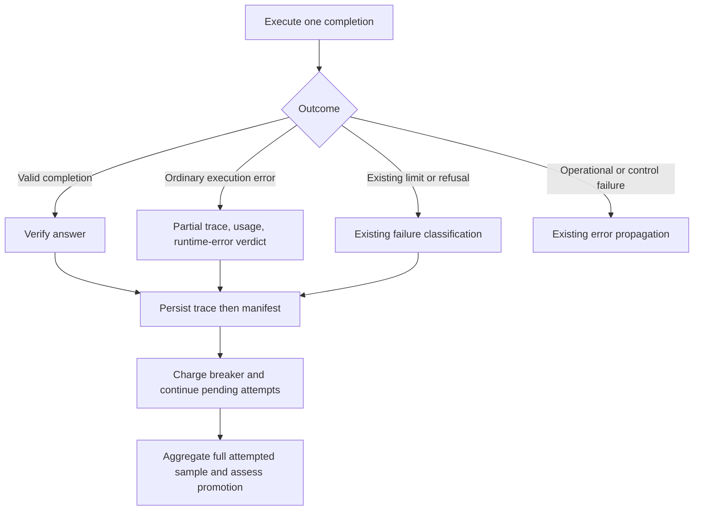

# Contain Harness Runtime Errors - Plan

## Goal Capsule

- **Objective:** An experiment finishes its scheduled work even when a generated harness crashes an individual attempt.
- **Means:** Persist run execution errors through the existing failed-run path (KTD1–KTD3).
- **Authority:** The user's requested failure containment governs product behavior; repository integrity and spend constraints remain applicable under R4–R6.
- **Execution profile:** Offline regression coverage first, then implementation and repository checks. No paid experiment is needed to prove this change.
- **Stop conditions:** Stop implementation for an unresolved persistence or accounting contract conflict; normal generated-harness exceptions are experiment results.
- **Tail ownership:** The implementer owns code, tests, documentation, and review. Restarting the stopped experiment and publishing changes require a separate instruction for this new task.

---

## Product Contract

### Summary

Record an ordinary harness execution exception as a failed attempt and continue the remaining runs and optimization rounds. Preserve partial evidence and spend, and make the failure classification consistent across execution modes.

### Problem Frame

In `experiment_oolong_pairs_dsv4f_20260911_213930`, round 3's S9 `accept_answer` passed a tuple from the answer inventory into `re.finditer`. The resulting `TypeError` escaped `execute_run`, became a failed subject-worker result, and stopped the experiment after the baseline finished. Round 2 had already promoted a useful S2/S9 batch; that result remains saved, but optimization never reached its final freeze.

### Requirements

**Containment and scoring**

- R1. An ordinary Python exception while executing an individual harness completion produces one failed attempt and does not abort the enclosing subject, mining round, or experiment.
- R2. The failed attempt remains in the configured sample denominator with `passed=false`, a distinct runtime-error cause, and an explanation; a partial answer cannot be verified into a pass.
- R3. Continue pending attempts under the existing caps and repetition counts, without automatic replacement attempts or dropping a failed candidate from its batch. Promotion continues to use the existing pass-count and cost rules.

**Evidence and accounting**

- R4. Persist the original exception type, message, traceback, elapsed time, available partial trajectory, and recorded usage before advancing. Unknown usage remains marked as a lower bound and receives the existing conservative breaker charge.
- R5. Serial execution, run workers, subject workers, and orphan-trace recovery retain the same failure meaning. Resuming skips already persisted failed attempts exactly as it skips successful attempts.

**Failure boundaries**

- R6. Configuration, credentials, transport/provider failures outside existing handled cases, verifier defects, persistence corruption/write errors, and process-control failures retain their existing handling. Do not turn an unhealthy experiment into a successful result by catching errors around the entire orchestrator or subject worker.
- R7. Aggregation and mining can consume runtime-error traces, including attempts with no recorded iterations, without a secondary crash. Runtime failures caused by harness execution remain eligible evidence for weakness mining.

### Acceptance Examples

- AE1. Covers R1–R5. A scripted S9 callback raises the observed tuple/string `TypeError` after a recorded model call. Its attempt is persisted as failed with that usage; a later valid instance completes, the subject gets a summary, and the orchestrator reaches its next round or normal stopping condition.
- AE2. Covers R2–R3. Every candidate attempt raises. The candidate has the full attempted denominator, zero passes, and a normal rejection ledger; the experiment continues according to patience.
- AE3. Covers R5–R6. Resume after a trace was written but before its manifest append. Adopt the trace once with the runtime-error cause. A corrupt trace or a verifier exception still surfaces as an operational failure.

### Scope Boundaries

This change applies to experiment-run execution, including mining and held-out validation. Existing pre-validation rejection of malformed proposals stays in place. It does not repair generated proposal source, change proposal quotas, alter promotion thresholds, or automatically resume the stopped paid run.

#### Deferred to Follow-Up Work

Improving S9 API examples and S2 brace-formatting guidance may reduce invalid proposals, but is not required for containment. Changing how subject workers drain siblings after a true operational error is separate work.

---

## Planning Contract

### Key Technical Decisions

- KTD1. **Contain at the shared completion boundary.** Extend `execute_run` in `shrlm/optimization/driver.py`, which both serial execution and run children already use. Limit the new catch to the completion call and its returned run extraction. Keep verifier execution outside the new generic catch while retaining the existing outer deadline/limit handling. This implements R1 and R6 without wrapping the orchestration loop.
- KTD2. **Classify failures explicitly.** Add `VerifierCause.RUNTIME_ERROR` in `shrlm/optimization/taxonomy.py`. Retain current limit, rate-limit, and content-filter handling first. Re-raise recognized SDK API/transport errors not already handled, `OSError`, and `MemoryError`; do not catch `BaseException` in the new path. Ordinary execution exceptions such as `TypeError`, `AttributeError`, `KeyError`, `ValueError`, and `RuntimeError` become runtime-error outcomes. The boundary is execution-local, not proof that generated code alone caused an error; full diagnostics make host-runtime defects visible too. Existing cancellation/deadline semantics remain unchanged. Governs implementation of R1, R2, and R6.
- KTD3. **Carry failure metadata in the persisted completion.** Add an optional structured execution-failure field to `RLMChatCompletion`, with its serializer/deserializer coverage. Store cause, original exception type/message, and formatted traceback there; keep the existing human-readable `error` string. Only failed completions emit the new field. The trace must be sufficient to reconstruct the verdict when worker result files are absent. Use it in both `_reap_run` and `_adopt_orphan_traces`; preserve the legacy error-string fallback for old traces. Do not infer new runtime causes by matching exception text. Implements R4–R5.
- KTD4. **Reuse partial usage and persistence.** Build the failure from `_partial_completion`, `last_completion_usage`, and the existing trace-before-manifest ordering. Mark interrupted measurements as lower bounds. Extend the missing-cost breaker fallback specifically to runtime-error outcomes; keep observed costs unchanged and do not substitute breaker estimates into reported measured cost. Preserve the current accounting version because its pricing arithmetic is unchanged. Implements R4–R5.
- KTD5. **Score failures normally.** Do not introduce blanket rejection for any runtime error: failed attempts contribute zero passes under R2–R3. A batch with other successful attempts may still qualify under the existing rule. Extend summary handling for absent trajectories and expose `n_runtime_errors`; keep this distinct from `n_resource_terminated`. Ensure the miner can retain and attribute this evidence under R7.

### High-Level Technical Design



```mermaid
sequenceDiagram
    participant Child as Run child
    participant Trace as Persisted trace
    participant Parent as Parent or resume process
    participant Loop as Experiment
    Child->>Trace: Write partial completion with structured failure and usage
    Parent->>Trace: Read and validate trace
    Parent->>Parent: Recover cause, append one failed manifest entry, charge breaker
    Parent->>Loop: Return ordinary subject summary
    Loop->>Loop: Promotion decision and next round
```

### Assumptions and Risks

The user authorizes planning a run-level failure policy. The operational exclusions in R6 are inferred safeguards against disguising broken evaluation or missing credentials as model performance.

Adding a verifier cause and an optional completion field expands persisted data. New readers must load old traces unchanged; older builds need not understand new runtime-error verdicts. Do not rewrite historical results or change config identity merely to introduce the field.

The same harness object can be reused in serial runs. Verify logger and usage reset on the next completion so a failure cannot contaminate its successor. If an early exception happens before per-run reset, fix reset ownership inside the execution unit rather than recording the preceding attempt's evidence.

### Research Basis

- `shrlm/optimization/driver.py`: `execute_run`, `_partial_completion`, `_persist_run`, and `prepare_round` already own limits, partial usage, append ordering, and resumability.
- `shrlm/optimization/run_worker.py`: `run_run_worker` calls `execute_run` without a verifier; parent-owned verification requires preserving the classification in the trace.
- `shrlm/optimization/costs.py`: `_error_verdict`, `_reap_run`, orphan adoption, and `breaker_run_cost` are the worker-mode and missing-cost boundaries.
- `shrlm/optimization/validation.py`: `aggregate_split` special-cases absent trajectories only for resource terminations today.
- `shrlm/optimization/subject_worker.py`: failed subject results become `SubjectWorkerError` after siblings finish; this remains the operational backstop.
- `rlm/core/rlm.py`: `_apply_answer_middleware` and `last_completion_usage`; `rlm/logger/rlm_logger.py`: per-completion trajectory reset.
- Local incident artifacts: `experiment_oolong_pairs_dsv4f_20260911_213930/opt/round_03/validation/round_03/r03-c01-s9/worker_result.json` and its generated `subject_module_c637df3f81bf22c3.py`.

---

## Implementation Units

### U1. Persist execution exceptions as failed attempts

**Goal:** Implement the shared failure boundary and durable diagnostic contract.

**Requirements:** R1–R2, R4, R6; AE1. **Dependencies:** None.

**Files:** `shrlm/optimization/driver.py`, `shrlm/optimization/taxonomy.py`, `rlm/core/types.py`, `tests/optimization/test_driver.py`, `tests/optimization/test_taxonomy.py`, and a focused serialization test in `tests/test_execution_failure_serialization.py` (new).

**Approach:** Implement KTD1–KTD3. Reuse the partial-completion builder and verify per-attempt logger/usage isolation. Preserve existing limit handling during verification.

**Execution note:** Start with a deterministic reproduction of the recorded S9 callback error using a scripted local client.

**Test scenarios:**

1. Covers AE1. Callback raises the tuple/string `TypeError` after paid usage is recorded; persist one runtime failure and complete the next valid instance.
2. Attribute, key, value, and runtime exceptions share the same behavior; an error before the first iteration still records an attempt.
3. A returned partial answer that would satisfy the verifier remains failed and is not re-verified.
4. Existing budget, deadline, content-filter, and exhausted-rate-limit cases retain their causes.
5. Verifier `TypeError`, credential/config failure, unhandled SDK API error, `OSError`, `MemoryError`, and direct `KeyboardInterrupt`/`SystemExit` are not absorbed by the new catch.
6. Failed and successful attempts on a reused harness retain only their own trace and usage. Old completion dictionaries round-trip without the new optional field; new diagnostics survive serialization.

**Verification:** Failed attempts are independently readable and the serial loop continues with the configured run IDs.

### U2. Preserve runtime failures across workers and spend accounting

**Goal:** Make worker execution and recovery equivalent to serial execution.

**Requirements:** R4–R6; AE3. **Dependencies:** U1.

**Files:** `shrlm/optimization/costs.py`, `shrlm/optimization/run_worker.py`, `tests/optimization/test_costs.py`, `tests/optimization/test_run_worker.py`, `tests/optimization/run_worker_support.py`.

**Approach:** Apply KTD3–KTD4 to trace adoption and reaping. A captured runtime exception is a completed worker execution carrying a failed verdict, not a worker infrastructure failure. Keep the existing handling for children that produce no usable trace.

**Test scenarios:**

1. A real local run child raises in S9 and publishes diagnostics; the parent persists `runtime_error`, not `resource_terminated`, and continues.
2. Covers AE3. Trace-only recovery retains the cause, original usage, and one manifest entry; repeating resume performs no extra call or charge.
3. Compare serial and concurrent outcomes for the same scripted failure, including pass counts, costs, and classification.
4. Unknown cost on a runtime failure charges the configured per-run ceiling to the breaker while persisted cost remains unknown; reaching the candidate budget stops dispatch normally.
5. Legacy content-filter/resource-error traces, malformed traces, child death, and timeout behavior remain covered.

**Verification:** Worker files are not required to recover a saved runtime-failure trace, and failures cannot become free attempts.

### U3. Consume failures through scoring and mining

**Goal:** Prevent a contained failure from crashing aggregation or attribution.

**Requirements:** R2–R3, R7. **Dependencies:** U1–U2.

**Files:** `shrlm/optimization/validation.py`, `shrlm/optimization/mining.py`, `shrlm/optimization/walker.py`, `tests/optimization/test_validation.py`, `tests/optimization/test_mining.py`, `tests/optimization/test_walker.py`, `tests/optimization/test_promotion.py`.

**Approach:** Implement KTD5. Both walker entry points currently reject absent metadata: permit a minimal root with zero observed iterations only for an explicitly marked runtime-error completion, while retaining its error and usage. Do not fabricate run metadata or loosen empty-trace integrity checks for successful runs. Ensure runtime diagnostics reach existing failure digests and are not routed as unexplained resource/platform failures.

**Test scenarios:**

1. A zero-iteration runtime failure aggregates with zero observed subcalls and one failed attempted run.
2. Covers AE2. An all-failed candidate produces a full-denominator summary and a normal rejection; a mixed candidate follows the unchanged strict improvement and cost checks.
3. Baseline runtime failures remain scored failed attempts; an ordinary wrong answer and a runtime failure remain distinguishable.
4. Mining a runtime failure with a partial or absent trajectory completes and preserves the cause and useful diagnostic detail.
5. Successful traces missing required metadata and corrupt persisted traces still fail integrity checks.

**Verification:** Summaries, promotion records, and mining bundles consume the new cause without losing attempts.

### U4. Prove experiment continuation and document recovery

**Goal:** Verify the user-visible outcome through the full offline experiment path.

**Requirements:** R1–R7; AE1–AE3. **Dependencies:** U1–U3.

**Files:** `tests/experiment/test_orchestrator.py`, `tests/optimization/test_subject_worker.py`, `tests/optimization/subject_worker_support.py`, `shrlm/optimization/README.md`, `shrlm/README.md`.

**Approach:** Exercise actual worker boundaries with importable fixtures and scripted clients. Document the new failed-run cause, remaining fatal boundaries, recorded-versus-conservative cost, and resume behavior.

**Test scenarios:**

1. Covers AE1–AE2. A proposal passes static checks and fails at runtime; remaining attempts finish, the round receives a ledger, and the orchestrator continues or freezes normally on patience.
2. Repeat through serial subjects and concurrent subject workers, with run workers both disabled and enabled.
3. Covers AE3. Resume an incomplete round containing persisted successes and runtime failures; execute only missing attempts and preserve previous promotions.
4. A true subject infrastructure failure still raises the existing `SubjectWorkerError` and preserves sibling work.

**Verification:** A deterministic experiment with injected runtime failures completes without real provider calls; prior promotions and normal stopping behavior remain intact.

---

## Verification Contract

During implementation, run the focused driver, worker, costs, validation, promotion, mining, serialization, and orchestrator suites identified above. Then complete the repository's Ruff checks/formatting, pre-commit checks, and full pytest suite required by `AGENTS.md`. Separate unrelated baseline failures from regressions with evidence. No tests or paid model calls are part of planning.

For acceptance, the observed S9 failure must become a persisted failed attempt in every supported worker configuration, and an offline experiment must reach its next round or normal frozen-harness output. Missing-cost accounting, trace-only resume, and negative operational-error cases are required proof.

---

## Definition of Done

- U1–U4 meet their verification outcomes and R1–R7 have executable regression coverage.
- Runtime failures retain their diagnostics and measured usage across serial execution, worker execution, persistence, and resume.
- Existing promotion and spend policies remain enforced, with no duplicated or omitted attempts.
- Documentation explains failed-run containment and operational failures that still stop execution.
- Required repository checks are recorded; abandoned experimental code and unrelated edits are absent from the change.
