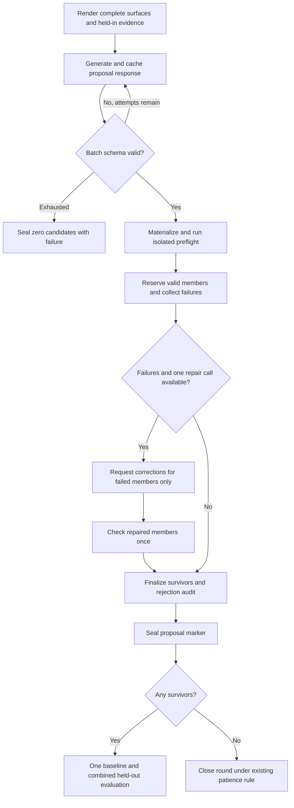
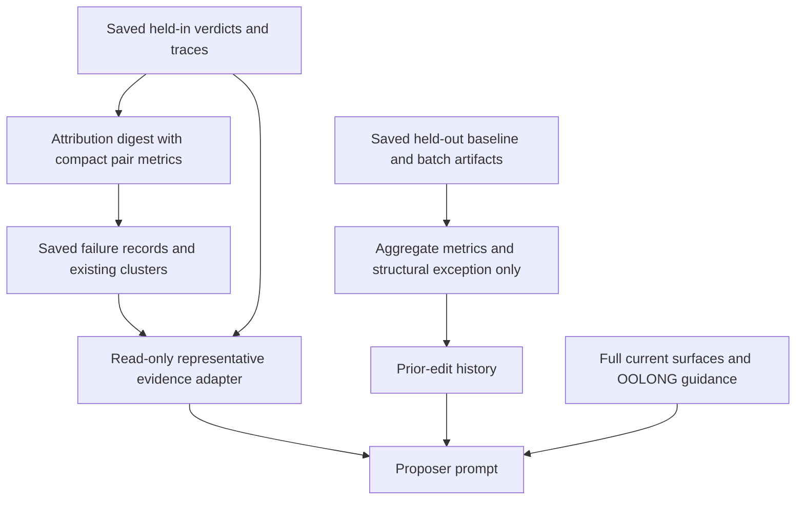

# OOLONG Proposal Quality and Feedback - Plan

## Goal Capsule

- **Objective:** OOLONG-Pairs experiments spend more of their evaluation budget on valid, distinct harness improvements, with enough feedback to avoid repeating known failures.
- **Means:** Improve proposer context, reuse isolated candidate checks before proposal completion, and carry diagnostic evidence into subsequent proposals (KTD1–KTD7).
- **Authority:** Product requirements govern behavior; technical decisions specify how to deliver them. The investigation is evidence, not authorization for its unselected recommendations.
- **Execution profile:** Six bounded implementation units on the current branch, with offline regression fixtures and mocked provider calls. Implementation includes code, tests, documentation, and review; launching another paid experiment is a separate task.
- **Stop conditions:** Report a blocker if implementation would require changing the promotion rule, exposing held-out answers to proposal generation, or rewriting completed experiment artifacts.
- **Tail ownership:** The implementer completes repository checks and removes abandoned code before handoff.

---

## Product Contract

### Summary

Give the proposer complete editable surfaces, concrete held-in evidence, and the actual answer contract. Catch and repair invalid candidates before combined validation, expose F1 and pair-error diagnostics, and teach evidence-backed proposals to preserve record identity through classification and aggregation.

### Problem Frame

The investigation in `docs/analysis/oolong-pairs-2026-09-13/README.md` covers 14 rounds and 580 saved attempts across three OOLONG-Pairs experiments. The oldest exhausted its final three rounds on no-ops. The latest evaluated three broken S9 implementations: its final 30 candidate attempts contained 21 runtime failures and nine format failures. Current prompts hide the end of the incumbent surface, omit useful attribution explanations, and omit the exceptions that explain earlier batch failures.

An exact-pass count can also hide progress: the latest round-2 baseline scored 0/10 with mean recorded F1 0.682. Dense diagnostics already exist in verdict detail, but most never reach the attributor or proposer. This work improves the validity and information content of proposals; it cannot guarantee a particular number of future promotions.

### Requirements

**Proposal context and contract**

- R1. Show the actual S9 callable API, redacted-inventory semantics, and OOLONG-Pairs accepted answer forms, including newline pairs and the explicit empty marker. Distinguish canonical evidence formatting from required model output.
- R2. Render every eligible surface's complete current value once, retaining the full-replacement edit contract and deterministic ordering.
- R3. For selected failure patterns, expose representative held-in task instructions, saved symptom explanations, supporting trace references, and compact missing/extra-pair evidence. Include a bounded example of successful held-in behavior where available.

**Preflight and bounded repair**

- R4. Before admitting an edited OOLONG-Pairs S9, test representative valid answers and malformed input inside the existing timed subprocess boundary; reject runtime errors and unjustified vetoes of the valid fixtures.
- R5. After materialization and preflight, retain valid batch members and allow one bounded repair response for failed members, including partial-batch no-ops and prompt-format failures. A failed or unavailable repair must not discard valid survivors.
- R6. Preserve at most one final edit per surface and the existing candidate maximum; a repair may correct or withdraw a failed member but may not replace a retained member or fill unrelated surfaces.
- R7. Cache repair requests and responses, persist their outcomes, and seal the final candidate set before any paid validation. Replaying completed stages must neither issue another proposal call nor alter that set.

**Diagnosis and history**

- R8. Expose recorded F1, missing-pair counts, and extra-pair counts in the held-in attribution digest, proposal evidence, and previous baseline/batch history. Label unavailable metrics and measurement coverage explicitly.
- R9. Prior-edit history must show runtime-error counts and a bounded structural exception message, along with each batch member's surface and predicted effect. Batch outcomes remain joint measurements.
- R10. Use held-in instances and traces for diagnosis; held-out history may expose aggregate scores, aggregate pair-error counts, and structural runtime diagnostics, but no held-out task text, answers, pair examples, or successful execution recipes.

**Record identity and experiment boundaries**

- R11. Add OOLONG-Pairs proposal guidance for classifying each record once under a stable record ID, checking coverage and label validity, aggregating counts/dates by user, and constructing pairs from the actual task predicate in Python. Apply that guidance only through warranted, eligible S2/S3/S4 proposals.
- R12. Preserve `v=1`, held-in-only mining, held-out-only promotion, one combined candidate evaluation, exact-pass/cost promotion rules, and the current cost band, patience, split sizes, and run caps in `configs/experiment_oolong_pairs_DeepSeekV4Flash.toml`.
- R13. Keep persisted verdicts, bundles, validation summaries, ledgers, and completed experiment results unchanged. Missing additive evidence in old artifacts must remain readable without becoming invented evidence.

### Key Decisions

- **Diagnostic feedback before promotion-rule changes.** Governs R8, R12. (session-settled: user-approved — chosen over an F1 promotion tie-breaker or more repetitions: the selected immediate intervention exposes existing signal while retaining cheap validation.)
- **Repair within the existing loop.** Governs R5–R7, R12. (session-settled: user-approved — chosen over individual paid edit validation: local checks can prevent demonstrated batch failures while keeping one combined decision.)

### Scope Boundaries

The investigation is preserved at `docs/analysis/oolong-pairs-2026-09-13/README.md`, with its audit files alongside it. This plan covers investigation items 1–4 and 6, diagnostic F1/pair counts, and the record-ID proposal direction.

#### Deferred to Follow-Up Work

- Investigation item 5: changing attribution taxonomy definitions, mechanism routing, or primary-surface rankings.
- Investigation item 7: changing patience or adding an invalid-round allowance.
- An F1 promotion tie-breaker, different sample sizes, different repetition counts, or another paid experiment.
- Replacing the starting harness, a task-specific solver, automatic semantic relabeling, a child-level correctness verifier, or a generic repair/metrics framework.

### Acceptance Examples

- AE1. Covers R1, R4. An S9 that redirects a valid newline-pair answer, calls `accept()` without an answer, or reads inventory metadata as text is refused before held-out runs start.
- AE2. Covers R5–R7. A valid S2 plus broken S9 retains S2 while one repair targets S9; a second failure yields S2 alone and an auditable S9 rejection.
- AE3. Covers R8–R10. A batch with 0/10 exact passes and useful pair overlap shows both figures; a batch with runtime failures shows their count and exception instead of presenting them as ordinary low-quality answers.
- AE4. Covers R11. Repeated user IDs and shuffled child responses do not motivate positional joins or per-child pair enumeration; guidance preserves row identity and performs the final task-specific aggregation at the root.

---

## Planning Contract

### Assumptions

The record-ID instruction is proposer pedagogy whose resulting edits still require validation. It does not authorize changing the initial harness or automatically inserting a hand-authored candidate. A future experiment measures whether this guidance improves proposal quality; the offline acceptance criterion is that the correct guidance and evidence reach the existing proposal path.

### Key Technical Decisions

- KTD1. **Keep domain knowledge with OOLONG-Pairs and render it explicitly.** Define compact answer-contract text and synthetic fixtures beside the existing parser in `shrlm/environments/oolong_pairs.py`; reuse them in proposal rendering and preflight without extending the serialized verifier config. The generic S9 API explanation comes from the existing `AnswerDecision` and candidate-module import contract. Governs R1, R4, R13.
- KTD2. **Use a single complete-surface section.** In `proposal.py`, render the deterministic union of eligible surfaces before the pattern blocks, with no surface truncation; keep evidence excerpts bounded separately. If a request exceeds the model context, surface that limit through the existing explicit error path instead of silently shortening replacement source. Governs R2.
- KTD3. **Extend the existing subprocess gate with a host-selected answer-contract profile.** Apply OOLONG valid-answer fixtures only when S9 is the declared edited surface; unchanged incumbent S9 still receives the existing generic checks. The host selects the profile from the experiment environment, never from candidate-controlled source, and standalone validation uses the same selection path. Governs R4, R12, R13.
- KTD4. **Reserve survivors and repair once within the existing proposal-call ceiling.** Keep current parse/schema re-asks until a structurally valid batch exists; then run materialization and preflight, reserve valid members, and make at most one repair call for failed members if `max_attempts` has room. The repair shares the existing stage spend/output limits and uses original pattern/surface/slot identities; a valid empty response withdraws failed members. Governs R5–R7.
- KTD5. **Build read-only diagnostic projections over saved artifacts.** Add a small `shrlm/optimization/proposal_evidence.py` adapter for held-in evidence and history aggregates, using the existing persisted verdict detail rather than adding fields to `Verdict` or validation summaries. Parse the OOLONG metric fields centrally in the environment module, with the existing three-decimal precision made explicit. Governs R3, R8–R10, R13.
- KTD6. **Keep history factual and deterministic.** Enrich in-memory records in `load_round_history` using the ledger's baseline/subject links and proposal files, then render each combined subject with its constituent descriptions and observed diagnostics. Use canonical instance/attempt ordering to select the first runtime exception; no individual edit receives credit or blame for a joint score. Governs R9, R10, R13.
- KTD7. **Teach the record-ID workflow at proposal time.** Add one conditional OOLONG guidance block alongside existing proposer pedagogy; locate strategy in S2 decomposition, S3 execution, or S4 verification only when the selected pattern already admits that surface. Neither the evidence bundle nor the verifier prescribes an edit. Governs R11, R12.

### Preflight fixtures and decisions

The S9 profile supplies fresh redacted inventories with `context` represented as a type/length tuple. It never supplies the original context or a gold answer. Each valid fixture must return an accepting `AnswerDecision` preserving the original answer; malformed input may be accepted or redirected, since passthrough middleware is legitimate, but must return the correct type without crashing.

| Fixture | Expected result | Failure it prevents |
|---|---|---|
| Bracketed list containing one valid integer pair | Accept unchanged | Missing `accept(answer)` argument |
| Newline-separated pairs | Accept unchanged | Incorrect list-only requirement |
| `No valid pairs found.` | Accept unchanged | Rejecting the permitted empty answer |
| Two pairs that do not form a clique | Accept unchanged | Assuming all involved users pair with each other |
| Valid pairs in a different global order | Accept unchanged | Confusing canonical evidence ordering with output requirements |
| Malformed placeholder | Return a valid decision without raising | Nonexistent methods such as `AnswerDecision.reject` |

Use synthetic IDs with no connection to experiment examples. Lower-ID-first within each pair remains required by the task. The explicit marker is the valid empty response; literal `[]` is not accepted as empty by the current verifier.

### Repair lifecycle

Use attempt-specific staging directories under the existing work directory. Only finalized candidates appear in the proposals directory consumed by validation; repaired source must not overwrite the module used to establish a retained candidate's hash. Candidate IDs keep their original batch positions, including gaps from refused members.

A malformed repair, an attempt-budget boundary, or proposal-output exhaustion closes repair while retaining survivors. Existing provider-transport, persistence, credential, and interruption failures retain their present handling; do not catch arbitrary host exceptions as proposal-quality outcomes. Persist preflight/repair outcomes in additive proposal-marker fields, leaving the existing materialization-failure meaning intact. Include request text, retained-candidate hashes, and the prompt/validator/profile versions in deterministic repair-cache identity.

The loader remains the final admission authority. Reusing its local checks at validation is acceptable; no additional model evaluation is introduced. New checks are not applied retroactively to sealed historical stages: record the selected profile with new proposal stages, use the legacy profile for pre-change markers, and pass the pinned profile through validation. Missing profile information from a genuinely standalone new invocation selects the current environment profile rather than trusting candidate data.

### Evidence and diagnostic flow

The adapter joins records to manifest entries by run ID when available. For legacy records, attach a trace only when the persisted identifiers establish a unique match; if several attempts remain possible, retain the saved symptom and label the trace excerpt unavailable. It verifies trace hashes using existing driver readers, follows the selected bundle's records file, and does not rewrite that bundle. Select one representative per pattern from its existing representative ordering, include saved `symptom_summary` and evidence node IDs, and show the saved instance's `question` field. This field already contains the task predicate and label vocabulary without the gold pairs or dataset text.

Put scalar metrics and missing/extra counts before excerpts. Include up to three sorted missing and three extra held-in pairs for parseable set answers; do not interpret a format/runtime failure as a measured empty set. Bound the symptom and supporting code/stdout excerpt separately so long answers cannot hide the explanation. For passing behavior, retain the pass count and choose at most two distinct held-in instances in canonical order, showing bounded root code and child-result/coverage evidence from the saved trace. Label excerpts as partial observed behavior, not a claim of causal proof.

| Diagnostic case | F1 treatment | Pair-count treatment |
|---|---|---|
| Parsed answer with recorded metrics | Use saved three-decimal F1 | Use saved missing/extra counts |
| Correct explicit empty answer | Use saved F1 1.000 | Both counts zero |
| Runtime, resource, or wrong-format failure | Contribution zero to all-attempt mean, identified as unscored | Unavailable, never a fabricated zero |
| Legacy ordinary verdict lacking metric detail | Aggregate mean unavailable if it prevents complete accounting | Report available-count coverage |
| No persisted attempts | Mean unavailable | No observed counts |

History reports mean F1 across all persisted attempts when computable, scored/unscored/unavailable counts, and total missing/extra pairs across measured answers with that denominator. Counts across differently sized tasks are diagnostics, not a new ranking or promotion statistic. Do not rerun a verifier on partial or redirected answers to award credit.

### Record-ID guidance

The instruction can remain three sentences:

> Classify each input record once and return its stable record ID with its label. Check ID coverage and label validity, aggregate counts and dates by user, then apply the actual task predicate and construct qualifying pairs in Python. Preserve per-record results instead of asking children to independently enumerate partial pair sets.

The supporting proposer guidance must clarify these constraints:

- Assign IDs from the original row order before chunking; a row ID is not a user ID, and repeated text or repeated user IDs still represent distinct records.
- Give children only the corresponding records and label vocabulary; join their returned labels by row ID rather than response order.
- Check duplicate, missing, unknown IDs and invalid labels; retain good classifications and repair only missing/invalid entries within existing runtime caps.
- Preserve the input's user/date mapping at the root, so children need not reproduce metadata or infer user eligibility independently.
- Evaluate counts, conjunctions/disjunctions, date boundaries, and asymmetric user roles from the actual task instruction; do not default to all combinations of a single user set.
- Deduplicate pairs, omit self-pairs, output the lower ID first, and permit a genuinely empty result. Coverage does not require every user to appear in a pair.

These are instructions for minimal proposals, not a new executor or guaranteed semantic-label correctness. S2 may establish decomposition; S3 may establish joining/aggregation; S4 may establish coverage checks. Do not force three edits or change surface eligibility to fit the recipe. Literal braces in proposed text must obey the existing formatting contract and its preflight.

### Compatibility and scope impact

`proposal.py` changes affect generic rendering and repair, while task contracts and recipe guidance are gated to OOLONG-Pairs. GraphWalks and OOLONG-synth retain their output semantics. `runner.py` retains its generic S9 check for ordinary harness construction; environment fixtures execute only through the candidate boundary.

Bump proposer prompt and validator versions for the new semantics, and bump digest rendering version when adding diagnostic lines. Preserve old records and their declared versions. Fresh experiment directories are the preferred comparison boundary after implementation; old completed runs remain research inputs. A source/profile change must not silently regenerate an unsealed stage that already has finalized proposal files or a frozen validation contract: detect that mismatch before another paid call and report it explicitly.

### Sources and research

- `docs/analysis/oolong-pairs-2026-09-13/README.md` and `docs/analysis/oolong-pairs-2026-09-13/s9-contract-probes.json`: observed failures, valid-answer redirects, and missing context.
- `shrlm/optimization/proposal.py`: current surface cap, retry/cache semantics, passing behavior, and history rendering.
- `shrlm/optimization/candidates.py`: JSON gates, subprocess timeout, round-trip identity, and candidate admission.
- `shrlm/environments/oolong_pairs.py`: parser, exact-set verifier, existing metric detail, saved task question, and unchanged benchmark task text.
- `shrlm/optimization/digest.py`: attribution header currently omits pair metrics.
- `shrlm/experiment/orchestrator.py`: proposal marker and disk-derived round history.
- `docs/plans/2026-09-11-1234-fix-proposer-noop-reask-and-history-plan.md`: existing behavior extended by R5 for partial batches.
- `docs/plans/2026-09-12-1052-fix-contain-harness-runtime-errors-plan.md`: existing per-run failure containment retained by R12–R13.

---

## Implementation Units

### U1. Complete proposer context and answer contract

**Goal:** Prevent full-replacement edits from guessing the hidden incumbent or the answer API.

**Requirements:** R1, R2, R12–R13. **Dependencies:** None.

**Files:** `shrlm/optimization/proposal.py`, `shrlm/environments/oolong_pairs.py`, `tests/optimization/test_proposal.py`, `tests/environments/test_oolong_pairs.py`, `shrlm/docs/harness-proposal-interface.md`.

**Approach:** Implement KTD1–KTD2. Keep eligible-surface labels in each pattern while moving current values to the shared section. Correct the stale proposer-quality statement about “either validation split” to describe the current held-out combined rule under R12. Document actual callable return methods, available imports, inventory shape, and text-format braces.

**Patterns to follow:** `render_prompt`, `_render_pattern_block`, `SURFACE_SERIALIZATION_KEYS`, `_render_verifier_contract`, and the environment parser.

**Test scenarios:**

1. A surface longer than 1,500 characters retains a distinctive tail exactly once across several patterns.
2. Different pattern input ordering yields deterministic surface order without changing candidate eligibility or quota.
3. OOLONG prompts describe newline/empty answers and inventory metadata correctly; GraphWalks prompts receive no OOLONG contract.
4. Existing S8/S10 grouped values and inventory remain complete; no eligible surface is silently truncated.
5. A full-replacement text example survives the existing formatting validator with literal braces.

**Verification:** Prompt fixtures prove complete incumbent visibility and truthful contracts without changing harness hashes or benchmark instance content.

### U2. Check edited S9 against valid answer fixtures

**Goal:** Refuse demonstrated S9 branch failures before paid evaluation.

**Requirements:** R4, R7, R12–R13; covers AE1. **Dependencies:** U1.

**Files:** `shrlm/optimization/candidates.py`, `shrlm/runner.py`, `shrlm/environments/oolong_pairs.py`, `shrlm/optimization/validation.py`, `shrlm/experiment/orchestrator.py`, `tests/optimization/test_candidates.py`, `tests/test_harness_surfaces.py`, `tests/optimization/test_batch_validation.py`.

**Approach:** Implement KTD3 and the fixture matrix through the existing timed subprocess. Carry the host-selected profile through loader calls and the internal subprocess invocation, and return named fixture failures using existing candidate rejection values. Preserve the generic check for other environments and unchanged surfaces.

**Execution note:** Start with minimal deterministic reproductions of the three audited runtime bugs and the valid-newline veto; no model call is needed.

**Test scenarios:**

1. Missing-argument, tuple-as-text, and nonexistent-method middleware are rejected at preflight, with fixture and exception identified.
2. List-only and clique-enforcing middleware fail valid fixtures; passthrough middleware accepts them.
3. Malformed input may redirect or pass through; a non-`AnswerDecision` return fails.
4. Hanging candidate code times out inside the subprocess and returns a rejection.
5. An S2-only edit inheriting a restrictive historical S9 does not trigger the newly added domain fixtures.
6. Standalone combined validation invokes the same selected profile; GraphWalks semantics remain unchanged.
7. A pre-change proposal marker selects legacy checks, while a new marker pins the current profile independently of candidate source.

**Verification:** All fixture-invalid edited S9 candidates are rejected before a mocked evaluation runner records any call.

### U3. Repair failed members while preserving valid proposals

**Goal:** Give preflight failures a single local correction opportunity without losing useful siblings.

**Requirements:** R5–R7, R12–R13; covers AE2. **Dependencies:** U2.

**Files:** `shrlm/optimization/proposal.py`, `shrlm/experiment/orchestrator.py`, `tests/optimization/test_proposal.py`, `tests/experiment/test_orchestrator.py`, `tests/optimization/test_batch_validation.py`, `shrlm/docs/harness-proposal-interface.md`.

**Approach:** Implement KTD4 using attempt staging, existing loader checks, retained candidate slots, and additive marker diagnostics. Repair messages identify the rejected source, exact gate reason, allowed failed surfaces, and retained members. Publish final proposals only after repair completes; include unsuccessful and repaired attempts in the audit without presenting repaired failures as final rejections.

**Patterns to follow:** `_materialize_batch`, `ProposalCache`, `ProposalAttempt`, `_candidate_id`, `load_candidate`, and `_persist_once`.

**Test scenarios:**

1. Valid S2 plus invalid S9 repairs only S9, retaining identical S2 content and hash.
2. Valid S9 plus no-op S2 repairs or withdraws S2; candidate IDs do not shift.
3. Unescaped prompt braces enter the repair path before validation.
4. A repair that edits a retained surface, changes pattern identity, adds unrelated surfaces, duplicates a surface, or exceeds `k` is rejected; survivors still proceed.
5. No call budget remains, repair output exhausts its limit, repair JSON is malformed, or all repairs fail: seal survivors and precise failure records.
6. An empty initial batch ends immediately; an empty repair withdraws failures without a new retry loop.
7. Replay after a cached repair response or after final proposal publication makes no additional paid proposal call and reconstructs identical final files/marker under the same versions.
8. A profile/source mismatch against finalized unsealed files or a frozen validation contract is reported before paid work, without deleting files.
9. The final batch runs only baseline plus one combined held-out subject; no admitted candidate means no evaluation.

**Verification:** Mocked call counts enforce the original total attempt ceiling and one repair-response maximum; persisted audit and batch identity agree on execute and replay.

### U4. Expose held-in diagnoses and pair metrics

**Goal:** Make existing failure explanations and near-miss signal usable by both attributor and proposer.

**Requirements:** R3, R8, R10, R13; covers AE3. **Dependencies:** U1.

**Files:** `shrlm/environments/oolong_pairs.py`, `shrlm/optimization/digest.py`, new `shrlm/optimization/proposal_evidence.py`, `shrlm/optimization/proposal.py`, `shrlm/experiment/orchestrator.py`, `tests/environments/test_oolong_pairs.py`, `tests/optimization/test_digest.py`, new `tests/optimization/test_proposal_evidence.py`, `tests/optimization/test_proposal.py`.

**Approach:** Implement KTD5 and the evidence/metric rules above. Build representative context from the exact records file paired with the selected bundle and SHA-verified mining traces, then pass it into prompt rendering. Include compact pair diagnostics in the attribution digest without changing attribution taxonomy, cluster order, or bundle schema.

**Patterns to follow:** `load_round`, `canonical_manifest_entries`, saved attribution node IDs, digest excerpt bounding, and the existing `question` instance field.

**Test scenarios:**

1. A near-miss verdict exposes saved F1 and both counts before any long produced/gold excerpt.
2. Missing-only, extra-only, mixed, reversed-pair, and correct-empty verdicts retain their existing pass/cause and diagnostic meaning.
3. Runtime/format failures have unavailable pair counts, not a fake empty-prediction diagnosis.
4. Multiple attempts of one instance retain the selected run's symptom and trace; a legacy record with several possible matching attempts retains its symptom but has no arbitrarily assigned trace excerpt.
5. A very long pair set cannot hide task instructions, the symptom, or scalar metrics; examples are bounded and deterministically ordered.
6. All-pass and no-pass rounds render useful bounded passing evidence or an explicit absence.
7. Missing optional legacy evidence renders unavailable; a trace hash mismatch remains an integrity error.
8. A held-out sentinel task, answer, and trace cannot appear in the held-in evidence path.
9. Reading an old bundle for new prompt context leaves its bytes and identity unchanged; non-OOLONG digests do not gain irrelevant pair fields.

**Verification:** Offline fixtures show the correct task and concrete diagnosis reaching proposal generation, and legacy inputs remain readable without metric invention or artifact rewrites.

### U5. Explain previous batch outcomes in history

**Goal:** Prevent another round from repeating a runtime failure that the previous batch already demonstrated.

**Requirements:** R8–R10, R13; covers AE3. **Dependencies:** U3, U4.

**Files:** `shrlm/optimization/proposal_evidence.py`, `shrlm/experiment/orchestrator.py`, `shrlm/optimization/proposal.py`, `tests/optimization/test_proposal_evidence.py`, `tests/experiment/test_orchestrator.py`, `tests/optimization/test_proposal.py`, `shrlm/docs/experiment-metrics.md`.

**Approach:** Implement KTD6 without modifying promotion ledgers or validation summary writers. Aggregate persisted subject verdicts and include each merged member's existing proposal description; for runtime failures, read the first canonical `execution_failure` and render a bounded structural message with data-bearing payloads omitted. Cache projections in memory only for the current invocation.

**Test scenarios:**

1. A batch containing five missing-argument failures shows the exception and count beside exact success, cost, and F1 diagnostics.
2. The same exception in the next round is visible in the rendered history; bundled S2/S9 predicted effects are retained without separate performance claims.
3. F1 aggregation includes explicit runtime/resource/format failures as zero while disclosing scored coverage; genuinely absent legacy metrics produce unavailable values.
4. Missing/extra totals disclose the measured denominator and do not imply zero errors for unscored attempts.
5. Zero-candidate rounds, preflight failures, repaired members, single-candidate evaluations, and old ledgers remain legible.
6. History assembled after resume equals uninterrupted history; old summaries and ledgers remain byte-identical.
7. Held-out pair IDs, answers, task text, trace excerpts, and exception payload text do not enter the prompt; aggregate diagnostics and callable-API errors do.

**Verification:** History explains the demonstrated round-4 failure to a round-5 proposer using saved artifacts alone, with no evaluation calls and no changed promotion decisions.

### U6. Guide record-preserving proposals and verify the full path

**Goal:** Give the proposer a concise, task-appropriate alternative to partial pair enumeration.

**Requirements:** R11–R13, with integration coverage for R1–R10; covers AE4. **Dependencies:** U1, U3–U5.

**Files:** `shrlm/optimization/proposal.py`, `tests/optimization/test_proposal.py`, `tests/experiment/test_orchestrator.py`, `tests/optimization/test_validation_e2e.py`, `shrlm/docs/harness-proposal-interface.md`, `README.md`.

**Approach:** Implement KTD7 and the record-ID guidance section. Keep it short, conditional on OOLONG-Pairs, and tied to current evidence and eligible surfaces. Document the proposal repair and diagnostic changes in the existing experiment instructions; reference the investigation rather than duplicating it.

**Test scenarios:**

1. OOLONG-Pairs prompts include stable row IDs, ID-based joins, coverage checks, root aggregation, and task-specific pair construction; unrelated environments do not.
2. Evidence involving repeated users, shuffled outputs, asymmetric predicates, or empty results is accompanied by the corresponding guidance without claiming labels are verified.
3. A pattern admitting only S9 cannot emit a forced S2/S3/S4 recipe edit; one reasonable surface still yields at most one proposal.
4. A mocked offline experiment carries a saved diagnosis into proposal generation, repairs a broken member, validates one combined subject, and exposes its metrics/exception in the next round.
5. Resuming that fixture makes no duplicate proposal/evaluation calls, retains failed attempts in denominators, and keeps all R12 settings unchanged.

**Verification:** The complete offline path has informative prompts, valid final candidates, honest feedback, and the same evaluation topology and promotion rule as before.

---

## Verification Contract

Implement behavioral regressions with synthetic fixtures and mocked provider clients. Historical experiment files are research references; committed tests must not depend on their presence. Use minimal fixture middleware derived from the audited failure mechanisms, without introducing a production label-classification implementation just to test the prose recipe.

| Check | Applies to | Required evidence |
|---|---|---|
| Focused pytest coverage in each unit's named test files | U1–U6 | Contract, repair, diagnostics, and leakage scenarios pass |
| Existing candidate, proposal, digest, driver, promotion, validation, and experiment suites | Shared changes | No regressions in supported environments or replay |
| Offline end-to-end fixture | U6 | One combined held-out decision and deterministic resume |
| `uv run ruff check --fix .` and `uv run ruff format .` | Changed Python | Repository lint/style clean; unrelated formatting churn excluded |
| `uv run pre-commit run --all-files` and `uv run pytest` | Final integration | Required repository checks complete, with any environmental blockers named |

Tests prove mechanics and information flow. Future live runs should report admitted candidates, locally rejected/repaired candidates, repeated exception classes, exact passes, diagnostic F1, and cost; a fixed minimum promotion count is not an offline acceptance condition.

---

## Definition of Done

- U1–U6 satisfy their verification outcomes and trace back to R1–R13.
- Edited S9 implementations reproducing the observed bugs fail locally; valid fixtures are accepted unchanged.
- Partial repair preserves valid proposals, costs at most one repair response within the original attempt ceiling, and leaves a reproducible audit.
- Attribution and proposal prompts show task-specific held-in evidence and pair diagnostics; history shows aggregate outcomes and structural failures without held-out answer leakage.
- Record-ID guidance reaches eligible proposals without changing the initial harness, task text, taxonomy routing, promotion thresholds, or validation topology.
- Historical experiment artifacts remain unchanged, old optional fields are tolerated explicitly, and replay behavior is covered.
- Documentation and the investigation reference are included with the implementation, repository checks are complete, and abandoned code is removed.
