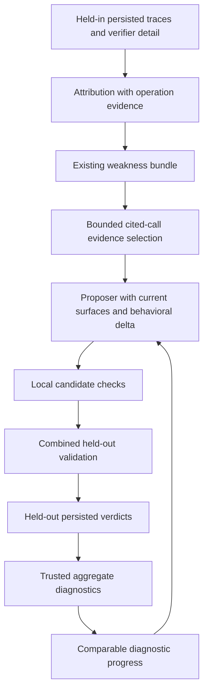
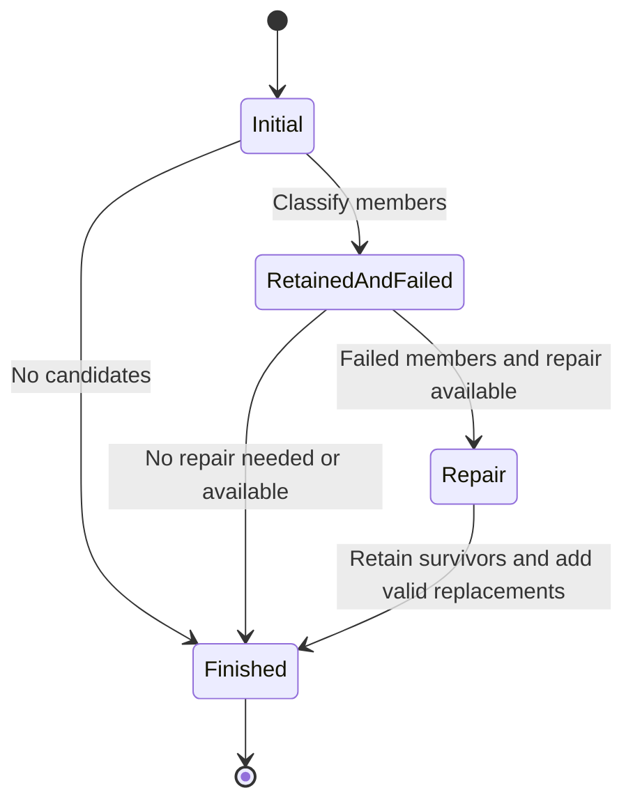

# Evidence-grounded proposals and diagnostic progress - Plan

## Goal Capsule

- **Objective:** Experiment operators receive actionable proposals tied to observed failures, and can distinguish an unsuccessful edit from a direction that still shows partial progress.
- **Means:** Strengthen attribution evidence, select relevant trace excerpts, require a concrete behavioral difference, permit bounded surface retargeting, and expose task-aware diagnostic progress in history (KTD1–KTD6).
- **Authority:** The user-requested behavior is captured in R1–R12. Requirements govern behavior, KTDs govern implementation within those requirements, and implementation units govern sequencing.
- **Execution profile:** Focused changes to the existing optimization loop, with deterministic tests and recorded-artifact checks.
- **Stop conditions:** Stop implementation for a conflict with R9–R12 that cannot be resolved within this scope. Missing optional legacy evidence is represented as unavailable.
- **Delivery:** An implementing agent completes U1–U6 and the Verification Contract. This planning deliverable does not launch an experiment, publish a PR, or update the paper.

---

## Product Contract

### Summary

Improve the evidence and behavioral specificity of proposals within the current optimization loop.
Allow its existing repair attempt to reconsider an ineffective target, and preserve comparable secondary-quality gains as potentially promising history.
Record the methodological changes separately for a future paper update.

### Problem Frame

The latest OOLONG Pairs experiment completed four rounds with one promotion.
Two rounds generated no usable edits, including responses that explicitly called their own candidates no-ops.
Another candidate added coverage guidance even though the incumbent already required coverage checks.

A diagnosis inferred skipped questions from missing output pairs despite a trace showing classifications for every parsed record.
The proposer received first/last root snippets instead of the operation needed to assess that diagnosis.
The incumbent S2 also mixes an aggregate-count example with per-record label guidance, making a replacement or explicit scope boundary more useful than another appended reminder.

Round 3 failed promotion as exact passes fell from 2/10 to 1/10, while recorded all-attempt mean F1 rose from 0.6388 to 0.7561.
That is a diagnostic reason to consider a refined proposal, with uncertainty and regressions attached.
The underlying evidence and methodology rationale are recorded in [the separate paper-update note](../analysis/2026-09-14-proposal-quality-methodology-notes.md).

### Requirements

**Diagnosis and evidence**

- R1. Attribution must distinguish omitted input, wrong or uncertain intermediate results, and faulty aggregation/predicate evaluation using evidence of the operation it identifies.
- R2. Unsupported claims about child correctness must remain explicitly unverified; missing output elements alone cannot establish incomplete input coverage.
- R3. Proposal evidence must prioritize cited calls and the relevant parsing, merging, checking, or filtering operation within the existing excerpt budget.

**Proposal behavior and repair**

- R4. Every newly generated candidate must describe incumbent behavior, the observed remaining failure, and its concrete behavioral change before presenting replacement text.
- R5. Repeating an existing instruction more emphatically is insufficient justification; proposal guidance must prefer replacing or clearly scoping conflicting examples when that is the smallest effective change.
- R6. Semantic aggregation and predicate failures must favor S3/S4; S9 proposals must address defects observable through its documented answer/inventory contract.
- R7. The existing repair attempt may retarget a rejected member to another eligible, unoccupied surface for the same pattern, retaining valid members and enforcing one edit per surface and one per pattern.

**History and experimental constraints**

- R8. A rejected evaluated subject with a comparable secondary-quality gain must appear in subsequent proposal history as potentially promising, with the failed promotion, contrary measurements, and uncertainty retained.
- R9. Diagnostic progress must support task-specific verifier details beyond F1, and remain unassessed when measurements or comparison semantics are unavailable.
- R10. Preserve `v=1`, held-out-only combined validation, current exact-pass/cost promotion gates, configured proposal limits, and existing model-call/repair budgets.
- R11. Keep held-out task, answer, identifier, and trace content out of proposer history; preserve immutable artifacts and reproducible replay.
- R12. Record the high-level changes outside this plan for a later paper update, without modifying the repository's current paper.

### Key Decisions

- **Improve proposals inside the existing loop.** The user selected small evidence, proposal, and repair changes after reviewing the failed rounds. Governs R1–R7, R10.
- **Preserve partial-progress directions without weakening promotion.** The observed round-3 tradeoff motivates diagnostic history alongside the failed gate. Governs R8–R10.
- **Preserve paper-update material separately.** The current paper is outdated and must remain untouched. Governs R12.

### Acceptance Examples

- AE1. **Covers R1–R3.** A run reports 188 classifications and no missing parsed-record IDs but has missing answer pairs. The proposer sees that check; attribution distinguishes parsed-record coverage from label correctness and original-input parsing coverage.
- AE2. **Covers R1–R2.** A run demonstrably leaves input slices unexamined, or loses classifications after a parse error. Attribution cites the relevant omission or failed parse instead of using missing pairs as its evidence.
- AE3. **Covers R4–R5.** S2 already requires record-ID checks but shows a count-only example for a task requiring user/date joins. A candidate explains that conflict and replaces/scopes the example with a consistent return contract.
- AE4. **Covers R6–R7.** An unchanged S9 member and an independently valid S2 member enter repair. The S2 artifact remains byte-identical; the failed pattern can move to an eligible unused S3/S4, or withdraw if no effective target exists.
- AE5. **Covers R8–R11.** The recorded round-3 comparison is rejected and potentially promising: all-attempt F1 0.6388 → 0.7561, exact passes 2/10 → 1/10, one malformed candidate attempt. No held-out pair examples or instance IDs enter history.
- AE6. **Covers R8–R9.** An OOLONG candidate improves its verifier's `score` but fails promotion. It receives the same diagnostic treatment without requiring an F1 field; an unsupported verifier reports progress unassessed.

### Scope Boundaries

This follows the completed [September 13 proposal-quality plan](2026-09-13-1159-fix-oolong-proposal-quality-plan.md).
It extends that plan's evidence/history adapter and retained-member repair.

No new optimizer, semantic judge, candidate tournament, validation arm, patience policy, stronger proposer model, or automatic experiment launch is included.
Starting harnesses and previously promoted surfaces are not hand-edited as part of this change.
Worked examples guide proposed candidates through the ordinary gates.

#### Deferred to Follow-Up Work

Measure whether the changes produce more usable proposals, promotions, or rounds in a separately requested experiment.
Actual paper revision remains a later task using the separate methodology note.

---

## Planning Contract

### Research That Shapes the Design

- `shrlm/optimization/types.py` keeps verifier-authored `Verdict.detail` separate from `AttributionDetail`; neither free-text channel changes the closed failure-signature key.
- `shrlm/environments/oolong.py` deliberately records partial `score` in detail while keeping promotion binary. GraphWalks and OOLONG Pairs record set metrics in detail. There is no universal numeric-detail interpretation.
- `proposal_evidence.trace_excerpt` ignores attribution node IDs and selects first/last root blocks. `walker.build_call_tree` already reconstructs stable node IDs, caller blocks, and child relationships.
- `attribution.validate` checks node existence, not whether an operation proves a mechanism. The digest labels root iteration/block coordinates; focused child excerpts may show only prompt/response.
- `MECHANISM_SURFACE` and `MECHANISM_SURFACES` both place lossy aggregation on S9 first. S9 sees an answer and redacted inventory, not intermediate values.
- `propose_round` already retains materialized/preflight-valid members, but repairs are locked to original pattern/surface pairs. Whole-batch duplicate checks currently run before retention.
- `load_round_history` derives annotations from persisted evidence without changing ledgers. It already distinguishes bundled constituents from the evaluated combined subject.

### Key Technical Decisions

#### KTD1. Extend attribution detail with operation evidence and verification limits.

Implements R1–R2.
Keep the existing mechanism enums and clustering key.
Add a bounded `operation_evidence` list and a short `verification_limits` string to `AttributionDetail`.

Each operation entry names an existing node, an observation, and optional iteration/block coordinates when visible in the digest.
Use root node `r` for root operations even when there are no subcalls.
Preserve existing `evidence_node_ids` for call citations.
Require an observed operation for an asserted agent mechanism, or an explicit evidence limitation with an appropriately uncertain/unattributed diagnosis.

Validate field shape and referenced coordinates against the reconstructed tree.
Describe root coordinates consistently in the digest; do not require coordinates that focused child excerpts never displayed.
Legacy details lacking these fields remain readable as unavailable.
Known coordinates prove that a citation resolves, not that a causal claim is true.

Tighten mechanism definitions and attribution instructions: coverage is relative to a stated input/record universe; valid JSON and complete IDs do not verify labels; a faulty combine operation can be described without asserting that its inputs were correct.
Use existing `other` detail for semantic errors outside the taxonomy rather than adding a classification ontology.
Use sub-verdicts only for what their checks actually establish; `level_grounded` alone is not proof that every child label is correct.

#### KTD2. Select evidence from the existing call tree under a shared budget.

Implements R3.
Use the existing walker instead of inventing a second node-ID parser.
Prioritize an explicit operation citation, then the cited child's caller and nearby consumer code.
For old node-only citations, inspect the caller and the next two nonempty blocks in that caller's execution order; include a bounded child prompt/return excerpt for the cited call.

Distribute the existing nominal 4,800-character excerpt payload across selected code, results, and child context.
Account for truncation markers and bound location metadata separately.
Deduplicate shared caller blocks, preserve deterministic execution order, and label every excerpt with its node/iteration/block location and selection reason.
Do not rely solely on first/last blocks when a relevant citation resolves.

If citations are absent, invalid in legacy data, or point into missing trace content, say so and use a bounded structural excerpt labelled as a fallback.
SHA/linkage mismatches remain integrity errors.
Selection is an observation aid, not a claim that neighboring code caused the failure.
Continue the existing passing-example selection with explicit partial-evidence labels.

#### KTD3. Make behavioral change a proposal contract and allow example replacement.

Implements R4–R5.
Add three bounded nonempty strings to new candidate responses and persisted proposals: `incumbent_behavior`, `observed_failure`, and `behavioral_change`.
Place them before `edit` in the response example and retain `predicted_effect` as the expected outcome.
The fields should describe one observed operation and a concrete changed action, not repeat the failure signature.

The proposer must return no candidate for a surface when it cannot state an effective difference.
Reject missing/empty required fields, explicit absent-change sentinel values, and materialized no-ops through existing local rejection/repair paths.
Prompt and repair instructions explicitly disallow emphasis alone as sufficient justification.
Do not add a keyword-based semantic classifier or claim deterministic detection of all paraphrased no-ops.

Revise minimal-edit guidance to permit deleting/replacing an obsolete example.
The record-label example should use a single return contract and a short executable ID-coverage check, including missing, duplicate, and unknown IDs and invalid labels.
Check duplicate IDs before collapsing results into a mapping; a JSON object cannot retain duplicate-key evidence.
Keep labels as semantic judgments, metadata/root aggregation as deterministic operations, and task predicates task-derived.
Any illustrative IDs/data are synthetic and do not encode benchmark answers.

#### KTD4. Retarget failed members within the existing repair state.

Implements R6–R7.
Make lossy aggregation's primary surface S3 and its allowed tuple S3/S4, updating both maps and adjacent definitions.
Other mechanisms keep their existing allowed sets.
For predicate/label errors represented as `other`, prompt guidance selects the surface that can change the operation, favoring S3/S4 for aggregation/predicates.
Across every mechanism, S9's documented capability boundary remains explicit in initial and repair prompts.

Track repair eligibility by original failed pattern and stable proposal slot, with the old surface retained as audit information.
A repair can keep that surface or choose another currently eligible surface not occupied by a retained member.
Retargeting must revise the behavioral-change explanation.
Retained proposal IDs, hashes, and contents are immutable; retargeted candidates use their original slot with the new surface suffix.

Once a response is parseable and within the candidate-count cap, classify per-member defects before deciding which members to retain.
Keep independently valid members even when another member is unchanged, malformed, or part of a duplicate-surface group.
Reject conflicting members as a group rather than arbitrarily treating the first as correct.
An invalid pattern index grants no new repair scope; the model can withdraw it.
The whole-response parse/count rejection path stays bounded.

Repair sees retained surfaces and failed-member reasons, can withdraw failed members, and cannot introduce an unrelated pattern.
Collision checks cover retained plus repaired members.
Repair exhaustion, refusal, or malformed output preserves valid survivors; an empty repair produces no extra call.
This consumes the already configured repair opportunity, not another generation stage.

#### KTD5. Normalize trusted verifier detail without changing Verdict or promotion.

Implements R9–R11.
Extend the existing read-only evidence adapter with a small environment-dispatched interpretation of saved detail.
Its common diagnostic representation carries the quality measure's name, direction, aggregation, scoring coverage, and missing-score policy.
No new metric framework, LM judgment, rescoring, or persisted `Verdict` schema is needed.

| Verifier environment | Recorded primary diagnostic | Mean interpretation | Additional context |
|---|---|---|---|
| OOLONG Pairs | F1 | Higher is better; all attempts | Missing/extra counts and their measured denominator |
| GraphWalks | F1 | Higher is better; all attempts | Missing/extra counts and their measured denominator |
| OOLONG | score | Higher is better; all attempts | Answer-kind/coverage summary |
| Unsupported detail format | Unavailable | No comparison | Existing exact outcome and cause summary |

Use strict full-format parsers and finite/range checks for these verifier-authored formats.
Environment identity and verifier configuration come from persisted evaluation contracts, never model-written candidate metadata.
Reuse the existing pair parser and share the identical set-metric parsing with GraphWalks where appropriate.

For the supported bounded quality measures, known unscored terminal causes contribute zero to the all-attempt mean.
Also recognize OOLONG's exact verifier-authored empty-marker failure as a known zero contribution; it is emitted without a numeric score even by the current verifier.
An ordinary legacy verdict without recorded metrics remains unknown and makes the comparison unavailable.
Count summaries cover only measured attempts and disclose their denominator.
Unknown metrics are never guessed from arbitrary free-text numbers or inferred from a passing verdict.

Expose bounded raw `Verdict.detail` in held-in diagnosis/proposal context so tasks without recognized numeric measures still carry their verifier observations.
Use the existing detail-render budget and remove redundant task-specific header payload where necessary.
Only sanitized aggregates from the trusted interpretation enter held-out history.
Future verifier formats require an explicit interpretation of direction/aggregation before numeric progress can be assessed.

#### KTD6. Add an advisory comparison beside the unchanged rejection.

Implements R8–R11.
Derive a versioned diagnostic-progress record while loading history, not by rewriting promotion ledgers.
It contains `potentially_promising`, `no_measured_improvement`, or `not_assessed`, plus a fixed explanation and the compared aggregates.

Compare a rejected evaluated subject only with its own recorded incumbent baseline.
Require the same verifier configuration, measure definition, aggregation/failure policy, and evaluated instance/attempt set.
Check those identifiers internally without exporting them.
A strictly favorable change in the designated primary diagnostic at its saved precision yields `potentially_promising`; do not select whichever auxiliary count happens to improve.
This is descriptive and adds no statistical significance threshold.

Always show exact-pass changes, terminal-failure counts, available cost, and secondary regressions beside the annotation.
State that `v=1` provides no reliable causal estimate.
A missing baseline, incompatible contract, unequal evaluation set, missing legacy measurement, or unevaluated proposal yields `not_assessed` with a reason.

A combined evaluation owns its diagnostic record.
Render constituent behavioral-change descriptions so the proposer knows what was attempted, but do not allocate the batch gain among members.
The history instruction permits a materially different refinement of a promising direction while retaining the ban on replaying the same rejected edit.
The annotation does not affect ranking weights, stopping patience, evaluation, or promotion.

#### KTD7. Preserve old artifacts and version changed live contracts.

Implements R11.
Bump attribution prompt/validator versions, digest version when rendered content changes, taxonomy version for the revised mechanism/routing contract, and proposal prompt/validator versions.
Include the evidence-selector and diagnostic-renderer versions in the live proposal contract so an incompatible unsealed checkpoint cannot replay silently.

New candidates require the behavioral fields; historical proposals and attribution details remain readable with missing fields explicitly unavailable.
Keep the persisted proposal envelope format additive: the versioned new-generation validator requires the fields, while historical readers accept their absence without inventing old rationales.
Do not rewrite sealed proposal results, ledgers, bundles, or experiment directories.
Reopening a completed round can read its historical result; attempting to extend an incompatible unfinished round must fail the existing contract check clearly.
Use new run directories for subsequent changed-method experiments.

### High-Level Technical Design

The evidence and history paths meet only at proposal rendering:

The bounded repair transition preserves surviving edits:

### Assumptions and Limits

The selected changes are expected to improve proposal usefulness; their effect on promotions remains an empirical question.
Semantic quality rules remain partly model-followed instructions, while local validators enforce structure, references, surface eligibility, and literal change.
A wrong explanation can still cite a real operation, and a novel edit can still reduce performance.

The execution topology is unchanged.
There is no need for new public commands, external services, or agent tools.
Maintainers of analysis readers must account for the new taxonomy/prompt versions when comparing future experiments.

---

## Implementation Units

### U1. Require operation evidence and preserve uncertainty in attribution

**Goal:** Diagnoses expose the operation and limits supporting a mechanism.

**Requirements:** R1–R2, R11; KTD1, KTD7.

**Dependencies:** None.

**Files:** `shrlm/optimization/attribution.py`, `shrlm/optimization/types.py`, `shrlm/optimization/digest.py`, `shrlm/optimization/taxonomy.py`; `tests/optimization/test_attribution.py`, `tests/optimization/test_types.py`, `tests/optimization/test_digest.py`, `tests/optimization/test_mining.py`, `tests/optimization/test_bundle.py`.

**Approach:**

1. Extend the optional stored attribution detail and new-response validation, preserving old readers and clustering behavior.
2. Render resolvable root operation coordinates and explicit verification limits using existing digest bounds.
3. Tighten the diagnosis instructions and mechanism definitions per KTD1, then update affected contract/version assertions.

**Test scenarios:**

- Covers AE1: a complete parsed-record coverage check appears alongside unknown label correctness; a canned response claiming unavailable verification must state its limits.
- Covers AE2: omitted slices and lost parse results remain valid distinct observations.
- Unknown node/block references are rejected within existing attribution attempts.
- Root-only and aggregated-child-table digests allow available citations without demanding invisible child identifiers.
- Legacy details still round-trip; adding evidence wording does not split a failure-signature cluster.
- Tests distinguish structural citation validation from semantic truth, rather than treating a canned LM response as proof of diagnosis quality.

**Verification:** Persisted attribution carries resolvable evidence/limits, and failure-mode fixtures retain their correct uncertainty and grouping.

### U2. Select proposer excerpts around cited execution

**Goal:** The proposer can inspect the code supporting or contradicting a diagnosis.

**Requirements:** R3, R11; KTD2.

**Dependencies:** U1.

**Files:** `shrlm/optimization/proposal_evidence.py`, `shrlm/optimization/proposal.py`; `tests/optimization/test_proposal_evidence.py`, `tests/optimization/test_proposal.py`.

**Approach:**

1. Resolve citations through `build_call_tree` after the existing manifest/hash join.
2. Assemble deterministic, deduplicated excerpts from operation/caller/consumer locations under the shared payload cap.
3. Render locations, selection reasons, missing evidence, and verification limits without duplicating the same trace payload.

**Test scenarios:**

- Covers AE1: a cited child call in iteration 3 reveals the coverage check in iteration 5, while a preview and final-ready block do not displace it.
- A nested child's cited operation selects the correct caller instead of a root block with the same iteration index.
- Several cited children sharing a block do not duplicate it or exhaust the payload budget.
- Empty/legacy citations and partial traces produce labelled fallbacks; a SHA mismatch raises.
- Large code/stdout/child returns stay bounded after truncation markers; repeated rendering is byte-identical.
- Held-out data paths are never opened by held-in trace selection.

**Verification:** Compact local fixtures reproduce the useful coverage excerpt within the cap, and persisted-source files remain unchanged.

### U3. Add behavioral-difference fields and coherent-example guidance

**Goal:** New proposals explain what changes and can replace contradictory instructions.

**Requirements:** R4–R5, R10–R11; KTD3, KTD7.

**Dependencies:** U2.

**Files:** `shrlm/optimization/proposal.py`, `shrlm/optimization/candidates.py`; `tests/optimization/test_proposal.py`, `tests/optimization/test_candidates.py`.

**Approach:**

1. Carry the three fields through candidate validation, materialization metadata, proposal serialization, and historical loading.
2. Update initial/repair instructions and the response example to require the comparison before replacement text.
3. Revise minimal-edit and record-workflow coaching to encourage replacing/scoping incompatible examples.

**Test scenarios:**

- A new candidate missing a required field is rejected; an older persisted candidate loads with those fields unavailable.
- An explicit absent-change value and a byte-identical materialized edit fail locally; a paraphrase is not falsely advertised as machine-verified novel behavior.
- Covers AE3: a replacement candidate documents count-only incumbent behavior, required user/date associations, and the new return/coverage contract.
- A synthetic example's coverage check detects duplicate, missing, unknown IDs and invalid labels before lossy mapping construction.
- A task requiring only aggregate counts retains an explicitly scoped applicable example.
- Fields survive write/load/history access, and prompt text still permits an empty array and a single effective proposal.

**Verification:** New response contracts and old artifact readers both work; no starting harness changes are required.

### U4. Route semantic edits and permit bounded repair retargeting

**Goal:** An ineffective target can be corrected without discarding useful edits.

**Requirements:** R6–R7, R10–R11; KTD4, KTD7.

**Dependencies:** U3.

**Files:** `shrlm/optimization/taxonomy.py`, `shrlm/optimization/proposal.py`; `tests/optimization/test_taxonomy.py`, `tests/optimization/test_proposal.py`, `tests/optimization/test_batch_validation.py`.

**Approach:**

1. Update lossy-aggregation routing and capability guidance consistently in taxonomy, prompts, and assertions.
2. Replace failed pattern/surface locks with original-pattern repair eligibility and stable slot tracking.
3. Preserve independently valid members during local failures, then check repaired members against all occupied surfaces and patterns.

**Execution note:** Establish the retained-member/retarget integration cases before changing the proposal loop.

**Test scenarios:**

- Covers AE4: an unchanged target retargets to an allowed free surface while a valid S2 member retains its ID, hash, and bytes.
- An unrelated pattern, occupied surface, or ineligible S9 target is rejected.
- A duplicate-S9 group does not discard an independently valid S2 member.
- A malformed repair or exhausted output budget keeps retained survivors and consumes no additional attempt.
- Empty repair withdraws failed members; a round with only one effective surface produces one candidate.
- Final survivors merge once and trigger one combined validation, with no individual validation.
- Replay of a sealed result returns the same survivors without another model call.

**Verification:** Candidate identity and one-edit-per-surface guarantees hold through repair, and configured attempt limits remain unchanged.

### U5. Generalize diagnostic progress in proposal history

**Goal:** Failed attempts with partial gains remain visible as potentially promising directions across tasks.

**Requirements:** R8–R11; KTD5–KTD6.

**Dependencies:** U3 for behavioral descriptions; otherwise independent of U4.

**Files:** `shrlm/optimization/proposal_evidence.py`, `shrlm/optimization/digest.py`, `shrlm/optimization/proposal.py`; `shrlm/environments/oolong_pairs.py`, `shrlm/environments/graphwalks.py`, `shrlm/environments/oolong.py` as needed for shared detail interpretation; `shrlm/experiment/orchestrator.py`; `tests/optimization/test_proposal_evidence.py`, `tests/optimization/test_digest.py`, `tests/optimization/test_proposal.py`; `tests/experiment/test_orchestrator.py`.

**Approach:**

1. Implement the small trusted detail interpretations and common aggregate representation, retaining useful existing pair diagnostics.
2. Add held-in verifier-detail context and derive comparison records from each evaluated subject and its recorded baseline.
3. Render progress/rejections together, including combined-member descriptions without individual credit.

**Test scenarios:**

- Covers AE5: recorded round-3 values yield rejected plus potentially promising, with the malformed attempt counted as zero and count denominators disclosed.
- Covers AE6: OOLONG `score` improvement follows the common path; unsupported detail and missing legacy metrics remain unassessed.
- Equal/decreased primary quality is not promising merely because an auxiliary count improves.
- The common comparison honors declared direction rather than an F1-name branch.
- Different instance/attempt sets, verifier configurations, or metric definitions cannot be compared.
- Known terminal failures, all-unscored rounds, nonfinite values, and malformed detail follow KTD5 without rescoring answers.
- OOLONG's current explicit-empty-marker failure contributes zero, while an unrecognized legacy `NO_ANSWER` detail remains unknown.
- An unevaluated local rejection has no measured-progress claim.
- A combined subject gets one progress record, and its constituents get no independent measured gain.
- Canary task text, instance IDs, produced/gold answers, and arbitrary detail/error text never enter held-out history.
- Existing ledgers and decisions remain unchanged after history loading.

**Verification:** History generated from local fixtures preserves the intended round-3 nuance and demonstrates a non-F1 task using the same comparison behavior.

### U6. Verify compatibility, end-to-end context, and methodology documentation

**Goal:** Deliver the changed contracts as a coherent, reviewable follow-up.

**Requirements:** R1–R12; KTD7.

**Dependencies:** U1–U5.

**Files:** `tests/optimization/test_proposal_evidence.py`, `tests/optimization/test_proposal.py`, `tests/optimization/test_ablation.py`, `tests/optimization/test_audit.py`; `tests/experiment/test_orchestrator.py`; `shrlm/docs/harness-proposal-interface.md`, `shrlm/docs/experiment-metrics.md`; `docs/analysis/2026-09-14-proposal-quality-methodology-notes.md`.

**Approach:**

1. Audit reader/version/checkpoint interactions across attribution, proposal, and derived history.
2. Build compact synthetic fixtures for the observed failures so tracked tests do not require the local experiment directory.
3. Update technical interface/metrics documentation and reconcile the separate methodology note with the implementation actually delivered.

**Test scenarios:**

- A persisted held-in record becomes a cited bounded excerpt, then a proposal with behavioral fields, then a retained/retargeted merged candidate using fake model responses.
- Reloading rejected validation history gives the next proposer the correct advisory progress without changing promotion.
- Completed legacy artifacts remain readable; an incompatible unfinished proposal contract is rejected before additional paid work.
- The taxonomy change is visible to existing audit/comparability checks.
- Regression coverage confirms R10's validation and call-count invariants.

**Verification:** Documentation matches the delivered contract, the paper remains untouched, and the Verification Contract passes.

---

## Verification Contract

No tests or model calls run during planning.
Implementation uses deterministic fixtures and mocked LM responses; existing live-test opt-ins stay disabled.

| Check | Scope | Completion evidence |
|---|---|---|
| Targeted optimization/experiment tests | U1–U6 | Citation, budget, repair, compatibility, history, and privacy scenarios above pass |
| Saved-artifact inspection | U2, U5 | Read-only reconstruction matches the round-4 coverage observation and round-3 all-attempt diagnostics when local artifacts exist |
| `uv run ruff check --fix .` | Changed repository | No lint errors or unrelated fixes retained |
| `uv run ruff format .` | Repository convention | Changed files conform; inspect and remove unrelated formatting churn |
| `uv run pre-commit run --all-files` | Repository convention | Required hooks pass |
| `uv run pytest` | Existing offline suite | No regression in mining, proposal, validation, or experiment persistence |

Tests do not prove that the model will consistently diagnose correctly or produce better candidates.
A future experiment must report usable-proposal frequency and promotion outcomes before making that empirical claim.
That experiment is outside this plan.

---

## Definition of Done

- U1–U6 satisfy their verification outcomes and all R1–R12 have coverage.
- The next proposer can inspect relevant execution, state a concrete delta, and refine a promising rejected direction under the unchanged gates.
- Repair retains valid edits and can retarget eligible failed patterns without collisions or extra calls.
- History demonstrates both F1 and non-F1 diagnostics, honest missing-data behavior, and batch-level attribution.
- Existing artifact hashes are unchanged, affected live contracts are versioned, and offline checks pass.
- Technical documentation and the separate methodology note match the delivered changes; the paper is untouched.
- No abandoned experiments, speculative framework, or unrelated cleanup remains in the diff.
