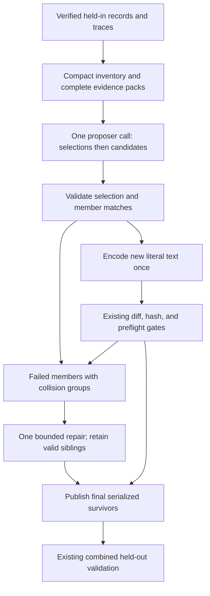

# Task-agnostic proposer improvements - Plan

## Goal Capsule

- **Objective:** Experiments produce more usable, evidence-supported harness interventions across tasks, with fewer proposal calls wasted on formatting errors and duplicate surfaces.
- **Means:** Host-owned text encoding, explicit surface selection, execution-based explanations, task-derived guidance, and bounded complete evidence (KTD1–KTD5).
- **Authority:** The five changes requested on September 15 define scope. Product requirements govern behavior; technical decisions govern implementation within those requirements.
- **Execution profile:** Six focused units in the existing proposal path, verified with deterministic fixtures and mocked model responses.
- **Stop conditions:** Do not weaken promotion or expose held-out task payloads to satisfy proposal-quality goals. Escalate a contradiction that requires either change.
- **Delivery:** Implementation ends with verified code and updated contract documentation. A paid experiment, PR, or merge needs the corresponding user instruction; this request produces the plan and methodology record.

---

## Product Contract

### Summary

Move template encoding into the host and make the proposer select one intervention per surface before writing replacements. Ground its explanation in the unresolved execution operation, replace the benchmark recipe with questions derived from the task, and spend a shared evidence budget on complete operations and useful contrasts.

### Problem Frame

The latest OOLONG Pairs experiment completed three rounds with zero promotions. Five of six S2 submissions failed template formatting; both attempts in round 1 repeated two competing S3 edits. The admitted S2 intervention addressed record coverage while its cited failure concerned semantic labels. One S3 contender proposed a recovery the trace had already performed.

Reconstructed system prompts were approximately 158–174k characters, including roughly 35k of repeated legacy answer dumps per round. Relevant operations were sometimes split by equal per-field excerpt limits. Earlier OOLONG Pairs, OOLONG, and GraphWalks artifacts show related construction and reasoning failures, although differences between runs prevent causal comparisons. Evidence and limits are recorded in `docs/analysis/2026-09-15-task-agnostic-proposer-review.md` and its linked audit.

### Requirements

**Proposal construction**

- R1. New S1–S5 proposals contain literal instruction text under an explicit versioned contract; the host performs template encoding once and preserves supported tool insertion.
- R2. Existing serialized harnesses and completed proposal artifacts retain their bytes, hashes, and load behavior; formatting preflight still runs on new materialized candidates.
- R3. The proposer explicitly selects at most one evidence-supported intervention per surface before generating replacements, within the existing call and candidate limits.
- R4. Collision repair chooses one contender or withdraws contenders while preserving valid siblings; retargeting remains limited to the same failed pattern and an eligible unoccupied surface.

**Proposal reasoning**

- R5. The existing three explanation fields compare the edit with observed execution and identify the unresolved operation, the changed action, and why that action addresses the demonstrated cause.
- R6. Guidance distinguishes successful checks, recovered failures, unverified claims, and remaining failures; structural coverage does not establish correct semantic labels.
- R7. Generic guidance derives information-retention needs and final conditions from the task instead of prescribing the OOLONG record-ID procedure; authoritative environment and surface contracts remain present.

**Evidence and experimental integrity**

- R8. Keep a compact pattern inventory and expand a few distinct mechanisms within one shared rendered-evidence budget, preferring complete relevant operations and supported successful or recovered contrasts.
- R9. Remove duplicate raw answer dumps when trusted diagnostics cover them; unknown verifier formats retain bounded original evidence without invented measurements.
- R10. Preserve held-in-only proposal evidence, aggregate-only held-out history, existing potentially-promising annotations, one combined candidate decision, held-out-only validation, `v=1`, and the current promotion/cost gates.
- R11. Record this iteration in the existing methodology notes outside the plan, separating proposed changes from implemented changes and measured effects; leave the paper unchanged.

### Acceptance Examples

- AE1. **Covers R1–R2.** A replacement containing a JSON object and an f-string survives materialization and prompt rendering with its intended visible text. Reloading the saved candidate does not encode either a second time.
- AE2. **Covers R3–R4.** Two mechanisms compete for S3 and an independent S2 edit is valid. Repair returns one selected S3 contender or withdraws both; S2 retains its serialized bytes and identity.
- AE3. **Covers R5–R6.** A trace has complete IDs but wrong valid labels. The proposal must explain a change to the unresolved labeling operation; another coverage check cannot claim to resolve semantic correctness.
- AE4. **Covers R5–R7.** A failed child result was discarded and replaced successfully. Guidance requires a remaining defect before proposing the same recovery as a final-answer fix. For an “exactly one” condition, retaining counts may matter; set membership alone is insufficient.
- AE5. **Covers R8–R10.** Several patterns repeat the same operation and answer dump. The prompt shows the inventory, one complete operation for that mechanism, and an available relevant contrast within budget, with no held-out question or answer payload.

### Success Criteria

Offline fixtures must eliminate template-only repair for valid literal S1–S5 edits, reject conflicting surface assignments without losing valid siblings, and respect the rendered-evidence cap. Prompt review must show the unresolved-operation challenge and task-derived reasoning across OOLONG Pairs, OOLONG, and GraphWalks fixtures.

These checks establish construction and context behavior. More usable proposals, better causal explanations, more promotions, and longer experiments remain empirical hypotheses for a later authorized experiment; mock responses cannot establish them.

### Scope Boundaries

No changes to mining taxonomy, clustering/ranking, pool sizes, patience, model choice, validation gates, or resource limits. No additional selection call, model judge, general semantic validator, or execution of model-authored examples. S6–S10 payload representations retain their existing contracts.

The review's separate suggestions for a new history-revision requirement and executable-example probes are deferred. Existing history diagnostics remain in scope only for preservation under R10.

---

## Planning Contract

### Assumptions

The request says “these 4” but enumerates five changes; all five are included. The existing proposal attempt and local repair limits are sufficient. A shared evidence cap applies to evidence added to the prompt, while complete current surfaces, authoritative instructions, and existing history remain separately accounted overhead.

### Key Technical Decisions

- KTD1. **Separate new literal input from stored templates.** Introduce host-owned `literal-text/v1` for new S1–S5 specs, identified by the proposer contract and persisted provenance. Stored `shrlm-harness/v2` and `shrlm-proposal/v1` artifacts remain format-ready. Encode only at new-spec materialization, before diffing and hashing; loaders never encode. Remove instructions asking the model to double braces. JSON string escaping remains necessary for the response transport and is separate from template escaping. Governs R1–R2.

  Render current S1–S5 surfaces in the same literal view. Use a reserved proposal-only marker, starting with `<<custom_tools_section>>`, for the live tool slot, so literal `{custom_tools_section}` text is distinguishable from template insertion. If that marker already occurs in an incumbent literal span, choose the first unused numbered variant deterministically; seal the selected marker in the proposal contract and use it for the whole round and its repair. Decode stored format syntax for display without substituting tool content; encode literal braces and translate the reserved marker to the runtime slot. Do not use a repeated replace/unescape heuristic. The existing `escape_braces` helper preserves a brace-named slot, so its behavior must not silently change for current callers. Other surfaces keep their current display and storage representation.

- KTD2. **Select and author in one structured response.** Replace the live array response with a versioned object containing an ordered `selections` list followed by `candidates`. Each selection names a pattern index, surface, and brief evidence-based reason; each candidate must match exactly one selection. At most `k` selections, unique patterns and surfaces, and a one-to-one match are host-checked before materialization. The prompt asks for selection first; the host checks the declared choice, not the model's hidden reasoning order. Empty lists mean withdrawal. Governs R3–R4.

  Apply selection/matching errors to implicated members, preserving independent valid siblings. Do not choose the first duplicate, merge unrelated contenders, or let duplicate JSON object keys silently overwrite one another. Invalid top-level JSON or an ambiguous envelope uses the existing bounded whole-response parse retry; errors attributable to a parsed member remain local. Collision repair receives explicit contender groups, occupied surfaces, and allowed remaining surfaces. It returns replacement selections and candidates only for failed original patterns; omission withdraws them. The single-repair and existing parsing/transport limits remain unchanged.

- KTD3. **Refine the existing fields rather than add a semantic gate.** Keep `incumbent_behavior`, `observed_failure`, and `behavioral_change` with their existing 600-character limits. The first describes what the relevant execution actually did, distinguishing it from what the surface instructed. The second cites the unresolved operation and verification limits. The third states the changed action/value and answers: “If this edit were followed perfectly, could the demonstrated failure still happen for the same reason?” If yes, revise the mechanism claim or withdraw. Governs R5–R6.

  Prompt examples contrast wrong-but-valid labels with missing coverage, and recovered intermediate errors with unresolved failures. Deterministic validation checks fields, selection links, and literal no-ops; it does not claim to establish causal relevance from arbitrary prose. Do not build keyword rules that pretend to detect semantic correctness.

- KTD4. **Replace prescriptive benchmark guidance.** Remove `OOLONG_RECORD_GUIDANCE` from the generic proposer and substitute one compact task-derived reasoning block. Ask which information each step must preserve and which conditions the final computation must enforce. Counts, dates, identity, order, provenance, units, and asymmetric roles are considerations, not a required checklist for every edit. Keep OOLONG Pairs `ANSWER_CONTRACT` conditional on its environment, and keep callable/surface capability restrictions. Governs R7.

- KTD5. **Budget rendered evidence, selecting whole operations.** Set a versioned default budget of 32,000 characters for the complete evidence section, including inventory, diagnoses, task questions, verifier observations, contrasts, JSON escaping, labels, and omission notices. Expand at most `min(k, 4)` mechanisms. This is an evidence cap, not a claim that arbitrary incumbent surfaces or history fit within a fixed whole-prompt cap. Record evidence and full-prompt character counts in the existing proposal audit. Governs R8–R9.

  Start with an inventory of original pattern indices, signatures, support, and eligible surfaces. Rank expansion candidates deterministically by resolvable operation evidence, then existing support/rank and stable IDs; prefer different mechanisms before a second example of one mechanism. Inspect matching held-in records within the selected pattern for a better representative instead of always taking the first. Preserve original indices and pattern identity; do not mutate the mining bundle or its ordering.

  A relevant code block is an indivisible unit. Include its caller/consumer when needed to interpret it; allocate output text from the remaining space rather than splitting every field equally. If an operation or task question cannot fit intact, try another representative or omit the expansion with an explicit reason. Never describe a head/tail code fragment as a complete operation. Bound long stdout/child payloads with explicit truncation markers and retain verification limits.

  Prefer a directly related subsequent recovery operation from the same held-in trace; otherwise choose a relevant passing held-in operation when available. Code proximity or an absent exception does not prove recovery: preserve observed outcomes and uncertainty. If no relevant contrast exists, say so rather than inserting an unrelated first/last block. Deduplicate shared code by stable run/node/iteration/block identity and reference it from relevant patterns. A contrast counts against the same budget.

  Prefer existing trusted verifier diagnostics and a few bounded examples over legacy produced/expected lists. Unknown formats get bounded verbatim evidence labelled unparsed. Keep compact inventory entries for unexpanded patterns; absence of an expansion is not evidence that a direction is exhausted. If the compact inventory alone exceeds the cap, return a recorded local proposal rejection before a model call, using the existing handled failure path.

- KTD6. **Version live generation without migrating artifacts.** Bump proposal prompt/validator to `3.0.0` and evidence selector to `3.0.0`; retain diagnostic-history `1.0.0` unless its interpretation changes, which this plan does not require. Add response-format and literal-text contract identifiers to the sealed proposal contract, cache identity, and new provenance. Historical v1 proposal loaders remain unchanged because they load full serialized harnesses, not raw replacement specs. Governs R2, R10.

  A legacy array is invalid under the new live response contract; do not guess which text encoding it intended. Changed contracts must refuse an unfinished paid replay before any call. Completed artifacts remain readable without being rewritten. Use a new experiment directory for any later live evaluation.

### High-Level Technical Design

| Representation boundary | Input | Output | Encoding action |
|---|---|---|---|
| Current-surface display | Stored format-ready S1–S5 | Literal view with tool-slot marker | Decode for display only |
| Live proposal response | Literal text plus selection | Validated new spec | None |
| New-spec materialization | Validated literal spec | Format-ready harness field | Once |
| Proposal persistence | Materialized harness | Hashed full harness envelope | None |
| Historical load/replay | Saved harness envelope | Same harness | None |

### Risks and Mitigations

The largest compatibility risk is confusing literal text with an already encoded template. KTD1 and KTD6 make the boundary explicit and test it through serialization and reload. The new response shape can introduce parsing errors; keep its schema small and preserve existing bounded retries and valid-sibling behavior.

Evidence selection can hide a useful minority mechanism. Retaining the inventory, stable tie-breaks, omission reasons, and alternative representatives makes that choice inspectable. Complete code may still rely on unavailable state, so completeness labels apply to the shown operation, not the entire causal chain. Prompt instructions can still be ignored; empirical proposal quality remains unproven until measured.

### Sequencing

U1 establishes the text boundary. U2 establishes selection and repair. U3 implements evidence budgeting. U4 combines those contracts with revised reasoning guidance. U5 verifies orchestration and replay. U6 documents the final behavior and the limits of the evidence. No new runtime dependency is needed.

---

## Implementation Units

### U1. Encode literal instruction text at materialization

**Goal:** Remove template syntax as a model repair task.

**Requirements:** R1–R2; AE1. **Dependencies:** None.

**Files:** `shrlm/optimization/proposal.py`, `shrlm/rlm_harness.py`, `tests/optimization/test_proposal.py`, `tests/optimization/test_candidates.py`, `tests/test_harness_surfaces.py`, `tests/test_harness_identity.py`.

**Approach:** Apply KTD1 at `render_current_surfaces` and `materialize_candidate_harness`. Preserve the existing runtime template contract and reuse real harness serialization and diff gates. Start with characterization coverage for saved-template display, hashing, and reload before changing new-spec input semantics.

**Patterns to follow:** `escape_braces`, `build_candidate`, `changed_surfaces`, and `check_harness`.

**Test scenarios:**

1. Covers AE1. JSON dictionaries, set literals, f-strings, unmatched ordinary braces, and deliberate doubled literal braces retain their exact visible text after materialization and prompt formatting.
2. The live tool marker inserts tools once; literal brace text spelling `{custom_tools_section}` stays literal; adjacent braces do not corrupt either interpretation. An incumbent containing the default marker receives a non-colliding marker and still round-trips unchanged.
3. Displaying and resubmitting an unchanged incumbent remains a no-op after encoding; it cannot become a candidate merely through brace normalization.
4. Save, load, and reserialize a new candidate without changing its hash or visible text. A legacy saved harness loads byte-identically.
5. S6–S10 representations, including S10 literal skill bodies, retain their existing behavior. Genuine invalid harnesses still fail preflight.

**Verification:** Literal examples no longer need brace-specific repair, while template checks and one-surface diff checks still run.

### U2. Make surface selection explicit and repair collisions

**Goal:** Resolve competing interventions before replacement admission.

**Requirements:** R3–R4; AE2. **Dependencies:** U1.

**Files:** `shrlm/optimization/proposal.py`, `tests/optimization/test_proposal.py`.

**Approach:** Implement KTD2 in response extraction, member validation, and repair construction. Keep selection reasons in the saved response/attempt audit. Reuse retained-member handling, failed-slot identities, and checkpoint publication; extend those paths rather than introducing a second proposal stage.

**Patterns to follow:** `validate_batch_members`, `propose_round`, and current interrupted-publication/retarget tests.

**Test scenarios:**

1. Unique eligible selections with matching candidates materialize; one justified surface yields one candidate, and empty lists yield none.
2. Covers AE2. Duplicate S3 selections or replacements reject the conflicting members, retaining an independent valid S2; repair explicitly chooses one contender or withdraws both.
3. Missing selections, unmatched replacements, duplicate patterns, duplicate JSON keys, unknown surfaces, and excess entries produce named bounded failures without silently overwriting candidates. Member-local errors preserve siblings; an ambiguous top-level envelope takes the bounded parse-failure path.
4. Repair cannot overwrite occupied surfaces, add unrelated patterns, or retarget without a revised behavior claim. A valid retarget preserves sibling bytes and IDs.
5. Malformed or output-exhausted repair ends within current limits and publishes surviving siblings. Cache replay does not repeat a paid call.

**Verification:** Every published member has one declared unique selection; collisions do not consume an extra selection-stage call or discard valid siblings.

### U3. Select compact, complete held-in evidence

**Goal:** Replace repetitive fragments with inspectable operations under one measured budget.

**Requirements:** R8–R10; AE5. **Dependencies:** None.

**Files:** `shrlm/optimization/proposal_evidence.py`, `shrlm/optimization/proposal.py`, `tests/optimization/test_proposal_evidence.py`, `tests/optimization/test_proposal.py`.

**Approach:** Apply KTD5 across evidence loading and rendering. Preserve SHA/run/verdict integrity checks. Reuse existing call-tree citations and verifier interpretations; separate evidence gathering from deterministic final packing so JSON overhead is counted where it is rendered. Remove repeated raw answers from `_render_pattern_block` when their bounded diagnostic replacement is present.

**Patterns to follow:** `load_proposal_evidence`, `trace_excerpt`, `bounded_excerpt`, and existing exact-attempt linkage tests.

**Test scenarios:**

1. Covers AE5. Repeated mechanisms share one complete operation, retain all compact pattern identities, and never exceed the rendered cap, including quotes, Unicode, JSON escapes, and notices.
2. A late cited child call and its relevant consumer remain complete; a short stdout leaves space for code instead of wasting an equal field share.
3. An oversized operation is replaced by another representative or explicitly omitted; no mid-operation truncation is labelled complete.
4. A discarded intermediate result and its later replacement appear together when supported. An unavailable contrast is labelled unavailable; an unrelated passing run is not called recovery evidence.
5. Known diagnostics suppress duplicate large answer lists; unknown verifier detail remains bounded and labelled without fabricated scores.
6. Missing or ambiguous legacy links remain unavailable, while hash/verdict/instance mismatches fail loudly as today. Only held-in traces are eligible.
7. Stable input yields stable selection and prompt hashes. Empty bundles, no passing runs, unexpanded patterns, and an oversized inventory have explicit bounded outcomes.

**Verification:** Rendered fixtures satisfy the budget, preserve citation identity and complete code, and keep the existing integrity boundary.

### U4. Ground explanations in execution and task conditions

**Goal:** Make the proposer justify an effective behavioral change across tasks.

**Requirements:** R5–R7, R10; AE3–AE4. **Dependencies:** U1–U3.

**Files:** `shrlm/optimization/proposal.py`, `tests/optimization/test_proposal.py`, `tests/optimization/test_proposal_evidence.py`.

**Approach:** Apply KTD3–KTD4 to the task, response examples, and repair guidance together. Remove obsolete brace and record-recipe instructions instead of appending competing rules. Keep existing field limits and literal no-op validation.

**Test scenarios:**

1. Covers AE3–AE4. A held-in synthetic wrong-label case and an already-recovered child-output case expose the actual operation and the counterfactual challenge in the rendered prompt.
2. OOLONG Pairs, OOLONG, and GraphWalks fixtures receive the same task-derived reasoning, with each environment's existing authoritative contracts intact.
3. Multiplicity, dates, order, and asymmetric roles are examples of possible task needs, not unconditional instructions to build record IDs or pairs.
4. A blank, overlong, or explicit no-op explanation remains invalid. A well-formed explanation is not reported as semantically verified.
5. Existing potentially-promising history annotations retain rejection reasons, contrary metrics, batch attribution, and unknown-measure handling.

**Verification:** Review the complete rendered prompts for contradictions and task-specific anchoring. Mocked responses prove plumbing only; no test claims the live model now diagnoses causes correctly.

### U5. Seal contracts and verify the combined proposal path

**Goal:** Make replay and orchestration safe across the live protocol change.

**Requirements:** R1–R4, R8–R10. **Dependencies:** U1–U4.

**Files:** `shrlm/optimization/proposal.py`, `shrlm/optimization/proposal_evidence.py`, `shrlm/experiment/orchestrator.py`, `tests/optimization/test_proposal.py`, `tests/optimization/test_candidates.py`, `tests/experiment/test_orchestrator.py`.

**Approach:** Apply KTD6 to contract sealing and provenance, and persist the KTD5 size/selection audit. Add a mocked end-to-end round covering literal text, a surface conflict, one repair, and final combined validation. Reuse existing stage markers and failure handling.

**Test scenarios:**

1. A valid literal S2 and repaired S3 yield one combined candidate evaluation, using the configured held-out attempts and no held-in validation arm.
2. Changing text, response, or evidence contracts refuses unfinished paid replay before calling the provider; the old artifact remains unchanged.
3. Completed historical proposals without new provenance fields still load. Replaying a new sealed result preserves hashes, IDs, and persisted counters.
4. An interruption before final publication resumes from the checkpoint without double encoding or repeating paid work.
5. A local inventory-budget rejection is recorded through the current handled proposal failure path and does not crash the experiment.
6. History contains only allowed held-out aggregates, never raw held-out questions, answers, or traces.

**Verification:** The integrated path preserves experimental protocol and can resume safely under a matching contract.

### U6. Document the next proposer iteration

**Goal:** Preserve the rationale and final contract for operators and the later paper update.

**Requirements:** R11. **Dependencies:** U1–U5 for implementation wording.

**Files:** `README.md`, `shrlm/docs/harness-proposal-interface.md`, `docs/analysis/2026-09-14-proposal-quality-methodology-notes.md`.

**Approach:** Document the new literal/selection contract, evidence accounting, semantic limits, and fresh-directory requirement. Replace README's obsolete OOLONG recipe description. The methodology note already records the planned iteration; update its implementation evidence only after implementation checks actually run.

**Test expectation:** No new tests for prose; check links and consistency against the implemented contracts.

**Verification:** Readers can distinguish earlier implemented behavior, this iteration's changes, and effects that still need a live experiment. The paper remains unchanged.

---

## Verification Contract

Implementation verification uses offline deterministic tests with synthetic held-in examples and mocked providers. Existing local experiment artifacts may support read-only prompt reconstruction, but are optional evidence and must not become committed test dependencies. Do not copy held-out task payloads into proposal fixtures.

Run the focused proposal/evidence/candidate/orchestrator and harness tests named in U1–U5, then the repository's required `uv run pytest`, Ruff checks/formatting, and pre-commit checks from `AGENTS.md`. Report new failures separately from independently established baseline failures; historical reports of baseline failures do not excuse an unexamined current failure. No paid run is required to establish implementation correctness.

Compare rendered prompt section sizes with the saved September 15 audit where artifacts are available, reporting the evidence reduction and full-prompt size separately. Check proposal validity, preserved siblings, call counts, and unchanged batch validation in fixtures. A later authorized experiment should measure usable proposals per call, repair/rejection reasons, causal relevance on inspected samples, and both exact and secondary validation outcomes.

---

## Definition of Done

- U1–U5 satisfy their enumerated scenarios and the verification gates; no new regressions remain unexplained.
- Each requirement maps to an implementation unit, and the literal/selection/evidence contracts agree across prompts, parsers, persistence, and documentation.
- Historical artifacts retain their hashes and load behavior, and no new path exposes held-out payloads to the proposer.
- U6 records implementation evidence without presenting intended gains as measured results.
- Remove replaced prompt blocks, abandoned parser paths, and experimental helper code from the final diff.

---

## Sources

- `docs/analysis/2026-09-15-task-agnostic-proposer-review.md` and `docs/analysis/2026-09-15-proposer-review-audit.json`: latest proposal failures, prompt sizes, cross-run comparisons, and limits.
- `docs/analysis/2026-09-14-proposal-quality-methodology-notes.md`: previous implemented iteration and the outside-plan record for this iteration.
- `docs/plans/2026-09-14-0951-fix-evidence-grounded-proposals-plan.md`: prior behavior-field, repair, evidence, and generic history work.
- `shrlm/optimization/proposal.py`: current direct text materialization, per-member gates, repair, and contract sealing.
- `shrlm/optimization/proposal_evidence.py`: verified held-in joins, per-field excerpt allocation, and trusted diagnostic history.
- `shrlm/rlm_harness.py`, `shrlm/runner.py`, and `shrlm/optimization/candidates.py`: runtime template, formatting preflight, serialized envelope, and historical-load boundaries.
