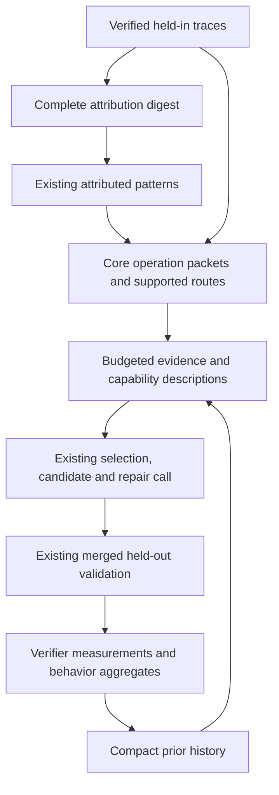
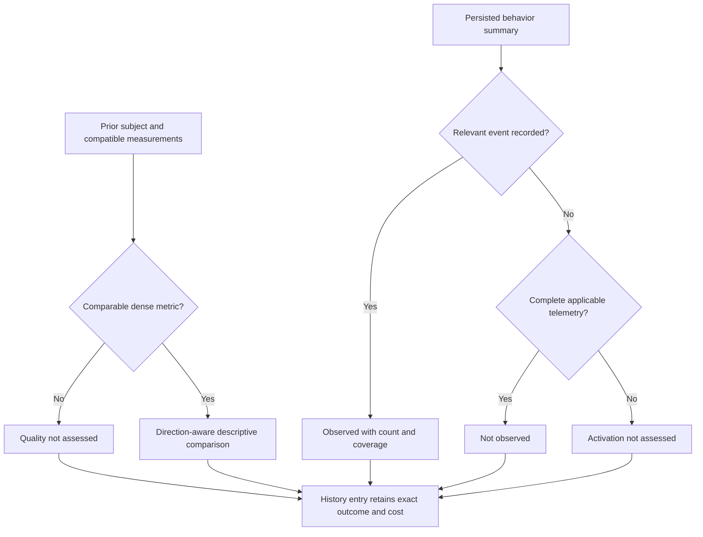

# Capability-aware proposal generation and observed history - Plan

## Goal Capsule

- **Objective:** Experiments produce better-supported harness proposals across useful surfaces, and subsequent rounds learn from what earlier interventions actually did and how their batches performed.
- **Means:** Accurate capability descriptions, supported S8/S5 routes, complete operation evidence, and compact behavior-and-quality history (KTD1–KTD6).
- **Authority:** The September 23 request selects four areas from `RESEARCH/meta-harness-optimization-2026-09-23/full_report.md`. Requirements below govern scope; technical decisions specify their implementation.
- **Execution profile:** Six implementation units in the existing optimization path, using deterministic fixtures and mocked model responses before any separately requested live experiment.
- **Stop conditions:** Do not satisfy proposal-quality goals by weakening promotion or exposing held-out task content. Report an implementation conflict that would require either change.
- **Delivery:** This document plans the work. Implementation should finish with checked code and methodology notes; experiment launch, PR creation, and merge follow the user's corresponding instructions.

---

## Product Contract

### Summary

Describe what each editable surface can observe and change, and admit S8 helpers and S5 recovery instructions for supported operations. Allocate bounded evidence across distinct mechanisms before adding surrounding context. Replace repeated proposal narratives with concise records of the intended change, observed activation, batch results, and substantive revisions. Let the verifier define any dense quality metric used in that history.

### Problem Frame

The September 16 experiment evaluated sixteen edits and promoted five, all on S2/S4. S8 was never eligible; S5 and S7 never received expanded evidence. Seven evaluated candidates targeted unexpanded patterns. Round 8's history occupied 47,342 characters of a 100,283-character system prompt. The rejected S6 policies claimed timeout recovery or chunk splitting, although their runtime fields only enabled same-prompt syntax retries.

The existing implementation already has literal-text encoding, selection before replacement generation, three behavior-explanation fields, complete proposer code blocks, a 32,000-character evidence cap, and potentially-promising diagnostic annotations. The remaining defects concern capability accuracy, admission and allocation, and the content and size of history.

The quality adapter also recognizes `oolong`, while `OolongVerifier.config()` emits `oolong_synth` or `oolong_real`. Tests supplying a hand-written environment string do not exercise that mismatch. Generic history should not own environment-name inference.

Evidence: `RESEARCH/meta-harness-optimization-2026-09-23/data/census.json`, `RESEARCH/meta-harness-optimization-2026-09-23/data/runtime-probes.json`, `docs/analysis/oolong-pairs-2026-09-23/rounds.csv`, and the implementation references in the Planning Contract.

### Requirements

**Capabilities and routes**

- R1. Attribution and proposal prompts use consistent descriptions of each surface's inputs, trigger, effect, scope, and limitations.
- R2. Admit deterministic S8 parsing/aggregation interventions and S5 recovery interventions through the narrow routes in KTD2 when relevant held-in operations are available.
- R3. Surface selection, candidate validation, and repair use the same eligible surface set; a repaired candidate cannot displace a retained sibling.

**Evidence allocation**

- R4. Distribute the existing proposer evidence budget across complete relevant operations from distinct mechanisms before optional context and contrasts.
- R5. Attribution digests show complete selected code blocks with original coordinates and explicit omissions; they do not portray clipped code as a complete operation.
- R6. Evidence ranking respects distinct-instance support, preserves original pattern identities, and records selection and omission decisions deterministically.

**History and measurement**

- R7. History distinguishes the intended behavioral change, available activation observations, and the measured batch outcome; unsupported behavior claims remain unassessed.
- R8. A proposal revisiting a prior intervention identifies that attempt and explains a substantive revision; an identical previously rejected evaluated harness under the same incumbent is refused locally.
- R9. Render history within a separate fixed budget while preserving the full archive and a compact accounting of omitted attempts.
- R10. Verifiers supply versioned definitions and structured measurements for an optional primary dense-quality metric; generic history does not infer quality from arbitrary text or environment names.
- R11. A comparable dense-quality gain remains potentially promising alongside exact-match regressions, cost, failures, and uncertainty; missing or incompatible measurements yield `not_assessed`.

**Experimental and artifact integrity**

- R12. Preserve one edit per surface, the existing one-pattern constraint, one merged candidate evaluation, held-out-only promotion, `v=1`, and current exact/cost gates and call/repair limits.
- R13. Only held-in task content enters diagnosis/proposal evidence; held-out history exports allowlisted aggregates without task IDs, code, prompts, answers, or raw verifier detail.
- R14. Completed artifacts remain readable without rewriting their bytes; changed live contracts refuse incompatible unfinished replay before a paid call.
- R15. Record the methodology outside this plan, clearly distinguishing planned, implemented, and measured results; leave the paper unchanged.

### Acceptance Examples

- AE1. **Covers R1–R3.** A cited merge overwrites values for repeated keys. S8 becomes a supported choice with an explicit helper call site. An S9 proposal requiring hidden record values remains outside that surface's capabilities.
- AE2. **Covers R2–R3.** A child error precedes the consuming root operation in an exhaustion trace. S5 can propose a changed recovery procedure. A terminal timeout with no inspectable recovery opportunity does not acquire that route merely from its cause label.
- AE3. **Covers R4–R6.** Coverage, parsing, and recovery each have complete packets that fit together. All three receive evidence before an optional contrast for coverage; repeated attempts on one instance do not outrank failures across distinct instances.
- AE4. **Covers R7–R9.** A saved policy claims timeout splitting, but its observable is syntax retries. History reports that distinction and available counts. Repeating its unchanged standalone evaluation under the same incumbent is rejected. Reusing it in a changed batch retains its prior record and requires a revised joint hypothesis.
- AE5. **Covers R10–R11.** Saved round 6 retains F1 0.6194→0.7193 with exact 1→0; round 8 retains F1 0.6128→0.6951 with exact 3→1. Both remain potentially promising batch observations, with their costs and no per-edit causal credit.
- AE6. **Covers R10–R14.** A verifier supplying a lower-is-better error metric gets the correct comparison without an environment-specific optimizer branch. A verifier supplying no metric remains `not_assessed`. Neither exports held-out answer content.

### Success Criteria

Offline fixtures demonstrate supported S8/S5 admission, multiple complete mechanism packets within the unchanged evidence cap, bounded history, and accurate activation/quality reporting across different verifier contracts. The saved round-6/8 diagnostic examples remain reproducible when those local artifacts are available; equivalent checked-in fixtures provide portable coverage.

Higher promotion rates and improved task performance require a subsequent experiment. Valid candidates, broader evidence access, or a detected hook event alone do not establish those outcomes.

### Scope Boundaries

No surface quotas, new semantic mechanism categories, extra critic calls, new validation arms, or changes to patience, pools, models, prices, or experiment configuration. Capability descriptions constrain proposal reasoning; they do not implement new runtime behavior.

#### Deferred to Follow-Up Work

Mining independent opportunities from successful runs, comparing instruction/helper/skill forms as a new selection requirement, executing model-authored behavioral fixtures, relaxing one-edit-per-pattern, and adding general helper-invocation instrumentation remain separate work. This plan uses existing activation evidence and reports its limits.

---

## Planning Contract

### Assumptions

The scope includes the attribution digest portion of evidence allocation because incomplete upstream code can misdirect the later proposer. It does not alter the attribution schema or introduce a semantic causality judge.

The existing held-in bundles, immutable trace links, validation summaries, and proposal checkpoints remain the storage foundation. Full instruction compliance is not deterministically observable from the present traces; an honest unknown is an expected history outcome.

### KTD1. Maintain one compact capability description per surface

Extend the existing surface metadata/rendering in `shrlm/optimization/taxonomy.py`, backed by `shrlm/rlm_harness.py`, `shrlm/runner.py`, and the runtime. Attribution and proposal prompts consume the same authoritative facts, with compact attribution rendering. Replace overlapping or misleading prose rather than appending another full description. Governs R1.

| Surface | Required capability fact |
| --- | --- |
| S1 | Factual environment/API contract; algorithmic strategy belongs elsewhere. |
| S2 | Decomposition instructions affect root and recursive children through the shared system prompt. |
| S3 | Execution instructions can change parsing, combining, and task-condition implementation; scope guidance to the current subtask. |
| S4 | Verification instructions can request checks but cannot supply an independent semantic oracle. |
| S5 | Recovery instructions guide model actions after a visible failure; they do not extend a terminated run or create host retries. |
| S6 | Explain each allowed field. Syntax retries repeat the same prompt; width/length limits refuse work. Local policy enforcement is root-only, while `max_depth` is inherited through RLM construction. |
| S7 | Receives execution output and redacted variable type/length inventory within the declared bound; cannot inspect hidden values or change child metadata. |
| S8 | Helpers run only when called, in the configured root/child namespace; names/docstrings support discovery, and a proposal must identify the intended caller. |
| S9 | Receives answer text and redacted inventory. `accept(text)` can accept transformed content; `redirect(nudge)` requests another root turn. |
| S10 | The index advertises a conditional procedure; its body affects behavior only when loaded or forwarded. |

Keep callable signatures and authoring formats in their existing owners. The capability table references those contracts rather than inventing new fields. Correct the blanket S6 reach explanation without changing the existing signature vocabulary or runtime propagation. Reference field-level exceptions anywhere the broad reach label is shown.

### KTD2. Add narrow routes with resolvable operation support

Keep existing primary surfaces and recorded pattern identities. Add the following alternate routes to `MECHANISM_SURFACES`, with the evidence requirements below enforced by a shared round-local eligibility resolver. Governs R2–R3, R6.

| Mechanism | Added surface | Support required for the new route |
| --- | --- | --- |
| `lossy_aggregation` | S8 | A complete cited combining operation and a proposed deterministic input/output contract. |
| `unparsed_child_output` | S8 | A complete cited parsing/consuming operation and the linked child return context. |
| `iteration_budget_exhaustion` | S5 | A linked failed child call or observed execution error with an inspectable recovery/consumer operation before termination. |
| `repl_execution_fault` | S5 | A visible execution failure and the operation where subsequent recovery can act. |

Resolve the operation facts from verified held-in links before packing. Freeze final support against the evidence actually admitted to the prompt. The inventory reports a newly added route as unavailable when its required packet cannot be included. Rendering, validation, and repair receive this same support map; repair cannot manufacture evidence or use a broader static map.

Add a bounded `evidence_refs` list to each live selection. For a newly added route, it must reference the admitted operation(s) belonging to that pattern. Its existing reason describes the surface's capability and intended call or recovery point. Coordinate membership, error events, and occupancy are structural checks; the host does not claim to prove semantic relevance from a model's explanation. Existing routes retain their current admission policy and receive the same capability guidance.

Recovery support establishes an opportunity, not that retrying would succeed. A later successful replacement must remain visible when present; the selection reason must identify any unresolved defect. A bare final resource-termination verdict is insufficient support for S5.

### KTD3. Allocate complete core packets before enhancements

Refactor evidence selection into core packets and optional additions within `proposal_evidence.py`. A core packet contains its task question, bounded diagnosis and verification limits, cited complete code, and the linked caller/return needed to interpret that citation. Following blocks are optional unless independently cited. Do not claim automatic reconstruction of all data dependencies. Governs R4–R6, R13.

Preserve the 32,000-character rendered-evidence limit and at most `min(k, 4)` expanded patterns. Use the bundle's distinct-instance/actionability ordering, prefer distinct mechanisms, and break ties by stable provenance. Legacy patterns without `instance_support` use their recorded instance-ID set when present, otherwise their existing order; never substitute repeated-run support for distinct support.

Allocation has two passes:

1. Admit one core packet per selected mechanism using an initial fair share of the remaining budget. Try another supported representative when necessary. Queue packets exceeding their initial share and redistribute unused space after other mechanisms have had an opportunity.
2. Use remaining space for queued complete packets, useful producer/consumer context, and relevant passing/recovered contrasts, in that order. Preserve the existing limits and uncertainty labels on contrasts.

Code blocks remain indivisible. Bound stdout and child payloads separately with explicit truncation markers. Count the inventory, JSON escaping, omission notices, and deduplicated operation references in the cap. An oversized question or required code block causes an alternate representative or a named omission, not a clipped code fragment. Record core/optional operation counts, expanded mechanisms, original pattern indices, and omission reasons in the evidence audit.

Apply whole-block selection to `digest.py` within its existing 12,000-character default budget, accounting for rendered overhead. Before attribution there are no operation citations: select from the existing structural signals—failed/errored focused children, their caller blocks, and terminal/root operations—and retain original node/iteration/block coordinates. Keep a compact skeleton identifying omitted blocks. Payload clipping remains explicit; code omission cannot silently renumber coordinates or imply that no operation occurred. Keep coverage accounting consistent with retained trace material. This is an allocation change, not a new diagnosis model.

### KTD4. Put the metric contract at the verifier boundary

Introduce a small typed optional primary-quality contract in `shrlm/optimization/types.py`. Each participating verifier publishes its definition in `config()` and emits a structured measurement with its verdict. The definition identifies the metric/version, direction, `all_attempt_mean` aggregation, measurement precision, and declared values for applicable unscored terminal causes. An absent measurement without an applicable declared value remains unknown. Governs R10–R11, R13–R14.

Use one primary dense metric per verifier in this iteration. Support higher- and lower-is-better values without assuming a universal zero or a [0,1] range. Require finite values and a matching measurement definition identifier. Unsupported aggregation or absent definitions remain unassessed. Explicitly malformed new metadata is a contract error; never quietly reinterpret it as legacy detail.

Add the optional measurement to `Verdict` serialization without changing its existing positional arguments. Absent measurements retain the legacy serialized shape. Persist the definition through existing verifier/evaluation contracts. Generic aggregation consumes these records without parsing `detail` or switching on task names. Preserve exact decisions and existing missing/extra diagnostics; dense progress remains advisory.

Move strict legacy interpretations behind a small compatibility adapter in `shrlm/environments/diagnostics.py` (new). It handles only the known saved contracts and existing detail grammars, including `oolong_synth` and `oolong_real`. It supplies the same normalized definition/value representation as a new verifier. Do not rewrite old verdicts or accept arbitrary numbers in diagnostic text. Historical missing values stay unknown except for the precisely supported terminal cases.

Initially preserve the current three-decimal measurement convention for the existing verifiers, including the round-6/8 examples. A future precision change needs a distinct metric definition version. Comparisons still require matching verifier/evaluation contracts, definition, and exact instance/attempt sets before comparing means. Export only fixed identifiers and numeric aggregates; arbitrary descriptor prose and exception text do not enter held-out history.

This choice extends the current verdict/config persistence path. It avoids a new runtime plugin system or a registry of model-generated metric parsers; no competing external mechanism needs a bake-off.

### KTD5. Summarize existing activation events once per evaluated subject

Extend the disk-only split aggregation in `validation.py`, where traces are already loaded and hash-verified. Persist an optional versioned behavior summary alongside existing aggregate metrics. History reads that summary and does not reopen held-out trace bodies. Governs R7, R13–R14.

Start with existing trustworthy observations: per-call syntax retry counts, root answer-redirect events, and named skill-load events. Distinguish the configured surface from the event that occurred. In particular, syntax retries cannot be labeled timeout splitting, and loading a skill does not prove following its procedure.

Traverse each canonical code-block call edge once; do not recursively scan duplicate serializations or double-count root and child copies. Report scope, observed event totals, measured run counts, and unknown/missing coverage. Root-only S6/S9 claims use root events. S10 can use named load events across the recorded tree, scoped to the changed skill.

The summary has three reporting states:

| State | Meaning |
| --- | --- |
| `observed` | A relevant host-recorded event occurred; report its count and coverage. |
| `not_observed` | The applicable event schema covers all required observed runs and reports zero events. This is not proof that another uninstrumented behavior did not happen. |
| `not_assessed` | No reliable detector, absent/incomplete telemetry, or insufficient linkage. |

Instruction compliance on S1–S5, S8 helper execution without invocation telemetry, and uninstrumented S6 fields remain `not_assessed`. S7 truncation counts may remain general diagnostics but cannot establish the correctness of a changed metadata formatter. Do not inspect code strings or response prose to manufacture activation claims.

For completed legacy summaries, use only already-persisted aggregates that have sufficient scope and coverage; otherwise mark activation unassessed. Do not backfill summaries or scan old held-out traces during proposal generation. The research's historical observation “no positive persisted retry count found” remains narrower than a certified absence of activation.

### KTD6. Bound history and require an explicit revision relationship

Build factual history records before rendering: stable round/subject identity, constituent membership, surface, mechanism when known, incumbent hash, effective edit fingerprint, intended change, available activation, rejection reason, and batch measurements. Keep predicted behavior explicitly labeled as a claim. Governs R7–R9, R11–R14.

Set a separate 12,000-character rendered-history budget. Deduplicate baseline/candidate diagnostics instead of rendering them again inside progress annotations. Retain a compact recent/relevant index and spend detail space on predecessors matching current mechanisms/surfaces, potentially-promising directions, and recent rejections. Whole entries are admitted deterministically; older omitted records receive counts and status totals. The full artifact archive remains available but is not recursively pasted into the prompt. This cap does not purport to bound complete incumbent surfaces or the whole system prompt.

Maintain a host-side index over all available prior attempts, independent of prompt compaction. Add a live `revision` field identifying the prior round/subject or null, with a short explanation of the changed operation or newly supported applicability. For a revisited intervention, require a resolvable reference and nonempty revision explanation. Resolve fingerprints from effective, host-materialized surface content so brace spelling or JSON ordering cannot evade an exact duplicate check.

Reject an identical previously evaluated/rejected harness under the same incumbent before paid validation. The identity gate compares the effective standalone candidate or complete merged batch, matching the unit that received the prior outcome. An unchanged constituent in a changed batch is not individually rejected from that shared outcome: retain its prior reference, label it unchanged, and require an explanation of the changed joint intervention. A changed incumbent can also make an old intervention newly applicable; require an explicit prior reference and explanation tied to current evidence. Structural checks establish identity and required fields, not the truth of a prose claim of novelty. Do not blacklist an entire mechanism because one batch failed.

Place the authoritative identity check in `validate_round` after loader admission and `plan_batch`, before either baseline or candidate execution. Loader rejection can change the final batch, so checking only the proposer's requested members is insufficient. Pass the experiment-scoped prior-evaluation index from the orchestrator and seal its identity with the validation inputs. A duplicate produces a durable local, not-evaluated outcome through the existing rejection-only path, with the shared reason and prior subject reference; retain proposal artifacts and do not generate individual performance results or launch another repair call.

Selected prior records referenced by live candidates remain resolvable even when omitted from the prompt. Supply relevant exact-match predecessors in existing repair feedback within its budget; never add another proposer stage. Preserve retained siblings and current withdrawal behavior.

### KTD7. Seal the new contracts and retain completed readers

Version proposal prompt/validator and evidence selection to `4.0.0`, diagnostic history to `2.0.0`, taxonomy to `3.3.0`, and digest to `1.5.0`. The added selection references and candidate revision field require `proposal-selection/v2`; literal-text/v1 and stored harness/proposal envelopes remain unchanged. Give metric definitions and behavior summaries explicit v1 schema identifiers. Governs R12–R14.

Add capability/history versions, the history cap, and any behavior-observation contract identifier to the existing sealed proposal/evaluation inputs. Update the validation summary writer's format and retain readers for completed prior formats. Follow existing contract mismatch handling for unfinished work; a missing optional historical summary is not a reason to rerun a model call or mutate evidence.

### High-Level Technical Design

### Risks and Existing Boundaries

The largest risk is overstating what trace metadata proves. KTD5 limits claims to explicit events and separates unknown coverage. Another risk is losing relevant negative evidence through compaction; KTD6 retains a complete host index and prioritizes matching predecessors.

Evidence allocation can favor short examples over representative ones. KTD3 keeps support ordering, tries alternative supported representatives, and reports omissions. It does not require every mechanism or surface to receive a proposal.

Metric metadata changes persisted verdict/config contracts. KTD4 and KTD7 keep old reads separate from new writes and require regression fixtures using actual verifier configs. Integrity mismatches remain failures; an unsupported optional metric remains unassessed.

### Sources and Sequencing

Reuse the repository research in `RESEARCH/meta-harness-optimization-2026-09-23/`, the September 15 plan, and `docs/analysis/2026-09-14-proposal-quality-methodology-notes.md`. This plan requires local implementation knowledge; no additional external research is needed.

The traced path is held-in run persistence → digest/attribution → evidence packing → proposal selection/repair → combined validation → immutable summaries/ledger → `load_round_history`. Important existing owners are `pack_evidence`, `trace_excerpt`, `render_surface_block`, `evaluation_contract`, `split_aggregate`, and `load_round_history`.

U1 defines capabilities and route support. U2 supplies admitted packets. U3 and U4 supply independent quality and behavior summaries. U5 renders and uses that history. U6 closes versioning, integration, and documentation.

---

## Implementation Units

### U1. Describe capabilities and resolve supported routes

**Goal:** Make supported S8/S5 interventions available with accurate runtime constraints.

**Requirements:** R1–R3, R6; AE1–AE2. **Dependencies:** None. Verify the resolver with supplied packet fixtures; U2 integrates actual packing.

**Files:** `shrlm/optimization/taxonomy.py`, `shrlm/optimization/proposal.py`, `shrlm/optimization/attribution.py`, `tests/optimization/test_taxonomy.py`, `tests/optimization/test_proposal.py`, `tests/optimization/test_attribution.py`, `tests/test_harness_surfaces.py`, `tests/repl/test_local_repl.py`.

**Approach:** Implement KTD1–KTD2 using the existing surface map and proposal member validation. Keep operation-support resolution separate from prompt prose. Add support data to current round-local evidence plumbing rather than changing persisted failure signatures.

**Execution note:** Characterize S6/S7/S9 scope and effects against existing runtime behavior before rewriting their descriptions.

**Patterns to follow:** `render_surface_block`, `_pattern_surfaces`, `validate_batch_members`, and current retained-member retarget tests.

**Test scenarios:**

1. Covers AE1. A linked combining operation permits S8 on `lossy_aggregation`; a fabricated, missing, or foreign operation reference cannot support the new route.
2. Covers AE2. Error plus consumer context enables the new S5 route; a final timeout alone does not. A recovered error remains labeled recovered in evidence.
3. Prompt rendering, initial validation, and repair agree on eligible/occupied surfaces; independent valid candidates survive a rejected retarget.
4. Capability examples distinguish syntax retry from timeout recovery, refusal from batching, transformed acceptance from redirection, and inherited depth from root policy enforcement.
5. Complete current surfaces and literal template rendering remain intact; no OOLONG-specific strategy enters the generic descriptions.

**Verification:** Newly supported routes are reachable and auditable without broadening unrelated surfaces or changing runtime behavior.

### U2. Allocate complete evidence to distinct mechanisms

**Goal:** Supply usable operation evidence to more supported intervention types within current budgets.

**Requirements:** R4–R6, R13; AE3. **Dependencies:** U1 for final route visibility.

**Files:** `shrlm/optimization/proposal_evidence.py`, `shrlm/optimization/proposal.py`, `shrlm/optimization/digest.py`, `tests/optimization/test_proposal_evidence.py`, `tests/optimization/test_digest.py`, `tests/optimization/test_proposal.py`.

**Approach:** Apply KTD3 to candidate packet construction, deterministic packing, and attribution code selection. Pass the resulting supported-operation map into U1's resolver. Keep current trace/verdict/hash linkage checks.

**Patterns to follow:** Existing operation reference deduplication, alternative representatives, `instance_support`, digest node IDs, and rendered-budget tests.

**Test scenarios:**

1. Covers AE3. Three small complete mechanisms fit before one mechanism's large optional contrast; repeated attempts do not reverse distinct-instance ordering.
2. Oversized first packets allow smaller supported representatives or another mechanism to fit, with named omissions and no cut code.
3. Escaped strings, Unicode, notices, repeated operations, empty bundles, and an oversized compact inventory honor the exact rendered cap and existing handled rejection path.
4. Digests retain complete late caller/consumer blocks and original coordinates; missing necessary code is explicit. Coverage accounting and grounded/ablated focus behavior remain consistent.
5. A new S8/S5 route loses its support when its mandatory packet is omitted; repair cannot cite an unshown operation.
6. Held-out payload canaries never enter evidence, and mismatched trace hashes or run identities still fail loudly.

**Verification:** Deterministic synthetic fixtures prove budget fairness and completeness. Optional reconstruction of stored held-in bundles reports changes without rewriting artifacts or making model calls.

### U3. Persist verifier-owned dense quality measurements

**Goal:** Make partial-credit history work through an explicit task-independent contract.

**Requirements:** R10–R11, R13–R14; AE5–AE6. **Dependencies:** None.

**Files:** `shrlm/optimization/types.py`, `shrlm/environments/diagnostics.py` (new), `shrlm/environments/oolong_pairs.py`, `shrlm/environments/graphwalks.py`, `shrlm/environments/oolong.py`, `shrlm/optimization/proposal_evidence.py`, `shrlm/optimization/validation.py`, `tests/optimization/test_types.py`, `tests/optimization/test_proposal_evidence.py`, `tests/environments/test_oolong_pairs.py`, `tests/environments/test_graphwalks.py`, `tests/environments/test_oolong.py`.

**Approach:** Apply KTD4 at verdict production, serialization, saved contract reading, and generic comparison. Keep the existing dense-detail display and missing/extra counts available while removing task-name inference from the generic quality path.

**Execution note:** Preserve historical means and unknown-score semantics with characterization fixtures before moving the parsers.

**Patterns to follow:** `Verdict.to_dict/from_dict`, verifier `config()`, `history_diagnostics_from_data`, and current comparability checks.

**Test scenarios:**

1. Covers AE5. Portable equivalents of the saved round-6/8 verdict sets retain their F1 means, exact regressions, costs, denominators, and potentially-promising status.
2. Covers AE6. A fake verifier with an unfamiliar environment and lower-is-better metric works through its definition. No metric, unknown legacy detail, and incompatible definitions produce `not_assessed`.
3. Use actual `OolongVerifier` configurations for both synth and real, alongside GraphWalks and OOLONG Pairs; do not substitute hand-written environment names.
4. Measured zero, declared terminal values, and genuinely unknown missing scores remain distinct. Mixed unknown values cannot silently shrink the denominator.
5. Reject NaN, infinity, conflicting measurement IDs, and malformed declared schemas. Unequal attempt sets or verifier contracts cannot be compared.
6. New fields survive persistence; legacy verdicts load without changing their serialized shape or saved bytes. Held-out free text cannot leak through metric metadata.

**Verification:** Generic aggregation handles real and synthetic verifier contracts without changing any exact-pass or promotion decision.

### U4. Persist bounded activation observations

**Goal:** Give history trustworthy observations about the behavior of evaluated interventions.

**Requirements:** R7, R13–R14; AE4. **Dependencies:** None.

**Files:** `shrlm/optimization/validation.py`, `shrlm/runner.py`, `shrlm/optimization/proposal_evidence.py`, `tests/optimization/test_validation.py`, `tests/optimization/test_proposal_evidence.py`, `tests/test_harness_surfaces.py`.

**Approach:** Apply KTD5 during the existing aggregation pass and expose only the allowlisted summary to history. Reuse canonical recorded call edges and existing skill-load/answer-event fields; avoid a general event collection framework or runtime tool wrappers.

**Patterns to follow:** `split_aggregate`, `run_metrics`, `iter_skill_loads`, and manifest integrity checking.

**Test scenarios:**

1. Covers AE4. Syntax retry counts are recorded as syntax retries; they never become evidence of timeout splitting or a cap on model-written loops.
2. Nested calls and repeated serializations produce one count per canonical call edge. Root-only claims exclude child events.
3. Named skill loads distinguish the changed skill from unrelated existing skills; root redirects do not imply content correction.
4. Explicit complete zero telemetry gives `not_observed`; missing metadata, partially terminated runs, and absent detectors remain `not_assessed` with coverage counts.
5. History reads summaries without loading held-out trace bodies. Legacy missing fields do not fabricate zeros or trigger paid work.
6. Existing spend, exact, subcall, and promotion aggregates remain unchanged; corrupt available trace evidence still fails integrity checks.

**Verification:** Activation observations are persisted once, independently of quality, with sufficient provenance and no task content exported.

### U5. Render compact history and validate revision relationships

**Goal:** Make past outcomes useful without repeating unsupported claims or identical rejected edits.

**Requirements:** R7–R9, R11–R14; AE4–AE6. **Dependencies:** U1–U4.

**Files:** `shrlm/optimization/proposal.py`, `shrlm/optimization/proposal_evidence.py`, `shrlm/optimization/validation.py`, `shrlm/experiment/orchestrator.py`, `tests/optimization/test_proposal.py`, `tests/optimization/test_proposal_evidence.py`, `tests/optimization/test_batch_validation.py`, `tests/experiment/test_orchestrator.py`.

**Approach:** Apply KTD6 to `load_round_history`, history rendering, candidate specs, materialization identity, and member-local repair. Keep the unbounded factual index out of the rendered prompt and attach shared outcomes only to the evaluated subject.

**Patterns to follow:** `proposal_behavior`, `BEHAVIOR_FIELDS`, `_render_history_block`, canonical harness serialization, and `validate_batch_members`.

**Test scenarios:**

1. Covers AE4. An identical previously rejected standalone harness or full batch under the same incumbent fails locally even when its history entry is omitted. A loader-dropped sibling cannot evade the final identity check; neither baseline nor candidate is called. The shared not-evaluated result persists and replays without assigning individual scores.
2. A revised payload identifies its predecessor; an invalid reference or empty revision explanation is member-local failure and preserves valid siblings. A duplicate evaluated harness cannot pass by rephrasing its rationale.
3. An unchanged constituent in a changed batch retains the old shared outcome and a revised joint hypothesis; it does not inherit an individual rejection. A different incumbent requires an explicit prior relationship and current evidence. Neither case is labeled proved causal novelty.
4. Hundreds of rounds remain within the rendered-history cap, including serialization overhead, omission counts, reasons, and prioritized potentially-promising results.
5. Covers AE5. Batch F1 gains coexist with exact regressions, unknown activation, and cost. Neither member receives an individual quality score.
6. Unmaterialized attempts and empty rounds remain accounted for. Incomplete historical metadata stays unknown and does not prevent completed artifact reading.
7. Proposer/repair/cache replay preserves the selected history and operation references, uses existing attempt limits, and makes zero extra calls on completed replay.

**Verification:** The proposer receives compact measured history and must justify revisiting a prior intervention without a new model stage.

### U6. Seal integration and document the method

**Goal:** Deliver a consistent contract across fresh runs, replay, workers, and documentation.

**Requirements:** R1–R15. **Dependencies:** U1–U5.

**Files:** `shrlm/optimization/proposal.py`, `shrlm/optimization/proposal_evidence.py`, `shrlm/optimization/taxonomy.py`, `shrlm/optimization/digest.py`, `shrlm/optimization/validation.py`, `shrlm/experiment/orchestrator.py`, `tests/optimization/test_proposal.py`, `tests/optimization/test_validation_e2e.py`, `tests/optimization/test_batch_validation.py`, `tests/optimization/test_subject_worker.py`, `tests/optimization/test_run_worker.py`, `tests/experiment/test_orchestrator.py`, `README.md`, `docs/analysis/2026-09-14-proposal-quality-methodology-notes.md`.

**Approach:** Implement KTD7 through existing sealing and publication paths. Exercise a mock experiment that proposes supported distinct surfaces, validates once, persists metrics/activation, and feeds bounded history into the next round. Document actual implemented limitations under R15.

**Patterns to follow:** Existing no-paid-replay checks, completed proposal checkpoints, subject evaluation contracts, and batch constituent linkage.

**Test scenarios:**

1. A fresh mock round carries verifier definitions, complete evidence, capability-aware selections, one merged result, and bounded next-round history end to end.
2. Changed capability, digest, metric, history, or response contracts reject unfinished incompatible replay before a model call; completed old artifacts remain readable.
3. Interrupted publication and serial/parallel worker paths persist identical new metadata without double counting or losing revisions.
4. One-surface proposal behavior, retained-sibling repair, held-out-only evaluation, and unchanged promotion/cost decisions remain covered.
5. Repository documentation distinguishes implementation verification from measured improvements and leaves the paper and experiment configs untouched.

**Verification:** Targeted and repository-required checks pass, and every new persisted contract has explicit legacy-read behavior.

---

## Verification Contract

Use deterministic local fixtures, actual verifier instances, and mock completions for the unit scenarios. Preserve existing corruption and no-leak tests. Do not call providers to prove prompt construction, runtime field semantics, or metadata plumbing.

Run the relevant optimization, environment-verifier, harness-surface, REPL, and orchestrator suites first. Complete the repository's Ruff checks, formatting, pre-commit checks, and pytest suite before a later PR. Document unavailable live checks separately; do not enable live/provider flags merely to finish the plan's verification.

During implementation, an optional read-only replay of the named experiment can verify the round-6/8 means and compare evidence/history sizes. Check source artifact hashes before and after; portable fixtures remain authoritative for automated tests. Record candidate validity and evidence/activation coverage separately from task performance.

---

## Definition of Done

- U1–U2 expose the supported routes and complete operation evidence consistently under their budgets.
- U3–U5 preserve task-independent quality semantics, available activation observations, batch attribution, bounded history, and substantive revision requirements.
- U6 verifies fresh/replay/worker integration and documents the implemented method and its limits.
- R12–R14 remain covered by regression tests, and no paid experiment or historical artifact rewrite is required for completion.
- Obsolete prompt descriptions, duplicated generic environment parsing, and abandoned implementation paths are removed. Deferred work has not entered the diff.
- The methodology note records the implementation and validation evidence when work is complete; improved promotions or accuracy are claimed only after measurement.
