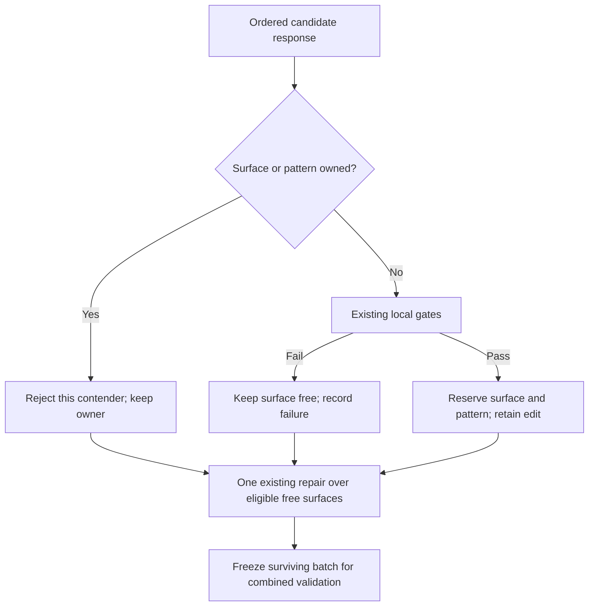

# Proposal admission and evidence fixes - Plan

## Goal Capsule

- **Objective:** Optimization rounds retain usable edits and offer the proposer distinct, evidence-supported opportunities to improve the harness.
- **Means:** Host-enforced surface ownership, smaller complete representatives across mechanisms, and explicit evidence for input-loss diagnoses (KTD1–KTD3).
- **Authority:** The September 23 request and the stopped experiment's `round-01-assessment.md`; the requirements below define this follow-up.
- **Execution:** Three bounded changes to the existing proposal and mining path, with deterministic regression fixtures before another live experiment.
- **Delivery:** This request produces a plan and methodology notes. Implementation, a new experiment, and publication are separate actions.

---

## Product Contract

### Summary

Keep the first usable proposal for a surface and make that surface unavailable to later proposals in the round. Choose compact, complete examples from different mechanisms before expanding repeated mechanisms. Show execution output alongside diagnosis code, and require a concrete input-loss observation before treating coverage loss as established.

### Problem Frame

In `experiment_oolong_pairs_dsv4f_20260923_123738`, round 1 submitted three S2 edits and repaired them into three S4 edits. The host rejected every contender in both collisions despite already telling the model to choose one. No edit reached validation.

The evidence prompt expanded patterns `[7, 0, 1, 2]`: one unattributed provider error without operation evidence and three coverage signatures. Aggregation and misaligned-unit patterns remained unexpanded. Smaller coverage examples existed under other signatures, but the first pass only considered the highest-ranked signature for each mechanism.

Two coverage diagnoses blamed a `Date:` filter for dropped records. The saved inputs had 188 record lines, all with that prefix; the traces printed 188 retained records. The saved attribution digests omitted those stdout observations, though they showed the corresponding print statements in some cases. The proposer subsequently received an unsupported causal diagnosis. A missing check establishes uncertainty, not an observed loss.

The experiment was stopped at the user's request on September 23 at 15:31 Chicago time. Round 1 completed 40 mining attempts, with 11 exact passes and mean F1 0.7589. Round 2 persisted nine attempts before interruption. There were no promotions or validation calls; recorded stage spend was at least $4.44617, excluding unrecorded unfinished work.

### Requirements

**Proposal admission**

- R1. Admit at most one usable edit per surface and per pattern in a round, preserving admitted siblings during repair.
- R2. A surface collision must not discard an otherwise valid owner; failed contenders may use an eligible unoccupied surface or withdraw within the existing repair allowance.
- R3. Invalid or unmaterializable proposals must not permanently occupy a surface.

**Evidence allocation**

- R4. Give distinct actionable mechanisms complete evidence before repeated mechanisms, searching alternative representatives across signatures of the same mechanism.
- R5. Keep unsupported or explicitly non-actionable patterns in the inventory without spending an expansion slot on them; an unattributed mechanism cannot authorize a proposal.
- R6. Preserve the existing rendered evidence cap, complete selected code, original pattern/run identities, and eligibility based on evidence actually shown.

**Diagnosis**

- R7. Include bounded execution outputs with selected diagnosis operations so observable results are not crowded out by additional code.
- R8. Treat input loss as established only when the diagnosis identifies an observed missing input unit/range or a coverage shortfall against the same input universe; output errors and absent checks alone are insufficient.
- R9. Carry unsupported or contradicted coverage hypotheses downstream as unestablished, without relabeling them as verified label or aggregation errors.

**Experimental integrity**

- R10. Keep the optimizer task agnostic, the existing model-call/repair limits, combined held-out-only validation, `v=1`, and current promotion gates.
- R11. Preserve historical artifacts and distinguish new contract behavior from old cached results; record the methodology outside this plan without changing the paper.

### Scope Boundaries

No new proposer stage, paid critic, surface quota, taxonomy category, input parser for a particular benchmark, or optimizer redesign. No configuration changes or automatic restart of the stopped experiment. New regression examples may reproduce the observed filter error, but production rules must also apply to documents, rows, chunks, pages, or other task inputs.

### Acceptance Examples

- AE1. **Covers R1–R3.** Three valid edits select S2. The first admitted edit survives; later contenders cannot replace it. If no other supported surface is appropriate, the round ends with one proposal.
- AE2. **Covers R3.** The first S2 contender fails materialization or preflight. A later valid S2 contender can become the owner.
- AE3. **Covers R4–R6.** A high-support coverage signature has a large packet, another coverage signature has a small complete packet, and aggregation has a medium packet. The allocator uses the smaller coverage representative so another mechanism receives evidence before repeated coverage.
- AE4. **Covers R7–R9.** A filter retains all observed records but the answer is wrong. The diagnosis states that input loss is unestablished; it does not invent dropped records. A trace showing an expected chunk range of 0–9 but calls only for 0–8 can support a loss claim.

---

## Planning Contract

### KTD1. First fully admitted proposal owns the surface

Process contenders in their returned candidate order through the existing local gates. Once a candidate passes spec validation, materialization, revision checks, and harness preflight, reserve its surface and pattern immediately. Reject subsequent contenders for that occupied surface or pattern individually, keeping the owner and independent siblings. Do not reserve on a malformed selection, orphan, no-op, or failed preflight. Governs R1–R3.

Replace the batch-wide duplicate-surface/pattern rejection in `validate_batch_members` with round-local occupancy enforced in `propose_round` at admission. Preserve exact selection-to-candidate matching: ambiguous duplicate selections for the same pattern/surface remain invalid rather than guessing which explanation applies. Record ownership and collision dispositions in the existing attempt audit, including the owner and original contender position.

The repair prompt lists occupied surfaces explicitly and offers each failed pattern only eligible unoccupied choices. Omission withdraws the contender; exhaustion returns the retained owner. If a pattern already has an owner, its other contenders are not repairable slots. Stable positions and candidate IDs must remain unique when failed same-pattern contenders precede a successful one.

The generation prompt states the same ordered selection rule. A single model response can still contain duplicates; the host guarantees admission, not token-by-token compliance while that response is being generated. First-valid order avoids another model call or a new quality-ranking stage, but does not claim to select the best colliding edit.

**Existing anchors:** `shrlm/optimization/proposal.py` (`validate_batch_members`, the sequential materialization/preflight loop, retained edits, and the one-repair prompt).

### KTD2. Select a small representative for each mechanism before repeats

Group expansion candidates by the existing `agent_mechanism`, keeping every original pattern in the inventory. Exclude packets without a resolvable cited operation or child-call observation, rows explicitly marked non-actionable, and signatures with `causal_status=unattributed` from expansion. An actionable `other` pattern with concrete evidence remains eligible; missing legacy actionability metadata is not automatically zero. Governs R4–R6.

Use the same round-local eligibility rule in rendering, validation, and repair: an unattributed signature has no eligible proposal surfaces. A nonzero actionability score cannot override this, because existing actionability also includes grounding and homogeneity. Keep unattributed rows visible with the reason for ineligibility; do not change historical bundle bytes or invent a new status.

For each mechanism, search all its patterns and existing alternate representatives for the smallest complete core packet by actual rendered incremental size. Preserve task question, diagnosis, verification limits, cited code, and the linked context needed by the existing core contract. Break equal-size ties by distinct-instance support, existing actionability order, pattern index, and run ID.

Use the existing support ranking to order mechanisms in the first pass, but use the compact representative found across the entire mechanism group. Admit at most one packet per mechanism before considering repeats. A packet that cannot fit remains inventory-only with an explicit reason; later smaller packets still get considered. Then fill remaining slots by existing support order, followed by optional context and contrasts. There is no guarantee that every mechanism fits and no requirement to fill all four slots.

This changes representative choice, not pattern identity or support counts. Do not attach one signature's evidence to another signature. Recompute supported S8/S5 routes from the operations actually admitted, as today. Add compact audit fields for distinct actionable mechanisms, selected representative sizes, and omission reasons; do not build a separate allocation framework.

**Existing anchors:** `shrlm/optimization/proposal_evidence.py` (`options`, `first`/`repeats`, `with_context`, `pack_evidence`, `operation_support`).

### KTD3. Preserve observed outputs and require a coverage witness

Pack each selected attribution code block together with short, separately labeled stdout/stderr excerpts before admitting additional code blocks. Reserve up to 500 characters per nonempty output stream, including explicit truncation markers and coordinates, within the existing 12,000-character digest cap. Keep code whole; if the packet cannot fit, omit it explicitly. Preserve error/focus priority and deduplicate outputs rather than emitting them again in the optional payload pass. Governs R7–R9.

Add one bounded `coverage_basis` object to live `incomplete_coverage` diagnoses: status (`observed_loss`, `not_established`, or `contradicted`), input scope, loss observation, and counterevidence. Limit each explanatory string to 500 characters. The loss observation must identify the missing input unit/range or same-scope coverage discrepancy and refer to the existing operation citations. Counterevidence must describe any visible completed processing or recovery, or state that none is visible. Neither a missing output element nor “no coverage check was run” is a positive witness.

Accept an honest `not_established` or `contradicted` assessment without another model call. Normalize that record to `other`/`unattributed`, retaining the original hypothesis and coverage assessment in detail. Do not present the rejected hypothesis as an actionable coverage mechanism in the bundle or proposer summary. `observed_loss` requires a nonempty witness and resolvable operation citations; contradictory field combinations or missing live fields use the existing bounded attribution rejection path.

The host validates structure, references, and consistency of the declared status. It cannot prove the semantic truth of a model-written witness. The prompt must explicitly distinguish original-input coverage from coverage of an already filtered subset, and coverage from label correctness. No regex over explanation prose or benchmark-specific count inference belongs in the host.

Carry the compact assessment through attribution detail, saved records, and proposer evidence. Legacy records without it stay readable and are labeled “coverage basis not assessed”; do not retrospectively mark their claims supported or rewrite their signatures. The new prompt instructs the proposer not to assume such a legacy coverage claim is established.

**Existing anchors:** `shrlm/optimization/digest.py` (`build_digest` currently fills code before outputs); `shrlm/optimization/attribution.py` (`ATTRIBUTOR_SYSTEM_PROMPT`, `Attributor.validate`); `shrlm/optimization/types.py` (`AttributionDetail`); `shrlm/optimization/mining.py` (record persistence); `shrlm/optimization/proposal_evidence.py` (detail-to-context projection).

### Contract changes and limitations

Each unit updates its owning prompt, validator, digest, or evidence-selector version where behavior changes. Keep existing literal-text encoding and proposal response structure unless a field must change. Saved completed results remain historical records; incompatible unfinished contracts must fail before another paid call. The stopped experiment remains unchanged.

The main remaining uncertainties are empirical: how often the model invents a coverage witness, whether smaller examples remain diagnostically useful, and whether first-valid candidates improve held-out performance. Offline tests can establish admission, accounting, and evidence delivery; they cannot establish better model reasoning or promotion rates.

### High-Level Technical Design

---

## Implementation Units

### U1. Enforce surface ownership during candidate admission

- **Goal / requirements:** Implement KTD1 for R1–R3 and preserve R10–R11.
- **Dependencies:** None.
- **Files:** `shrlm/optimization/proposal.py`; `tests/optimization/test_proposal.py`.
- **Approach:** Replace group rejection with per-contender admission; derive repairable failures after owners are known. Extend existing attempt records with collision ownership and update the live contract versions.
- **Patterns:** Reuse retained materialized siblings, original positions, bounded repair, frozen result checkpoints, and zero-call replay.
- **Test scenarios:**
  1. Covers AE1: three distinct patterns choose S2, repair repeats the collision, and the first valid owner survives unchanged.
  2. Covers AE2: the earlier contender fails spec, materialization, revision, or preflight checks; the next valid contender acquires the surface.
  3. A distinct-surface sibling survives; a failed contender can retarget to a supported free surface, but cannot displace either owner.
  4. Duplicate selections for one identity remain invalid without discarding an independent edit; orphans cannot reserve surfaces.
  5. Same-pattern contenders produce at most one owner, no colliding candidate IDs, and no repair slot that can replace that owner.
  6. Empty or exhausted repair retains survivors; resume reproduces the frozen batch without model calls, and incompatible unfinished contracts are refused.
- **Verification:** Collision handling can reduce a batch to one usable edit; it cannot manufacture an edit or bypass a preflight gate.

### U2. Allocate compact complete representatives across mechanisms

- **Goal / requirements:** Implement KTD2 for R4–R6 and preserve R10–R11.
- **Dependencies:** None; integrates with U1 through the existing eligible-surface map.
- **Files:** `shrlm/optimization/proposal_evidence.py`, `shrlm/optimization/proposal.py`; `tests/optimization/test_proposal_evidence.py`, `tests/optimization/test_proposal.py`.
- **Approach:** Replace the first-pattern-only mechanism pass with group-wide representative search; retain serialization accounting and operation deduplication. Update the evidence-selector contract and audits.
- **Test scenarios:**
  1. Covers AE3: a roughly 4k coverage packet under a lower-ranked signature replaces a roughly 15k representative, allowing a second roughly 15k mechanism within the existing cap.
  2. A tiny provider-error packet with no operation evidence stays inventory-only; an unattributed pattern cannot authorize an initial or repaired proposal even with nonzero actionability. Actionable grounded `other` still expands.
  3. Different mechanisms whose cores fit together precede repeated coverage, even when coverage has more attempts.
  4. Oversized code or task questions are omitted whole; every original inventory row and original selected pattern/run identity survives.
  5. S8/S5 support derives only from admitted qualifying operations; repeated renders and tied representatives give identical selections and budgets.
  6. With only one actionable mechanism, one complete packet remains useful and permitted repeats cannot fabricate additional surfaces or interventions.
- **Verification:** Exact rendered size stays within 32,000 characters and the existing four-pattern limit; synthetic regression inputs demonstrate at least two actionable mechanisms where the old selection concentrated on one.

### U3. Ground coverage diagnoses in observable input processing

- **Goal / requirements:** Implement KTD3 for R7–R9 and preserve R10–R11.
- **Dependencies:** U2 for final proposer evidence integration; digest and attribution work can be developed independently.
- **Files:** `shrlm/optimization/digest.py`, `shrlm/optimization/attribution.py`, `shrlm/optimization/types.py`, `shrlm/optimization/mining.py`, `shrlm/optimization/proposal_evidence.py`; `tests/optimization/test_digest.py`, `tests/optimization/test_attribution.py`, `tests/optimization/test_mining.py`, `tests/optimization/test_proposal_evidence.py`.
- **Approach:** Admit code/output packets, add the bounded coverage assessment, validate and persist its declared status, and project it into proposal evidence. Update the owning versions and append implementation evidence to the methodology note.
- **Test scenarios:**
  1. Covers AE4: a selected filter/parser prints retained counts; a full code inventory cannot evict its bounded output excerpt, and the digest still respects its cap.
  2. A wrong answer with no observed missing input yields `not_established`; a matching input/processed universe can yield `contradicted`, without implying correct classifications.
  3. A skipped chunk or demonstrable same-scope input discrepancy supports `observed_loss` with valid citations, across non-OOLONG synthetic examples.
  4. Missing live assessment, invented coordinates, or an observed-loss status without a witness uses the existing bounded failure handling; honest uncertainty needs no repair call.
  5. Normalized uncertainty persists through records and bundles into proposer evidence; the unsupported coverage claim is not silently restored as actionable.
  6. Legacy details remain byte-compatible when no new field was supplied; changed contracts invalidate affected cached attribution and unfinished proposal replay before paid work.
- **Verification:** Original input coverage, coverage of a filtered subset, answer correctness, and label correctness remain distinct claims in the saved evidence.

---

## Verification Contract

Begin with deterministic reproductions of the collision, cross-signature representative, and missing-output failures in the named tests. Use mocked attribution/proposer responses to test host behavior and zero additional model-call guarantees. Add minimal synthetic fixtures rather than depending on ignored experiment directories.

Run the affected optimization tests and the repository's required Ruff, formatting, pre-commit, and pytest checks during implementation. Compare known baseline failures separately and preserve unrelated working-tree changes. No tests or production code changes are part of this planning request.

After implementation, optionally reconstruct the stopped round's prompts from saved held-in artifacts without model calls, writing outputs to a separate analysis directory. Report actual selected patterns/mechanisms, rendered sizes, supported routes, and whether the relevant stdout appears. Do not claim that changed selection retroactively improves the stopped run.

A subsequently authorized experiment should track collision owners retained, expanded actionable mechanisms, coverage assessments, usable proposals, and batch exact/dense-quality results. A broader surface distribution alone is not success; missing or incomparable dense metrics remain unassessed.

---

## Definition of Done

U1–U3 satisfy their regression scenarios without additional paid stages or weakened promotion rules. Changed contracts are versioned, historical artifacts remain readable, and the high-level changes are recorded in `docs/analysis/2026-09-14-proposal-quality-methodology-notes.md`. Remove abandoned implementation paths and redundant collision instructions. Keep the paper and experiment configuration unchanged. Report checks and unresolved empirical limits without claiming a performance improvement before a new evaluation.

## Appendix

Primary evidence is in `experiment_oolong_pairs_dsv4f_20260923_123738/round-01-assessment.md`, `round-01-core-packet-audit.json`, and `opt/round_01/proposals_complete.json` under that experiment directory. The experiment is locally preserved and ignored by git; the findings above and synthetic tests make this plan portable.

The counterexamples are `oolong-t11-w9-b4cbd11dd9c162ad__a01` and `oolong-t20-w10-c0dd071439e06fa2__a01`. Their diagnoses, linked traces, inputs, and saved digests are under `opt/round_01/mining/round_01/`. Prior design context: `docs/plans/2026-09-23-1119-fix-capability-aware-proposer-plan.md`.
