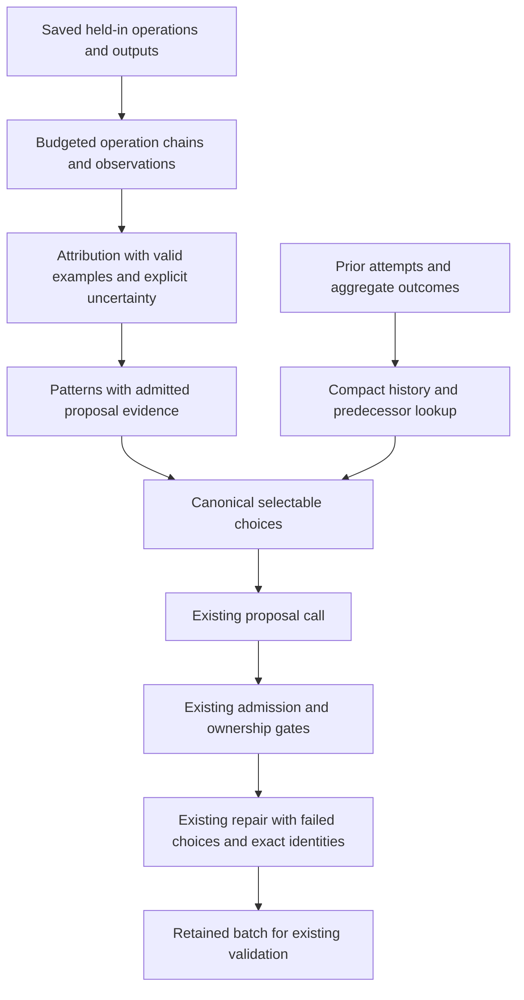

# Proposer evidence and context reliability - Plan

## Goal Capsule

- **Objective:** Researchers spend fewer optimization rounds on unusable proposals and receive edits supported by the failure that remains in the recorded execution.
- **Means:** Correct response examples, host-owned selection identities, compact recent history, and evidence that preserves consumers and later observations (KTD1-KTD5).
- **Authority:** The request to plan the most promising findings from `docs/analysis/2026-09-24-meta-harness-review.md`; the requirements below define the selected subset.
- **Execution:** Five bounded implementation units, beginning with deterministic reproductions from the review. Implementation completion and demonstrated task-performance improvement are separate outcomes.
- **Delivery:** Implement and verify locally under a later implementation request. A new experiment, PR, or paper update is outside this planning request.

---

## Product Contract

### Summary

Give the attributor a valid response example and give the proposer copyable choices that agree with admission. Preserve recent outcomes and relevant predecessor identities before expanding old history. Spend evidence space on the relevant computation and its later state, then require the existing proposal explanations to identify a concrete remaining behavioral difference.

### Problem Frame

The stopped experiment `experiment_oolong_pairs_dsv4f_20260923_163355` completed five rounds, admitted five edits from 21 submitted objects, and promoted one S2+S4 batch. Two rounds produced no usable edits. Missing `coverage_basis` caused 155 of 303 attribution responses to be rejected; selections repeatedly borrowed another pattern's evidence or named invalid revision predecessors.

The causal evidence also failed. Round 2 omitted a merge that its diagnosis called absent. Round 4 spent over 8,000 evidence characters on three sibling returns while another mechanism received no example. Round 3's promoted S2 targeted input parsing even though loss occurred while parsing child replies; its S4 explanation ignored a visible successful recovery. Better admission alone would send more unsupported hypotheses to paid validation.

### Selected Priorities

| Work | Evidence supporting priority | Scope decision |
|---|---|---|
| Conditional response example | 155 missing-field refusals | Include; small, directly reproducible |
| Copyable choices and revision identities | Repeated failures in rounds 2, 4, and 5 | Include with host enforcement |
| Compact recent history | Rounds 3-5 showed only round 1 | Include; retain qualified dense-quality gains |
| Consumer and later-state evidence | False missing-merge claim and one-mechanism allocation | Include within existing budgets |
| Behavioral distinction | Identical reparse and already-completed recovery | Refine existing fields; no extra model stage |

### Requirements

**Response and admission**

- R1. Attribution examples must demonstrate every conditionally required field, including accepted uncertainty, under the live validator.
- R2. Only patterns with admitted complete evidence may authorize live proposals; each selection must cite nonempty references belonging to that pattern.
- R3. Initial and repair prompts must expose the same eligible pattern, surface, evidence, and predecessor identities used by local gates.
- R4. Preserve first-valid ownership of each surface and pattern, including retained siblings during the existing bounded repair.

**History**

- R5. Compact history must show recent round outcomes, the incumbent's originating promotion, and predecessors relevant to the offered choices before verbose older examples.
- R6. Keep evaluated outcomes, bundled membership, and refused replacement attempts distinct; preserve qualified positive dense-quality signals alongside contrary exact-match outcomes.

**Evidence and reasoning**

- R7. Relevant consumers and later observations must take priority over redundant sibling returns and repeated transport-retry notices.
- R8. Allocate minimum complete examples across distinct actionable mechanisms before optional repeated evidence, preserving existing character and snippet caps.
- R9. Payload previews must disclose truncation; structural size observations must come from the complete payload and must not imply semantic correctness.
- R10. Existing diagnosis and proposal fields must identify the latest observed state, the unresolved discrepancy, and an action/value that changes a minimal example of that discrepancy.

**Integrity**

- R11. Keep all optimizer rules task agnostic and preserve held-in-only mechanism evidence, aggregate-only held-out history, combined validation, `v=1`, existing promotion gates, and current model-call/repair limits.
- R12. Version changed live contracts and preserve historical artifacts without reinterpretation or paid replay under a mismatched unfinished contract.
- R13. Regression fixtures must be independent of execution order and ignored experiment directories.
- R14. Record the selected methodology changes outside this plan, distinguishing planned work, implementation checks, and any subsequent empirical result; do not edit the paper.

### Acceptance Examples

- AE1. **Covers R1, R13.** A generic skipped-page diagnosis supplies the required coverage assessment; an honestly uncertain assessment is accepted without repair. Running its evidence fixture before an unrelated proposer test does not change that test's mechanism.
- AE2. **Covers R2-R4.** Pattern 0 is inventory-only and pattern 2 has admitted evidence. Pattern 0 cannot borrow pattern 2's references or use an empty list. Repair may retarget a failed, selectable pattern to a supported free surface while retaining a valid sibling.
- AE3. **Covers R5-R6.** Round 1 has a rejected but promising batch, round 2 a rejection, and round 3 the current promotion. The next prompt shows all three compact outcomes and the appropriate revision identities within the history cap.
- AE4. **Covers R7-R9.** A call returns five child results, followed by inspection prints, parsing, and aggregation. The packet includes a complete relevant consumer before extra sibling payloads; repeated retry notices do not displace it. A preview of a 26-key object does not report that the full object has only its visible keys.
- AE5. **Covers R7, R10.** An operation fails and later reconstructs the required state successfully. Evidence shows both observations, and the example diagnosis treats the early failure as recovered unless another unresolved discrepancy is demonstrated.
- AE6. **Covers R10-R11.** Coverage checks pass for a wrong-but-valid label. The proposal example identifies semantic uncertainty rather than promising that another coverage instruction corrects that label.

### Scope Boundaries

The implementation changes prompt construction, evidence projection, admission context, history, and their tests. It adds no paid critic, extra proposal stage, general data-flow engine, automatic semantic-verification claim, or new runtime dependency. Generated instructions may use task-derived details; the optimizer must not encode an OOLONG parser, expected answer IDs, or pair recipe.

### Deferred to Follow-Up Work

- Further surface-routing changes and explicit comparisons among S8/S5/S7/S10 interventions. Existing capability descriptions and supported routes remain available under R11; this run did not establish that changing routing would help.
- General instruction-compliance detectors and automatic execution of model-authored counterexamples. Existing unsupported activation remains `not_assessed`.
- Full semantic checks of classifications or arbitrary task predicates, large trace-search systems, and new retry/provider instrumentation.
- Changing patience, sample counts, validation repeats, or promotion criteria. Improving these proposals is the prerequisite to spending more rounds.

---

## Planning Contract

### KTD1. Correct examples and reuse the existing reasoning fields

Use short, separately valid response examples for established coverage loss, uncertain coverage, and another mechanism that omits `coverage_basis`. Keep existing field names and limits. Refine the current `coverage_basis.counterevidence`, operation observations, and three proposal explanation fields to describe the latest state and a distinguishing example; keep passing-behavior preservation in `predicted_effect` rather than duplicating it. Governs R1 and R10.

The current prompt already warns against missing-answer-to-missing-input inference and asks the perfect-compliance question. Replace its diffuse repetition with these concrete examples and field instructions. The host continues to validate declarations and references, not assert that model-written causal claims are true.

**Anchors:** `shrlm/optimization/attribution.py` response example and validator; `shrlm/optimization/proposal.py` `PROPOSER_TASK` and `TASK_REASONING_GUIDANCE`.

### KTD2. Derive selectable choices once from admitted evidence

Project a canonical round-local choice map after evidence admission. Each selectable pattern exposes its admitted refs, eligible surfaces, required conditional-route refs, and related history references. Reuse that map for initial rendering, `validate_batch_members`, skipped-pattern accounting, and repair; occupancy filters the map after a candidate passes all gates. Governs R2-R4.

Keep original pattern indices and operation IDs. Inventory-only rows remain visible with a nonselectable reason; they do not acquire references by retargeting. The existing evidence inventory should carry the compact choice projection within its 32,000-character cap, not be followed by a second unbudgeted copy. Predecessor details belong in the history budget under KTD3. No selectable patterns means a completed no-proposal result with no proposer call.

Finalize in one direction: admit evidence, derive provisional choices, fit required history, remove any choices whose mandatory context does not fit, and seal the surviving map. Apply removals to the rendered inventory, returned addressable list, validator, and repair together. Do not refill removed choices during this pass; that would make history and eligibility depend on an unstable packing loop.

Repair displays exact valid references and any required revision identity for the failed original selectable pattern. It cannot silently change the pattern or replace an owner. An exact-fingerprint predecessor discovered only after materialization is supplied explicitly to the existing repair rather than pretending that fingerprint was knowable before generation.

**Anchors:** `proposal.py` `render_prompt`, `validate_batch_members`, `propose_round`; `proposal_evidence.py` `pack_evidence`; `taxonomy.py` `eligible_surfaces`.

### KTD3. Budget identities and recent facts before verbose history

Replace whole-round packing with compact rows for the last three completed rounds, the current incumbent's originating promotion, and predecessors used by KTD2. Show one compact relevant qualified-positive signal when older than that window. Deduplicate rows and metric definitions, then spend remaining space on richer relevant history, keeping the existing 12,000-character cap. Governs R5-R6.

Rows identify the round and subject, local disposition or batch membership, exact counts, comparable verifier-defined quality delta, activation status, and a short behavioral summary. Dense metrics retain their definition/version and missingness; tasks without comparable metrics remain unassessed. No held-out instance payload enters this projection.

For a related intervention, prefer the most recent evaluated or bundled candidate over a refused attempt to rewrite its occupied slot; use a standalone refused attempt when no measured predecessor exists. Exact-fingerprint lookup still takes precedence. Rendering and `revision_violation` share this deterministic selection rule. Carry explicit owner links from existing admission records where resolvable; for legacy artifacts without that link, keep separate statuses and state that the relation is unknown.

Mandatory identity rows must never be silently truncated. If compact context still cannot fit, withhold the affected lower-priority choice and report the omission before generation; preserve current-incumbent and recent summary rows. The full archive remains unchanged.

**Anchors:** `history.py` `prior_attempts` and `revision_violation`; `proposal.py` `_render_history_block`; `shrlm/experiment/orchestrator.py` `load_round_history`.

### KTD4. Make the evidence core a bounded operation chain

Within the current six-snippet limit, prioritize the cited operation, the linked producer when needed, the first relevant computational consumer, and a later relevant observation before optional siblings. Use existing call edges, code order, and a bounded static name read/write scan over the same node's saved blocks to skip preview-only prints and find consumers; include one further consumer hop only when needed to show the produced value's use. Governs R7-R9.

This is a selection heuristic, not proof of data-flow or recovery. Do not execute trace code, infer hidden aliases, or search another run to fill a missing operation. Unresolvable relationships are labeled unestablished. Keep later operations in chronological order and label why they were selected; a later operation alone does not prove that an earlier error was repaired.

The distinct-mechanism allocation pass considers a minimum complete chain across existing alternate representatives. Additional sibling returns are optional unless a claim specifically compares them; in that case include the necessary siblings or declare the claim unsupported by the packet. If the mandatory chain is too large, try another representative or omit the example whole. Do not cut code through an operation or exceed caps to claim diversity.

In the attribution digest, reserve root consumer/later-computation coverage before repeated retry-only blocks. Summarize repeated notices emitted by the repository's client once, retaining their counts and locations. A notice alone never establishes recovery: retain any residual stderr, errored child, terminal exception, or unresolved outcome, and preserve those as eligible error evidence. Reuse the same distinction when proposal evidence derives `error_observed`, so retry chatter alone cannot unlock S5.

For bounded complete JSON replies, attach only structural facts such as top-level type and item/key count before truncating the preview. Non-JSON, oversized, or ambiguously parsed replies remain structurally unassessed; never parse an excerpt, evaluate Python, or infer record coverage from container size. Count the summary and its completeness marker inside the existing evidence/digest budgets.

**Anchors:** `digest.py` operation ranking and paired outputs; `proposal_evidence.py` trace selection, `core_snippets`, `operation_support`, and `pack_evidence`. Small shared read-only helpers can live in `digest.py`, which proposal evidence already imports.

### KTD5. Seal the changed projections without rewriting experiments

Bump the owning prompt, validator, digest, evidence-selector, and history contract versions when their live behavior changes. Preserve the current response envelope and literal-text contract if their shape remains unchanged. Use existing contract hashes to refuse incompatible unfinished replay before a paid call. Governs R11-R14.

Old completed experiments remain readable under their recorded contracts. Any reconstructed comparison writes a separate audit and identifies the source version; it does not replace saved prompts, proposals, verdicts, or ledgers. Record this round's rationale and later implementation results in `docs/analysis/2026-09-14-proposal-quality-methodology-notes.md`.

### High-Level Technical Design

### Assumptions and Risks

The implementation targets the reviewed behavior at commit `99812551`; it must accommodate later repository changes rather than overwrite them. Local evidence and existing tests establish the failure paths, so this plan adds no external research or technology choice.

Smaller packets can omit necessary comparisons, stricter eligibility can produce fewer drafts, and static name matching can miss aliases. KTD4 makes those omissions explicit; R2 favors a supported empty round over an unsupported validation batch. Better semantic reasoning and better held-out performance remain empirical hypotheses, not acceptance claims for offline tests.

---

## Implementation Units

### U1. Correct the attribution example and isolate regression fixtures

- **Goal / requirements:** Remove predictable response-schema errors and restore order-independent tests (R1, R13; KTD1).
- **Dependencies:** None.
- **Files:** `shrlm/optimization/attribution.py`; `tests/optimization/test_attribution.py`; `tests/optimization/test_proposal_evidence.py`; `tests/optimization/test_proposal.py`.
- **Approach:** Correct the conditional examples and use fresh nested fixture data before mutating a signature. Start from the two-test reproduction recorded in the review.
- **Test scenarios:**
  1. Covers AE1: established-loss and uncertain examples pass the live validator; a noncoverage example correctly omits the conditional field.
  2. Existing malformed/missing-field refusals and honest-uncertainty normalization remain intact.
  3. The legacy evidence fixture leaves `PATTERN_TEXT` and later proposer defaults unchanged in either test order.
- **Verification:** The 15 order-induced failures documented in the review disappear without weakening surface eligibility; the prompt no longer instructs an invalid conditional response shape.

### U2. Preserve consumers, later observations, and compact structural facts

- **Goal / requirements:** Deliver the evidence needed to distinguish absent, failed, and subsequently completed operations (R7-R9; KTD4).
- **Dependencies:** U1 for reliable shared fixtures.
- **Files:** `shrlm/optimization/digest.py`; `shrlm/optimization/proposal_evidence.py`; `tests/optimization/test_digest.py`; `tests/optimization/test_proposal_evidence.py`; `tests/optimization/test_taxonomy.py`.
- **Approach:** Change structural priority and first-pass core composition, reusing existing alternate representatives, operation deduplication, and serialized-size accounting. Add synthetic counterexamples before altering selection.
- **Test scenarios:**
  1. Covers AE4: five sibling returns followed by prints and a merge retain the relevant complete consumer within six snippets.
  2. A large sibling-rich example leaves room for another mechanism when their minimum complete chains fit together; a genuinely oversized chain is omitted whole.
  3. Covers AE5: a failure followed by repair and a successful check carries both observations. Mere proximity remains labeled unverified.
  4. Repeated known retry notices are summarized; notice-plus-terminal-error and unknown stderr retain failure evidence. Retry-only chatter cannot independently authorize an error-handling route.
  5. Covers AE4: a complete 26-key JSON object gets an honest size summary despite a short preview; malformed/oversized replies remain unknown.
  6. Multiple cited siblings necessary to a comparison remain together or the claim is marked unsupported. Parse failures in trace-code inspection produce explicit unknown relationships, not invented consumers.
  7. Deterministic rendering preserves operation IDs, caps, and existing held-in/held-out boundaries.
- **Verification:** Fixture equivalents of the missing-merge and sibling-allocation failures expose decisive operations under existing budgets. No claim of semantic correctness is derived from structural metadata.

### U3. Compact recent history and resolve predecessor identity consistently

- **Goal / requirements:** Give proposals the outcome and revision context that admission will require (R5-R6; KTD3).
- **Dependencies:** None; integrate with U4 after its choice projection exists.
- **Files:** `shrlm/optimization/history.py`; `shrlm/optimization/proposal.py`; `shrlm/experiment/orchestrator.py`; `tests/optimization/test_history.py`; `tests/optimization/test_proposal.py`; `tests/experiment/test_orchestrator.py`.
- **Approach:** Share predecessor ranking between rendering and validation; derive compact outcomes from persisted records and project owner links only when supported.
- **Test scenarios:**
  1. Covers AE3: old positive dense quality, recent rejection, and incumbent promotion all remain visible under 12,000 characters.
  2. A retained evaluated candidate and a refused rewrite keep different identities and dispositions; the latter does not overwrite the former's result.
  3. An exact-fingerprint predecessor takes priority; a newly supplied revision resolves uniquely against the complete index even if its verbose history is omitted.
  4. A lower-is-better metric retains direction, a missing/incompatible metric remains unassessed, and combined outcomes are not assigned to individual edits.
  5. Legacy records without owner links remain honest; mandatory rows exceeding the budget produce explicit choice omission under KTD3.
- **Verification:** Prompt-visible predecessor references and local revision checks agree, while stored records and held-out payload boundaries remain unchanged.

### U4. Make evidence-backed choices authoritative for generation and repair

- **Goal / requirements:** Prevent inventory-only and mismatched selections from consuming the repair allowance (R2-R4; KTD2).
- **Dependencies:** U2 and U3.
- **Files:** `shrlm/optimization/proposal.py`; `shrlm/optimization/proposal_evidence.py`; `shrlm/optimization/history.py`; `tests/optimization/test_proposal.py`; `tests/optimization/test_proposal_evidence.py`; `tests/optimization/test_history.py`.
- **Approach:** Use one derived choice map across prompt rendering, live validation, repair, and omission accounting. Remove redundant eligibility derivations in these paths.
- **Test scenarios:**
  1. Covers AE2: inventory-only patterns fail both empty-reference and foreign-reference selection; selectable patterns accept their own nonempty refs.
  2. Supported S8/S5 choices still require their admitted qualifying refs; ordinary routes cannot bypass evidence with an empty list.
  3. A valid owner survives repair, an invalid earlier contender reserves nothing, and a failed pattern can retarget only within its free supported choices.
  4. An exact-fingerprint revision failure returns copyable round/subject fields and predecessor disposition; no repair invents or silently remaps a pattern.
  5. Zero selectable patterns makes zero proposer calls; an empty repair preserves retained siblings. Existing original-pattern-only repair behavior is retained.
  6. Choice metadata is counted within evidence/history caps, and rendering does not mutate input bundles or shared nested data. A history-budget removal is reflected in the prompt, addressable list, validation, and repair without another allocation pass.
- **Verification:** A mocked round reaches the same admission outcome from the same frozen choices on replay, with no increase in model calls or surface count.

### U5. Require the remaining behavioral difference and verify the integrated contracts

- **Goal / requirements:** Make the existing explanations use the improved evidence and preserve experimental integrity (R10-R14; KTD1 and KTD5).
- **Dependencies:** U1-U4.
- **Files:** `shrlm/optimization/attribution.py`; `shrlm/optimization/proposal.py`; owning version constants in `shrlm/optimization/digest.py`, `shrlm/optimization/proposal_evidence.py`, and `shrlm/optimization/history.py`; `tests/optimization/test_attribution.py`; `tests/optimization/test_proposal.py`; `tests/optimization/test_mining.py`; `tests/experiment/test_orchestrator.py`; `shrlm/docs/harness-proposal-interface.md`; `shrlm/optimization/README.md`; `docs/analysis/2026-09-14-proposal-quality-methodology-notes.md`.
- **Approach:** Replace repetitive guidance with latest-state and minimal-distinction examples in existing fields. Update live contract seals and document the methodology and its evidential limits.
- **Test scenarios:**
  1. Covers AE5-AE6: non-benchmark fixtures distinguish recovered failure, wrong-but-valid labels, and genuine unrepaired omission; template/validator tests establish contract validity, not model obedience.
  2. An identical reparse is shown as no corrective change; sorting/deduplication does not claim to remove every invalid element. Passing-behavior preservation remains in its existing field.
  3. Changed unfinished contracts refuse replay before model calls; completed historical results remain readable; current matching contracts resume without new calls.
  4. End-to-end mocked mining/proposal/history flow preserves uncertainty, choices, retained edits, qualified metrics, and configured validation behavior.
- **Verification:** Required checks and offline artifact comparisons pass; documentation distinguishes observed implementation behavior from untested performance hypotheses.

---

## Verification Contract

Run the affected optimization tests and orchestrator tests during implementation, including both orders of the two-test shared-fixture reproduction. Then complete the repository's required Ruff, formatting, pre-commit, and full pytest checks. Compare known baseline failures separately rather than hiding them or changing unrelated configuration. No tests or runtime experiments are part of this planning turn.

Where local experiment artifacts are available, reconstruct the stopped run's round-2 and round-4 evidence and rounds 3-5 history into a separate analysis output. Report complete consumers and later observations included, distinct expanded mechanisms, rendered sizes, selectable identities, and recent outcomes retained. Historical model responses can be checked against the new host gates, but must not be presented as responses the model would generate under the revised prompt. Synthetic fixtures are the portable acceptance tests.

A later authorized experiment should measure usable batches, schema/reference/revision refusals, distinct mechanisms with complete evidence, and whether proposed behavior was observed or unassessed. Report exact and verifier-defined dense quality with cost under the existing gates. Promotion frequency or a broader surface distribution alone does not prove improvement.

---

## Definition of Done

U1-U5 satisfy their enumerated scenarios, respect R11-R12, and leave no abandoned implementation path or duplicate prompt/context source of truth. The methodology note describes the final behavior and verification limits. The stopped experiment, paper, configuration, and unrelated user edits remain unchanged. Improved task performance remains unproven until evaluated in a separately authorized run.

---

## Appendix

Primary investigation: `docs/analysis/2026-09-24-meta-harness-review.md` and `docs/analysis/2026-09-24-meta-harness-review-audit.json`. The audit carries all 21 submitted objects and admission outcomes, attribution refusal counts, validation aggregates, and exact prompt hashes.

Relevant earlier contracts: `docs/plans/2026-09-23-1119-fix-capability-aware-proposer-plan.md` and `docs/plans/2026-09-23-1534-fix-proposal-admission-and-evidence-plan.md`. This is a follow-up to their implemented behavior, not a rewrite of those plans.

Detailed trace counterexamples and exact edits remain in `experiment_oolong_pairs_dsv4f_20260923_163355/round-02-assessment.md`, `round-03-assessment.md`, `round-04-assessment.md`, and `round-05-assessment.md` under that experiment directory. Prior cross-experiment interpretation is in `docs/analysis/2026-09-15-task-agnostic-proposer-review.md` and `docs/analysis/oolong-pairs-2026-09-23/report.md`.
