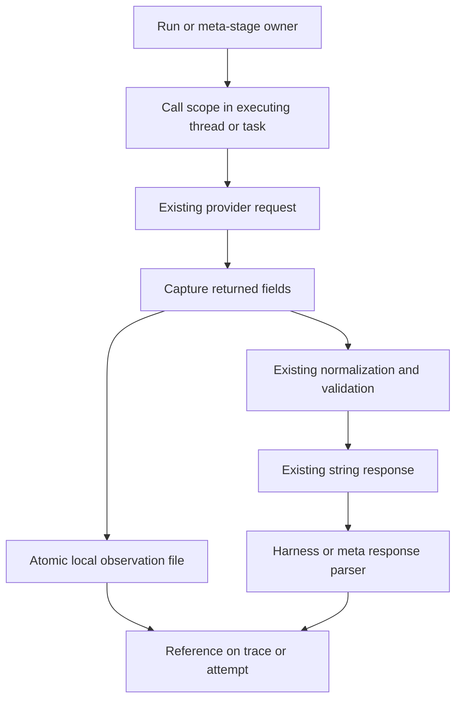
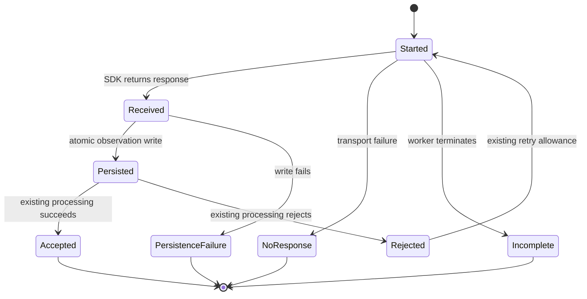
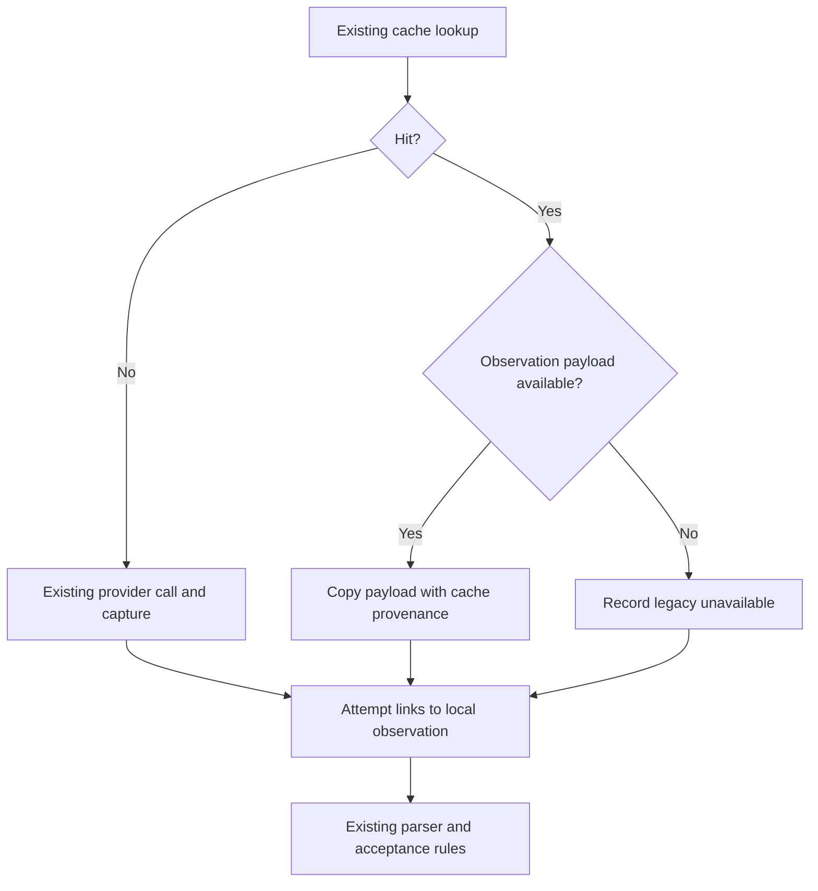

# Save provider reasoning in experiments - Plan

## Goal Capsule

- **Objective:** Researchers can inspect the reasoning a model provider returned for an experiment call, including unsuccessful runs and rejected optimization attempts, from that experiment's saved outputs.
- **Means:** Capture responses at the provider boundary and link separate reasoning artifacts to existing traces and attempt records (KTD1-KTD5).
- **Authority:** The request to save COT during mining and other experiment LLM calls. The requirements below govern behavior; technical decisions govern implementation within those requirements.
- **Execution:** Five dependency-ordered units. Use deterministic provider fixtures and offline integration checks to establish coverage.
- **Delivery and stop conditions:** Implement and verify under a subsequent implementation request. Stop when the Definition of Done holds; launching a paid experiment, publishing a PR, and merging require their own user instructions.

---

## Product Contract

### Summary

Save provider-returned reasoning for subject-model calls, attribution, proposal generation, and repairs. Apply the same capture to mining, validation, and final evaluation. Make it possible to follow a trace or attempt to its reasoning without changing the response that the harness executes or parses.

### Problem Frame

The shared OpenAI-compatible client currently projects each SDK response down to `message.content`. Separate reasoning fields disappear before either mining or evaluation persistence receives them. Azure Foundry also normalizes reasoning-bearing content before returning the final text. Existing evaluation traces can contain visible assistant explanations, but the inspected common evaluation path does not separately preserve provider reasoning.

Capturing only completed root iterations would leave several gaps: child/plain LLM calls, compaction, fallbacks, rejected meta-model responses, and responses received before downstream execution fails. Concurrent calls share clients, so a mutable “last reasoning” property would misattribute responses.

### Requirements

**Coverage and meaning**

- R1. Save reasoning returned by every model call executed within an experiment: mining, validation, evaluation, recursive and plain child calls, batched calls, compaction, final-answer fallbacks, attribution, proposals, and repairs.
- R2. Preserve returned reasoning text and structured reasoning blocks without truncation, with their provider field names and provenance. Distinguish summaries and opaque/signature data from readable reasoning.
- R3. Make missing reasoning explicit: a response without reasoning, an uninstrumented client, a legacy artifact, and a call with no received response are different observations. Absence must not imply zero reasoning tokens or no internal reasoning.
- R4. Keep each received response associated with its own run/stage, logical call, retry attempt, model, and available parent/iteration/batch coordinates, including unsuccessful responses.

**Experimental behavior**

- R5. Preserve completion return values and all existing prompt, parsing, execution, verifier, and evidence-selection behavior. Saved reasoning is observational data; it must not enter subsequent model context, weakness digests, proposal evidence, or held-out-derived mining input.
- R6. Leave decoding, thinking settings, sampling counts, concurrency, budgets, retry limits, promotion gates, and accounting unchanged. Record a provider-reported reasoning-token count as diagnostic metadata, without adding it again to billed output tokens.
- R7. Enable capture for newly executed experiment calls by default, independently of environment/task. A provider that does not return reasoning under the current request settings remains explicitly unassessed; this change does not enable a new reasoning mode.

**Persistence and replay**

- R8. Persist a received response before downstream normalization, budget validation, parsing, or execution can discard it. Preserve already committed observations when a run fails or a worker terminates; do not claim to recover a response that never reached the host.
- R9. Keep new experiment artifacts self-contained and discoverable from existing trace/attempt records, using relative references and integrity checks. Concurrent workers must not overwrite each other's observations.
- R10. Preserve reasoning on new attribution/proposal cache hits without another model call. Legacy text-only cache hits remain usable and explicitly lack captured reasoning.
- R11. Keep historical traces, cache keys, experiment identities, and completed stage artifacts readable without rewriting their recorded bytes or replaying paid work to populate missing reasoning.
- R12. Treat a capture write failure as an explicit persistence failure under the existing experiment checkpoint policy, not as a model-response error that triggers a paid retry.

### Acceptance Examples

- AE1. **Covers R1-R2, R4-R6.** A mining root response contains final code plus `reasoning_content`. The code executes exactly as before, and the root iteration links to the complete separate reasoning record.
- AE2. **Covers R1, R4, R9.** Three child requests finish out of order, with one failure. Each result links to its own observation; successful siblings remain successful and concurrent.
- AE3. **Covers R1, R8.** A provider returns reasoning but no final answer, then the client retries or raises a reasoning-budget error. That received response remains available even if no normal iteration or accepted proposal is produced.
- AE4. **Covers R3, R10-R11.** A repaired proposal replays from a new cache with its reasoning. A legacy cached proposal replays without a model call and reports `legacy_unavailable`. Neither replay changes the original cache key or completed experiment files.
- AE5. **Covers R5-R7.** Validation and evaluation save the same observation schema as mining. Their reasoning never appears in attribution/proposal prompts, and captured versus uncaptured fixture runs produce identical answers, requests, verdicts, and usage totals.
- AE6. **Covers R8-R9, R12.** A worker commits one response and then fails during code execution. Its partial trace links to that observation. A capture filesystem error is surfaced separately and does not cause another provider request.

### Scope Boundaries

This is persistence for the existing non-streaming call paths. It includes the first-party clients registered in `rlm/clients/__init__.py` and the repository's Lambda adapters. External/custom clients retain their existing string interface and report unsupported capture until instrumented.

Historical reasoning that was discarded cannot be reconstructed. Reading opaque provider data does not reveal its contents, and a provider summary is not a complete internal chain of thought.

### Deferred to Follow-Up Work

- Enabling reasoning or thought summaries where current requests do not ask providers to return them.
- Feeding captured reasoning into weakness mining, proposal generation, or a new reasoning-based diagnostic model.
- General tracing infrastructure, streaming support, token-accounting refactors, dashboards, and historical backfills.

---

## Planning Contract

### Repository Grounding

| Boundary | Evidence | Consequence |
|---|---|---|
| Provider projection | `rlm/clients/openai.py`: `completion`, `acompletion`; `rlm/clients/azure_foundry.py`: `_track_cost`, `_normalize_content` | Capture directly after the SDK returns, before retry decisions or normalization |
| Concurrent calls | `rlm/core/lm_handler.py`: `_handle_single`, `_handle_batched`, `completion` | Isolate observations by call; do not copy the existing shared `get_last_usage` pattern |
| Other runtime calls | `rlm/core/rlm.py`: `_completion_turn`, `_compact_history`, `_default_answer`, `_fallback_answer`, `_subcall` | Root-iteration logging alone is insufficient |
| Serialization | `rlm/core/types.py`: `RLMChatCompletion`, `RLMIteration`; `rlm/core/comms_utils.py`; `rlm/logger/rlm_logger.py` | Add optional references that survive socket transport and partial trajectories |
| Subject persistence | `shrlm/optimization/driver.py`: `execute_run`, `_partial_completion`, `persist_run`, `persist_existing_run`; `run_worker.py` | Bind output ownership inside each executing process and preserve parent-owned manifests |
| Meta responses | `shrlm/optimization/attribution.py`, `proposal.py`: attempts, caches, bounded retries | Save rejected and repaired responses, including cached failure outcomes |
| Meta artifact owners | `shrlm/experiment/orchestrator.py`: `_evidence_bundle`, proposal stage; `mining.py`, `bundle.py` | Carry references into `attributions.jsonl` and `work/proposal_result.json` |
| Evaluation | `shrlm/experiment/evaluation.py`: `HarnessEvaluationMethod.run_set`; `shrlm/baselines/lambda_runner.py`, `paper_lambda_rlm.py` | Reuse subject capture and explicitly cover the Lambda client proxy |

Grounding used branch `fix/task-agnostic-proposer` at `775e6221`. The inspected `origin/main` at `22daa0a8` also contains newer Lambda classification/failure handling. Integrate with whichever version is current at implementation time; preserve those changes and the pinned upstream Lambda source.

### KTD1. Preserve the string API with call-scoped observation

Keep `BaseLM.completion` and `acompletion` returning strings. Introduce one small observation module in `rlm`, with a call-scoped collector and optional persistence sink. Provider adapters publish an allowlisted observation immediately after the SDK returns. Existing callers without a recorder continue to work. Governs R1, R4-R8.

Use a context-local binding within a logical call so nested code can publish without adding provider SDK arguments. Carry the owning recorder explicitly into runtime handlers, child RLMs, and worker entry points; establish the local scope inside each handler thread and asynchronous batch slot. A context variable alone does not propagate into arbitrary new threads or processes.

Assign logical call IDs before dispatch and physical attempt IDs at the provider boundary. A retry belongs to its original logical call but owns a distinct response record. Cache replay is a new observation linked to its source, not a fresh provider attempt. Context must be reset on success, exception, cancellation, and logger reuse.

Do not introduce a mutable `last_reasoning`, serialize batches to avoid races, or route capture configuration through `sampling_args`/`backend_kwargs`. Those dictionaries affect requests and appear in serialized model configuration.

### KTD2. Use a versioned, provider-neutral response record

Define `rlm-llm-observation/v1` for the saved record. Preserve original field names in a structured payload rather than pretending all providers return the same kind of COT. Governs R2-R4, R6, R9.

| Field group | Content |
|---|---|
| Identity | Logical call ID, attempt ID, source call ID for cache replay, provider response ID when supplied |
| Ownership | Stage, run ID or meta attempt, purpose, and available parent/iteration/depth/batch coordinates |
| Model and outcome | Requested and returned model, response receipt time, finish reason, response-received/error outcome |
| Reasoning | Complete selected reasoning fields/blocks, source names, block kinds, and availability |
| Response association | Selected raw assistant content before normalization, plus a reference from the existing returned response/attempt |
| Usage | Provider-reported reasoning-token count or null; existing cost ledgers remain authoritative |

Availability distinguishes `returned`, `opaque_only`, `not_returned`, `unsupported_client`, `legacy_unavailable`, and `no_response`. A present but empty field is retained as present/empty in the payload; do not silently replace it with missing data. Missing token counts stay null. A started call with no terminal observation is reported as incomplete by the reader rather than fabricated as an empty successful response.

For OpenAI-compatible clients, capture `reasoning_content`, `reasoning`, `reasoning_details`, and reported reasoning-token usage when supplied. Preserve the raw selected content before Azure's existing Harmony/think normalization; only label inline analysis as reasoning where the adapter already recognizes that protocol. Do not guess reasoning boundaries in arbitrary answer prose.

For Anthropic, preserve returned thinking/redacted-thinking blocks and signatures. For Gemini, preserve returned thought parts and signatures. Reuse a shared OpenAI-compatible extractor for Azure OpenAI and Portkey; Azure Foundry inherits that path. Serialize SDK values using supported JSON conversion, preserving opaque byte fields with explicit encoding. Do not dump HTTP headers, credentials, complete SDK client objects, or duplicate request prompts.

OpenRouter distinguishes text, summary, and encrypted detail blocks, which is why one undifferentiated `cot` string is insufficient. Its reasoning tokens already count as output tokens. See [OpenRouter reasoning fields](https://openrouter.ai/docs/guides/best-practices/reasoning-tokens). Gemini's returned thought summaries require an explicit request setting, which R7 leaves unchanged: [Gemini thought summaries](https://ai.google.dev/gemini-api/docs/generate-content/thinking). For Anthropic block semantics, see [extended thinking](https://platform.claude.com/docs/en/docs/build-with-claude/extended-thinking).

### KTD3. Write local response files before final trace publication

Use immutable JSON response files within each run or stage's existing output directory. Each executing owner writes only its own namespace, through a temporary file followed by atomic rename. Save a small start record before dispatch so a terminated in-flight call is distinguishable from a stage that never called a model. Do not add a shared append-only file across workers. Governs R8-R9, R12.

Add optional `llm_observations` references to `RLMIteration`, `RLMChatCompletion`, `AttributionAttempt`, and `ProposalAttempt`. The root trajectory also indexes observations that never produced a completed iteration, such as compaction and failed final turns. A reference carries a relative path, content SHA-256, and call/attempt identity. Payloads live once; nested traces reuse references instead of duplicating full reasoning.

Resolve references relative to the owning trace or meta artifact's directory. Nested completion references use the outer saved run trace as their anchor. Stage readers receive that anchor explicitly; they must not resolve paths against the process working directory. Paths must stay inside the owning artifact directory. Hash mismatches and missing referenced files are persistence errors, not invitations to re-run the model.

| Existing artifact | New observation location relative to its directory |
|---|---|
| `runs/<run_id>.json` | `<run_id>.llm_calls/<call_id>/...` |
| Mining `attributions.jsonl` | `llm_calls/attribution/<call_id>/...` |
| `work/proposal_result.json` | `llm_calls/proposal/<call_id>/...` |
| Evaluation subject `runs/<run_id>.json` | `<run_id>.llm_calls/<call_id>/...` |
| Lambda method's saved run trace | Adjacent `<run_id>.llm_calls/<call_id>/...` using that method's actual trace stem |

A received response is committed before it can be rejected or processed. Call completion/error markers may be separate small records, so committed response files never need mutation. A killed worker can leave an unfinished call directory; preserve it for inspection. This does not add automatic recovery of paid work beyond existing resume rules, and atomic rename does not promise survival of a machine/power failure.

The parent continues to own run manifests. Workers write their response files and trace; the parent verifies references before adopting the trace. Keep the existing rule that `persist_existing_run` does not rewrite child-produced bytes.

If capture fails after a paid response arrives, retain that write error while the provider's available usage is accounted exactly once, then propagate a distinct observation-persistence error before another request or downstream execution. Preserve any simultaneous provider-validation error as diagnostic context. Missing provider usage remains subject to the existing lower-bound/error rules. The error must retain its persistence classification across model retry wrappers, socket replies, and worker results; the owning driver maps it to the experiment persistence boundary rather than a task-failure verdict. This ordering satisfies R6 and R12 without moving successful capture after potentially failing response validation.

### KTD4. Keep cache replay self-contained and additive

Extend attribution/proposal cache entries with optional observation payloads, including responses attached to cached budget-exhaustion outcomes. Keep existing lookup keys and the response text API available. Governs R3, R10-R11.

New cache entries contain portable payloads, not references into a different experiment directory. On a cache hit, materialize local observation files with cache provenance and attach their references to the new attempt. Mark these as cached so diagnostic usage cannot be mistaken for new spend. Legacy entries supply a `legacy_unavailable` observation without a provider call.

Completed stages remain untouched. Unfinished stages can use new capture for newly executed or replayed calls while preserving their original prompt/contract identity. Additive fields default absent when rehydrating old attempts or traces and stay absent when old objects are serialized. Capture schema versions do not change harness hashes, prompt hashes, bundle inputs, or paid response cache keys.

### KTD5. Keep observation storage out of model evidence

Wire capture at execution and persistence boundaries, not into digest/proposal rendering. Bind explicit purposes for root turns, plain children, recursive children, compaction, fallbacks, attribution, proposal, repair, and Lambda calls. Use run-local IDs where the later trace walker has not yet assigned an evidence-node ID. Governs R1, R4-R7, R11.

The Lambda guard/proxy provides the integration seam; instrument repository-owned adapters without modifying `shrlm/baselines/upstream/lambda_rlm.py`. Cover both guarded direct completions and the paper adapter's asynchronous classifications. An uninstrumented injected client still returns normal content and receives the explicit unsupported status.

### High-Level Technical Design

The component and data flow separates the response used by the experiment from the observation used by a researcher:

The response lifecycle includes received-but-rejected responses:

The cache path preserves the same saved-output contract without making another request:

### Assumptions and System-Wide Impact

“COT” means information actually supplied by a provider under the existing request configuration. Some models return only summaries or opaque blocks. The plan deliberately makes that limitation visible instead of manufacturing reasoning or changing the experiment's inference settings.

Researchers gain larger saved-output directories, and artifact readers gain optional references. Full reasoning stays outside evidence character budgets because R5 excludes it from model context. Existing experiment folders may therefore contain a documented mixture of legacy traces and newly captured calls after resume.

Provider response capture is opt-in at the library execution context and enabled by experiment owners under R7. Standalone client users do not acquire an implicit filesystem destination. No dependency on a remote tracing service or new runtime package is needed.

The main risks are association errors across concurrency boundaries, changed failure behavior from logging, and accidental inclusion in evidence serialization. The verification contract targets those directly. Exact helper names and fixture layout can be settled during implementation; the observation ownership, reference anchor, replay policy, and failure behavior are fixed by KTD1-KTD5.

---

## Implementation Units

### U1. Add provider response capture without changing completion values

**Goal:** Establish the observation contract and synchronous/asynchronous extraction (R2-R4, R6-R8; KTD1-KTD2).

**Dependencies:** None.

**Files:** New `rlm/core/llm_observation.py`; `rlm/clients/base_lm.py`, `openai.py`, `azure_foundry.py`, `azure_openai.py`, `portkey.py`, `anthropic.py`, `gemini.py`; new `tests/clients/test_reasoning_capture.py`; existing `tests/clients/test_openai_transport.py`, `test_azure_foundry.py`, `test_gemini.py`.

**Approach:**

1. Add typed observation data and the call-scoped publishing seam, following KTD1-KTD2.
2. Publish before existing retry, normalization, and usage-validation branches can discard the received response.
3. Preserve provider field/block provenance and explicit availability across all registered adapters.
4. Keep no-recorder behavior compatible with current clients and test doubles.

**Execution note:** Start with provider-response fixtures that demonstrate loss of separate reasoning and Azure normalization before implementing capture.

**Test scenarios:**

- Covers AE1. A sync and async OpenAI-compatible response returns code plus separate reasoning; capture preserves both while the returned string is identical.
- Covers AE3. Empty final content with reasoning is recorded before an empty-content retry; the retry owns another attempt ID.
- Azure Harmony/think content is retained before normalization and before a reasoning-budget exception.
- Summary, text, opaque, empty, missing, and unknown optional fields preserve their distinct meaning; unknown reasoning-token usage stays null.
- Anthropic thinking blocks and Gemini thought parts are captured without changing request settings or completion projection.
- A recorder write failure after a billed response still records its available usage exactly once and cannot enter the provider retry loop, including when response validation would also raise a budget error.
- No-recorder execution sends the same SDK arguments and reports the same usage.

**Verification:** All provider adapters preserve existing successful/error behavior while exposing returned reasoning through one compatible observation contract.

### U2. Associate runtime observations with the correct trace calls

**Goal:** Cover root, child, batched, compaction, and fallback execution without association races (R1, R4-R5, R9, R11; KTD1, KTD3, KTD5).

**Dependencies:** U1.

**Files:** `rlm/core/types.py`, `rlm/core/rlm.py`, `rlm/core/lm_handler.py`, `rlm/core/comms_utils.py`, `rlm/logger/rlm_logger.py`, `shrlm/runner.py`; `tests/test_types.py`, `tests/test_rlm_query.py`; new `tests/test_llm_observation_runtime.py`.

**Approach:**

1. Add optional observation references and preserve them across logger and socket serialization.
2. Establish separate call scopes inside threaded handlers and individual asynchronous slots; propagate owning context into recursive children and direct fallback clients.
3. Associate completed iterations/calls with their references and index non-iteration observations in the trajectory.
4. Reset per-run capture state with the logger lifecycle, including failures and reused runtime instances.

**Test scenarios:**

- Covers AE2. A shared client receives simultaneous requests with duplicate prompt text and distinct reasoning markers; out-of-order completion and one exception do not cross-associate records.
- Recursive children, depth-capped calls, plain socket calls, and batched calls retain their own references through serialization.
- Compaction and default/fallback answer calls appear with distinct purposes even without an ordinary root iteration.
- A received final turn followed by code failure remains indexed in the partial trajectory.
- Consecutive runs using a reused logger do not inherit the previous run's observations.
- Legacy completion/iteration payloads round-trip with no new fields inserted.

**Verification:** Every runtime call path resolves to its own observation, and capture does not alter execution, prompt history, or batch behavior.

### U3. Persist observations under subject and evaluation outputs

**Goal:** Make response capture durable across sequential and subprocess execution, including Lambda evaluation (R1, R7-R9, R11-R12; KTD3, KTD5).

**Dependencies:** U1-U2.

**Files:** New `shrlm/optimization/llm_observation_store.py`; `shrlm/optimization/driver.py`, `run_worker.py`, `subject_worker.py`, `costs.py`; `shrlm/experiment/evaluation.py`; `shrlm/baselines/lambda_runner.py`, `paper_lambda_rlm.py`; `tests/optimization/test_driver.py`, `test_run_worker.py`, `test_subject_worker.py`; `tests/experiment/test_evaluation.py`; `tests/baselines/test_lambda_runner.py`, `test_paper_lambda_rlm.py`; new `tests/optimization/test_llm_observation_store.py`.

**Approach:**

1. Implement atomic local storage and relative/hash-checked references under KTD3.
2. Configure storage from the known run trace path inside the executing process; use serializable request metadata when a worker needs additional ownership fields.
3. Include observations in normal and partial-run persistence and validate them when adopting child traces.
4. Cover the existing evaluation conditions and repository-owned Lambda adapters with the same store.
5. Preserve run-manifest ownership and existing persistence-error handling.

**Test scenarios:**

- Covers AE6. A child writes a response, then raises during execution; its partial trace and local observation remain readable and hash-valid.
- Three run workers create disjoint namespaces while the parent alone appends the manifest.
- A worker terminated after a committed response leaves that response inspectable; a started request without a response remains incomplete.
- Missing or altered referenced payloads fail integrity verification without issuing a model request.
- Covers AE5. Initial/final harness evaluation and Lambda direct/async calls produce observations under their own run outputs.
- Capture write failure preserves its classification through socket and worker boundaries, reaches the persistence boundary with recorded spend, and is never turned into a task-failure verdict. Ordinary model failures retain their current handling.
- Moving an entire experiment directory preserves reference resolution; an escaping reference is rejected.

**Verification:** Sequential execution, worker execution, and evaluation leave equivalent self-contained capture artifacts without changing answers, verdicts, or manifest accounting.

### U4. Preserve attribution and proposal reasoning through repair and cache replay

**Goal:** Retain every meta-model attempt, including rejected, repaired, and cached responses (R1, R3-R4, R8-R11; KTD3-KTD4).

**Dependencies:** U1, U3.

**Files:** `shrlm/optimization/attribution.py`, `proposal.py`, `mining.py`, `bundle.py`; `shrlm/experiment/orchestrator.py`; `tests/optimization/test_attribution.py`, `test_proposal.py`; new `tests/optimization/test_meta_reasoning_persistence.py`; `tests/experiment/test_collapse_and_attribution.py`.

**Approach:**

1. Attach local observation references to attribution/proposal attempts and terminal failure artifacts.
2. Extend cache serialization additively under KTD4, including budget-failure cache records.
3. Materialize observations on replay before persisting a new attempt, with cached provenance and no new spend.
4. Keep sealed stages and legacy trace/cache identity untouched.

**Test scenarios:**

- Initial attribution rejection and accepted re-ask each retain separate reasoning and raw response associations.
- A malformed proposal, selective repair, and retained valid sibling preserve the correct attempt references.
- Covers AE3. A proposal budget-exhaustion result retains its received reasoning despite having no accepted candidate.
- Covers AE4. New and legacy cache entries replay with zero client calls and unchanged keys; a cache stored outside the experiment does not create external file references.
- An interrupted stage reuses cached responses under the same prompt identity, while a completed stage is not rewritten.
- A capture write failure is not swallowed by the meta-model transport retry wrapper: the client is called once and its available usage remains recorded.

**Verification:** Attribution files, proposal results, and failure markers expose all available attempt reasoning without altering admission, repair, or cache behavior.

### U5. Prove observational parity and document the output contract

**Goal:** Demonstrate experiment-wide coverage and make the saved reasoning easy to locate (R1-R12).

**Dependencies:** U1-U4.

**Files:** `shrlm/optimization/README.md`; the existing experiment-output documentation in `README.md` or its linked experiment guide; new `tests/experiment/test_reasoning_capture.py`; `tests/optimization/test_proposal_evidence.py`, `test_digest.py` as needed for focused isolation regressions.

**Approach:**

1. Exercise a small deterministic experiment through mining, attribution, proposal repair, combined validation, and evaluation using instrumented fake providers.
2. Compare captured and uncaptured runs at their behavioral boundaries under R5-R6.
3. Document the KTD3 paths, reference anchors, availability values, cached provenance, and limits of old/provider-unavailable data.
4. Audit all repository model-call sites against R1 and remove abandoned capture approaches.

**Test scenarios:**

- Covers AE5. The complete offline experiment produces identical requests, answers, verdicts, promotion decisions, and accounting with capture enabled and disabled.
- A unique reasoning-only sentinel never appears in a weakness digest, proposal packet, follow-up model prompt, or verifier input.
- Held-out reasoning is saved in its own validation output and never enters held-in mining artifacts.
- A resumed legacy fixture keeps existing trace hashes and sealed files unchanged while new calls gain capture.
- A generic non-pair task follows the same output contract without task-specific configuration.

**Verification:** A reviewer can start from a run or meta attempt, locate every available reasoning payload, and distinguish unavailable data without running another model call.

---

## Verification Contract

Use deterministic fixtures for supported provider response shapes and injected failures. No paid API call is required to complete this change. Any later live smoke experiment should use a fresh output directory and report which reasoning fields the configured provider actually supplied.

Run the focused client, runtime, optimization, baseline, and experiment tests named by each unit, then the repository's required broader checks. The repository uses `uv run pytest`, `uv run ruff check --fix .`, `uv run ruff format .`, and `uv run pre-commit run --all-files`. Preserve unrelated working-tree changes. If broad checks expose pre-existing failures, identify them with evidence and distinguish them from failures introduced here.

Completion requires a call-site coverage audit, positive reasoning persistence checks, and negative behavioral checks. Test response association with deliberately overlapping asynchronous calls rather than relying on ordinary sequential mocks. Verify legacy serialized bytes and manifest hashes directly; successful deserialization alone does not prove replay compatibility.

---

## Definition of Done

- U1-U5 satisfy their stated verification outcomes and the applicable repository checks.
- Every current experiment model-call path either saves returned reasoning or records a specific availability limitation.
- Received-but-rejected responses and meta repairs remain inspectable after normal failure handling.
- Concurrent response association and partial-worker persistence are demonstrated by deterministic regression tests.
- Existing request behavior, model evidence, outcomes, usage accounting, and historical artifact identities remain unchanged under the parity fixtures.
- Documentation identifies exact output locations and explains cached, legacy, opaque, and missing reasoning.
- No paid backfill, experiment launch, unrelated cleanup, unused abstraction, or abandoned implementation remains in the change.
