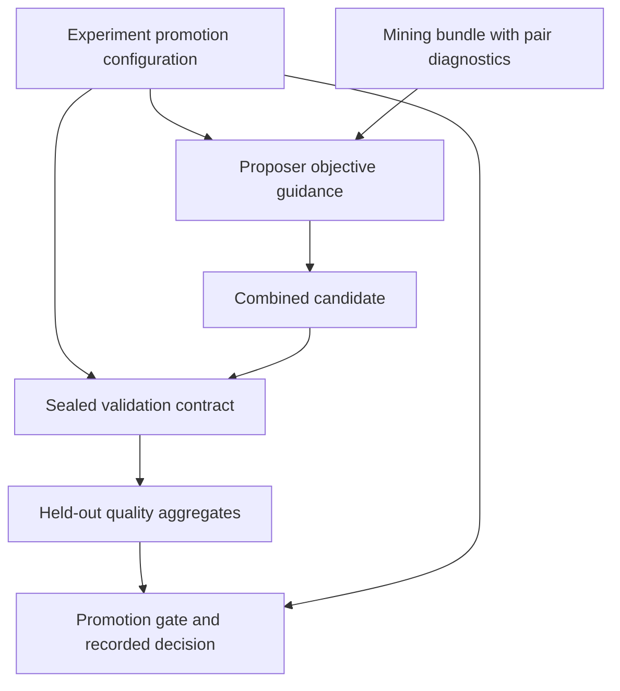

# F1 Meta Optimization Alignment - Plan

## Goal Capsule

- **Objective:** Researchers running the blended OOLONG-Pairs experiment can optimize and promote candidates against its configured F1 objective consistently throughout the loop.
- **Means:** Carry the promotion configuration into proposal guidance, freeze its metric during validation, and correct numerical boundary comparisons (KTD1–KTD3).
- **Authority:** The user's request and R1–R7 govern behavior; KTD1–KTD4 govern implementation within those requirements.
- **Execution profile:** Four bounded fixes with deterministic, mocked regression coverage. No paid experiment or dataset download is needed.
- **Stop conditions:** Revisit the plan if implementation requires changing the calibrated thresholds, mining eligibility, or the combined-candidate evaluation protocol.
- **Delivery:** The implementing contributor completes the changes and checks; repository maintainers review and merge them.

## Product Contract

### Summary

Align proposal guidance and validation replay with the configured promotion objective, make F1 boundary comparisons inclusive in practice, and restore the failing legacy-summary tests.
Protect the existing weakness-mining behavior with coverage spanning mining, proposal, and promotion.

### Problem Frame

PR #53 introduced verifier-owned primary-quality promotion, including macro F1 over context lengths for `configs/experiment_oolong_pairs_blended_DeepSeekV4Flash.toml`.
The review of merge `1897a4bc`, checked against current main `1d96a8df`, found four remaining gaps: the proposer still describes an exact-pass gate, the standalone validation contract omits the metric, floating-point rounding can reject an equal-boundary F1 result, and a test double no longer accepts the aggregation argument.

Weakness mining already keeps exact-match failures with partial F1 credit and exposes pair diagnostics.
Promotion already uses equal weighting of context-length means, checks each length's regression margin, and applies resource bands to the combined candidate.
Those behaviors are the baseline for this work.

### Requirements

**Proposal guidance and mining**

- R1. The proposer receives the actual promotion metric, improvement threshold, regression margins, and cost/sub-call bands used for its round, with the verifier's quality definition when primary quality is selected.
- R2. For primary-quality promotion, guidance explains the equal-weight macro average of context-length means and the per-length regression checks; it must not describe F1 as merely diagnostic or require an exact-pass improvement.
- R3. Weakness mining continues to retain partial-F1 exact-match failures and their diagnostics, while pass-count profiles retain their configured promotion semantics.

**Promotion and replay**

- R4. A saved validation round binds its evidence to the promotion metric and refuses a metric-only change before evaluation or promotion-artifact writes.
- R5. F1 improvement and regression comparisons accept equality despite insignificant floating-point error, while rejecting material threshold violations.
- R6. An unchanged, fully sealed round resumes without new model calls or artifact rewrites; a saved validation contract without a metric is rejected with a fresh-directory instruction.

**Verification**

- R7. Both legacy-summary runtime-error test cases exercise their intended resume/divergence behavior, and deterministic coverage proves the configured objective across mining, proposal, and promotion.

### Scope Boundaries

This work addresses the four confirmed review findings and the regression coverage needed to connect them.
It does not change F1 measurement, exact-match verdicts, weakness ranking, evidence selection, calibrated thresholds, split sizes, repetitions, resource bands, or combined-batch attribution.
It adds no artifact migration or inference of an omitted metric from cached scores.

## Planning Contract

### Key Technical Decisions

- KTD1. **Use the existing typed `PromotionConfig` as the proposal input.** Thread it from the orchestrator through `propose_round` to prompt rendering rather than maintaining a second proposer-specific set of thresholds. Standalone proposal callers may retain the existing pass-count default. Render metric-specific guidance deterministically and advance `PROMPT_VERSION`; the existing rendered-prompt hash then binds the proposal cache and `proposal_contract.json` to the objective. Governs R1–R3.
- KTD2. **Seal the metric explicitly and reject ambiguous old contracts.** Add `promotion.metric` to `validation.json` and use the existing exact contract comparison before evaluation. A missing metric cannot identify either pass-count or F1 evidence because the buggy implementation emitted both forms without it. Preserve old artifacts for inspection and require a fresh directory, following `check_contract`'s existing legacy-evidence policy. No broad summary or ledger schema change is needed. Governs R4, R6.
- KTD3. **Use a narrow absolute tolerance for primary-quality gate equality.** For F1 regression and improvement comparisons, treat values within `1e-12` of the threshold as equal, with zero relative tolerance. This is negligible beside OOLONG-Pairs' three-decimal F1 measurements and calibrated margins. Keep raw measurements and deltas in the ledger, and leave pass-count comparisons and resource-band arithmetic unchanged. Governs R5.
- KTD4. **Repair the test double instead of changing aggregation compatibility.** Accept and forward the optional primary-quality definition in the monkeypatched aggregator, then continue injecting only the runtime-error count. The production call already uses the intended API. Governs R7.

### High-Level Technical Design

The promotion configuration remains owned by the experiment; the proposer receives it as context and the validation stage seals it before using evidence.

The two promotion modes retain their existing aggregation rules: pass-count guidance follows exact-pass deltas, while primary-quality guidance follows the registered quality definition and context-length macro average.
This change supplies the missing context without adding another scoring stage.

### Sequencing and Resume Impact

U1–U3 can be implemented independently; U4 completes integration coverage after all three.
Existing proposal artifacts whose prompt identity changes will be refused by the current replay check.
An old round that re-enters validation without `promotion.metric` will need a fresh output directory under R6, including an interrupted round resumed through the experiment runner.
Completed experiment rounds restored from their round markers retain the existing restoration path; they are not revalidated by this change.
The original metric-switch bug was reproduced through standalone `validate_round` with a supported scalar regression margin; top-level experiment identity already detects configuration changes.

## Implementation Units

### U1. Give the proposer the active promotion objective

**Goal:** Proposal guidance agrees with the gate that evaluates the proposed batch.

**Requirements:** R1–R3. **Dependencies:** None.

**Files:** `shrlm/experiment/orchestrator.py`, `shrlm/optimization/proposal.py`, `shrlm/optimization/README.md`, `tests/optimization/test_proposal.py`, `tests/optimization/test_proposal_context.py`, `tests/experiment/test_orchestrator.py`.

**Approach:**

1. Pass the orchestrator's existing promotion configuration into `propose_round` and prompt rendering under KTD1, using the repository's import-cycle conventions where necessary.
2. Replace the fixed exact-pass promotion paragraph with rules for the selected metric. Include the actual thresholds and resource bands, explicitly representing an unconstrained band.
3. Audit nearby quality/history prose for contradictions and correct the optimization README's exact-pass-only loop summary. Keep the distinction between descriptive mining/history statistics and the held-out quality aggregate that governs promotion.
4. Preserve deterministic serialization and the existing cache/contract identity checks when advancing the prompt version.

**Patterns to follow:** `validate_round`'s typed promotion argument; `render_prompt`'s verifier-contract section; existing prompt-hash and replay checks in `propose_round`.

**Test scenarios:**

1. Render guidance for the blended configuration and assert the F1 definition, macro weighting, all three regression margins, improvement threshold, cost ceiling, and unconstrained sub-call band are present.
2. Render a pass-count profile and verify exact-pass guidance remains correct, including a zero minimum and equality.
3. Change only a promotion setting and verify the rendered prompt identity changes and a previously sealed proposal directory refuses replay before model calls; unchanged inputs replay without calls.
4. Exercise the orchestrator with a mocked proposer and verify the promotion settings reach it unchanged.

**Verification:** The prompt agrees with the profile's scoring contract and cannot replay paid proposal output under a different objective.

### U2. Bind validation replay to the promotion metric

**Goal:** Cached held-out evidence cannot silently change promotion objectives.

**Requirements:** R4, R6. **Dependencies:** None.

**Files:** `shrlm/optimization/validation.py`, `tests/optimization/test_batch_validation.py`, `shrlm/optimization/README.md`.

**Approach:** Add the metric to the existing frozen promotion payload under KTD2, preserving the pre-evaluation contract check and empty-round behavior. Document R6's resume consequence in the optimization README. Keep the separate compatibility behavior for a missing legacy preflight-profile field.

**Execution note:** Establish the metric-only replay failure with an interrupted round before changing the persistence payload.

**Patterns to follow:** `check_contract`, `evaluation_contract`, and existing changed-contract and legacy-evidence tests in `test_batch_validation.py`.

**Test scenarios:**

1. Persist a primary-quality round interrupted after evaluation and before ledger persistence; resume with only the metric changed to pass count and a scalar regression margin valid for both modes. Expect a contract error, zero new model calls, and no decision or ledger writes.
2. Resume the same interrupted round with identical settings and verify completion uses cached runs without model calls.
3. Remove only `promotion.metric` from an otherwise valid saved contract. Resume under each metric and expect refusal without modifying the contract or existing evidence.
4. Verify new pass-count and primary-quality contracts each record the explicit metric, and a completed unchanged round replays without rewriting artifacts.
5. Keep the existing missing-preflight-profile replay test passing for a contract that does include the metric, and preserve the no-artifact result for an empty fresh proposal directory.

**Verification:** The standalone entry point enforces the objective before evidence reuse, including the interrupted-round path that exposed the bug.

### U3. Honor inclusive F1 boundaries

**Goal:** Mathematically equal F1 boundaries do not reject a candidate because of float arithmetic.

**Requirements:** R5. **Dependencies:** None.

**Files:** `shrlm/optimization/promotion.py`, `tests/optimization/test_promotion.py`.

**Approach:** Apply KTD3 to primary-quality per-length regression and macro-improvement comparisons. Update the module's pass-count-only description to reflect both supported metrics. Keep existing aggregation and ledger values intact.

**Execution note:** Begin with the concrete boundary regression from the review, then cover the analogous improvement boundary.

**Patterns to follow:** `score_candidate`'s metric branches and the existing primary-quality summary fixtures in `test_promotion.py`.

**Test scenarios:**

1. Build means from twelve baseline values of `0.054` and twelve candidate values of `0.036`. With the configured 16K margin `0.018000000000000016` and other lengths satisfying the macro gate, accept the regression boundary despite the computed delta `-0.018000000000000023`.
2. Accept macro improvement at the configured minimum when arithmetic places the delta less than `1e-12` below it; reject a shortfall of `1e-9`.
3. Reject a per-length regression that exceeds its margin by `1e-9`, even when the macro gain passes.
4. Preserve pass-count boundary behavior, resource-band rejection, quality-definition/count/strata validation, and the raw recorded deltas.

**Verification:** Only negligible primary-quality boundary error receives tolerance; meaningful regressions and insufficient gains still reject.

### U4. Restore resume tests and prove loop alignment

**Goal:** The regression suite covers the repaired resume behavior and all three optimization stages together.

**Requirements:** R3, R7; integration proof for R1–R6. **Dependencies:** U1–U3.

**Files:** `tests/optimization/test_validation.py`, `tests/optimization/test_mining.py`, `tests/optimization/test_proposal_evidence.py`, `tests/optimization/test_batch_validation.py`, `tests/experiment/test_orchestrator.py`.

**Approach:** Repair the legacy-summary aggregation test double under KTD4. Extend the existing deterministic OOLONG-Pairs fixtures to cover partial-credit mining, objective propagation, and held-out promotion, reusing the real verifier and promotion logic with mocked model responses.

**Patterns to follow:** `TestSummaryPersistence`, OOLONG-Pairs diagnostics tests in `test_proposal_evidence.py`, and the orchestrator's blended-length fixtures.

**Test scenarios:**

1. With a legacy summary missing the runtime-error count, zero recomputed errors resume successfully and one recomputed error raises the intended divergence error. Both paths make zero new model calls and preserve the saved summary bytes.
2. A valid partial pair set with F1 `0.667` remains an exact-match failure, enters the mining evidence, and retains its F1/missing/extra diagnostics. A correct exact-match answer remains excluded from failure mining.
3. In a mocked blended experiment, improve all three held-out length means from `0` to `0.667` while exact-pass counts stay zero. Verify proposer guidance uses R1–R2 and the combined candidate promotes within the configured resource bands.
4. Improve the macro mean while regressing 16K beyond its margin and verify rejection identifies that length. Replay an unchanged sealed completed round without new model calls.

**Verification:** Existing and new fixtures exercise mining, proposal, and promotion without changing mining eligibility or invoking an external model.

## Verification Contract

The completed review ran 660 targeted cases: 658 passed and the two R7 test-double cases failed with the changed aggregator signature.
That is prior evidence, not a post-change result.

During implementation, run the changed optimization and orchestrator tests first, then the review's relevant suite: promotion, validation, batch validation, validation end-to-end, mining, proposal, proposal context/evidence, promotion calibration, experiment config/splits, and orchestrator tests.
Use the repository's `uv run pytest` workflow with deterministic mocked services.
Complete the required repository checks from `AGENTS.md`: `uv run ruff check --fix .`, `uv run ruff format .`, `uv run pre-commit run --all-files`, and `uv run pytest`.
Review formatter changes for unrelated edits.

The decisive proof is R7's mocked blended run plus R4/R6's interrupted and completed replay cases.
A paid experiment is not an acceptance prerequisite for these logic and contract fixes.

## Definition of Done

- U1: Both objective modes render correct guidance, and promotion-setting changes invalidate proposal replay.
- U2: Validation persists the metric and refuses changed or ambiguous contracts before evidence reuse or promotion writes.
- U3: Both F1 boundary comparisons tolerate insignificant arithmetic error and reject meaningful violations.
- U4: The two original test failures pass for their intended reasons, and deterministic loop coverage proves partial-credit mining and F1 promotion with tied exact-pass counts.
- R1–R7 are covered, required checks pass, and the resume consequence is documented.
- The diff contains no abandoned experimental code, unrelated cleanup, threshold recalibration, or generated experiment artifacts.
